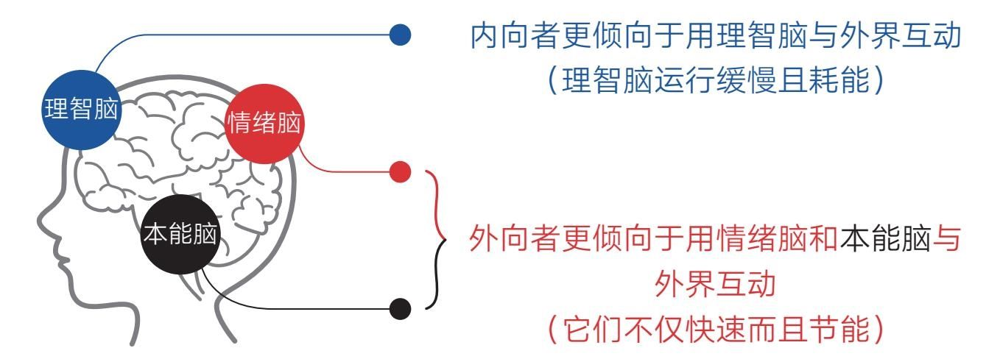

### 第五节　内向：被动社交，内向成长者的制胜之道

  这个世界好像越来越喧嚣了。

  似乎只要点开屏幕，就能看到各种面孔对你说：“在这个时代，你一定要学会在众人面前销售自己，要敢于表达、主动连接，要拉得下脸，否则你会错失各种人生机遇，活得默默无闻……”所以，他们鼓励你走到台前去分享、去演说，以提高自己的知名度；他们推荐你日更文章（视频）、与读者（观众）保持情感联系；他们告诉你微信视频号的第一条应该说“你要关注我的N个理由”；他们提醒你在短视频的最后告诉观众“记得双击、分享，爱你么么哒……”

  于是满世界的信息似乎都充斥着这种套路，好像你不跟着做就会落伍一样。这让很多人焦虑不已，特别是那些天生内向、不善言辞和表达的人，因为这些对他人显得极为平常且轻松的事，换到自己身上就会变得异常难受和别扭。不用折腾多久，自己就会感到精疲力竭，内心也像被掏空了一样。

  但为了不被时代淘汰，他们依然鼓足勇气，冲进“拥挤的潮水中努力游动”，美其名曰挑战自己、突破自己。然而，这样做似乎并不能真正缓解焦虑，因为同质化的内容实在太多了。在众人自我叫卖的时候，自己那点不够自然和自信的声音依然显得默默无闻。

  如果你正在遭遇这种尴尬，那不妨在此刻停下来想一想：做成一件事，真的必须这样扯着嗓子主动叫卖吗？

  事实上，我们根本无须在“主动社交”这条路上挤得头破血流，因为这个世界上还有很多条通往成功的路。比如与之相反的“被动社交”这条路就非常好走，它不仅畅通不拥挤、安静不焦虑，而且还特别适合那些不擅长即时表达的内向成长者。不信的话，我们可以看看一位与众不同的“网红”——李子柒。

#### 被动社交——用作品替自己说话

  如果你看过李子柒的作品，就知道她从不在视频中和观众对话，也不会为了讨好观众而保持日更，更不会在视频的最后求大家点赞、关注和转发。她只是专注于作品本身，在视频里尽情地演绎自己，甚至为了拍好一个视频，她要经历春夏秋冬一整年的准备。“蹊跷”的是，这种冷淡的风格却让她火遍全球，使她不仅获得了可观的财富，也收获了独一无二的个人影响力。

  这背后的原因很简单，那就是她只用作品说话。她的作品不仅精致有特色、清新不浮躁，而且还有长远价值，就算几十年后再看，依然可以成为中国乡村理想生活的代言。如今，她最不担心的就是缺少外界的关注和联系，要操心的反而是对海量的合作请求进行筛选。

  这就是所谓的“被动社交”——通过产出独一无二的、具有长久价值的作品或产品来与这个世界保持连接。如此，就算创作者自身不善言辞，也同样可以让自己产生强大的社交吸引力，因为他可以让作品代替自己说话。而有价值的作品，特别是精心打磨的作品所产生的影响力要远远超过个人在台面上的高声叫卖。

#### 扬长避短——内向者更有创造优势

  选择“被动社交”战略的人并非少数，比如25岁就成为百度副总裁的李叫兽在成名前就思考过这个问题。他知道自己不是一个善于交际的人，但工作中又需要人际关系和影响力，于是他梳理了获取人际关系和影响力的两种方式：一是通过不断地与人交流，建立情感联系；二是通过知识或能力的吸引，让别人想认识自己。

  通过梳理，他果断选择了“被动社交”战略，即通过公众号，每周输出一篇高质量的营销干货文章，专注于知识领域的创造。通过上述做法，他很快收获了50万读者，在营销圈打造了强大的个人品牌，最终拥有的人际网络和资源，远远超过很多社交能力比他强的人。

  再比如《5分钟商学院》的作者刘润也很推崇这种“自管花开”的行为模式，他说：“你可以把自己想象成一朵花，我们只管这朵花开得漂亮，只想散发自己的光、热和香气。如果在覆盖范围之内，有人感受到了，那真是幸运，他就有机会成为我们的客户或者合作伙伴了。我们不愿意拿着手电筒去找客户，也不想着去说服别人，如果发现这个人竟然还要被说服，那就只能证明这朵花散发的光和热还不够。那没事儿，我继续努力，继续发光发热，争取我的光和热有一天能够覆盖到他。”

  可见，采用被动社交的人同样可以获得成功。他们这样做并非出于无奈，相反，这是一个非常明智和正确的选择。因为内向成长者的生理特点决定了他们更擅长与事物而非与人物打交道。

  科学研究证明，内向者与外向者在生理机能上有显著的差别。比如，内向者头脑中的血液流动路线更长、更复杂，犹如很多蜿蜒的路径，因为他们的血液聚集在离脑干更远的前额叶和布洛卡区——负责计划、思考和语言处理的区域，而外向者头脑中的血液聚集在离脑干更近的负责感官印象和感知情绪的区域。

  换句话说，内向者更倾向于使用理智脑与外界互动，而外向者更倾向于用本能脑和情绪脑与外界互动。

  如图1-4所示。由于理智脑运行时非常缓慢且耗能，所以内向者与外界互动时往往反应迟钝，且社交之后需要更多的时间和空间才能恢复能量——这也是内向者通常不喜欢社交的原因。而本能脑和情绪脑正好相反，它们与外界互动时反应快速且不容易疲惫，甚至还能从社交中获得能量。

    图1-4 内向者与外向者的大脑区别

  另外，内向者与外向者体内的神经递质分泌也有所不同。内向者体内的乙酰胆碱分泌通常比较活跃。乙酰胆碱是一种帮助集中精力、提升逻辑思维能力和记忆力的神经递质，它会抑制我们的行为系统，让我们安静下来，以此来丰富我们的能量储备。而外向者体内的多巴胺分泌通常更加活跃。多巴胺是一种传递兴奋、愉悦、开心的神经递质，它会激活我们的行为系统，使人充满精力。因此，比起外向者，内向者更容易看到事物的全局，行为也更为审慎。但由此带来的副作用便是，他们在与人交往时往往需要更长的时间才能找到合适的措辞，也更容易感到疲惫。所以，内向者的总体优势体现在他们更加擅长与事物打交道，面对静态事物时，他们更理性、更有创造力，也更加关注事物的根本——这可能也是很多内向者不太合群的原因之一，因为习惯关注根本的人会觉得普通的闲聊太肤浅、没有意义，他们与人交流时不知道说什么好。

  综上可知，内向成长者虽然在社交上不具优势，但在创造上更具潜力，所以专注创造并用创造的价值来吸引外界与之连接，往往是他们更具优势的人生赛道。如果你了解以上知识，或许会主动扬长避短，切换到更适合自己的人生赛道上来。

#### 长期主义——价值创造的必经之路

  我自己就是一个偏内向的人，平日里不善言辞，同步沟通能力勉强及格，但开始写作后，我便不自觉地走上了“被动社交”的道路。因为我发现，通过生产有思想的文字来表达自己更容易获取成就与优势，而且这种“异步”沟通的方式让我很放松、很愉悦，也是我所擅长的。

  事实上，公众号刚开始有起色的时候，我也尝试过向各大平台主动投稿，以此来提升自己的知名度。但这种“主动求关注”的方式让我十分疲惫。因为每写一篇文章我都要另外准备好几个版本，同时还要联系平台、介绍自己、等待回应、忍受拒绝，即使谈妥了，也还要按照平台要求修改内容……几次尝试之后，我发现这种方式不仅会消耗自己大量的精力，而且会让自己的写作风格变得越来越浮躁，推广效果也不见得好。于是我果断放弃这种方式，并暗下决心：今后不再投稿，除非他人主动转载……

  这种想法看上去有些清高，但的确让我开始摒弃浮躁、继续聚焦。此后，我把全部精力投入知识写作和价值写作，深度思考，精心打磨，不接广告，不搞互推，即使更新文章的周期很长，也要坚决保证文章的质量。当我放弃“主动求关注”的成长方式后，情况却发生了有趣的变化：

  ·转载文章的请求接踵而至，数百家自媒体申请了转载白名单；

  ·读者主动来联系，每天都会收到很多留言和感谢；

  ·结识了很多作者及其他领域的意见领袖；

  ·收到了多家出版社的出书邀请，出版了自己的书……

  我用自己的经历再一次证明被动社交这条路的可行性，而这一切的发生，都是因为有扎实的作品为自己代言。

  当然，走这条路需要我们做一个长期主义者，需要我们抵御短期利益的诱惑，忍受暂时不被外界关注的不安全感，牢牢盯住自己的价值和产出。虽然我们无法像李子柒或李叫兽那样在相对较短的时间内爆发，毕竟那需要更大的付出和运气，但相对来说，作为一个没有特殊资源的普通人，我获得如今的成长的速度已经算很快了。如果当初我一直在他人的赛道上跟风模仿，把精力都放在自己不擅长的向外连接上，想必我现在依旧是个默默无闻的焦虑写手。

  所以那条看上去十分漫长的“被动社交”之路走起来其实并不慢，而且优质作品的价值积累效应还会加速这个过程，因为好的作品会自己“走路”。

#### 价值稀缺——酒香不怕巷子深

  好的作品确实会自己“走路”。

  这句话成立的关键是这个作品要足够好。它要好到能让人眼前一亮，让人觉得醍醐灌顶、能传递极度的美，或对他人产生巨大的帮助，且有长久的生命力。这样的作品很难被外界模仿或代替，因此需要创作者持续专注、持续打磨，投入足够的精力和脑力。这对擅长与事物打交道的内向成长者来说是一个喜讯，因为他们更有可能通过创造优质作品来打造自己的“价值护城河”。事实上，无论是内向成长者还是外向成长者，要想获得真正的成就和影响力，最终都要过创造价值这一关。

  当然，我们也不能自视清高，轻视主动传播的力量，但更好的传播一定发生在我们拥有足够多、足够好的作品或价值之后。所以，在自己还不够强大的时候，不要太担心自己没人关注，我们只需专注于自己的作品与价值就好了。当有一天，你能用作品惊艳众人的时候，“整个世界”都会向你投来目光、伸来双手。那时，无论是主动宣扬还是借助专业的传播力量，你都更有可能让自己的影响力产生裂变。

  在现代竞争环境的影响下，大多数人已经不再信奉“酒香不怕巷子深”这句老话了，人们似乎都愿意跑到巷口主动招揽生意。这在商业上是行得通的，因为商业竞争非常激烈，商家需要主动出击、占据市场先机才能更好地活下去。但在个人成长领域，我依然认为这句老话更加可行。因为个人成长与商业发展的竞争模式不同，它有更大的时间宽容度和强烈的个人属性，它允许我们慢慢地变好，让我们不紧不慢地“雕刻”自己的作品。

  同时，我们还应该具备这样的洞见：越是在传播手段发达的社会里，越要坚守价值。因为这个世界已经不缺乏传播途径了，但价值依旧稀缺！

  想想看，在一个人人都拥有传播能力（每个人都可以发朋友圈、拍短视频）的世界里，大家最缺什么？

  缺好东西！

  只要是好东西，人们就愿意主动分享。

  就像深山里有一处风雅之地被某个“网红”发现，他的分享便会引得无数人前来围观打卡。而现在很多“网红”的日常工作就是不断更换打卡地，分享更多好东西，借以维持自己的流量，但风雅之地一旦被曝光，它就可以持续引来客流，不再寂寞。

  当然，风雅之地只是一个比喻，它代表某些天然或人工作品，只要自然或人为地建设它、改造它，它就可能成为一处名胜。如果你暂时无法成为像“网红”那样有魅力、有影响力的人，那就专注打造自己的作品和价值吧。毕竟容颜易老、魅力易逝，而由人创造的思想、价值和美却可以长期存在。

  等有一天，当你手握它们从幕后走到台前时，就算你缺少魅力、不善言辞，人们也会认认真真地听你说话。
