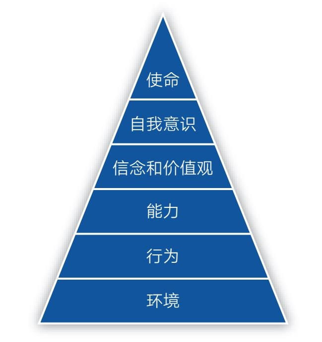
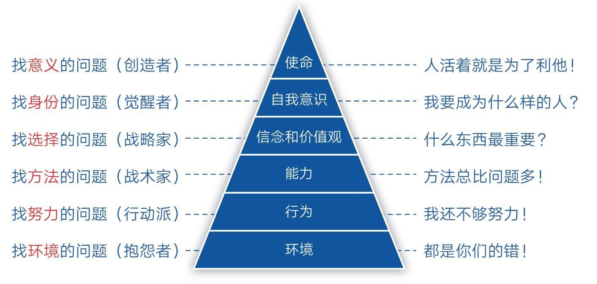

### 第一节　层次：你在这个世界的哪一层

  1976年，理查德·班德勒和约翰·格林德开创了一门新学问——NLP（Neuro-Linguistic Programming），中文意思是用神经语言改变行为程序。后来他们的学生罗伯特·迪尔茨和格雷戈里·贝特森创立了NLP逻辑层次模型。这个模型把人的思维和觉知分为6个层次，自下而上分别是：环境、行为、能力、信念和价值观、自我意识、使命（见图2-1）。

    图2-1  NLP逻辑层次模型

  NLP逻辑层次模型适用于很多领域，诸如生活、商业、情感，也包括成长领域。可每次看到某某模型，或某个模型的组成部分超过3个时，我就有昏昏欲睡之感，觉得这些东西太抽象。想必你也有同样的感觉，不过还是请你在这一页上多停留一会儿，让我把这个模型换个面貌，你就会发现它其实是个好东西。

  下面，我以成长为例。

  在成长过程中，我们必然会遇到各种各样的问题，此时，对待这些问题的态度就很关键了，因为从中可以看出我们的成长等级，而NLP逻辑层次模型就可以作为衡量成长等级的标尺。

  第一层：环境。处在这一层的是最低层的成长者，他们遇到问题后的第一反应不是从自己身上找原因，而是把原因归咎到外部环境中，比如感叹自己运气不好、没有遇到好老板、怪老师教得太差……总之凡事都是别人的错，自己没有错。这样的人情绪不稳定，往往是十足的抱怨者。

  第二层：行为。处于这一层的人能将目光投向内部，从自身寻找问题。他们不会太多抱怨环境，而是把注意力放在自身的行为上，比如个人努力程度。对于绝大多数人来说，努力是最容易做到的，也是自己可以完全掌控的，所以他们往往把努力视为救命稻草。

  这本没什么不好，只是当努力成为唯一标准后，人们就很容易忽略其他因素，只用努力的形式来欺骗自己。比如每天都加班、每天都学习、每天都写作、每天都锻炼……凡事每天坚持，一天不落，看起来非常努力，但至于效率是否够高、注意力是否集中、文章是否有价值、身形是否有变化似乎并不重要，因为努力的感觉已经让他们心安理得了。说到底，人还是容易被懒惰影响的，总希望用相对无痛的努力数量取代直面核心困难的思考，在这种状态下，努力反而为他们营造了麻木自己的舒适区。

  第三层：能力。处在这一层的人开始动脑琢磨自身的能力了。他们能主动跳出努力这个舒适区，积极寻找方法，因为有了科学正确的方法，就能事半功倍。但这一步也很容易让人产生错觉，因为在知道方法的那一瞬间，一些人会产生“一切事情都可以搞定”的感觉，于是便不再愿意花更多力气去踏实努力，他们沉迷方法论、收集方法论，对各种方法论如数家珍，而且始终坚信有一个更好的方法在前面等着自己，所以他们永远走在寻找最佳方法的路上，最终成了“道理都懂，就是不做”的那伙人。

  第四层：信念和价值观。终有一天他们会明白，再好的方法也代替不了努力；也一定有人会明白，比方法更重要的其实是选择。因为一件事情要是方向错了，再多的努力和方法也没用，甚至还会起反作用，所以一定要先搞清楚“什么最重要”“什么更重要”，而这些问题的源头就是我们的信念和价值观。

  一个人若能觉知到选择层，那他多少有点接近智慧了。在生活中，这类人一定愿意花更多时间去主动思考如何优化自己的选择，毕竟选择了错误的人和事，无异于浪费生命。

  第五层：自我意识。如果说“信念和价值观”是一个人从被动跟从命运到主动掌握命运的分界线，那么“自我意识”是更高阶、更主动的选择。所谓“自我意识”，就是从自己的身份定位开始思考问题，即“我是一个什么样的人，所以我应该去做什么样的事”。在这个视角之下，所有的选择、方法、努力都会主动围绕自我身份的建设而自动转换为合适的状态。这样的人，可以说是真正的觉醒者了。

  第六层：使命。在身份追求之上，便是人类最高级别的生命追求。如果一个人开始考虑自己的使命，那他必然会把自己的价值建立在为众人服务的层面上。也就是说，人活着的最高意义就是创造、利他、积极地影响他人。能影响的人越多，意义就越大。当然，追求使命的人不一定都是伟人，也可能是像我们这样的普通人，只要我们能在自己的能力范围内对他人产生积极的影响即可。有了使命追求，我们就能催生出真正的人生目标，就能不畏艰难困苦，勇往直前。

#### 知识，让我们更好地感知世界

  这个世界是有层次的。在NLP逻辑层次模型的帮助下，个体的成长便有了不同的呈现（见图2-2）。

  一层的人找环境问题，他们是抱怨者，喜欢说：“都是你们的错！”

  二层的人找努力问题，他们是行动派，喜欢说：“我还不够努力！”

  三层的人找方法问题，他们是战术家，喜欢说：“方法总比问题多！”

  四层的人找选择问题，他们是战略家，喜欢问：“什么东西最重要？”

  五层的人找身份问题，他们是觉醒者，喜欢问：“我要成为什么样的人？”

  六层的人找意义问题，他们是创造者，喜欢说：“人活着就是为了利他！”

    图2-2  NLP逻辑层次在成长上的呈现

  现在，我们可以脱离这一模型，记住“环境、努力、方法、选择、身份、意义”这几个词就行了。有了这把标尺，我们就能意识到自己所处的位置，能够觉知自己当前的状态。

  没有层次的指引，你可能意识不到自己还有更好的选择，因此被困在当前的层次。就像当你只知道“努力”这一个招数时，就不太可能主动去琢磨“方法”，更不太可能去主动思考“选择、身份和意义”了，甚至很可能把当前层次的焦点，诸如“努力”“方法”，当成目的去实现，以致不自觉地走偏。

  但反过来，一旦我们清楚了全局框架，就可以成为“自由人”。在遇到问题时，我们就能主动放弃情绪化的抱怨，勤努力、找方法、做选择、建身份、明意义。

  这正是让人感到喜悦的地方：原来我们还有这么多选择！特别是当我们能够从上至下地总览全局，能够从高维度看问题时，低维度的问题自然就消失了，所以对个体来说，最重要的事情莫过于找到人生目标和意义，想清楚自己应该成为什么样的人。这个问题一旦解决，我们自然就知道该怎么选择、找什么方法、如何努力。不用刻意追求，一切水到渠成。

  现代社会，人人都在学知识，但我时常问自己：学习知识到底是为了什么？现在似乎有了一个新的答案：知识可以让我们更好地审视自己和感知世界。有了感知，我们便能更好地定位和应对。

  那么，你在这个世界的哪一层呢？
