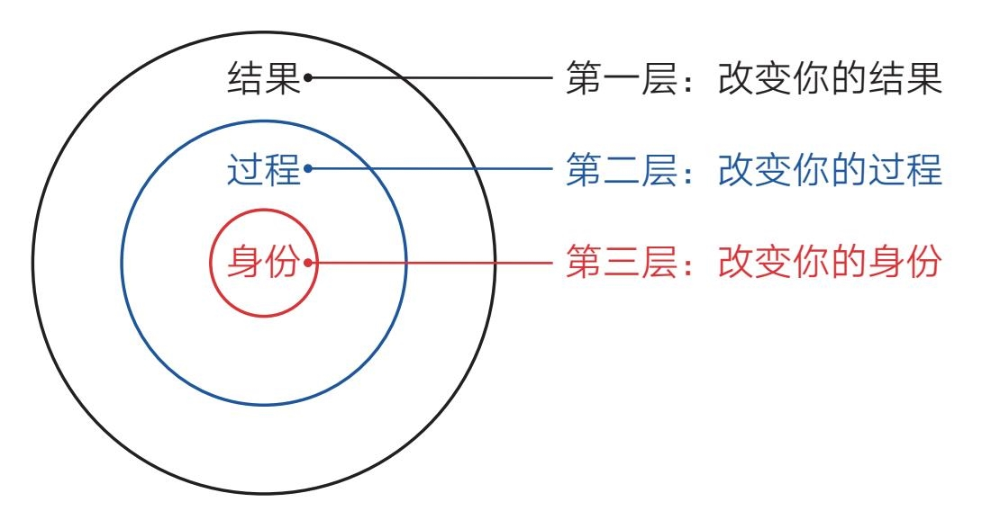
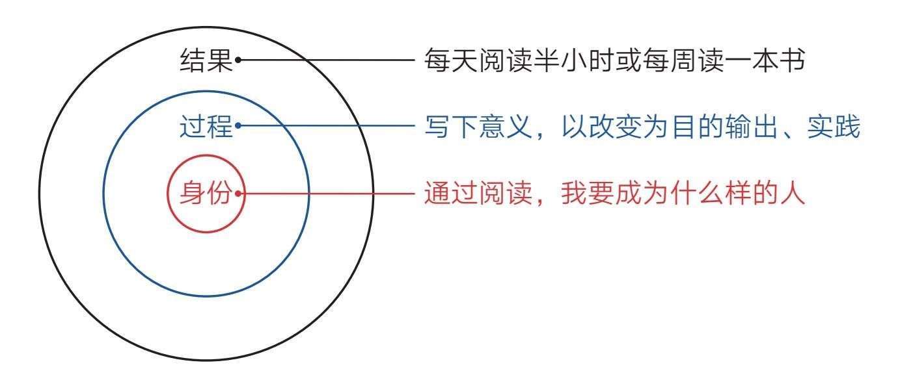
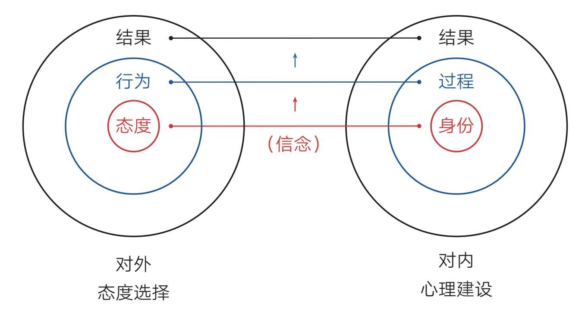
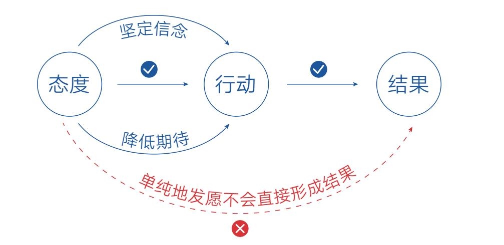

### 第二节　身份：改变自己的终极力量

  2020年3月，我结识了“剽悍一只猫”（以下简称“猫”），而结识他的缘由竟是我对他的误解——在此之前，我一直认为他是那种在网上运营社群贩卖焦虑的人。好在自己当时克制住了未经证实的偏见，抱着开放的心态读了他的新书《一年顶十年》，随后的事情也由此发生了戏剧化的转变。

  通过和“猫”本人的交流，我了解到他是一个极致践行的人，他的书便是他实践的心得。不过在这本书中，我印象最深的是他多次提到的以下场景。

  ·我经常对自己说一句话：你是个干大事的人。

  ·刚毕业时，我觉得自己的气度不够，容易跟人斤斤计较，于是找人写了“气度”两个字挂在墙上天天看。

  ·2017年，我变得越来越焦虑，于是又请人写了“今天”两个字挂在墙上。

  ·我们办公室有一幅字，上面写着：我们很贵。

  ·若你还没富，请先让自己像一个富人。用富人的思考方式、富人心态、富人思维武装自己，改变自己的气质，让自己看起来更具“富人气”……

  说实话，若是早几年读到这些内容，我肯定会充满怀疑和鄙夷：“这不就是鸡汤嘛！一个人怎么可能给自己画个大饼就让自己变好呢？简直太离谱了……”而现在，我不仅没有这样的念头，反而觉得这种做法很高级，因为我知道这种行为触及了我们人类成长的终极力量——心理建设。

#### 身份—过程—结果

  想了解心理建设，我们还得从《掌控习惯》这本书说起。作者詹姆斯·克利尔在书中描述了这样一个规律：即人的行为改变可分为身份、过程、结果三个层次，不同层次的努力会带来不同的结果（见图2-3）。

    图2-3 行为改变的三个层次

  为了更好地理解，我们以养成阅读习惯为例（见图2-4）。

    图2-4 养成阅读习惯的三个层次

  绝大多数人想养成阅读习惯时，都会自然地给自己定这样的目标：每天阅读半小时或每周读一本书。他们以为只要自己做到这些就可以养成阅读习惯，实际上这只是盯着最浅层的“结果”去行动，结局往往是为做而做，不了了之（相信你肯定深有体会）。

  少部分人会把注意力放在“过程”这个层面。他们不满足于做什么（What），还要探索怎么做（How）以及为什么要做（Why）。所以他们会花时间写下阅读的意义，让自己看到阅读的各种好处；他们会以改变为目的去阅读，让自己输出、实践，使阅读效果最大化……做到这一点，其实已经非常了不起了，他们的收获会远远大于普通人，但这仍然需要消耗大量的意志力去坚持。

  只有极少数人能看到“身份”这个层次，并主动从心理建设开始行动。他们会花大量的时间去思考：通过阅读，我要成为什么样的人。或者暗示自己：我本来就是一个以书为伴、追求新知、乐于探索的人。如此一来，阅读就会成为像吃饭、睡觉一样的基本需求，成为自己不做就会难受的事。这个时候，哪里还需要约束自己、强迫自己呢？

  这个规律是普遍适用的，无论我们在哪个领域，想做成什么事，都会置身于这个框架之下。因此，那些能明确自己身份的人才是真正的高手，他们肯花时间进行心理建设，能从上而下或从里到外地改变自己。就像“猫”说的，要告诉自己，我是个干大事的人。因为如果连你都认为自己注定是平庸之辈，那你的内心很难强大起来。一个干大事的人，是不会与“偷懒”“嫉妒”“贪心”“恐惧”“浮躁”“自卑”为伍的。所以在遇到困惑和困难时，成事之人会主动做出不同的选择，绘出不凡的命运轨迹；而平庸之辈往往会对这种“画大饼”式的行为充满鄙视和不屑，殊不知自己才是落伍者。

  当然，那些从“结果”层开始行动的人最终也可能做成那件事，但他们依然会在“身份”上不知不觉地进行重塑。这种从下至上、从外到里的被动重塑不仅过程痛苦、耗力巨大，也会使成功变得极不可控，甚至当成功真的来临时，他们也可能会因心理准备不足而亲手毁掉机会，因为他们内心觉得自己配不上、承受不了。而被毁掉的机会可能是财富、爱情、成功及各种好运。

  所以，我们一开始就应该正视自己的心理建设，正视自己的身份建设，把潜意识的心理改造放到桌面上。毕竟在现实生活中，就算你不告诉自己应该成为一个什么样的人，你内心也有一个默认的身份存在。他可能是一个自卑的人、胆小的人、不敢相信自己会成功的人，只是你自己察觉不到这一身份的存在而已。这就不难解释，为什么很多成年人即使自身能力不差，但在面对生活中的困难与选择时，总是畏首畏尾，承担不起责任。因为他们内心依然是个孩子，潜意识里的自己并没有长大。而潜意识的力量是巨大的，善用之，它会成为我们成长的巨大推力；漠视之，它会成为我们成长的巨大阻碍。它是领着你跑还是拖着你阻碍前行，全看你对它的态度是否积极主动。

  可见，信念从来都不是空的、假的，它是实实在在的力量，是特别强大的力量。我想只要你知道了这个秘密，就必然会主动改变策略，真正重视信念的力量。

#### 态度—行为—结果

  信念，说白了就是我们看待事物的积极态度。这态度对内，就是主动进行心理建设；对外，也同样是好用的终极力量。

  2020年新冠疫情突发，同学们都只能在家学习，其中读者“点点”给我发来了自己的困扰，他说：“我家楼上的脚步声比较大，而且她家里有小孩，拉椅子的声音也非常响。和她交流也没有效果。有时候我甚至认为她家的拉椅子声都是故意的……每次一听到这些声音我就感觉很无力，不想继续学习，请问你对我的问题有什么好的建议吗？”

  正好那几天我在读《思维的囚徒》，作者亚历克斯·佩塔克斯提出的“十大积极结果练习”十分应景。于是我对他说：“如果你希望有所改变，那就试着写下楼上脚步声的10个好处吧。”之后他便没了声音。我知道他心里大概在想：“从烦人的脚步声里找好处？还要找出10个，这怎么可能！”于是我给他做了个示范，我说：“你可以把椅子声和脚步声解读为‘这家的孩子真活泼呀’，或者‘还好疫情得到了控制，不然整个世界会安静得一点声音都没有，那就太可怕了，所以能听到人的脚步声真好’……”两天后，他给我回了消息：“谢谢你给我提供了另一个视角，但是我的想象力不够丰富，只能想出两点，另外，你给的那两个视角很好。”

  不用告诉你结局，你也能猜到“点点”的情况发生了积极的变化，尽管现实环境并没有任何改变。不过，我想总有人在听完这段经历后脑海里会闪过“自欺欺人”“阿Q精神”之类的念头。可千万不要轻易下结论，因为这种看似可笑的做法极其符合“态度—行为—结果”的事物发展规律。

  很明显，我们看待一件事情的态度会影响我们的行为，而我们的行为则会影响现实结果。在上述案例中，读者“点点”如果不改变态度，他就会一直处于烦躁和抱怨中，可能使自己的成绩在痛苦中持续下滑；而他现在可以笑对噪声，聚焦学习，甚至还能刻意锻炼自己抗干扰的能力。

  所以在遭遇困难的时候，一定要提醒自己保持冷静，要在这种时候审视自己的态度和选择，要想方设法找到积极的一面。卡尔·纽波特在《深度工作》一书中也表达过类似观点：“你的世界是你所关注事物的产物。”“我们的大脑是依据我们关注的事物来构建世界观的。”我们选择去关注哪些事物、忽略哪些事物，会对我们的生活质量起到关键的作用。这也是我们在任何困难面前都要保持乐观的原因，只有态度和信念改变了，事情才会朝好的方向转变。

  更好的消息是，无论我们遇到什么困境，最终我们都是有选择权的。正如《活出生命的意义》的作者维克多·弗兰克尔所说：“人所拥有的任何东西都可以被剥夺，唯独人性最后的自由，也就是在任何境遇中选择一己态度和生活方式的自由不能被剥夺。”所以，困境就是我们成长、改变的分水岭，而成长、改变也是我们和困境争夺选择权的较量：放弃选择，我们就会成为困境的囚徒；坚守选择，困难也会向我们俯首称臣。

  现在，我们把“心理建设”与“态度选择”放在一起，就会发现对内和对外的力量其实是统一的，它们的力量源头是我们自身的信念（见图2-5）。

    图2-5 为什么我们要保持乐观

#### 做最好的准备，做最坏的打算

  “心理建设”与“态度选择”从本质上说都是帮助我们挣脱环境束缚的元认知能力。但对这种能力，人们可能还会产生一种难以辨识的误解，比如读者“平哥”就曾提出这样的疑惑：“吸引力法则告诉我，要想达成一件事就得坚定信念，始终往好的方面想，这样才会有好的结果发生；而有人又说，要想做好一件事情，就要降低期待，要是结果不好，也算有所预料，结果好，喜悦就会翻倍。但是用吸引力法则来看，主动降低期待就是往不好的方面想，这样做很可能产生不好的结果。所以，坚定信念和降低期待是矛盾的吗？”

  这是个极具迷惑性的问题，但想清楚一点，就可以走出这种认知迷宫。

  所谓吸引力法则，并不是指单纯地在心里对想要达成的事情发愿并保持极度渴望，而是改变自己对待这件事情的态度，保持一种自信、平和的状态，这样，我们就能采取正面的行动，最终产生好的结果。如果一个人心里总想着不好的结果，让自己产生了担忧、顾虑、焦虑等情绪，那这种心态就会将自己的行动导向负面，这样一来，好的结果也会离我们越来越远。而主动降低期待并不是悲观主义，因为它的目的也是调整心态——让自己把注意力放到成长上，而不是外部评价上，这样，我们就可以让行动更加踏实，创造出好的结果。

  所以，坚定信念和降低期待并不矛盾，因为坚定信念就是做最好的准备，而降低期待就是做最坏的打算。它们的目的是一致的：促使自己更好地行动，并最终产生好的结果（见图2-6）。

    图2-6 做最好的准备，做最坏的打算

  至此，改变自己的终极力量已全部呈现在你的面前，它们最终能否为你所用，就看你自己的行动与实践了。不过千万不要忘了潜意识的学习方式是不断重复。这就像我们学骑自行车，刚开始的时候需要不断地、刻意地提醒自己动作要领。经过无数次重复后，我们不需动脑也能轻松做到，这说明潜意识已经学会了。掌握这种看不见的力量也是如此，我们一开始需要“假装”，而后不断进行自我提醒和暗示，直到有一天可以本能地、笃定地相信自己。

  当然，我们还要时刻保持觉知，不能执着于一个固定的身份或信念。因为随着自身能力和境遇的改变，我们往往需要新的“身份”来引领，所以成长注定是一个将内在身份不断揉碎并重塑的动态过程。

  改变自己、让自己变得更好，是这个世界上每个人的愿望，但大多数人都不知道有“心理建设”这种力量的存在，能主动运用它来重塑自己的人更是少之又少，因此，大多数人只能在生命途中懵懵懂懂地低效前行。如今，你我终于有机会接近这股看不见的力量，去创造主宰自己命运的可能。
