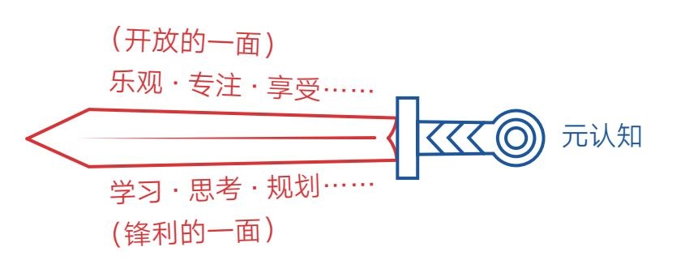

### 第四节　理性：成功，最怕一开始就对自己说不可能

  从2019年开始，我就向读者倡导“你的一生，至少要主动做成一件对他人很有用的事”这一理念。很多人深受触动，决定开启自己的成事之旅，但在定下目标后又会产生这样的顾虑。

  “我的目标是不是太大了？”

  “看上去有些不切实际啊！”

  “我怎么可能做到？”

  “万一失败了怎么办？”

  最初的雄心壮志在千思万虑之后反而令人彷徨、退却，于是一些人来寻求咨询，希望我能给出一些更加理性的建议。然而我给出的通常不是理性的分析，而是热情的鼓励。对于这样的回应，有些人并不满意，因为人们普遍认为，要想做成一件事，光有热情没用，还得用理性思维思考目标的可行性。这样的想法自然没错，只是很多人并不知道，在某些情况下，理性思维不仅不会成为达成目标的利器，反而还会成为阻碍。

  这或许会令一些人费解，毕竟在传统的观念里，理性思维是破解问题的利器，我们努力学习也是为了让自己变得更加理性，而现在我却说“理性无用”，这到底是怎么回事？

  如果你有这种感觉，那我要先恭喜你，因为当你习以为常的观念被颠覆时，说明你可能要进步了。

  是的，我们孜孜以求的理性思维其实是有局限的，而且这种局限很难被人们察觉，它不仅会影响我们塑造自己的人生目标，还会在生活中的很多方面限制我们。如果我们能突破理性思维这道屏障，很多人生问题都将迎刃而解。所以大家不妨暂时放下抗拒，与我一起更新对理性思维的认知。相信我，这次更新会使你的元认知产生重大飞跃。

#### 乐观构想、悲观计划、乐观实行

  为了更好地理解，我们还是从稻盛和夫的故事开始吧。

  稻盛和夫有个有趣的习惯，他每次展开新的、难度较大的工作时，都会刻意去找一些“理性不足，感性有余”的人一起商讨自己的想法。这些人对稻盛的专业往往并不在行，但对他的提案总是表现出足够的兴趣和赞同，并鼓励他一定要试试。

  这听起来可能有些荒唐：一个人要不是虚荣心作祟，他不至于总找外行人来捧场吧？但稻盛和夫这样做是有原因的。此前，他同样信奉理性思维，每次冒出新想法、新点子，他都会向那些一流大学出来的优秀人才征求意见。可他们听了提案后常常反应冷淡，表示这样的想法是多么脱离实际、多么缺乏根据。稻盛和夫看着这些“智慧的大脑”列出的全是“不能成功”的消极理由，深感失望，他说：“再美好的想象之花，经他们冷水一浇，也难免萎缩凋零，本来可以做成的事情也做不成了。”经过几次这样的教训，他就更换了商量的对象。

  当然，你会认为这只是个案，不足以说明问题，那我们不妨看看历史上其他精英的言论。

  ·1911年，法国军事战略家、第一次世界大战协约国军队总司令斐迪南·福煦说：“飞机是有趣的玩具，但没有军用价值。”

  ·1923年，诺贝尔物理学奖得主罗伯特·密立根说：“人类不可能利用原子的力量”。

  ·1943年，IBM公司创始人托马斯·沃森说：“我认为世界市场对计算机的需求大概是5台”。

  ·1946年，20世纪福克斯公司总经理达里尔·扎努克说：“电视机只要上市6个月就抓不住消费者了，人们很快会厌倦每天晚上盯着一个胶合板箱子看。”

  ·1957年，电子管发明者李·德弗雷斯特说：“无论未来科技如何发展，人类永远无法登上月球。”

  ·1977年，美国数据设备公司（DEC）创始人肯尼斯·奥尔森说：“让每个人都拥有一台电脑不合常理。”

  很难想象，这些悲观的判断是从当时几乎最聪明理性、最专业权威的人嘴里说出来的，但从他们当时的处境看，这些结论似乎非常符合逻辑，因为他们的专业知识告诉他们这是毫无疑问的“事实”。

  理性思维的局限正在于此——它只相信自己所见所闻的一切事情，对于已知之外的未知，它会主动怀疑并排斥。因此，《意念力》的作者大卫·霍金斯告诫我们：“理性，是将我们从低级本性的需求中解放出来的大救星，但同时也是一个严厉的看守，拒绝我们向智慧之上的层面逃离。”

  可见，稻盛和夫的做法不仅不荒唐，甚至可以说是一种智慧。

  那么，理性思维是否可以就此剔除呢？

  也不是，理性思维自有用武之地，至于如何使用，不妨继续看稻盛和夫的做法，他说：“在事情的构想、构思阶段，需要营造大胆乐观的氛围，但是将构想转到具体计划时，情况就完全不同了。这时应该基于‘悲观论’，设想各种可能出现的风险，进行仔细、慎重的分析，制订周密的计划。”

  之后，他话锋一转：“然而，到了计划付诸实行的阶段，就要再次强调‘乐观论’，坚定地采取行动。就是说‘乐观构想、悲观计划、乐观实行’，这是成就事业、变理想为现实时必须具备的态度。”

  这下终于明白了！

  原来稻盛和夫的智慧就在于他知道如何巧妙地避开理性思维的局限——在不需要的时候将其关闭，在需要的时候再将其打开。所以我们要想成事，最好不要在理性思维这条路上“一条道走到黑”，而应遵循“先感性，后理性，再感性”的模式。这与《人生算法》的作者喻颖正说的“人生最好的模式是长期乐观、短期悲观、当下愉悦”如出一辙。

#### 长期乐观、短期悲观、当下愉悦

  正如我开始写作的时候，根本没有想过自己会在3年后写出一本书，我只是牢牢记住了李笑来说的那句话：“持续写作很可能是锻炼学习能力、锻炼思考能力、锻炼分析能力、锻炼沟通能力最直接、最低成本的方式。”因此我内心极其坚定，坚信写作可以塑造一个全新的自己，可以打造一个属于自己的世界，于是拿起笔就开始上路了。

  当然，在写作途中我始终坚持“价值写作和知识写作”的理念，坚持写的东西三年、五年，甚至十年后再看依然是有价值的内容，于是不自觉地把自己推到了舒适区边缘，每写一篇新文章都会刻意“保持难受”，不断阅读、关联、修改、打磨，并亲自实践那些启发和道理。这个过程并不舒适，即使如此，每当自己坐在电脑前码字时，我都能感受到创造的乐趣；每当看到读者的留言和反馈时，我都会感到动力满满。这些乐趣和动力支撑着我持续不断地写下去。

  蓦然回首，我发现自己走的正是“长期乐观、短期悲观、当下愉悦”的道路，而且已经离起点很远了。不得不说，这又是我遇到的好运——没有被理性思维束缚在起点。

  现在，当我再用这个概念去观察他人时，发现很多人走的是与此完全相反的路径。他们一开始总是用当前的思维预估未来的情形，在发现自己的想法简直是异想天开时便觉得悲观无比，在起点时便停滞不前。即使勉强起步了，却又在过程中过于乐观、急于求成，希望很快看到成果，结果频遭打击，以致在接下来的具体行动中萎靡不振、痛苦煎熬，没过多久就放弃了。归结起来正好是“长期悲观、短期乐观、当下痛苦”的模式。细细想来，这或许正是很多人无法成事的原因之一吧。

#### 理性思维是把双刃剑

  理性思维之所以被人们奉若神明，是因为人们只看到它解决问题时的锋利，但事实上，理性思维是一把双刃剑，它还有偏颇、顾虑、担忧等自我设限的另一面。

  比如它对评价特别敏感，所以我们总是特别在意别人的眼光；它对失败特别抗拒，所以我们总是沉浸在挫折的情绪中；它对得失特别在意，所以我们总是在选择时畏首畏尾；它对标签特别认同，所以我们总是不敢相信自己可以跨界发展……它总是对自己知道的事实坚定不移，然后用这些单一的认知束缚自己，它让我们处于安全地带，也让我们远离很多人生可能性。

  只要我们把理性思维这把“剑”拆分一下，马上就可以看到它的两面性——锋利的一面和设限的一面，而这把剑的安全剑柄则是元认知能力（见图2-7）。

    图2-7 理性思维是把双刃剑之设限

  元认知能力让我们跳出限制审视思维本身，控制剑的运行方向，让它始终呈现锋利的一面，帮助我们做成事情。就像稻盛和夫先生也并不排斥理性的力量，他同样会在各个阶段竭力运用思考的力量。

  比如在事情开始的阶段，他会让自己睡也想、醒也想，一天24小时不断地思考、透彻地思考，让自己从头顶到脚底，全身充满“非同寻常的、强烈的愿望”。他说：“如果从身上某处切开，流出来的不是血，而是这种‘愿望’。”

  比如在事情计划的阶段，他又会反复周密地推敲实现愿望的具体方法，将实现愿望的过程在头脑里进行模拟演练，直到像“看见了”它的结果一样才肯罢休。

  他会用理性思维锋利的一面砍向自己的目标，同时尽量避免设限的一面影响自己的发挥。他还巧妙地把设限的一面替换成了开放的一面，让乐观开放、专注当下、享受过程成了另一种锋利，于是他无论怎么挥舞，都不会伤到自己（见图2-8）。

    图2-8 理性思维是把双刃剑之开放

#### 人生还需要浪漫、无畏和勇气

  在电影《流浪地球》中，地球即将被木星的引力吸引坠毁，空间站上的人工智能“莫斯”以极为理性的方式计算出拯救地球的成功率为零，于是决定带领空间站逃离，但刘培强中校却做出了一个极不理性的决定。他关闭了莫斯，带着30万吨燃料冲向天际引爆了木星，最终拯救了地球文明。虽然这只是一部科幻电影，但它同样揭示了成事的奥秘：有时候，我们无法达成目标不是因为我们不够理性，而是因为我们不够感性。

  随着社会的发展，理性思维大放异彩，人工智能、大数据等科技的运用让我们不自觉地崇尚理性的力量。但我们切不可全盘接受理性的摆布，即使我们生而混沌，要努力成为一个理性的人，但也要始终牢记获取理性不是最终目的，因为精彩的人生还需要浪漫、无畏和勇气。

  所以，无论什么时候，我们都要告诉自己：这世上没有什么事是不可能的。至少在一开始的时候不要轻易对自己说不可能！
