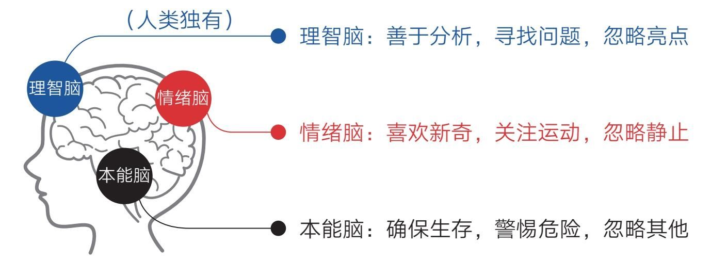

### 第一节　负面偏好：为什么你总是不快乐

  如果你可以设计生命，那么你必然会让它们对危险保持更高的警惕，因为一个生命如果对危险不够警觉，就很容易一命呜呼，因太过警觉而错失几次机会往往不会付出太大的代价。

  这种逻辑几乎不用论证就能推断为正确，现实世界也确实如此：动物对威胁及讨厌事物的反应，要比对机会及喜好事物的反应更快、更强烈、更持久。换句话说，生命对坏事的反应要强于对好事的反应。

  这种“负面偏好”被深深地写进了物种的基因，毕竟对生命来说，生存大于一切。我们人类也是生命，所以同样深受影响。这种影响能让我们远离危险，有机会坐在这里阅读这本书，但它也为我们变得不快乐埋下了隐患。

#### 负面偏好

  设想下面这样的场景。

  如果你是一个学生，带着一张成绩单回家，上面写着“一科优秀、两科良好、一科不及格”，你的父母极有可能短暂地瞥一眼“优秀”和“良好”之后，把注意力放到“不及格”上。他们会追问原因、叹气失望，甚至动怒责怪，使空气中充满紧张的味道。你有3/4的天气是晴朗的，但这1/4的乌云却让整个天空都显得黑压压的。

  我们都体会过这些场景：一天中大部分时间都过得平安顺利，但领导的一句训斥、客户的一句责骂、爱人的一个抱怨、好友的一个误会……便让全天的心情蒙上了一层阴影。事实上这些“不好的事情”充其量只占全天事情的几十分之一，但它就能如此霸道地占据我们的意识。还有那些过去发生的和未来可能发生的“坏事”，都会不自觉地让我们产生困扰。因为“负面偏好”会使我们更多地注意负面信息和事件，不自觉地忽略大多数正面、美好的事情。缺乏觉知的人，大多会在这种基因力量的操控下过着“身处美好中，却活在烦恼里”的生活。

  而且，要想对冲一件坏事的影响，我们往往需要制造多件同等规模的好事。比如在夫妻关系中，一句批评的话所造成的伤害起码需要5个善意的行为才能弥补。所以要想在受“负面偏好”影响的世界里过得更快乐，我们还得学会自我调节。

#### 幸福适应

  有人可能会说，遇到坏事那是运气不好，如果我们生活在一个没有任何威胁和烦恼的环境里就可以每天都很快乐了。这种想法很美好，但并不现实。

  有观点认为，当我们过上无忧的生活之后确实会快乐一阵子，但很快就会回到原来的幸福基准线。因为我们的大脑是一个极强的适应器，当新的刺激出现时，神经细胞会产生强烈反应，但之后会逐渐“习惯”，适应后，刺激反应会趋于缓和。所以不管发生什么事情，我们终究会慢慢适应。

  从大脑内部看，“适应”其实是一种平衡。大脑不可能让自己始终处于兴奋或消沉的失衡状态，因为在这种状态下，能量会很快耗尽，进而威胁到生存。出于自我保护，大脑会主动调节内部环境使之达到某种平衡。

  然而一旦达到平衡，也就意味着生活从动态变成了静态。静态的事物又很容易被大脑忽略，因为动态的东西往往蕴含着新奇和危险，大脑对此特别敏感；而静止的事物意味着安全和无趣，为了节省能量，大脑会将其主动忽略。换句话说，无论生活在何种幸福的环境里，你都有可能慢慢丧失觉知，视一切为理所当然，然后对其视而不见。

  我们的大脑就是这样，在默认情况下，永远都会以现在已经适应的水平为基准来判断现实是更好还是更坏。

  再看看我们身边的关系，我们总是对亲人的付出视而不见，理所当然地认为他们会一直对自己好；而面对陌生人时，只要他们态度不错，自己就很容易感动，但实际上，亲人和朋友对我们的付出是多过陌生人的，所以有人总结道：所有的感动都是陌生人带来的。

  深察人心呐！

#### 近大远小

  联想人类的大脑构造，我们还会发现更有意思的东西（见图3-1）：本能脑的首要职责是确保生存，因此它警惕危险，忽略其他；情绪脑喜欢新奇，因此它关注运动的事物，忽略静止的事物；而人类独有的理智脑虽然很高级，但它分析思考的优势注定使其紧盯问题不放——当自己是把锤子时，看什么都像钉子。

    图3-1 大脑的负面偏好属性——我们是天生的烦恼主义者

  无论从哪个角度看，人类的三重大脑都像问题的发现器和情绪的担忧器，而不是亮点的发现器和幸福的感受器。我们是天生的烦恼主义者——这是人类的又一大天性！

  而根据近大远小的规律，我们越关注的东西就越庞大，当我们眼中只有烦恼的时候，就意识不到这个世界是美好的，觉得到处都很糟。所以你若是觉得自己总是不快乐，请不要沮丧，因为你并不孤独，其他人也这样，这其实是我们的常态。

#### 快乐，就是成为那条能看到水的鱼

  然而总有一些人能够有意无意地跳出常态，生活得更快乐，他们采用的方法也并不新鲜，无非就是运用了所有情绪高手都会遵循的共同法则：善用不同的视角看问题——既然基因和本能让我们不自觉地关注坏事，那我们不妨反其道而行之，试着多看看好事，毕竟我们生活在现代社会，生存不再是最重要的主题，生存得更好才是。

  要想生存得更好，我们就应该主动做点什么。比如有“最有趣的理财书”之称的《小狗钱钱》就给了一个很好的提示。书中那只会说话的小狗钱钱，叫主人吉娅拿出一个本子，记录自己每天所有做成功的事情，任何小事都可以，每天至少写5条，并且把这个本子取名为“成功日记”。在成人眼里，这种做法有些幼稚，但它是对冲人类“负面偏好”的利器，因为它可以帮助我们主动发现自己和生活中的亮点，弥补我们大脑天生的缺陷。

  吉娅就通过记录成功日记建立了自信。在她第一次做公共演讲时，心里非常抗拒和害怕，但当她翻开日记本时，发现自己原来有那么多成功的经历，立即就有了信心。

  可不要小瞧这种做法（写下来）的威力，很多时候，人与人的差距就在于最后的一点行动，毕竟生活留给我们的东西足够多，只是我们自己不够留心罢了。

  说到记录，我首先想到的是自己的每日反思。这个习惯让我受益匪浅，不过现在看来，它只是更好地帮我发现和解决了生活中的问题，仍然是问题视角。为了开启大脑的另一种模式——亮点模式，我在2019年11月毫不犹豫地开始实践“成功日记”，不过当自己真的去写的时候才发现，每天写5个亮点并不容易，但我坚信这样做是有用的，尽管我已经是成人了。

  除此之外，我们还可以运用想象的力量。比如当身处平淡时，我们可以想象失去现有的东西会怎样，这会帮助我们意识到生活的可贵，把注意力集中在自己已有的事物上。如果总是盯着自己没有得到的事物，恐怕会终日活在不快乐中。而一个不快乐的人，又怎能轻装上阵去追求和体验更好的生活呢？所以，“比较是偷走幸福的贼”这句话只说对了一半，因为这要看跟谁比了，如果与那些更不幸的人相比，比较就是送来幸福的天使。

  当自己遇到烦恼时，我们则可以想象远离。根据远小近大的原理，再大的烦恼放到远处似乎也不算什么，而再小的幸福放到眼前也会变成大幸福。毕竟就数量而言，烦心之事在一天或一生中总是少数，我们不能让它们站得太近以致遮挡众多美好。就像你要是不小心被老板“骂”了，那就提醒自己这只不过是一天中的几十分之一而已，它不应该在眼前来回晃，而应回到自己原来的位置上去。你还可以采用假设时间远离的方法，用三五年后的视角看待当前，通常你会觉得眼前的烦恼变得无足轻重了。

  总之，我们要善于体察身边平静生活的宝贵与美好。正如人们常说的：“和平犹如空气和阳光，受益而不觉，失之则难存。”我们不能身在福中不知福，不能等到遭遇战火和动荡时才知道和平时光的宝贵。一个智慧的人不会等到自己真正失去了才后悔当初没有珍惜，他们在拥有的时候就会主动平衡注意力，更多地关注自己已经拥有的快乐和幸福。

  列夫·托尔斯泰说：幸福的家庭都是相似的，不幸的家庭各有各的不幸。但我想说：幸福的人各有各的幸福，而不幸的人都是相似的，因为他们都是“身在水中却看不到水的鱼”。

  要想变得更快乐，就要成为那条能看到水的鱼。
