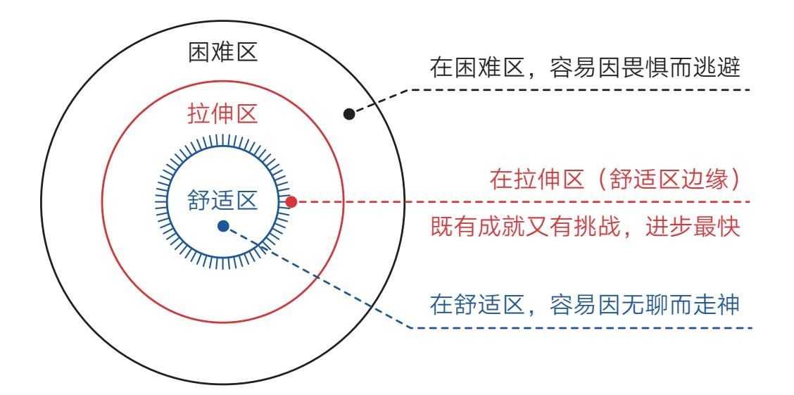
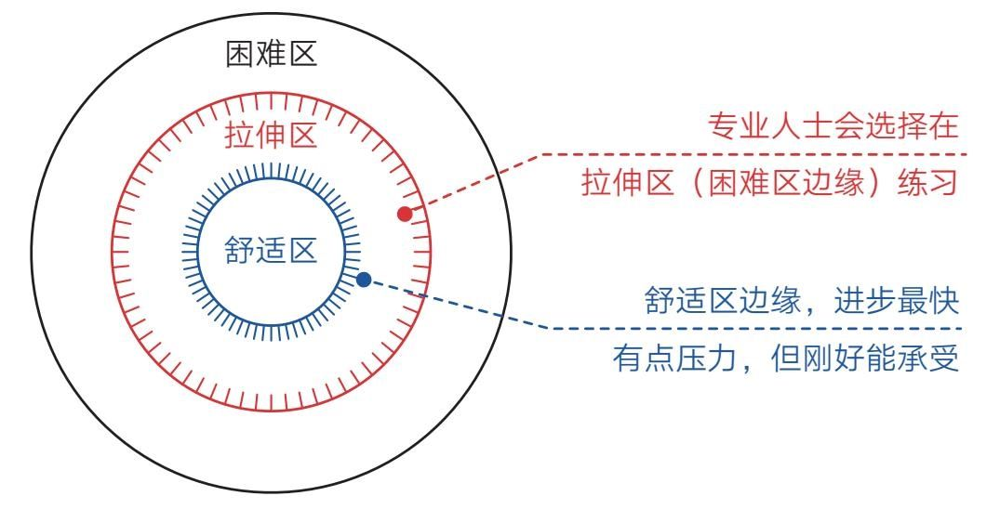
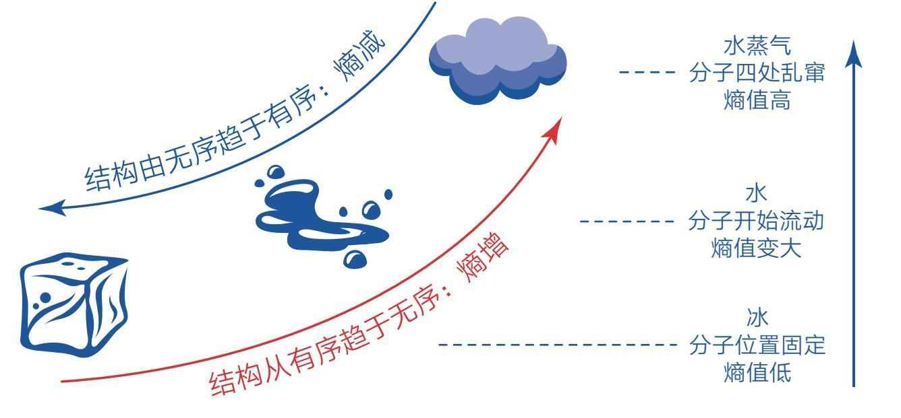
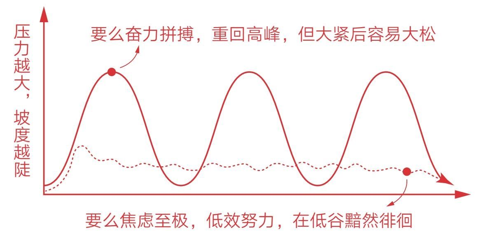
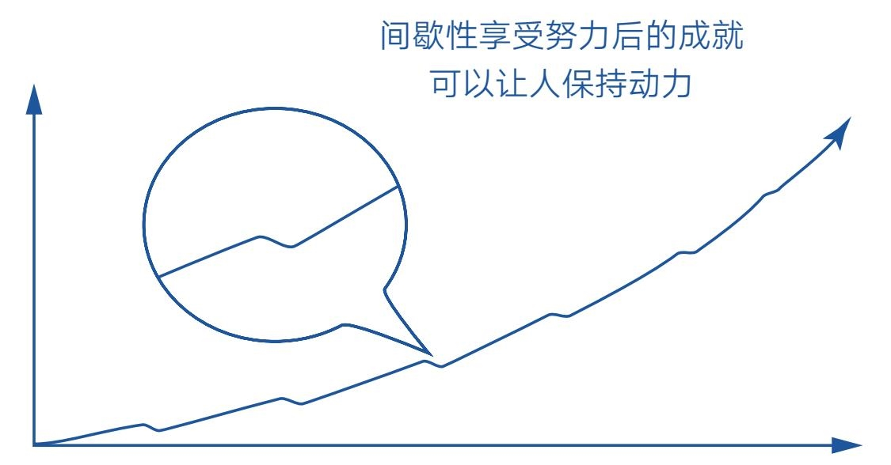
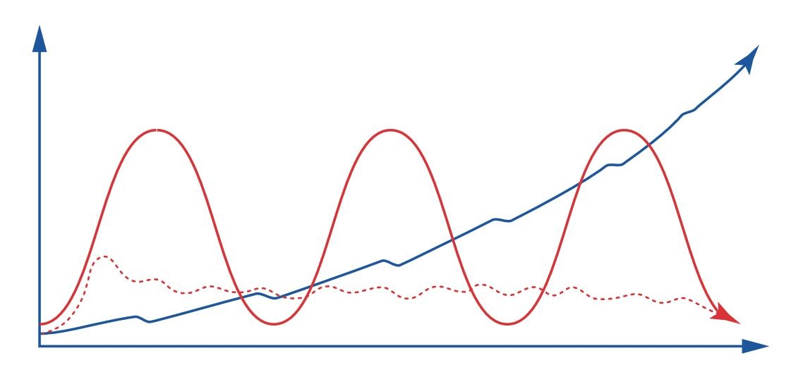

### 第三节　一劳永逸：想要一劳永逸？还是死了这条心吧

  下次你吃花椰菜的时候，记得多关注它一下。

  因为，它有毒！

  是的，这个被普遍认为味道鲜美、富含维C，还具有抗癌功效的蔬菜，竟然有毒！我知道这样说肯定会惊掉一些人的下巴，就像我自己最初也被惊到一样，为了避免被人说是造谣，我还是具体解释一下。

  花椰菜虽然富含抗氧化物，但通过饮食摄入的抗氧化物水平，远远无法起到抗癌的作用，人们食用花椰菜之所以会更健康、更长寿，是因为其含有的毒素——萝卜硫素。这些毒素原本是为了阻止昆虫或其他动物啃噬植物的，但蔬菜被我们食用之后，毒素便随之进入了人体内，不过由于剂量很小，对人体的伤害并不大。但毕竟是毒素入侵，身体依然会拉响警报，激活细胞内的应激反应，这些应激反应包含酶促反应，而酶促反应会增加抗氧化酶的含量。这才是吃花椰菜使我们变健康的真相。

  当然，大多数人即使知道了这个真相，也不过是多了一个知识点而已，但这背后还隐藏着一条重要的成长路径，如果我们能意识到并深挖它，就能主动改善自己的生活态度，减少人生路上的愁云困苦，保持生命活力。

#### 好的生活是始终游走在舒适区边缘

  通过花椰菜的知识，我们知道影响人健康的关键不在于是否有危害，而在于危害程度如何，换句话说：太大的压力和没有压力都不是好事，适度的压力才是。

  这是一个非常重要的启示！

  生活中，人人都在追求一劳永逸的无压生活，但长久的无压生活显然不是最佳选择，毕竟没有压力的伴随激励，我们很快就会陷入生理退化、精神空虚、思维衰退的境地，所以从成长角度看，压力其实没有好坏之分，但有轻重之分，适度的压力反倒是我们保持活力的重要基石。

  这与我们内心追求一劳永逸的思想多少有些出入，但接纳了这一点，我们面对压力的态度会发生有益的转变。毕竟，在漫长的人生中，压力无从避免，现在，我们终于可以通过上述观点来正视压力、运用压力了。如果运用得当，我们甚至还会乐于面对压力。当然，这里的压力特指“适度的压力”，就是那种既不是很大也不是很小的压力。

  读过《认知觉醒》的朋友一定还记得图3-2中的内容。

    图3-2 舒适区边缘

  能力圈法则告诉我们：一个人成长进步最快的区域在自己能力舒适区的边缘，太困难或太舒适的区域都容易让我们止步不前。

  如果我们把能力圈替换为压力圈，这个规律同样成立：太大的压力或没有压力都会使我们生活不幸，适度的压力则能让我们的人生获得源源不断的幸福。

  换言之，好的生活是始终游走在舒适区边缘。让自己处于有点压力但刚好能承受的状态，这或许才是我们应该追求的常态。所以生活中有点小压力、有些小约束、有点小焦虑……或许是好事，这会让我们的相关机能保持警觉，不会因麻木而退化，还能因此变得更好、更强。

  当然，那些专业人士，比如音乐家、运动员等，他们想要快速走到专业领域的前沿，必然会选择在靠近困难区的边缘练习，每次练到力竭。尽管他们在承受更大压力的同时会收获更多的进步，但原则还是一样的：不贸然进入困难区，否则也可能产生反作用。对我们普通大众来说，只要敢于在舒适区边缘游走，再辅以时间的力量，就足够了（见图3-3）。

    图3-3 承受压力的区域

#### 无压的世界不值得留恋

  尽管我对压力的利弊做了理智的分析，但估计你在情感上也不会买账，毕竟谁不希望自己永远或长期生活在没有压力、没有焦虑的舒适环境中呢？就连童话故事也会用“王子和公主从此过上了幸福的生活”来结尾，这显示了人们对永恒幸福的潜意识追求。虽然我们都知道童话故事只是一种理想化的畅想，但对一劳永逸的无压生活依然十分向往：我们希望找到一份事少、钱多、离家近的工作，最好是“铁饭碗”，从此高枕无忧；我们希望找到一个容貌佳、家境好、性格优的伴侣共度余生；我们希望实现财富自由，从此随心所欲。

  “等我哪天实现了这个目标，就可以告别辛苦，开始享受了！”这种思维模式极其符合我们追求确定性的天性，但它就像一个毒苹果，初咬一口觉得很甜，但很快就会神经麻痹，滑向危险之地。这并非危言耸听，因为它违背了一个基本定律：一切事物都会自然“熵增”。

  “熵”这个字太过专业，对于一些读者来说显得很不友好，尤其组合为“正熵”“负熵”或“熵增”“熵减”之后，更让人一头雾水。不过，当你知道熵是表示无序程度的量度时，就能理解了：因为正值大于负值，所以正熵表示更无序，负熵表示更有序；而熵增和熵减自然是指趋向无序和趋向有序的过程。

  比如冰是水的固体形态，它的分子位置固定，井然有序，熵值最低；变成液态水后，分子开始流动，秩序消失，熵值变大；变成水蒸气后，分子四处乱窜，一片混乱，熵值最高（见图3-4）。

    图3-4 用水的形态类比熵的概念

  熵增的本质其实就是热力学第二定律。热力学第二定律指出，能量会自发地从多处向少处、从高处向低处传递。传递过程中，事物的浓度趋于降低，结构趋于消失，有序趋于无序。也就是说，如果我们不主动输入能量去维护，这个世界上的万事万物会趋于混乱和无序、瓦解和消亡，包括我们的身体、技能和认知。这个世界上并不存在固定不变的舒适区，只要中断新能量（物质、信息）的输入，舒适区就会逐渐消失、瓦解。

  所以，一些人有了稳定工作后逐渐开始消磨自己的奋斗意志，而这种心态导致他们停止学习、浑噩度日，以致在面临新的挑战时无所适从；一些人找到满意的伴侣后，觉得没必要再持续完善和提升自己了，这种心态导致他们成长停滞，无法与对方同步，以致出现情感危机；一些人实现财富自由后，觉得没必要再克制节约，开始沉迷享受，以致失去目标、空虚无聊，最终跌入低谷。

  进入了舒适区，我们可以暂时松一口气，但不能一松到底，因为舒适区的消逝瓦解“不以人的意志为转移”。很多时候我们意识不到这一点，因为这个消解的过程往往并不明显，特别是在增长大于消解的时候，我们更是难以察觉实际状况，这一点可以从我们身边的很多现象中观察到。

  一个很有意思的现象是：假如你劝二十几岁的年轻人早起锻炼、少吃垃圾食品或不要熬夜，通常都会被他们当成耳边风，因为他们新陈代谢和恢复精力的能力正处于顶峰，此时，增长大于消解，即使不运动、吃垃圾食品，他们仍能保持匀称的身材和紧致的皮肤；即使通宵熬夜，睡一觉也能立马恢复。一旦到了一定年龄，就算没有人催，一些人也会主动想着锻炼和养生，因为此时其生理顶峰已过，能力曲线开始下行，消解开始大于增长，即使每天清汤寡水也很容易发福发胖，稍不注意就会有肚腩。

  可见，舒适区的消解无时不在、无处不在，不仅生理上如此，技能和认知上也是如此。《刻意练习》的研究者指出，训练引起的认知和生理变化要想持续，就不能停止训练，一旦停止训练，它们便开始消失。也就是说，我们通过辛辛苦苦的训练培养的绘画、演奏、写作等技能一旦荒废，就会退化。因为大脑中相关脑区的神经不再受到刺激，神经关联就会减弱，原先建立的连接也可能慢慢断开。所以这个世界上没有能够长期逗留的舒适区，贪恋舒适区必然会走向退化。当我们长时间觉得生活没有压力和挑战时，危险可能已经潜伏在身边了。

#### 刻意保持适度的难受

  古语说，人无远虑，必有近忧。这句话反过来说也是成立的：人无近忧，必有远虑。

  当我们长时间处于舒适区时，各项机能退化消解，直至遇到真正的危机，我们才会逼迫自己从低谷开始努力，但巨大的压力会迫使我们想要更多、想要快速见效，于是我们又陷入了巨大的困难区。在这种情况下，我们要么焦虑至极，低效努力，始终在低谷黯然徘徊；要么奋力拼搏，重回高峰，但也元气大伤。当我们再次达成目标后，可能又会大松一口气，然后待在新的舒适区内等待恢复，毕竟没人愿意持续高强度地拼搏。周而复始，形成了大起大落的波浪式成长轨迹（见图3-5）。

    图3-5 一劳永逸的心态导致大起大落或一蹶不振

  聪明的成长者会采用更加合理的策略——无论自己面临巨大的外部压力还是处于舒适区，他们都会刻意保持“适度的难受”。比如当自己面对巨大的外部压力时，他们会放弃一些欲望、降低一些期待、调整一些目标，或换个环境来减压。

  我的一个减压秘诀就是尽量不要同时设定很多目标，主动降低期待，不急于看到成果。这一秘诀非常奏效。因为不管是外部的还是内部的，只要目标或欲望一多，我们必然会焦虑丛生、急于求成，而面对强大的惰性时，我们也要学会主动跳出舒适区，通过持续输出和创造给自己加压。

  因此，我极力提倡大家无论干哪一行都要想着去创造点什么。有了创造意识，我们就会主动走到舒适区边缘，无论身体、技能还是认知，只要有作品的引领、反馈和激励，我们就会乐此不疲，精进不止。这样的努力虽然不会快速见效，但可以让人在高峰期和低谷期都保持耐心、稳健，避免大紧后的大松，最终形成持续积累的上升曲线（见图3-6）。

    图3-6 刻意保持适度难受享受的是间歇性成就

  如图3-6所示，我们会发现它呈现了一个相对平缓但持续上升的状态，但过程中我们并非没有享受。因为每达成一个小目标或小成就时，我们都会间歇性地获得一些正面反馈。这些反馈带来的成就和动力，让我们愿意再次走到舒适区边缘，继续行动。正如我在写作过程中体验到的那样：每次打磨一个主题，我都逼迫自己在舒适区边缘待一到两周；而每次发布一篇深度文章，我就能收获大量的正面反馈，激励自己继续向前迈进。如此反复，乐此不疲，我既能忍受这样的“痛苦”，又能持续扩大舒适区。这种成长模式没有一劳永逸的保障，却有享用不尽的乐趣，长久坚持，它就会与一劳永逸的模式形成鲜明对比（见图3-7）。

    图3-7 一劳永逸模式vs刻意保持适度难受

  可见，适度的难受是成长提升的催化剂，真正的美好也在于努力之后的收获与成就，而非长久的无压。只要我们刻意建立这种心态，就能从这个策略中长久受益。

#### 控制的艺术

  这是一个控制的艺术——把压力控制在舒适区边缘，让自己处于有点压力，又刚好能承受的状态。

  不过总说“有点压力”还是太笼统，到底什么程度才算处在舒适区的边缘呢？我们不妨参考罗伯特·威尔逊等人的研究。他们在《最优学习的85%规则》这篇论文中计算得出：生活和学习的最优值是15.87%。即无论生活还是学习，其“甜蜜点”是每次加入15.87%的难度和意外。或者说，好的状态（熟悉的部分）约占85%，困难的状态（有挑战的部分）约占15%。

  当然，这只是个参考数值，如果不追求精确，我们可以借用“二八法则”，即每次做到当前最佳水平，再加一到两成的吃力程度，比如跑步跑到有些气喘，阅读读到有些烧脑，写作写到有些力竭。

  总之，必须让自己的身体、思维和认知都受点挑战和“伤害”，这样，它们才会启动警觉和修复机制，就像通过运动锻炼了肌肉（产生酸痛感），身体修复之后我们会变得更强壮。

  尽管这一到两成的附加努力无法在短时间内给我们带来可观的变化，但可不要小看它，因为从长远看，它产生的收益会非常可观，而我们的成长也正好是一件长久之事。

  [[1]](./07-上篇-做成一件事的心法.md) 请允许我用自己的经历开始本节的讲述。这样做只是希望用自己的实践证明价值理念的正确性，并无自夸之意，为避免误解，特此说明。
