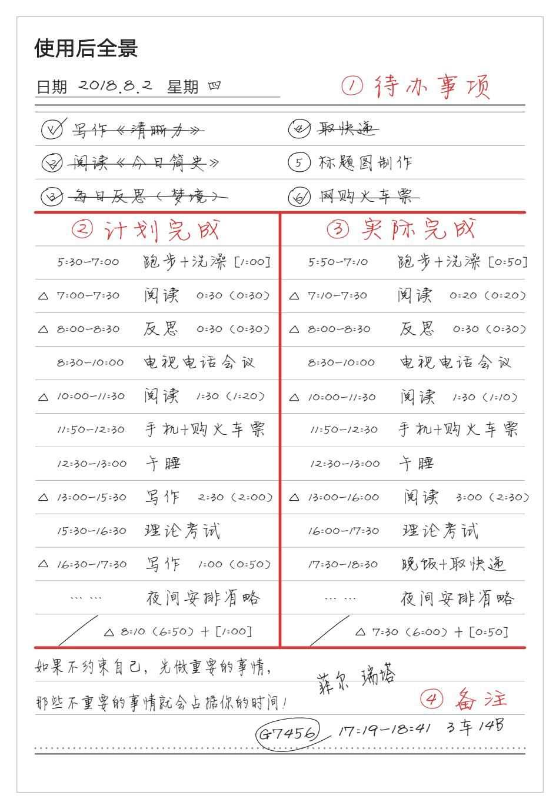

### 第二节　写下来：我们都低估了“写下来”的力量

  在接受了诸多咨询和提问后，我发现一个很有意思的现象：很多问题的解决方案竟然是一样的，而且都很简单，那就是写下来。比如以下场景。

  “无法掌控自己的情绪怎么办？”我：“写下来！”

  “经常分心走神不专注怎么办？”我：“写下来！”

  “行动力不强总是拖延怎么办？”我：“写下来！”

  “没有自己的人生目标怎么办？”我：“写下来！”

  “想问题很肤浅没深度怎么办？”我：“写下来！”

  这样的对话很多，不过当我只是简单地抛出“写下来”这个结论但并没有说明原因时，你肯定觉得这只是我个人的经验之谈，不足为信。事实上，“写下来”背后有丰富的科学原理支撑，如果你能从根源上了解这一方法，或许就会发自内心地实践运用，从而快速摆脱困境。现在就让我们一起来看看，为什么“写下来”会有“包治百病”般的神奇魔力。

#### “写下来”是情绪的调节器

  首先申明，这里说的“写下来”是指“把想法写下来”（包括用笔写下来和用键盘打出来），而不是专业的“写作”。实践这一方法不需要什么文笔或基础，只要会写字或打字就可以拥有这种力量。那么对于普通大众来说，“写下来”最大的好处是什么呢？我想莫过于它能化解自己的糟糕情绪了。

  2019年1月，读者“王棋”和我说过这样一段经历。

  有一次，我朋友被领导批评，情绪特别低落。在自己无法消化情绪的时候，她就用笔一条条写下自己真实的想法，写下自己到底在难过什么。当把真实想法一条条写下来并想清楚之后，她就觉得没有那么难过了，觉得领导的批评是有道理的，是在帮助她改掉问题、提升专业能力，只不过这种事实被批评后的难过情绪包裹了。我当时特别吃惊：竟然还可以用这种方法消解自己的情绪！我被批评后总是一直陷在情绪中，从来没有理性分析过自己到底在难过什么。看来高手解决问题的方式都是相通的。

  为什么“写下来”会有这样神奇的作用呢？因为当情绪产生时，理性便会退居第二位。我们都知道，人类情绪脑的力量比理智脑要强大得多，所以情绪在大脑中处理的优先级远高于理性思维，但情绪脑在智能上又远远落后于理智脑，它只能将遇到的事情粗糙地分为“有利的”和“有害的”，所以情绪一旦极端化，它就会在模糊的“有害端”反刍那些负面事件，也就是我们说的陷在情绪里走不出来。

  但是，书写自己当前面临的负面事件，就可以调动更多的理性资源帮助我们整理思路，使处理情绪思维的优先级暂居其后，同时，书写这一行为可以激活大脑皮层的语言区和书写区，使我们对当前遇到的负面事件有一个更为具体和清晰的认识，所以书写可以让负面情绪得到一定的缓冲，使人慢慢地恢复理智或理性。

  我在平时的每日反思中也深深地体会到了这一点，因为无论当天遇到什么难过的事，我都会把它们写下来复盘，所以即使没人帮助，我也能疏导情绪，而且往往还能从负面事件中产生积极的视角和看法。

  《开放心胸》的作者杰米·彭尼贝克通过幸福实验也发现，运用书写来表达自己情绪的人更加健康。因此，他同样建议：一旦你的生活出现了问题，就拿出笔和纸把事件的经过、自己的感受、为何会有这样的感受，一五一十地写下来。过程中不用修改，不用检查，更不用管语法或句式对不对，只要放手去写就好了。

  同时他还强调，写下之后一定要回答自己以下两个问题。

  一是这个事件为什么会发生？

  二是我能从中汲取什么教训？

  书写的意义不只是宣泄怒气，更在于找出意义，所以表达即消融，表达即清醒。无论你遇到什么不愉快的事情，如果想更好地解决问题，那就拿出笔纸或键盘来疗愈自己吧。

#### “写下来”是专注的聚焦器

  其实就算没有极端情绪的影响，我们也未必总能够集中注意力去做重要的事。随便回顾一下生活中的片段就会发现，大多数时候我们都会杂念丛生，心中翻腾着各种欲望、担忧、顾虑或焦虑。

  2005年，美国国家科学基金会通过调查发现：普通人脑海里每天会闪过1.2万至6万个念头，其中80%的念头是消极的，95%的念头与前一天完全相同。[[1]](./34-第六章-成事——做到，是最高等级的成长.md)

  可见分心走神是我们的常态，而且人有负面偏好，会不自觉地把注意力放到那些“坏事”上，所以在日常生活中，我们会天然地陷入分心走神状态，很难进入心流状态。那如何在生活和工作中保持专注呢？

  写下来。无论在什么场景中，如果你无法静下心来做事，那就坐下来写下你心中的念头，想到什么就写什么，连续写上5分钟，你就能集中注意力了。如果你在学习的过程中，总有杂念闪现，也没关系，把它们写在边上的本子上，哪怕只用一句话描述也可以，因为这样做可以启动元认知，清空我们的“工作记忆”。

  所谓“工作记忆”，就是我们所有可用的脑力资源。它非常有限，大概只有7个单位，也就是说，每个人脑中大概只有7个脑力小球可以帮助自己进行思维活动。而那些烦恼、顾虑、担忧等无用的念头会轮流占用这些资源，就像一台电脑在后台运行了很多程序。所以要想让大脑集中精力、火力全开，就得想办法结束这些无用的进程，而结束进程通常只有两个办法：

  一是在现实世界中完成它，让事情闭合；

  二是在虚拟世界中审视它，让进程结束。

  显然，很多念头是无法在现实世界中立即完成的，所以“写下来”就成了在虚拟世界中打消它们的不二之选，因为它可以帮我们开启元认知，审视这些念头存在的理由和必要性。只要把可信的理由“说”给它们听，它们就能接收信息，认识到自己没有存在的必要，从而主动释放进程，退出工作记忆。而工作记忆一旦被清空，人的精神熵就会迅速降低，于是就具备了进入极度专注状态的条件。

  这也是人们常说“先整理心情，再处理事情”的原因。

#### “写下来”是行动的发动机

  就算你心中毫无挂念，就一定能拥有强大的行动力吗？

  未必！

  因为真正的行动力不是意志力，而是清晰力[[2]](./34-第六章-成事——做到，是最高等级的成长.md)。也就是说，即便我们清空了工作记忆，如果不清楚下一步具体应该做什么，同样会行动模糊。在这种状态下，我们会觉得做这个也行、做那个也行，最后往往会在强大天性的支配下选择做那些最简单、舒适的活动——娱乐。

  这也是为什么很多没有生活压力的人活得并不幸福，因为他们虽无压力，但也无力做成那些能够成就自己的困难之事。要想在顺境中主动掌控命运，就要防止自己陷入“选择模糊”的状态。而消除“选择模糊”最好的办法就是把下一步的行动或计划写下来（见图4-1）。

    图4-1 日程规划

  通过写下具体的日程，把自己约束在特定时间内的特定事件上，我们就不需要在过程中再花脑力做选择了。而且写下明确的日程相当于和未来的自己达成了一种协议，这种协议就是一种承诺。人一旦许下承诺，潜意识就会倾向于保持前后一致，所以这种写下来的习惯会让行动力大大提升。

#### “写下来”是目标的出发地

  对于成长来讲，消除情绪、保持专注、提升行动力其实都是细枝末节，真正重要的是找到自己的人生目标。一旦我们找到那件茶不思、饭不想都愿意去做的事，我们的生活就会自带平和、专注、高效的属性。然而找到自己的人生目标并不容易，很多人都没有意识到自己始终活在无目标的状态中。

  比如在一次关于人生目标的咨询中，我要求读者“贺Y”告诉我他的人生目标，结果他沉默了一周才回复我：“那天你问我改变的目标时，真的一下子蒙了，原来不知不觉中，我已经过上了得过且过的生活，我居然一直处于这样的状态。”另一位读者“落F”也这样回复：“我思考了两天，还是没能写出清晰的人生愿望。”

  不信的话，你可以自己试试。可能你觉得心里有目标，但真到动笔的时候就不是那么回事了——要么写不出，要么写不清。

  因为写下来要求你把那些模模糊糊的想法变成非常清晰的文字，这个从模糊到清晰的过程就是“想与写”之间的距离。如果你能清晰地写下来，往后的人生或许会变得些许不同。

  当然，做这件事最大的困难是，你不确定写下来的是不是自己真正的目标，或者根本写不出来，停在那里不知如何继续。如果你遇到这种情况，请谨记一条原则：一定要先假设一个最接近的目标。这个目标是否正确并不重要，只要它是目前最接近的，那它就可以帮助我们先行动起来，然后带领我们走向下一个更接近的目标，直至真正的目标出现。

  实际上多数人的人生目标都不是一开始就出现的，而是在持续的实践试错中慢慢浮现的。所以这种利用假设来消除模糊和不确定性的方法，是一种极好的成长策略。除了上面的日程规划，这条假设原则也同样适用。如果你不确定下一步该做什么，那就按照最大的可能性先假设一个。你会发现仅仅一个假设也会大大增强你的行动力。

  当然，如果你希望自己更进一步，那我建议你再花点时间写一写对人生目标的认识。也就是想办法从各个角度发现做这件事情的好处与意义，因为当我们看到的好处和意义越多，做成这件事情的概率就越大。而发掘好处和意义最好的方式就是用笔或键盘描述自身与目标之间的关联。

#### “写下来”是思考的挖掘机

  最后，再说一说如何用写下来的方式提升自己深度思考的能力。深度思考的能力从本质上来说其实就是输出的能力。

  ·没有输出能力的人只会在脑中想，但不会说；

  ·输出能力弱的人可能会说，但不一定能说清楚；

  ·输出能力强的人通常都会写，而且还能写清楚。

  “想、说、写”之所以代表不同程度的思考能力，是因为这三种活动关联知识的数量和密度是不同的。很多时候，你会发现一件事情或一个道理自己脑子里想得挺明白，但让你说的时候你会磕磕巴巴；如果再让你写下来，你就会无所适从，感觉逻辑非常不清晰，所以书写是锻炼深度思考能力最有效的方法之一。

  无论是把心中的困惑写下来（表达清楚问题），还是把脑中的想法写下来（表达清楚思考），都会最大限度地调动脑中的知识储备，产生更多的关联，让我们不断突破自己的脑力局限，让那些模模糊糊的、呼之欲出的、似是而非的、捅破窗户纸就可以洞察的时刻，变成我们的“啊哈时刻”[[3]](./34-第六章-成事——做到，是最高等级的成长.md)。

  可见，写下来的力量是强大的，时常这样练习，你的思考能力和表达能力都会在潜移默化中得到锻炼和提升。如果你还能把每次新学的知识通过自己的语言重新描述出来，那你就可能在深度学习的路上领先他人。

  写下来还有另一个好处，就是可以反复修改，直到能用最合适的语言表达最多、最准确的含义。就像本节一开始也只有几个零星的思考点，我甚至担心篇幅不够，但经过数周的持续打磨，我竟查阅了4篇文章、6本书、20多个读者咨询的对话，最后把“写下来”这个主题翻了个底朝天。“写下来”这三个字在我这里又有了全新而独特的意义，清晰又深刻。

  如果你真正体会到了写下来的好处，我相信你肯定会对这种能力爱不释手。而且你一定会越来越不满足，然后在某一天拿起手中的笔，迈向写作的殿堂，用它去创造一个属于自己的世界。毕竟“写下来”只能让自己变得更好，而“写作”还可以对外产出有价值的作品，让他人变得更好。

  不要低估“写下来”的力量，更不要低估“写作”的力量。只要你写下了第一笔，就有机会开启人生的无限可能！
