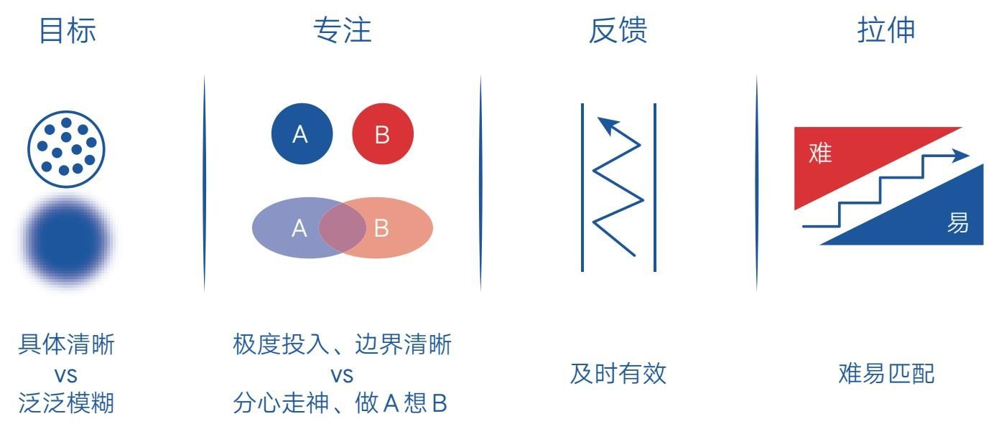

### 第五节　深度练习：跨越从普通到卓越的分水岭

  从某种意义上说，要想获取人生幸福，最简单直接的方式就是练就一项技能，让自己在某方面拥有独特的优势。如果你在某一方面比绝大多数人都擅长、出色，在成就感的加持下，你做这件事时一定会更加从容和幸福。

  然而在获取人生优势的道路上，多少人的心境是求而不得呀！无论自己内心多么希望变好，无论怎么用功努力，有时就是无法让自己变得与众不同。那感觉就像面前横了一道无形的分水岭，难以跨越。

  如果你有这种体验和感觉，那很正常，因为普通与卓越之间确实存在一道无形的分水岭，只是大多数人看得并不清楚。现在，就让我用两个人的逆袭故事帮你勾勒它的模样，然后一起想办法跨越它。

#### 史诗般的高考逆袭[4]

  某年5月的一个下午，一位高二男生在学校操场上焦虑地绕圈踱步。此时上课铃声已经响起，但他没有走向教室，反而走到了更僻静的地方。

  他在思考一个问题，而且下定决心要把它想清楚。因为他当时的成绩只有400多分（总分750分），前程堪忧。让他更焦虑的是，不管他变好的欲望多么强烈，无论他怎么努力，都无法明显提高成绩。这种“求而不得”的残酷现实让他走到了崩溃的边缘，而此时距离高考只有1年零2个月了，所以他必须找到问题的根源。

  一番苦思冥想之后，他逐渐把困惑缩小到了这个问题上：“我今天的学习是为了什么？”终于，他得到一个让自己眼前一亮的答案：“今天的学习就是为了进步！如果明确知道自己努力学习一天不会有任何进步，那还不如去玩！现在之所以听课、预习、做作业、做卷子、看参考书，全都是为了一个目的：进步。”

  想到这里，他的头脑清晰了起来。但是新的问题马上来了：“既然每天学习是为了进步，那如何知道自己每天进步了多少呢？”他发现自己根本回答不出来，但也意识到这就是问题所在：“如果连一天中有哪些进步都不清楚，那说明自己在过去的时间里都是在糊里糊涂地学习。”此时他恍然大悟，确定这就是自己没有明显进步的根本原因，于是当即决定建立一个“进步本”，把每一个学习收获都记下来。

  从那天开始，他把每天新学到的各种知识、不会做的题、搞明白了的错题，还有关于学习的一切总结、思考都记录在进步本上。这样，只要一看本子，就知道当天有多少具体的进步，一目了然。

  当然，仅仅记录是不够的，因为记录不等于进步。“如果同样的错误再犯，同样的题型又不会了，同样的知识点下次遇到又模糊了，这些都不意味着进步。只有记在脑子里，不忘记，才是真正的进步。”

  遵循这样的原则，他每天抽出专门的时间，把本子上面的题拿出来重新做、反复做，不懂就问同学、看参考书，直到把所有学到的知识完全无误地记住、理解了每一个步骤的细节，并达到了任何时候都能快速做出且不出错的程度。

  通过实践，他终于明白为什么之前听课、做作业、看参考书等学习方式无法让自己真正进步了。因为这些学习过程的效果不能被直接检验，唯有将转化的结果清晰地记录在进步本上，才可以检验学习方法是否有效。

  由此，他确认了这样一个事实：进步本的完整操作是快速进步的有效方法。如果犯过的错误下次还犯，做过的题目下次还错，那说明这根本不是学习，或者是效率极低的学习。相反，保证出过错的题不再出错，搞明白之后不会忘记，才是学习的底线。

  在进步本的加持下，他的学习成绩和名次开始飞速跃升。最终在高考时考出了全班第一、全校第一、全市第一的好成绩，如愿拿到了北京大学的入学通知书，实现了高考的逆袭。

  他就是“核聚老师”（以其公众号名称呼），如今他用自己的方法论帮助很多考生走上了逆袭之路。

  “核聚老师”的方法表面上看是个人经验，其实背后有科学的脑神经理论作支撑。所以这样的方法论适用于各个领域，并不局限于在校阶段被动式的有压学习。当然，如果你还想继续了解离校后自主式的无压学习，那就随我一起看看韩国作家张同完的人生翻转之路吧。

#### 自学英文翻转人生

  张同完是《我在100天内自学英文翻转人生》一书的作者。在书中，他自曝自己在初中时就是一个差生，对学业丝毫不感兴趣，不懂为什么要读书，成绩落后到差点没机会读高中。后来侥幸上了高中，英文成绩垫底，他对未来没有任何想法，但在一个偶然的机遇下，他萌发了“讲一口流利英文”的强烈愿望。

  经过不断摸索，他终于发现了100LS训练法，在几乎零基础的状态下，做到了6个月开口说地道英文，1年达到口译水准。这种学习方法与学校的教学完全不同——不学语法、不刻意背单词，但效果惊人，很多母语是英语的人都以为他在国外生活过。凭借一口地道流利的英文，他不仅获得了卡塔尔的高薪工作，之后又以同样的方法学会了法语、日语和汉语，并以特招生的身份进入釜山大学法语系，让自己的人生焕然一新。

  张同完的经历听起来非常神奇，就像热播剧里的虚构故事。事实上，他的100LS训练法并不神秘，说起来还很简单，就是找一部自己喜欢的电影，然后跟着听（Listening）和说（Speaking）。

  说到这儿，你肯定会认为这不就是“看美剧学英语”的方法吗？有什么神奇的？确实，粗看起来没什么神奇的，但仔细观察就会发现，张同完的方法还是与众不同的。

  普通的方法通常会带着这样的诱惑告诉你：只要看完这100部美剧，你就会在不知不觉中成为英语达人。但张同完的方法是：只看一部剧，但这一部剧要看100遍！

  他还提供了这一方法的具体步骤。

  第一步，关掉所有字幕观看第一遍；

  第二步，打开母语字幕观看第二遍，确认之前没有听懂的部分；

  第三步，换成英文字幕，把刚才没听懂的片段抄下来；

  第四步，反复练习听不清楚的片段，听完马上跟读；

  第五步，关掉所有字幕，观看剩下的97遍。

  这其中，关键要领是弄清楚每一句台词的意思，听完马上跟读，对不熟练的片段反复练习，使语气、语速、语调尽可能与剧中一样。换句话说，就是将剧中的情景对话强化为“大脑的肌肉记忆”，直到在类似的场景下不用思考就能脱口说出极为准确和地道的外语。

  张同完直言，这其实就是我们每个人学习母语的方法。而且用这种方法学习外语并不需要看很多部电影，只需要把几部经典“背下来”，就足够赶超绝大多数人的外语水平。

  现实也证实了这一点，我们绝大多数人从小学起就开始接触英语，不断学语法、背单词、做卷子。如此学上十几年，结果可能连十句正常的对话都接不下去，更别提流利、准确、地道了。一些人也用看美剧的方法来学习英语，甚至用海量的影视剧来“浸泡”自己，指望自己的英语水平能在这种无痛的娱乐环境中轻松提高。可惜他们只是沉浸在轻松的剧情里，并不注重扎实的练习和具体的收获，最终的效果往往也是水过鸭背。

  如果我们进一步探寻根源就会发现，这正是我们人类急于求成、避难趋易的天性在作祟。所以在默认状态下，我们总是不看现实结果，一味追求轻松、简单、新鲜、快速，以致迷失在没有实效的自我欺骗中而不自知。在这种状态下，即使我们有变好的强烈愿望，就算愿意付出持续的努力，最终收获的结果可能还是两个词：平庸和普通。

#### 学习即练习，有一是一

  结合“核聚老师”与张同完的经历，我们不难发现他们的学习有一个共同的理念和标准，那就是：学习即练习，有一是一。

  “核聚老师”没有沉迷于对各种资料的泛泛复习，张同完也没有醉心于各种美剧的泛听，他们都把知识当成技能去练习，只关注自己能真正把握的那些点滴细节，最终成就了自己。奇怪的是，普通人对这种学习方式往往不屑一顾，而高手们却极力推崇。

  比如曾国藩在家读书时，他父亲要求他，不读懂上一句，不读下一句；不读完这本书，不摸下一本书。因此他也在家书中留下了“一书未完，不看他书，东翻西阅，徒徇外为人”的忠告。事实上，曾国藩年轻时资质非常普通，进步也非常慢，但凭借步步扎实的积累，得以做出一番成就。

  再比如诺贝尔物理学奖获得者理查德·费曼教他14岁的妹妹琼学习天文学教科书时，曾这样指导她：“你从头读，尽量往下读，直到你一窍不通时，再从头开始，这样坚持往下读，直到你完全读懂为止。”最终，琼成为一名天文学家。而在此之前，她的母亲曾告诉她，女子的大脑达不到从事科学工作的程度。

  可见，上乘的学习方法就是这样原始、简单。不需贪多求快，只要一步一步、一点一滴地扎实推进即可。谁在这方面耍小聪明，谁就会吃亏。而这种盈亏关系在一位研究生给“核聚老师”的反馈中也被形象准确地描述了出来：“在使用‘进步本’之前，我学得虽快，但忘得也快，相当于用沙子建房子；在使用‘进步本’之后，我惊恐地发现自己真正掌握的没有多少，发现之前的学习基本没有让自己产生实质性的进步……但此后的学习相当于用钢筋混凝土建房子，不留一点漏洞，让人感到很踏实！”

  “沙子”和“钢筋混凝土”的对比真是形象又准确，因为这其中暗含另一层寓意，即前者开始时容易，后期困难；后者开始时困难，后期容易。这解释了为什么那些学习成绩一般的人会越学越痛苦。因为前面的学习有很多漏洞和盲区，所以后面所有建立在这些基础之上的知识就会摇摇欲坠。之前的漏洞和盲区若是得不到彻底的解决，之后会一直受此影响，那么学习上的新问题和新漏洞就会越来越多。

  而那些使用了类似“进步本”的学霸，则越学越轻松，因为他们每一步都走得很扎实，因而在后期需要面对和解决的难点会越来越少。巨大的学习优势还会让他们自信满满、乐此不疲，甚至学习上瘾、停不下来。所以对一些人来说，学习这件事永远是难的，无论学什么都学不好；而另一些人却学什么成什么，显得特别聪明。背后的原因很可能就在于这个最基本的学习观。

#### 速度，也是一种能力

  再看“核聚老师”和张同完的学习方法，我们会发现它们都非常符合刻意练习的基本原则（见图4-2）。

    图4-2 刻意练习四要素

  比如“核聚老师”会不断明确那些自己不会或不熟练的部分，将学习范围划定在一个极小的范围内，然后反复咀嚼、反复琢磨，直到融会贯通，再开启下一个章节；张同完也会对不熟练的长句进行拆解，然后对各个小片段进行反复练习，直到可以将整句流利、连贯地表达出来。他们在练习时不仅目标明确，而且都善于将大目标拆解为小目标。

  采用这样的学习方法，他们也能得到最及时的反馈，比如“核聚老师”会通过测试衡量自己的学习效果，而张同完则直接与地道的发音进行对比。这些学习规律使他们能始终在舒适区边缘拓展，而非在舒适区内低效重复。

  除此之外，还有一个重要的因素拉开了普通与卓越之间的距离，那就是速度。很多人正是忽略了这一点，才陷入了很努力但就是不见明显进步的境地。

  比如高三读者“木多”就有这样的困惑。她自述在学业上非常吃力，尽管自己内心很想变好，但巨大的学习压力和糟糕的学习体验使她终日被低落、沮丧的情绪缠绕，甚至开始信心崩溃。

  当问及她具体如何学习时，她说：“基础的东西我也可以做出来，只是花的时间要久一点。比如一页地理习题可以只错一题，但要花45分钟才能完成。”我当即意识到，她的学习观里缺少一个概念，那就是速度也是一种能力。

  很多人和她一样，以为学习就是理解知识的过程，以为理解了就是掌握了，然后止步于此，殊不知，对知识运用的频率、速度及熟练度也是学习能力的一部分。所以很多人在学习之初感觉并不吃力，但越往后，就发现自己越来越搞不定学习了。而那些成绩好的人，往往会有意无意地把“做对”和“做快”同时列入自己的学习标准。他们不满足于会做，还追求快速做出且不出错。“核聚老师”也提到过这样一个学习铁律：凡是遇到卡壳、学不下去的情况，只有一个原因——你对此前学过的东西不熟练，没有达到掌握的程度。

  那些卓越者正是在这一步下足了功夫才真正拉开了与普通人的差距。如果张同完说的每句英语都磕磕巴巴的，那即使他说的都正确，也没有人会认为他是英语达人。他之所以能让别人刮目相看，正是因为他不满足于能说，还反复练习，达到了能脱口而出的程度。如果一位钢琴练习者弹的每首曲子都断断续续，那么即使他会弹100首曲子，也不会有人认为他是钢琴高手。而一个人即使只会弹一首曲子，但如果他能闭着眼睛把那首曲子弹好，也一定会让众人惊叹。可见，只有达到非常熟练的程度，一个人才能真正创作出自己的成绩或作品，获取真正的优势和影响力。

  无论是学习知识还是学习技能，我们都应该在脑子里牢牢树立这个观念：速度，也是能力的一部分。有时候它比理解更重要，甚至是后期竞争中唯一重要的因素。所以千万不要忽略学会之后的练习，并且要明确练习的标准，因为真正的对手不怕你会一万招，就怕你把一招练一万次。

  另外，如果你经常观察那些卓越者，会发现他们平时行动的速度也很快：

  ·能用一分钟做完的事，绝不花两分钟；

  ·一旦投入学习，就直奔目标，快速进入状态；

  ·用学校考试的标准来写家庭作业；

  ·刻意提高阅读速度，强迫自己集中注意力……

  这些快速的习惯会把他们带入极度专注的状态，让他们在学习时能聚集穿透问题的能量，所以他们不仅学得更好，还能留出很多时间让自己检查、复习、拓展，甚至放松娱乐，以此保持优势的正循环。而普通人习惯在学习途中慢慢悠悠、磨磨蹭蹭，半天进不了状态，即使开始学习了，也极容易分心走神。这都是因为他们缺乏“快速”这个意识和技巧。

  快速和优秀之间似乎存在一种因果关系，但这种关系这样表述才更加准确：一个人不是因为学习好才动作快，而是因为动作快才学习好。

  归结起来，我们在心态上要“慢”，允许自己学得少、学得慢；在动作上要“快”，要求自己熟练、迅速。

  想透了这些，我们就能让自己的卓越之路变得更加清晰。

#### 开启深度练习

  学习无非两种：一种是认知上的学习，另一种是技能上的学习。

  对于认知上的学习，我曾在《认知觉醒》的深度学习主题中总结过三点：

  ·获取高质量的知识——获取并亲自钻研一手知识；

  ·深度缝接新知识——用自己的话把所学的知识写出来；

  ·输出成果去教授——让自己的实际生活发生改变。

  对于技能上的学习，我们现在至少可以归结出两点：

  ·学习即练习，有一是一；

  ·速度，也是一种能力。

  为了更好地记忆并传播这个概念，我把技能学习的方法论命名为“深度练习”。我相信，当你手中有了“深度学习”和“深度练习”这两个认知武器后，就能应对学习过程中的种种困难，获取自己想要的人生优势。

#### 穿越而非跨越

  至此，你肯定已经能清楚地看见普通和卓越之间的分水岭长什么样了，但此时我的脑子里又冒出一个神奇的画面——那道分水岭不是跨过去的，而是穿过去的。

  那些习惯浅学习的人总是试图轻松翻越障碍，于是沉迷于体验各种不同的路径，尽管开始时走得很轻松，但每到半山腰总会无路可走；而那些愿意深度练习的人就好比在打隧道，虽然每一步都走得不容易，速度也不快，可一旦将其贯穿，那就是一劳永逸的轻松了。

  比起那些每天都要费力爬山的人，那个坐拥私人隧道的人可不就拥有了巨大的人生优势嘛！有了这种人生优势，他怎能不幸福呢？
