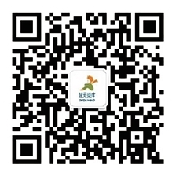

# 参考文献

  （按首次引用顺序）

  ［1］稻盛和夫.活法[M].曹岫云，译.北京：东方出版社，2019.

  ［2］岸见一郎，古贺史健.被讨厌的勇气[M].梁海霞，译.北京：机械工业出版社，2015.

  ［3］稻盛和夫.心[M].曹寓刚，曹岫云，译.北京：人民邮电出版社，2020.

  ［4］小马宋.朋友圈的尖子生[M].重庆：重庆出版社，2017.

  ［5］师北宸.让写作成为自我精进的武器[M].北京：中信出版社，2019.

  ［6］多丽丝·迈尔亭.内向者的天赋[M].孙瑜，译.北京：机械工业出版社，2018.

  ［7］杰里米·拉萨路.NLP思维[M].陶尚云，译.北京：台海出版社，2018.

  ［8］剽悍一只猫.一年顶十年[M].北京：北京联合出版公司，2020.

  ［9］詹姆斯·克利尔.掌控习惯[M].迩东晨，译.北京：北京联合出版公司，2019.

  ［10］亚历克斯·佩塔克斯，伊莱恩·丹顿.思维的囚徒[M].赵晓瑞，译.北京：中信出版社，2019.

  ［11］卡尔·纽波特.深度工作[M].宋伟，译.南昌：江西人民出版社，2017.

  ［12］维克多·弗兰克尔.活出生命的意义[M].吕娜，译.北京：华夏出版社，2010.

  ［13］罗伯特·清崎.富爸爸穷爸爸[M].萧明，译.成都：四川人民出版社，2017.

  ［14］西恩·贝洛克.具身认知[M].李盼，译.北京：机械工业出版社，2016.

  ［15］埃伦·兰格.专念创造力[M].黄珏苹，译.杭州：浙江人民出版社，2012.

  ［16］大卫·R.霍金斯.意念力[M].李楠，译.北京：光明日报出版社，2014.

  ［17］乔纳森·海特.象与骑象人[M].李静瑶，译.杭州：浙江人民出版社，2012.

  ［18］奥伦·克拉夫.重新定义推销[M].李卉，张魏，译.北京：人民邮电出版社，2016.

  ［19］卫蓝.暗理性[M].杭州：浙江人民出版社，2019.

  ［20］卡洛琳·亚当斯·米勒.坚毅[M].王正林，译.北京：机械工业出版社，2019.

  ［21］博多·舍费尔.小狗钱钱[M].王钟欣，余茜，译.成都：四川少年儿童出版社，2014.

  ［22］约翰·瑞迪，埃里克·哈格曼.运动改造大脑[M].浦溶，译.杭州：浙江人民出版社，2013.

  ［23］安德斯·艾利克森，罗伯特·普尔.刻意练习[M].王正林，译.北京：机械工业出版社，2016.

  ［24］万维钢.学习究竟是什么[M].北京：新星出版社，2020.

  ［25］亚伦·卡尔.这书能让你戒烟[M].严冬冬，译.北京：北京联合出版公司，2018.

  ［26］乌尔里希·伯泽尔.有效学习[M].张海龙，译.北京：中信出版社，2018.

  ［27］史蒂芬·柯维.高效能人士的七个习惯[M].高新勇，王亦兵，葛雪蕾，译.北京：中国青年出版社，2018.

  ［28］罗伯特·B.西奥迪尼.影响力[M].闾佳，译.北京：北京联合出版公司，2016.

  ［29］理查德·鲁梅尔特.好战略，坏战略[M].蒋宗强，译.北京：中信出版社，2017.

  ［30］吕克·德·布拉班迪尔，艾伦·因.打破思维里的框[M].林琳，译.北京：机械工业出版社，2015.

  ［31］成甲.好好学习[M].北京：中信出版社，2017.

  ［32］周岭.认知觉醒[M].北京：人民邮电出版社，2020.

  ［33］罗尔夫·多贝里.清醒思考的策略[M].杨耘硕，译.北京：中信出版社，2019.

  ［34］叔本华.人生的智慧[M].韦启昌，译.上海：上海人民出版社，2014.

  ［35］张同完.我在100天内自学英文翻转人生[M].关亭薇，译.北京：北京日报出版社，2019.

  ［36］杨建邺.费曼传[M].北京：金城出版社，2013.

  ［37］李笑来.财富自由之路[M].北京：电子工业出版社，2017.

  ［38］格雷戈里·希科克.神秘的神经镜像元[M].李婷燕，译.杭州：浙江人民出版社，2016.

  ［39］刘未鹏.暗时间[M].北京：电子工业出版社，2011.

  ［40］海蒂·格兰特·霍尔沃森.成功，动机与目标[M].汤珑，译.南京：译林出版社，2013.

  ［41］吉姆·柯明斯.蜥蜴脑法则[M].刘海静，译.北京：九州出版社，2016.

  ［42］罗尔夫·多贝里.明智行动的艺术[M].刘菲菲，译.北京：中信出版社，2016.

  ［43］斯科特·扬.如何高效学习[M].程冕，译.北京：机械工业出版社，2013.

  ［44］采铜.精进2[M].南京：江苏凤凰文艺出版社，2019.

  ［45］Scalers.刻意学习[M].北京：北京联合出版公司，2017.

  ［46］加里·凯勒，杰伊·帕帕森.最重要的事，只有一件[M].张宝文，译.北京：中信出版社，2015.

  ［47］吴军.见识[M].北京：中信出版社，2018.

    天生管理者
