# 第3章：第二课 为什么要教授财务知识

1990年，迈克接管了富爸爸的商业王国，事实上，他比富爸爸做得还好。我们每年都会在高尔夫球场上见一两次面。他和他妻子的财产多得难以想象，富爸爸的王国被管理得很好。现在迈克已经开始训练他的儿子接班了，一如富爸爸当年训练我们。

1994年，我退休了，那时我47岁，我妻子37岁。退休并不是因为我们没事可干。对于我和我妻子来说，只要不发生意想不到的大事，我们就完全可以选择工作或是不工作，我们的财富可以不受通货膨胀的影响，自动增长。我想这就是自由。资产已经多到可以自我增值，就像种树，你年复一年地浇灌它，终于有一天它不再需要你的照料了。它的根已经长得足够深，你现在可以开始享受它带给你的阴凉了。

迈克选择经营他的商业王国，而我选择了退休。

现在，我常面对许多人讲演，他们总是问我能给他们什么理财建议，或是他们应该怎么做才能致富。“我该怎样开始？”“有什么好书吗？”“应该怎么培养孩子？”“成功的秘诀是什么？”“你是怎样挣到一百万的？”这些问题总让我回想起我写过的那篇文章，其内容如下。

### 最富有的生意人

1923年，当时我们国家一些最伟大的领导人和最富有的商界人士在芝加哥的海岸酒店开会。他们中有美国最大的钢铁公司的领导人查尔斯·施瓦布、世界最大的经营公共基础设施的公司的主席塞缪尔·英萨尔、世界最大的煤气公司的领导人霍华德·霍普森、世界上最大的公司之一——国际火柴公司的总裁埃娃·克鲁格、国际清算银行的总裁利昂·弗雷泽、纽约证券交易所主席理查德·惠特尼、两个最大的股票投机商阿瑟·科顿和杰斯·利弗莫尔、美国第29任总统沃伦·甘梅利尔·哈定的内阁成员阿尔伯特·富尔。25年后，他们中有9人（就是上面提到的9人）的结局是这样的：施瓦布在度过5年的借债生涯后身无分文地死去了，英萨尔破产后死于国外，克鲁格和科顿也死于破产，霍普森疯了，惠特尼和阿尔伯特·富尔则刚从监狱被释放出来，弗雷泽和利弗莫尔自杀了。

我怀疑是否有人说得清这些人究竟怎么了。看看时间，1923年，正是1929年市场大崩溃和大萧条前不久，我想这场大萧条严重地冲击了这些人和他们的生活。关键是：我们今天所处的时代比那些人所处的时代变化更大、更快，我想在未来25年里会有更多的兴衰起落，这正是上面那些人曾经遭遇过的。我想有太多人过多地关注钱，而不是关注他们最大的财富——所受的教育。如果人们能灵活一些，保持开放的头脑不断学习，他们将在时代的变化中一天天地富有起来。如果人们认为钱能解决一切问题，恐怕他们的日子就不会太好过。只有知识才能解决问题并创造财富，那些不是靠财务知识挣来的钱也不会长久。

大多数人没有意识到，在生活中你挣了多少钱并不重要，重要的是你留下了多少钱。我们都听说过穷人买彩票中奖的故事，他们一下子暴富起来，但不久就又变穷了。他们虽然得到了上百万美元但很快又回到他们最初时的样子。还有关于职业运动员的故事，有一个运动员在24岁时，一年就挣了几百万美元，但到34岁时却露宿桥下。在我写这本书的时候，报纸上就有这样一则新闻：一个年轻的篮球运动员，一年以前还拥有几百万美元，可现在，他说他的朋友、律师和会计师拿走了他的钱，他只能在一个洗车房干报酬最低的活儿。

他只有29岁。他因为在擦车时拒绝摘下总冠军戒指，被洗车房解雇了，这样他的事才上了报纸。篮球运动员抱怨洗车房，说自己在艰难地工作并受到歧视，他还说那枚戒指是他唯一剩下的东西，如果把它拿走，他就会崩溃。

1997年，我知道又有很多人要成为百万富翁了。已临近20世纪的尾声，我很高兴看到人们越来越富裕，我只想提醒一句：从长远来看，重要的不是你挣了多少钱，而是你能留下多少钱，以及能够留住多久。

所以当人们问我“我该从哪儿开始”或是“怎样才能快速致富”时，他们肯定会对我的回答感到失望。我只是告诉他们富爸爸在我小的时候对我说过的话：“如果你想发财，就要学习财务知识。”

每当我和富爸爸在一起的时候，这个观念都会萦绕在我的脑海中。就像我说的，我那受过高等教育的爸爸强调的是读书的重要性，而富爸爸则强调要掌握财务知识。

如果你要去建造帝国大厦，你要做的第一件事就是挖个深坑，打牢地基。如果你只是想在郊区盖个小屋，你只须用混凝土打15厘米厚的地基就够了。大多数人在努力致富时，总是试图在15厘米厚的混凝土上建造帝国大厦。

我们的学校体系在农业文明时代就建立了，依旧迷信于不打基础就盖房子。孩子们从学校毕业时没有学到一点有关财务的基础知识。一天，当做着美国梦的那些人，在郊区的小房子里因债务的问题而无法入睡时，他们认定解决财务问题的方法就是快点发财。

于是建造摩天大楼的工作开始了。虽然进展得很快，但不久就会发现，他们建造的不是帝国大厦，而是一座斜塔。于是不眠之夜又回来了。

我和迈克在成年以后可以有多种选择，因为我们从小就被教导要打下坚实的财务知识基础。

现在，会计可能是世界上最乏味的学科了，也可能是最让人弄不明白的学科。但如果你想一直富有下去，它又可能是最重要的学科。问题是，你怎样才能接受这门乏味而晦涩的学科并把它教给你的孩子呢？那就是先用图表来教吧。

富爸爸为我和迈克打下了牢固的财务知识基础。由于当时我们只是孩子，富爸爸就发明了一种简单的方法来教我们。有好几年他只是用一些图和词语讲课。我们弄懂了那些简单的图和术语，以及它们表现出的钱的运动规律。在之后几年中，富爸爸开始加入数字。今天，迈克已经掌握了更为复杂的会计分析的方法，因为他经营着几十亿美元的公司，必须掌握这些方法。我不用掌握那么复杂的方法是因为我的“商业王国”要小一些，不过我们源于同一个简单的基础。在下面几页，我会给你介绍富爸爸为我们发明的那些简单的图表。图虽然简单，却帮助两个孩子建立了取得巨大财富的牢固基础。

规则
 　你必须明白资产和负债的区别，并且购买资产。如果你想致富，这一点你必须知道。这就是第一条规则，也是唯一一条规则。它听起来似乎简单得有些荒谬，但大多数人并不知道这条规则有多么深奥，他们就是因为不清楚资产与负债之间的区别才在财务问题中苦苦挣扎。

“富人获得资产，而穷人和中产阶级获得负债，只不过他们以为那些负债就是资产。”

当富爸爸向我和迈克解释这些概念时，我们以为他是在开玩笑。当时，两个不到10岁的小孩正等着听致富的秘诀，而得到的却是这样的答案。这个答案是如此简单以致我们不得不花很长时间思考它。

“资产是什么？”迈克问。

“别着急，”富爸爸说，“要先理解我刚才说的话。如果你们能明白这个简单的道理，你们的生活就会变得有计划，而且不会受到财务问题的困扰。正是因为它简单，才常常被人们忽视。”

“你的意思是说，我们只要明白什么是资产并得到它就能致富，是吗？”我问。

富爸爸点点头说：“就这么简单。”

“既然很简单，那为什么不是每个人都发财呢？”我问。

富爸爸笑了，他说：“因为人们并不明白资产和负债的区别。”

我记得我又问：“大人怎么会这么笨，如果这个道理很简单，而且很重要，为什么不把它弄明白呢？”

于是富爸爸又花了几分钟向我们解释什么是资产和负债。

成年后，我发觉向其他成年人解释什么是资产、什么是负债十分困难。为什么呢？因为成年人更聪明。大多数情况下，大多数的成年人没有掌握这个简单的道理，是因为他们已有了不同的教育背景。他们被其他受过高等教育的专家，比如银行家、会计师、房地产商、财务规划师等教过，于是就很难忘记已经学过的东西，变得像孩子一样简单。有学识的成年人往往觉得研究这么一个简单的概念太没面子了。

富爸爸相信“KISS”原则，即“傻瓜财务原则”（Keep It Simple Stupid）。所以他特意为两个孩子简化了课程，而这又使两个孩子的财务基础更加牢固。

是什么造成了观念的混乱呢？或者说，为什么如此简单的道理，却变得这么混乱？为什么有人会买一些自认为资产的负债呢？答案就在于他接受的基础教育是什么样的。

我们通常重视的是“知识”这个词而非“财务知识”这个词。而用词语很难说清什么是资产、什么是负债。实际上，如果你真的不想弄明白，尽管去查字典中关于“资产”和“负债”的解释吧。我知道那上面的定义对一个受过训练的会计师来说是很清楚的，但对于普通人而言可能毫无意义。可我们成年人却往往太过自负，不肯承认不懂其中的含义。

对小孩子来说，富爸爸说：“对资产的定义不是用词语而是用数字来表达的。如果你读不懂数字，就不知道什么是资产。”

“在会计上，”他接着说，“关键不是数字，而是数字要告诉你的东西。它的作用就像词语一样，虽然它不是词语，但它能告诉你词语不能告诉你的东西。”

许多人都可以阅读，但并不理解他们读到的东西，所以有“阅读理解”这一说法。人们在阅读理解方面的能力也是不一样的。例如，我最近买了个新的录像机，附有它的使用指南。其实我只想把星期五晚上喜欢的电视节目录下来，但我读那本指南时几乎要疯了。我甚至认为在我的生活里简直没有比学习使用录像机更复杂的事了。我认识每个词，但它们连起来后，我就不明白它们在说什么了。在认字上我得了A，而在理解上却得了F，这和大多数人对财务词汇的理解情况是一样的。

“如果你想富有，就必须读懂并理解那些数字。”这句话我从富爸爸那儿听到不下一千次了，他还经常说“富人得到资产而穷人和中产阶级得到负债”。

下面是区分资产和负债的方法。大多数会计师和财务专业人员不会同意这种方法，但是这些简单的图表却让两个小男孩建立了坚实的财务基础。

为了教两个不到10岁的孩子，富爸爸简化了他要教的事，尽可能地多用图，少用文字，并且很多年一直没有使用数字。

下图中上半部分的表格是收益表，它常被用来衡量收入和支出以及金钱流动方向的情况。下图中下半部分的表格是资产负债表，它被用来说明资产与负债的情况。许多初学财务的人都弄不清收益表和资产负债表的关系，而这关系到如何理解它们。

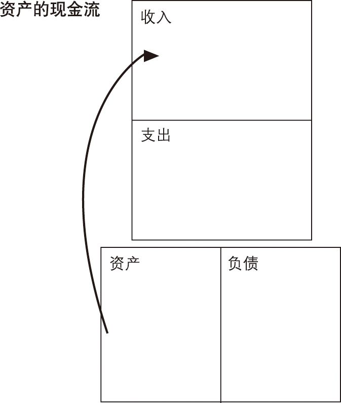

很多人陷入财务困境的根本原因就在于，他们不明白资产和负债的区别，而引起误解的原因就是定义它们时所用的词语。如果你想知道什么是含糊不清，只需去字典里查查“资产”和“负债”这两个词就明白了。

当然，受过训练的会计人员能够理解字典中对这两个词的定义，但对于普通人而言，这种定义过于专业，你读出了这两个词的定义，但真正理解它们却很难。

所以正如我前面说过的，富爸爸只告诉两个小男孩这句话：“资产就是能把钱放进你口袋里的东西。”这话妙极了，既简单又实用。

我们已经用图表来说明了什么是资产和负债，我还可以用文字下定义，也许会更容易理解：

资产是能把钱放进你口袋里的东西。

负债是把钱从你口袋里取走的东西。

你只要知道这些就足够了。如果你想致富，只需不断买入资产就行了；如果你只想当穷人或是中产阶级，只要不断地买入负债。正是因为不知道资产与负债的区别，世界上才会有这么多人有财务问题。

看不懂关于财务的文字或读不懂数字的含义，是产生财务问题的根本原因。如果人们陷入财务困境，那就是说有些数字或文字他们读不懂。他们误解了一些事情。富人之所以富有，是因为他们在某些方面比那些有财务问题的人更有知识，所以如果你想获得财富并保住财富，财务知识是十分重要的，它包括对文字和数字两方面的理解。

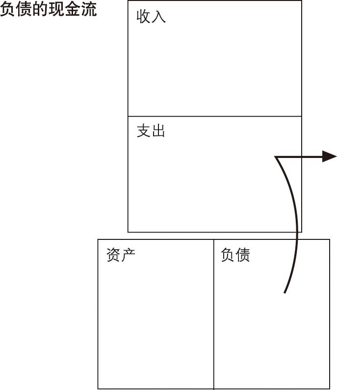

图中的箭头方向表明了现金流动的方向，它又被称为“现金流”。数字本身意义不大，正如文字本身意义不大一样，重要的是数字和文字所表达的东西。在财务报告中，读数字是为了掌握情况，即钱向哪儿流动。80％的家庭的财务报表表现的是一幅拼命工作、努力争先的图景，这不是因为他们挣不到钱，而是因为他们购买的是负债而非资产。

例如，下面是一个穷人（也可以表示一个没有经济独立的年轻人）的现金流图：

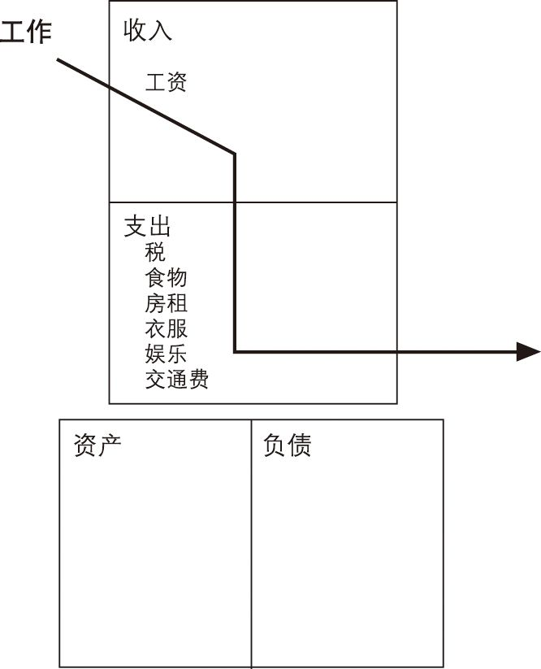

下面是一个中产阶级的现金流图：

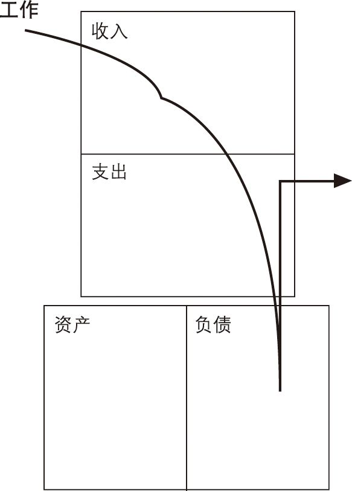

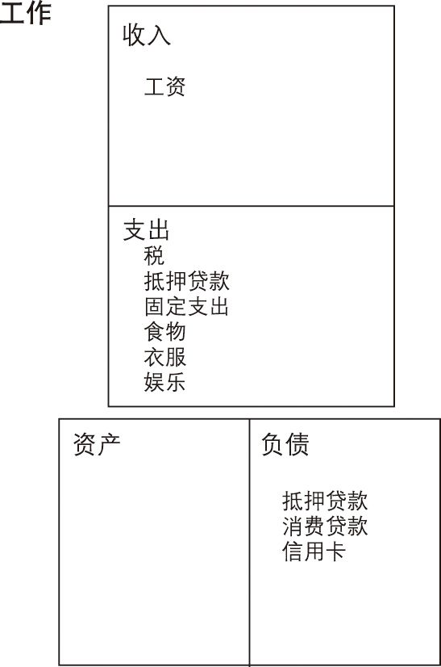

下面是一个富人的现金流图：

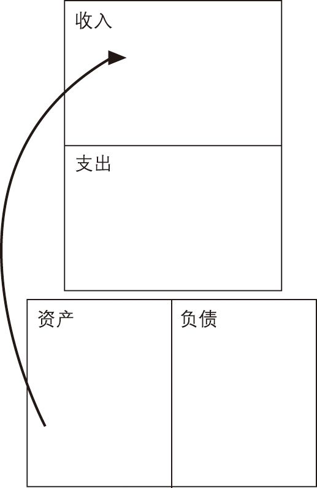

很显然，所有这些图表都经过了简化，只表现人们最基本的吃、穿、住、用。

这些图表显示了穷人、中产阶级和富人一生的现金流。正是现金流说明了问题，即一个人怎样处理他的钱，当他有了钱后会怎么做。

我刚才之所以提到美国那些最有钱的人，其实是想纠正一个错误观念，即钱能解决一切问题。这也是为什么当我听到人们问我他们怎样才能快速致富，或是他们应当从哪儿开始时，我感到不快的原因。我也常听人说：“我欠了债，所以我必须挣钱。”

但有更多的钱往往不能解决问题，实际上可能使问题变得更加严重。钱往往能暴露人性中那些可悲的弱点，并凸显人们的无知。这就是为什么经常有一些人在忽然得到一大笔意外之财，比如遗产、加薪或买彩票中大奖之后，不久又陷入财务困境的原因——即便他们的财务状况会比之前好一些。钱只会让你头脑中的现金流的模式更加明显，如果你的模式是把收入都花掉，那么最可能的结果是在增加收入的同时也增加支出。正所谓，“蠢人用蠢钱”。

我已经说过很多次，我们去学校学习以获取知识和专业技能，这两者都很重要，我们需要学会用专业技能谋生。20世纪60年代，当我在上高中时，如果有人在学校里成绩好，马上就会有人猜测这个聪明的学生将会成为一名医生，而不去问问这个学生是否愿意当医生，只是自己想当然的这么认为。因为，医生被认为是当时最有前途、收入最高的职业。

今天，医生们也同样面临着我们都不希望面对的巨大的财务挑战：保险公司对整个保险业的控制，医疗管理，政府的干预，医疗诉讼，等等。现在的孩子们想成为篮球明星、像泰格·伍兹那样的高尔夫球手、计算机奇才、电影明星、摇滚歌星、选美皇后或是华尔街的交易员，因为这些职业会让他们更出名、更有钱、更显赫。这也是很难激发孩子的学习热情的原因，他们知道职业成功不再像过去那样完全与学习成绩挂钩了。

由于学生们在学校时并没有获得财务技能，所以成千上万受过良好教育的人虽然取得了事业上的成功，却发现自己仍在财务问题中挣扎。他们努力工作，却并无进展，他们的教育中缺少的不是如何挣钱，而是如何花钱，即挣了钱后该怎么办？它被称为“理财态度”，即在你赚了钱之后如何处理这些钱，又怎样防止别人从你手中拿走这些钱？你能拥有这些钱多久？你如何让钱为你工作？大多数人不明白自己为什么会遭遇财务困境，这是因为他们不明白现金流。一个受过高等教育且事业有成的人，同时也可能是财务上的文盲。这种人往往太过努力地工作，因为他们只知道努力工作，却不知道如何让钱为他们工作。

### 发财梦变成噩梦的故事

下面的动态图显示了努力工作的人们所具有的模式。一对快乐的、受过高等教育的新婚夫妇租住在一套拥挤的公寓里，他们很快就意识到这样很省钱，因为两个人的日常花销和一个人的差不多。

但问题是，公寓太拥挤了，于是他们决定攒钱买一栋理想的房子，这样就能计划要孩子了。现在，他们有两份收入，并开始专心干事业。

他们的收入开始增加，见上面的图。

随着收入的增加……

支出也增加了。

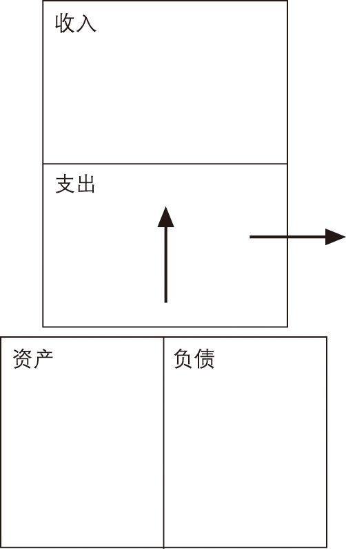

对大多数人而言，第一项支出是税。许多人以为是个人所得税，但对大多数美国人而言，最高的税是社会保险。作为一名雇员，表面上社会保险和医疗保险共计约7.5％，实际上却是15％，因为雇主必须为你付7.5％的社会保险。关键是，雇主是拿他本该支付给你的钱去支付的。此外，你还得为你工资中已经扣除的社会保险的那部分钱缴纳所得税，而这些钱是你从未拿到手的，因为它们通过预扣直接进入了社会保障体系之中。

接着，他们的债务开始增加。

下图是对这对年轻夫妇情况的最好描述：随着收入的增加，他们决定去买一套自己的房子。有了房子后，他们就得缴纳一项新的税——房地产税，然后他们买了新车、新家具等，以与新房子相配。最后，他们突然发觉他们的负债项充斥着抵押债务和信用卡债务。

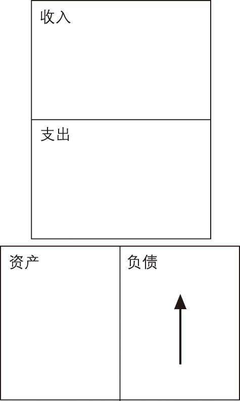

他们落入了“老鼠赛跑”的陷阱。不久孩子出生了，他们必须更加努力地工作。之前的经历又再次发生，钱挣得越多，缴税也越多，这也被称为“所得等级攀升”[(1)](./09-第3章-第二课-为什么要教授财务知识.md)
 。这时一家贷款公司打电话来，告诉他们他们最大的“资产”——房子已经通过评估，因为他们的信用记录非常好，所以公司可以为他们提供“债务合并”[(2)](./09-第3章-第二课-为什么要教授财务知识.md)
 贷款。那家公司告诉他们用这笔贷款偿付他们信用卡上的高息消费贷款是一项明智之举，除此之外，他们的住房按揭贷款的利息也会是免税的。他们同意了贷款公司的建议，并用债务合并贷款付清了高息的信用卡贷款。他们感觉松了口气，因为他们的信用卡账单付清了，但实际上他们不过是把消费贷款转到了住房按揭贷款上。他们现在要支付的钱数少了，是因为他们把债务分散在以后的30年去支付了。这真是件聪明事。

他们的邻居打电话来，说阵亡将士纪念日[(3)](./09-第3章-第二课-为什么要教授财务知识.md)
 商店正在打折，这是省钱的好机会。他们对自己说：“我们什么也不买，只是去看看。”但一旦发现了想要的东西，他们还是忍不住又刷了那些刚刚付清的信用卡。

我总是会碰到这种年轻夫妇，他们名字不同，但遇到的财务窘境却是如此相似。他们来听我的讲座，并问我：“你能告诉我们怎样才能挣更多的钱吗？”他们的消费习惯迫使他们挣更多的钱。

他们甚至不知道他们真正的问题在于他们选择的消费方式，那才是他们在财务困境中苦苦挣扎的原因。而这是由他们在财务上的无知以及不理解资产和负债的区别造成的。

再多的钱也不能解决他们的问题，只有运用财务知识才能解决这些问题。我的一个朋友对那些欠债的人不厌其烦地说：“如果你发现你已在深渊，那你自己就别再挖了。”

当我还是孩子时，我的爸爸告诉我日本人注重3种力量：剑、宝石和镜子。

剑象征着武器的力量。美国人在武器上已经花了上千亿美元，是世界上的超级军事大国。

宝石象征着金钱的力量。有句格言很有道理：“记住黄金规则：有黄金的人制定规则。”

镜子象征着自知的力量。从日本的传奇故事中我们得知，自知是3种力量中最宝贵的。

穷人和中产阶级往往被金钱的力量控制着。他们起床工作，却不问自己这样做的意义。他们每天去工作，其实是搬起石头砸自己的脚。大多数人并不真正懂得钱的意义，因此只能被钱控制，和钱对抗。

如果他们知道镜子的力量，也许会自问：“这有意义吗？”可通常人们总是不相信自己内在的智慧，只会随波逐流，人云亦云。他们做事情只是因为其他人也这么做，他们总是服从而不去提问。他们总是轻率地重复别人告诉他们的东西，例如：“分期付款”、“你的房子就是你的资产”、“你的房子是你最大的投资”、“欠债可以抵税”、“找一个稳定的工作”、“别犯错误”、“别冒险”之类的话。

据说，对很多人来说在公众面前讲话比死还可怕。精神病学认为，害怕在公众面前说话是因为害怕被排斥、害怕冒尖、害怕被批评、害怕被嘲笑、害怕被别人所不容。简言之，是害怕与别人不同。这种心理阻碍了人们去想新办法来解决问题。

这也就是我那受过良好教育的爸爸所说的“日本人最重视镜子的力量”的原因，因为只有当他们“照镜子”时，才能发现真相，即大多数人热衷于“稳定”是出于恐惧。其他事也一样能借助“镜子”来看清，如运动、社会关系、职业和金钱等。

正是由于这种恐惧，即害怕被排斥的心理，使人们服从而不是去质疑那些被广泛接受的观点或流行的趋势：“你的房子是资产”、“用一个债务合并贷款来解决债务”、“更努力地工作”、“升职”、“有一天我会成为副总统”、“存钱”、“加薪后我要买更大的房子”、“共同基金是最安全的”、“搔痒娃娃已经脱销了，而我正好有，就等着顾客盈门吧”，等等。

大多数人的财务困境是由于随大流、盲目地跟从其他人所造成的。因此我们都需要不时地照照镜子，相信我们内心的智慧而不是恐惧。

我和迈克16岁时，在学校遇到了麻烦。我们不是坏孩子，只是开始和同学们疏远了。我们在周末及平时放学后为迈克的爸爸干活，干完活后，我们会花几个小时坐在一边听富爸爸和他的银行经理、律师、会计师、经纪人、投资商、经理和员工开会。富爸爸13岁就离开了学校，现在却在质问、指挥和命令着一群受过良好教育的人。他们对他唯命是从，并且当他对他们表示不满时感到害怕。

富爸爸不是一个随大流的人，他有自己的想法。他痛恨“我们必须这么做，因为其他人都这么做”这类的话，也讨厌“不能”这个词。如果你想让他做什么，最好对他说“我想你办不了这件事”就行了。

我和迈克在这些会议中学到了不少东西，甚至比在学校里包括大学学到的还要多。迈克的爸爸虽然没有受过高等教育，但作为一个成年人，他有很丰富的财务知识并且最终获得了成功。他曾反复地对我们说：“聪明人总是雇用比他更聪明的人。”所以，我和迈克总是愿意花几个小时听那些聪明人说话并向他们学习。

因此，我和迈克很难再遵循老师们教的那些僵化的教条，这样问题就来了。当老师说“如果你得不到好成绩，在社会上也干不好”时，我和迈克就扬起了眉毛。当我们被要求循规蹈矩，不要偏离规则时，我们看到学校的程序扼杀了创造性。我们开始理解为什么富爸爸说学校是生产好雇员而不是好雇主的地方。

我和迈克有时会问老师，怎样才能学以致用，或是为什么我们不学习有关钱的知识及其运动的规律。对第二个问题，我们得到的回答通常是：钱并不重要，如果我们学习成绩好，自然就会有钱。

我们越了解钱的力量，与老师和同学们的距离就越远。

我的受过高等教育的爸爸从不过问我的成绩，这使我感到惊讶，但我们却开始为钱的事争论。在我16岁时，我可能就已经掌握了比父母更多的财务基础知识。因为我经常看书，经常听审计师、企业律师、银行家、房地产经纪人、投资人的谈话，而爸爸每天只和老师们谈话。

一天，爸爸告诉我我们的房子是他最大的投资时，我告诉他我认为房子并非是一项好的投资，一场不太愉快的争论发生了。

下图反映了富爸爸和穷爸爸在对待房子问题上的不同观念，一个认为他的房子是资产，另一个则认为是负债。

我还记得我画了下面这张图向爸爸说明他的现金流，我也向他指出了拥有房子后带来的附属支出。房子越大支出就越大，现金就会通过支出不断地流出。

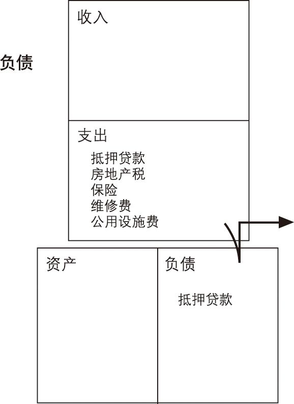

今天，我仍在向“房子是资产”这个观念挑战。我知道对许多人来说，房子是他们的梦想和最大的投资，而且拥有自己的房子总比什么都没有强，但我仍想用另一种方法来看待这一教条。即使我和我妻子要买大而豪华的房子，我们也很清楚那不是资产，而是负债，因为它把钱从我们口袋中掏走了。

因此我提出这个富有争议的观点。我并不指望所有人都同意，因为房子还有感情层面上的意义。此外，对于钱的热衷也会降低财商，我的个人经验告诉我，钱能使决策变得情绪化。

1．对于房子，我要指出大多数人一生都在为一所他们从未真正拥有的房子而辛苦地工作。换句话说，大多数人每隔几年就买所新房子，每次都用一份新的30年期的贷款偿还上一笔的贷款。

2．即使人们住房按揭贷款的利息是免税的，他们还是要先还清各期贷款后，才能以税后收入支付各种开支。

3．财产税。当我的岳父岳母知道他们每月要为房子缴纳的财产税涨到1000美元的时候，简直被惊呆了。他们已经退休了，这笔税款无疑使他们的日子很紧张，他们时常感到不得不搬出房子了。

4．房子的价值并不总是在上升。1997年，我的一位朋友有一所价值100万美元的房子，而今天这所房子在市场上只值70万美元了。

5．最大的损失是致富机会的损失。如果你所有的钱都投在了房子上，你就不得不努力工作，因为你的现金正不断地从支出项流出，而不是流入资产项，这是典型的中产阶级现金流模式。正确的做法应该是怎样的呢？如果一对年轻夫妇能够早点在他们的资产项中多些投入，他们以后的日子就会过得轻松些，尤其是他们准备要把孩子送入大学。他们的资产会不断增长，自动弥补支出。通常情况下，买房子只不过是为了取得抵押贷款以支付不断攀升的开支。

总之，决定买很昂贵的房子，而不是早早开始证券投资，将对一个人的生活在以下3个方面形成冲击：

1．失去了用其他资产增值的时机。

2．本可以用来投资的资本将用于支付房子高额的维修和保养费用。

3．失去受教育的机会。人们经常把他们的房子、储蓄和退休金计划作为他们资产项的全部内容。因为没钱投资，也就不去投资，这就使他们无法获得投资经验，并永远不会成为被投资界称为“成熟投资者”的人。而最好的投资机会往往都是先给那些“成熟投资者”的，再由他们转手给那些谨小慎微的投资者，当然，在转手时他们已经拿走了绝大部分的利益。

我并不是说就一定不能买房子。我的意思是要理解资产和负债的区别。当我想要换一所大一点的房子时，我会先买入一些资产，让它们创造能够支付这所房子的现金流。

我那受过良好教育的爸爸的财务状况，很好地描述了“老鼠赛跑”式的生活。他的支出总是和他的收入持平，根本不可能去投资。结果，他的负债，比如抵押贷款、信用卡贷款总是比他的资产还多。下图简单明了地解释了这种情况。

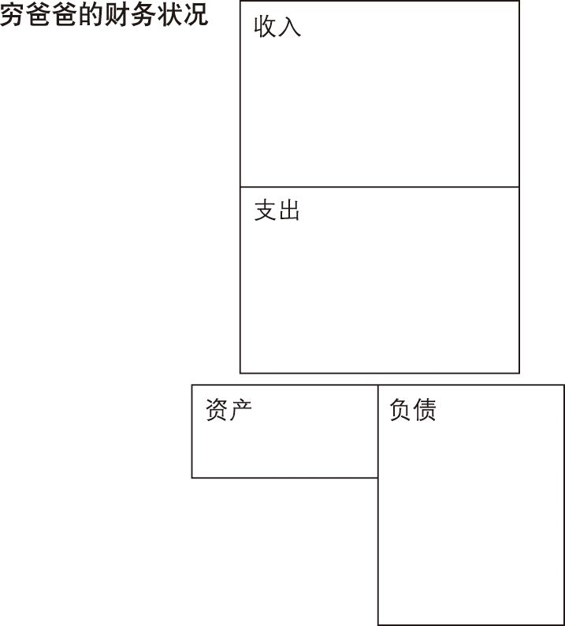

另一方面，富爸爸的财务状况反映了致力于投资和减少负债的结果。

关于富爸爸的财务状况的分析说明了为什么富人会越来越富。资产项产生的收入足以弥补支出，还可以用剩余的收入对资产项进行再投资。资产项不断增长，相应的收入也会越来越多。

其结果是：富人越来越富！

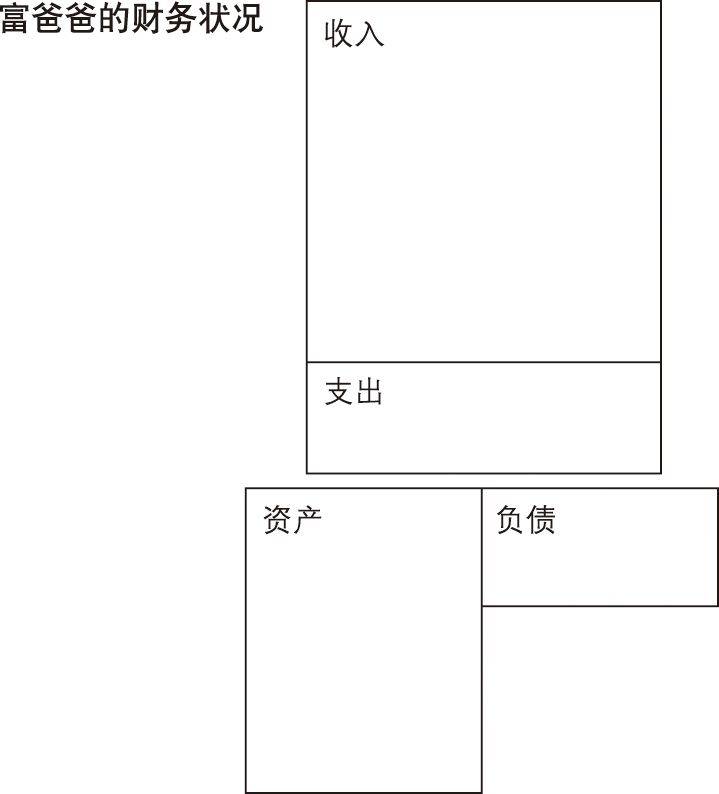

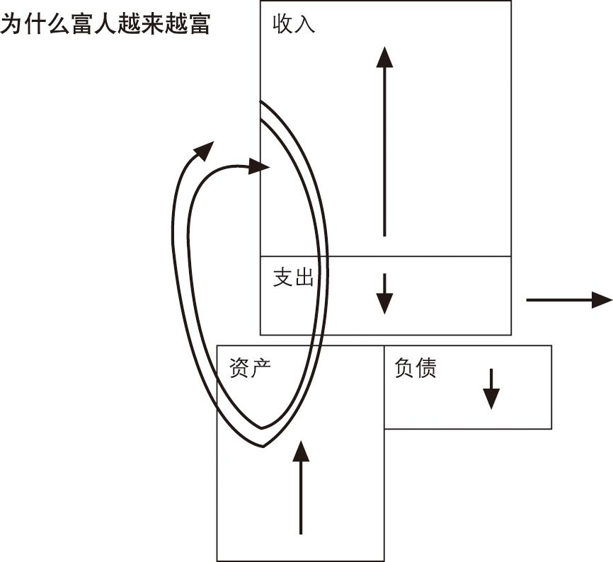

中产阶级发现自己总是在财务问题上挣扎。他们最主要的收入就是工资，而当工资增加的时候，税收也就增加了，更重要的是他们的支出也和收入同步增加，接着是新一轮的“老鼠赛跑”。他们把房子作为最主要的资产，而没有把钱投在那些能带来收入的资产上，如图所示。

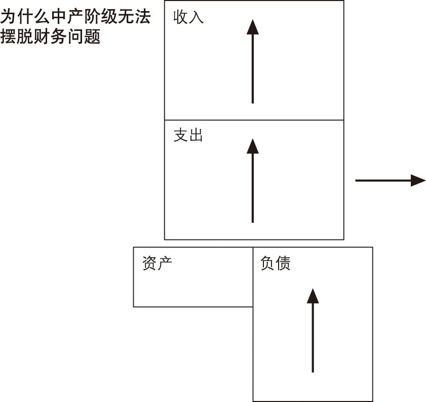

这种把房子当资产的想法和那种认为钱越多就能买更大的房子或更多东西的理财哲学就是今天这个债台高筑的社会的基础。过多的支出把家庭拖入债务和财务不稳定的旋涡之中，即使人们工作业绩优秀、收入固定增长，也会出现这种情况，而这种高风险的生活正是由于缺乏财商教育造成的。

20世纪90年代经济不景气，出现大量失业的现象，这就已经表明了中产阶级的财务状况是多么脆弱。公司退休金计划突然被“401（k）退休金计划”[(4)](./09-第3章-第二课-为什么要教授财务知识.md)
 所替代，很明显，社会保险体系已经陷入困境，退休后的生活来源没有保障，恐慌在中产阶级中慢慢产生。今天许多人已经意识到这个问题并开始购买共同基金，这确实是件好事。投资增长在很大程度上带动了股市的兴起和复苏，并且为了满足中产阶级的投资需要，越来越多类型的共同基金应运而生了。

共同基金因其风险小而大受欢迎。一般的共同基金投资者因为忙着挣钱去支付税款和住房按揭贷款、为孩子上大学攒钱、偿还信用卡等，根本无暇去研究如何投资，所以他们只能依靠共同基金的财务专家来帮助他们投资。而且，因为共同基金投资多个项目，所以他们觉得自己的钱更安全了，因为风险被“分散”了。

这些受过良好教育的中产阶级十分认同基金经理和财务计划提出的“风险分散”的说法，他们想安全运作，规避风险。

真正的悲剧是：正是由于早年缺乏必要的财务知识教育，才造成了中产阶级财务上的风险。而他们必须回避风险，是因为他们的财务状况不容乐观。他们的资产负债表从来没有平衡过，负担着大量债务而且没有能够产生收入的真实资产。一般说来工资是他们收入的全部来源，他们的生活完全依赖于他们的雇主。

所以当名副其实的“关系一生的机会”来临时，这些人无法抓住，他们必须保证安全，因为他们工作非常辛苦，并负担着高额的税和债务。

正如我在这一章开始时所说的，最重要的规则是弄清资产与负债的区别，一旦你明白了这种区别，你就会竭尽全力只买入能带来收入的资产，这是你走上致富之路的最好办法。坚持下去，你的资产就会不断增加。同时还要注意降低负债和支出，这也会让你有更多的钱投入资产项。很快，你就会有钱来考虑进行一些投资了，这些投资能给你带来100％，甚至是无限的回报。5000美元的投资很快就能上升到100万美元或更多。这种被中产阶级称为“太冒险”的投资实际上并没有多大风险。他们这样认为只是因为他们缺乏一些很简单的财务知识。只要你拥有足够的财务知识，你就不必害怕去“冒险”。

如果你盲从于别人，你的财务状况就会像下图展示的那样。

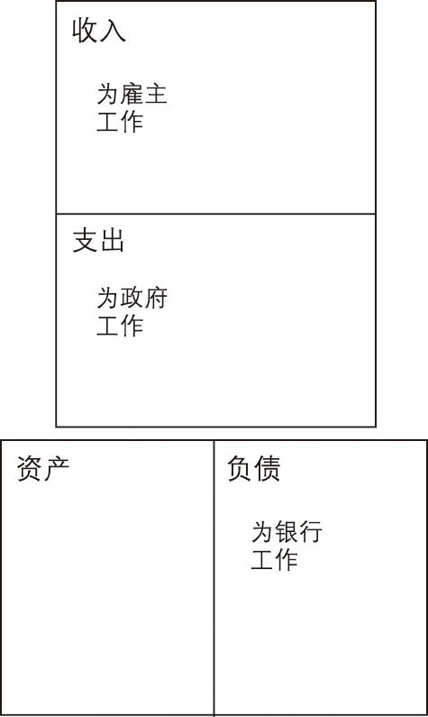

作为一个自己有房子的雇员，你努力工作的结果如下：

1．你为别人工作。就像为工资而工作的大多数人一样，你的工作只会使雇主或股东更加富有，你的努力和成功将使雇主更加成功并得以提早退休。

2．你为政府工作。政府在你还未看到自己的工资时就已拿走了一部分，你努力工作，其结果是使政府的税收增加。实际上大多数人每年从1月到5月都是在为政府白白工作。

3．你为银行工作。缴了税后，你的最大支出应该是抵押贷款和信用卡账单了。

问题是如果你只懂得努力工作，以上三方从你那儿拿走的劳动成果也就会更多。你需要学会怎样才能使你的努力更直接地为你和你的家人带来好处。

假如你决定集中精力创建自己的事业，又该怎样确立目标呢？对大多数人而言，他们的目标是保住他们的工作并靠工资取得他们想要的资产。

随着资产的增加，他们应怎样衡量自己是否成功了呢？他们知道自己有钱了，可那就等于拥有财富吗？如同我有自己的关于资产和负债的定义一样，我也有对于财富的定义。实际上这是我从一个名叫巴克敏斯特·富勒的人那儿借用的。有人叫他骗子，而另一些人则称他为“生活大师”。在1961年他申请了一种圆顶结构的专利，这在建筑业引起了颇多争议。在申请中，富勒讲了一些关于“财富”的话。起初他的话的确令人迷惑，但是读过之后，你就会觉得他说得有道理。他是这样定义的：财富就是支撑一个人生存多长时间的能力，或者说，如果我今天停止工作，我还能活多久？

不像净资产被定义为资产和负债间的差额那样（这种定义常常与人们关于昂贵的古董以及某物值多少钱的观点相连），这样定义财富，就给了人们一种真实准确的财富衡量新方法，现在我能衡量并且确切地知道我经济独立的目标已实现到哪一步了。

净资产通常包括那些非现金资产，例如：你买回后堆在车库里的原材料。财富则衡量着你的钱能够挣多少钱，以及你的财务的生存能力。

财富是将资产项产生的现金与支出项流出的现金进行比较而定的。

让我们举个例子。比如说我的资产每月可产生1000美元，可我每月要支出2000美元，那我还有什么财富可言呢？

让我们回到富勒的定义。以他的定义来看，我还能活几天呢？按一个月30天来算，我只能活半个月。

如果我每月能从资产项得到2000美元，那我就有财富了。

虽然我没有什么钱，可我拥有财富了。现在每个月我从资产项得到的现金收入与支出等量。如果我想增加支出，就必须先增加资产项产生的现金来维持我的财富水平。注意，这时我不再依赖工资，我集中精力建立资产项，并取得了成功，它使我实现了财务自由。如果我辞职了，我也能用每月资产项产生的现金维持支出。

我的下个目标是用资产项中的剩余现金进行再投资。流入资产项的钱越多，资产就增加得越快；资产增加得越快，现金流进来的就越多。只要我把支出控制在资产项能够产生的现金之下，我就会越来越富有，也会有越来越多的非劳动收入。

随着这种再投资过程的不断继续，我最终走上了致富之路。实际上关于财富的定义是仁者见仁，智者见智的。财富永远没有止境。

请记住下面这些话：

富人买入资产。

穷人只有支出。

中产阶级购买自以为是资产的负债。

那么我该怎样开始我的事业呢？请听麦当劳的创立者是怎么说的。

————————————————————

[(1)](./09-第3章-第二课-为什么要教授财务知识.md)
  发生通货膨胀时，价格和所得提高，而美元价值保持不变，纳税人的所得就会被划入较高的税收等级，即使实际所得没有增加，其有效税率也会提高，这种有效税率的提高被称为“所得等级攀升”。

[(2)](./09-第3章-第二课-为什么要教授财务知识.md)
  债务合并贷款是指用一个单一的贷款替换多重贷款，借款人不仅可以按月还款，还款期还可以延长。

[(3)](./09-第3章-第二课-为什么要教授财务知识.md)
  美国政府曾将每年的5月30日定为阵亡将士纪念日，以纪念美国南北战争中阵亡的将士。但1971年以后，为保证全体美国人都能享受这个假期，许多州将它改为在5月的最后一个星期一。

[(4)](./09-第3章-第二课-为什么要教授财务知识.md)
  此计划是按美国国内税收总署的税收编号命名的。它允许雇主和雇员对一部分收入进行税收递延。
