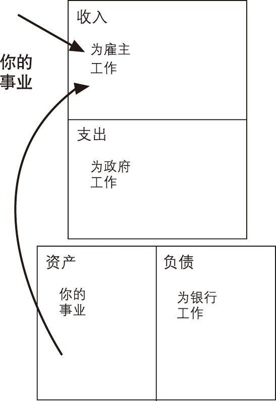

# 第4章：第三课 关注自己的事业

1974年，麦当劳的创始人雷·克罗克，被邀请去奥斯汀为得克萨斯州立大学的MBA班作演讲，我的一个好朋友基思·坎宁安正是这个班上的一名学生。在一场激动人心的讲演之后，学生们问雷是否愿意去他们常去的地方一起喝杯啤酒，雷高兴地接受了邀请。

每个人都拿到了啤酒，这时雷问：“谁能告诉我我是做什么的？”

“当时每个人都笑了，”基思说，“大多数学生都认为雷是在开玩笑。”

见没人回答他的问题，于是雷又问：“你们认为我是做什么的呢？”

学生们又笑了，最后一个大胆的学生叫道：“雷，地球人都知道你是做汉堡包的。”

雷哈哈大笑：“我料到你们会这么说。”他止住了笑声，并很快地说：“女士们、先生们，其实我并不是做汉堡包的，我真正的生意是房地产。”

基思说雷花了很长时间来解释他的话。在雷的商业计划中，麦当劳的基本业务是出售麦当劳各个分店。他一向很重视每个分店的地理位置，因为他知道房产和位置将是每个分店获得成功的最重要的因素。实际上，是那些买下分店的人在为麦当劳买下的土地支付费用。

麦当劳今天已经是世界上最大的独立房地产商了，它拥有的房地产甚至比天主教会还多。今天，麦当劳在美国以及世界其他地方都拥有一些位于街角和十字路口的黄金地段。

基思说那是他一生中最重要的一课。今天，基思经营着洗车房，但他最重要的业务其实是经营洗车房的地产。

在上一章的结尾，我们用图表说明了大多数人工作其实是为其他人，而非他们自己。首先他们要为公司的老板工作，其次是通过纳税为政府工作，最后是为向他们提供住房按揭贷款的银行工作。

小时候，我家附近没有麦当劳。然而，富爸爸却向我和迈克传授了类似于雷·克罗克向得克萨斯州立大学的MBA们所传授的内容，这就是致富的第三个秘诀。

第三个秘诀是：“关注自己的事业。”存在财务问题的人经常耗费一生为别人工作，其中许多人在他们不能工作时就变得一无所有。

一幅图胜过了千言万语。下面是一张收益表和一张资产负债表，它们能很好地描述雷·克罗克的思想。

我们当前的教育体系致力于让年轻人学习知识并找到一份好工作，他们的生活将围绕工资或前面提到的收入项进行。学完一定的基础知识后，他们将去更高级别的学校培养职业能力，他们会被培养成为工程师、科学家、厨师、警察、艺术家、作家，等等，这些职业技能使他们能成为工薪阶层并为钱而工作。

请注意，你的职业和你的事业有很大的差别。我经常问人们：“你的事业是什么？”他们会说：“我在银行工作。”接着我问他们是否拥有一家银行，他们通常回答：“不是的，我只在那儿工作。”

在这个例子中，他们混淆了他们的职业和事业，他们可以在银行工作，但他们仍应有自己的事业。雷·克罗克很清楚职业和事业的区别，他的职业总是不变的，他是个商人。他卖过牛奶搅拌器，后来又转卖汉堡包。但在他卖麦当劳分店的时候，他的事业是购买能产生收入的地产。

学校的问题是你在那里学到什么，就会从事什么。如果你学的是烹调，你就会成为一名厨师；如果你学的是法律，就会当上律师；如果你学的是自动化，就会成为机械师。从事你所学的专业的可怕后果在于，它会让你忘记关注自己的事业。人们耗尽一生去关注别人的事业并使他人致富。

为了财务安全，人们需要关注自己的事业。你的事业的重心是你的资产项，而不是你的收入项。正如以前说过的，秘诀一是要知道资产与负债的区别，并且去买入资产。富人关心的焦点是资产而其他人关心的是收入。

这就是我们为什么总是听到人说：“我要加薪”、“我要是能升职该有多好”、“我要回学校去继续深造以便找到一份更好的工作”、“我要去加班”、“也许我能干两份工作”、“两周之内我会辞职因为我找到了一份工资更高的工作”，等等。

在某些情况下，这些想法都是明智的。但如果你听了雷·克罗克的话，就会发现你还没有关注自己的事业，上面这些想法只是围绕着工资收入转。只有你把额外的收入用来购买可产生收入的资产，你才能获得真正的财务安全。

大多数穷人和中产阶级财务保守（这意味着他们无法承担风险）的根本原因在于，他们没有经济基础。他们必须依附于工作，必须安全运作。

当经济衰退不可避免地来临时，数以万计的工人将发现他们所谓的最大的资产——房子，正要活活地吃掉他们！这项叫做房子的资产每个月都要花钱。汽车——他们的另一项“资产”，也在吞噬他们的生活。车库里花1000美元买来的高尔夫球杆，现在已经不值1000美元了。没有了职业的保障，他们也就失去了生活依靠。他们所认为的资产无法帮他们度过财务危机。

我猜我们中的大部分人都填过信贷申请表，来获得贷款买房或买车。所谓的“净资产”是十分有意思的，那是因为按照银行的会计惯例，允许人们计为资产的东西十分有趣。

有一天，由于我的财务状况看似不佳，所以我决定申请一笔贷款。于是我把新买的高尔夫球杆，我的艺术藏品、书、音响、电视、阿玛尼西装、手表、鞋和其他个人用品通通填到资产项中以增加资产的数目。

最后我的贷款申请还是被拒绝了，原因是我投资了太多的房地产。信贷委员会不信任我从房地产投资中获取的大量收入，他们只想知道为什么我没有一份能挣到薪水的正式工作。他们也不问阿玛尼西装、高尔夫球杆或艺术藏品是从哪里来的。当你不符合“标准”的规范时，生活将是严峻的。

每次当我听到某人说他的净资产是100万美元或10万美元或是其他任何数字时都会有点害怕。净资产并不是一个确定的东西，这主要是因为在你开始出售资产时，你还要为获得的收入缴税。

所以许多收入少的人更容易陷入财务困境。为了获得更多的现金，他们不得不出售资产。他们个人资产的卖价远比他们在资产负债表上列出的数字低。如果卖掉资产之后获得了收益，他们还要缴税，所以说每获得一次收益，政府就会从中拿走一份，从而减少了可以用来帮助他们摆脱债务的现金。这就是我说某人实际的净资产要比他们自己认为的少得多的原因。

开始关注你自己的事业，在继续工作的同时购买一些房地产，而不要买负债或是一旦被你带回家就没有价值的个人用品。在你把一辆新车开出停车场的同时，它已经贬值25％了。汽车不是真正的资产，即使你的银行经理让你把它列入资产项。一根新的价值400美元的钛合金高尔夫球杆被我开过球后，就只值150美元了。

对成年人而言，把支出保持在低水平、减少借款并勤劳地工作会帮你打下一个稳固的资产基础。对于还未经济独立的年轻人来说，父母应该教他们搞清楚资产和负债的区别，让他们在离家、结婚、买房子、生孩子、陷入财务危机、完全依赖工作和贷款之前建立起坚实的资产基础，这是非常重要的。我见过许多年轻夫妇，在结婚后不久就陷入了即使工作多年也无法摆脱债务的生活方式中。

对大多数人而言，当他们最小的孩子离开家时，他们才意识到自己还没有为退休作好足够的准备，于是开始拼命地挣钱。接着，他们的父母又病了，他们又背上了新的负担。

那么，你或你的孩子应该获取什么样的资产呢？依我看，真正的资产可以分为以下几类：

1．不需我到场就可以正常运作的业务。我拥有它们，但由别人经营和管理。如果我必须在那儿工作，那它就不是我的事业而是我的职业了；

2．股票；

3．债券；

4．共同基金；

5．能够产生收入的房地产；

6．票据（借据）；

7．版税，如音乐、手稿、专利；

8．其他任何有价值、可产生收入或有增值潜力并且有很好销路的东西。

当我还是孩子的时候，我受过良好教育的爸爸就鼓励我找份安稳的工作，而富爸爸则鼓励我去获得我所喜爱的资产。“因为如果你不喜欢它，就不会关心它。”我选择房地产是因为我喜欢建筑物和土地，我喜欢购买它们。我愿意整天看着它们，即使有问题出现，也不会糟到使我不再喜爱它们。但对于那些本来就憎恶房地产的人来说，投资房地产显然不是一个好主意。

我喜欢小公司的股票，尤其是刚成立的公司，因为我是一个企业家而不是一个雇员。我早年也曾在一些大机构工作，如加利福尼亚标准石油公司、美国海军陆战队和施乐公司。在这些机构做事给我留下了愉快的回忆。但我深知我不只是一名雇员，我喜欢开办公司但不喜欢去经营它们，所以我买的股票都是小公司的。有时我甚至自己创办小公司并把它们上市，在新股发行中创造财富，我喜爱这种游戏。许多人害怕买小公司的股票，认为它们风险大，事实上也确是如此。但是如果你喜爱你所投资的对象，了解它并懂得游戏的规则，风险就会降低。对于小公司，我的投资策略是：一年内脱手。另一方面，我的房地产投资策略则是从小买卖开始一点点做大，条件允许的话尽量晚一些出手，这样做的好处是可以延迟缴纳所得税，从而使资产戏剧化地增长。我持有的房产通常会在7年内脱手。

多年来，甚至当我还在海军陆战队和施乐公司做事的时候，我就按照富爸爸的建议去做事。我上班，但同时也关注自己的事业。我通过买卖小公司的股票和房地产，努力增加我的资产项。富爸爸总是强调财务知识。我对会计和现金管理懂得越多，我就越能更好地进行投资分析并开始建立自己的公司。

我并不鼓励那些不想创立自己公司的人也去这么干。因为知道其中的曲折，所以我并不希望每个人都去经营公司。不过，当人们找不到工作时，开公司倒是个解决的办法，但失败的几率是这样的：新公司中10成有9成会在5年内倒闭，存活下来的公司在下一个5年内又会有9/10最终倒闭。所以只有当你真的想拥有自己的公司时，我才建议你这么做。否则，你还是继续上班并关注自己的事业吧。

当我说关注自己的事业时，我的意思是建立自己牢固的资产。一旦把1美元投入了资产项，就不要让它出来。你应该这么想，这1美元进了你的资产项，它就成了你的雇员。关于钱，最妙的就是让它可以一天24小时不间断工作，还能为你的子孙后代服务。你要照常去工作，做个努力的雇员，但要不断构筑你的资产项。

当你的现金流增加时，你可以买点儿奢侈品。富人与穷人一个重要的区别就是：富人最后才买奢侈品，而穷人和中产阶级会先买下诸如大房子、珠宝、皮衣、宝石、游艇等奢侈品，因为他们想让自己看上去很富有。他们看上去的确很富有，但实际上他们已深陷贷款的陷阱之中。那些能给子孙留下遗产的人和那些能长期富有的人，就是先构筑资产项，然后才用资产所产生的收入购买奢侈品的，而穷人和中产阶级则用他们的血汗钱和本应该留给子孙的遗产来购买奢侈品。

真正的奢侈品是对投资和积累真正资产的奖励。例如，当我和我妻子通过房地产生意获得了额外的收入时，她去买了辆奔驰汽车。这不是因为她增加工作量或是冒着风险才买下的，是她在房地产生意上的收益为她支付了这辆车。然而，在房地产投资升值并最终有足够的现金流足以购买这辆车之前，她等了4年。这奢侈品的确是个奖励，因为它证明了她知道如何增加自己的资产。那辆车对她的意义已不仅是一辆漂亮的车，而意味着她能用自己的财务知识得到它。

大多数人则会冲动地用贷款去买新车或其他奢侈品，他们可能对生活有些厌烦了，所以期待有点新玩意儿。用贷款买奢侈品，结果迟早会让人们放弃那些东西，因为借下的债是个沉重的负担。

在你花时间投资并创建自己的事业之后，就准备好迎接那神奇的秘密吧——富人的最大秘密。这个秘密铺平了富人的致富之路，在路的尽头你会由于付出时间和关注自己的事业而获得回报。
