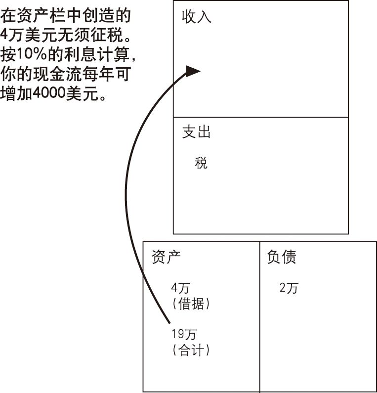
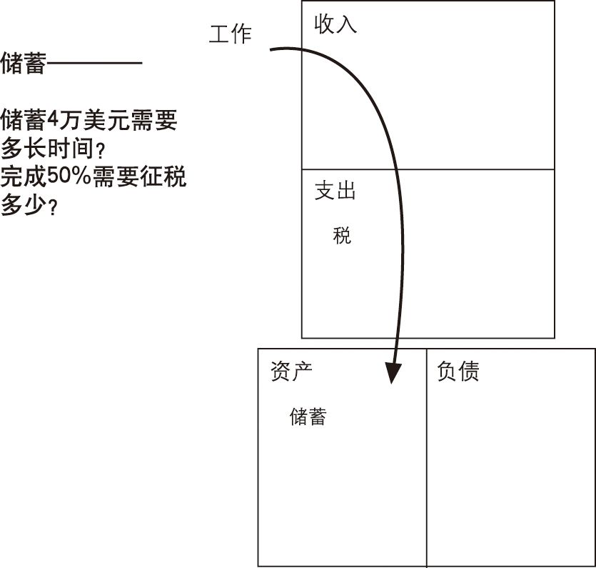

# 第6章：第五课 富人的投资

昨天晚上，在写作的间隙，我看了一个电视节目，讲的是亚历山大·格雷厄姆·贝尔年轻时的故事。那时候，贝尔刚刚为他发明的电话机申请了专利，却苦于无法满足市场对于这项新发明的强劲需求。贝尔需要大公司的支持，于是他找到了当时的巨无霸——西部联合公司，问他们是否愿意购买他的专利和他的小公司，他要的一口价是10万美元。西部联合公司的老总嘲笑贝尔并拒绝了他的要求，认为这个价格简直荒谬无比。后来发生的事情我们都知道了：一个拥有数十亿美元资产的企业——美国电报电话公司最终诞生了。

这个节目之后是晚间新闻，其中一条新闻谈到了本地一家公司又一次裁员，公司员工愤怒地谴责老板这种不公平的做法。在公司门口，一位大约45岁的经理带着妻子和两个孩子，请求门卫让他进去同老板对话，请老板不要解雇他。他刚刚买了一套房子，他害怕失去它。全世界的人都看见了他在镜头前的乞求，这件事自然也引起了我的思考。

我从1984年开始从教，这是一种非常有益的经历，甚至可以说是一种奖励。但这也是一个令人不安的职业，我曾经教过数千人，从中发现了所有人——包括我自己在内有一个共同点：我们都拥有巨大的潜能——这是上天赏赐的礼物。然而，我们都或多或少地存在着某种自我怀疑的心理，从而阻碍前进的步伐。这种障碍很少是缺乏某种技术性的东西，更多的是缺乏自信。有些人更容易受到外界的影响。

一旦我们离开学校，大部分人就会意识到只有大学文凭或好成绩是远远不够的。在校园之外的现实生活里，有许多东西比好成绩更为重要，人们称之为“魄力”、“勇气”、“毅力”、“胆量”、“气势”、“精明”、“勇敢”、“坚强”、“才华横溢”，等等。无论它们的名称是什么，它们都比学校的成绩更能从根本上决定人们的未来。

在我们的性格当中，既有勇敢、聪明、无拘无束的一面，也有相反的另一面：如果需要，人们会跪地乞求。作为一名海军陆战队的飞行员，我在越南战场上待了一年，发现我身上这两种倾向都有，并没有哪种倾向更突出。

但是，作为一名教师，我意识到过分的害怕和自我怀疑是毁掉我们才能的最大因素。看到学生们明明知道该做什么，却缺乏勇气付诸实际，我就感到十分悲哀。在现实生活中，人们往往是依靠勇气而不是智慧去取得领先的位置的。

以我的个人经验来看，要成为财务上的天才既需要专业知识，又需要足够的勇气。如果畏难情绪太重，往往会抑制才能的发挥。在我的班上，我极力劝说学生们要学着去冒险，要勇敢，把畏难情绪转化成力量和智慧。一些人采纳了我的建议，但另一些人却感到害怕。我很明显地意识到，对大多数人来说，一旦涉及金钱的问题，他们宁愿安全行事。我不得不回答诸如此类的问题：为什么要去冒险？为什么必须永不停止地提高自己的财商？为什么必须懂得财务知识？

对此我的回答是：“就是为了获得更多的选择机会。”

我们的世界将会有巨大的变化。正如我提到的发明家贝尔年轻时的故事，将来会出现更多的像他一样的人。每年全世界都会产生100个像比尔·盖茨那样的人，也会出现更多的像微软一样成功的公司，当然，每年也会有更多的公司破产、裁员和精简机构。

那么，一个人为什么必须提高自己的财商呢？除了你自己，没人能回答这个问题。不过，我可以告诉你为什么要这样做。原因很简单，这是我生命中最快乐的事情，我更喜欢变化而不是害怕变化，我更喜欢能挣到数百万美元而不是去担心能不能升职。当今我们所处的时代是历史上从未有过的最激动人心的时代，当后人回顾今天这段历史时，他们一定会感叹这是一个让人心情激荡的时代。旧的东西消亡了，新的东西产生了，到处都在发生翻天覆地的变化，这的确让人兴奋不已。

那么究竟为什么要努力提高自己的财商呢？如果你这样做了，你就会获得巨大的成功；如果不这样做，对你来说，这个时代就会让你恐慌。你会发现一些人勇敢地走在了时代的前面，而另一些人却只能紧紧地抓住生活的救生圈。

300年前，土地是一种财富，所以，谁拥有土地，谁就拥有财富。后来，美国依靠工厂和工业产品上升为世界头号强国，工业家占有了财富。今天，信息便是财富。问题是，信息以光一样的速度在全世界迅速传播，这种新的财富不再像土地和工厂那样具有明确的范围和界限。变化会越来越快，越来越显著，百万富翁的人数会极大地增加，同样，也会有许多人被远远地抛在后面。

今天，我发现许多人在辛苦工作、苦苦挣扎，这主要是因为他们依然固执于陈旧的观念。他们希望事情还像以前那样，他们抵制任何变化。那些失去了工作或房子的人总在抱怨技术进步，抱怨经济状况不佳以及他们的老板。很遗憾他们没有意识到，问题的症结其实在于他们自身。陈旧的思想是他们最大的债务。原因很简单：他们没有意识到已有的某种思想或方法在昨天还是一种资产，今天却已经变成了负债。

一天下午，我正在用我发明的“现金流”游戏讲授有关投资的课程。我的朋友带了一位女士一起来听我的课。这位女士最近离婚了，在离婚的问题上她遭到了沉重的打击，正想寻找某种答案。我的朋友认为听听我的课也许会对她有帮助。

我设计“现金流”游戏的目的，是帮助人们了解金钱是如何运动的。在玩游戏的过程中，人们可以了解收益表和资产负债表之间的互动关系，并弄懂现金流是如何在这两张表之间流动的，除此之外，你还会明白，通过增加资产项上的月现金流量，使你的月现金流量超过每月支出的金额，进而达到财富的增长，一旦你学会了这些知识，你就能从“老鼠赛跑”中挣脱出来，上升到“快车道”上。

我曾经说过，一些人讨厌这个游戏，也有许多人喜欢它，还有一些人并不理解它的真正意义。这位女士就失去了学习一些东西的大好机会。在第一轮中，她得到了一张“零星支出”卡，开始她很高兴：“噢，我拥有了一艘游艇！”接着，我的朋友试着向她解释如何在收益表和资产负债表上做记录，她非常沮丧，因为她从不喜欢与数字打交道。桌上的其他玩家都在等着她，而我的朋友则不停地向她解释收益表、资产负债表和月现金流量之间的关系。终于，当她弄明白这些数字的意义时，她意识到这艘小艇实际上消耗了她的资金。在后来的游戏中，她在“下岗”格停过，还添了一个孩子，不用说，这个游戏对她来说简直糟透了。

课后，我的朋友过来告诉我，说这位女士不太开心。她来听课是为了学习投资的知识，而不是要花这么长的时间来玩一个愚蠢的游戏。

我的朋友建议她反省一下自身，也许这个游戏在某些方面正好反映了她的情况。这个建议起了副作用，这位女士要回了自己的钱。她说，认为这样一种游戏会反映她的情况，这简直是荒谬绝伦。我们立即给她退了钱，然后她就走了。

自从1984年以来，我仅仅是通过做学校教育没做的事情，就赚了数百万美元。在学校，大部分老师都喜欢不停地讲解，我在当学生的时候就不喜欢这种授课方式，因为我很快就会厌倦地走神。

1984年，我开始使用游戏和模板来教学。我常常鼓励我的成人学生要从游戏中发现哪些情况是他们所知道的，哪些是他们还需要学习的。最重要的是，这个游戏能反映一个人的行为方式，它是一个实时的反馈系统。它不需要老师不停地讲解，它就像是一场个人间的对话，完全按照你的习惯定制。

后来我的朋友打电话告诉我那位女士的最新情况。她现在很好，已经平静下来。当冷静下来时，她发现那个游戏与她的生活之间的确存在着某种微妙的关系。

虽然她和她丈夫并不曾拥有一艘游艇，可他们确实还有其他期望得到的东西。离婚之后她感到很愤怒，一方面因为她丈夫另结新欢离她而去，另一方面也是因为结婚20年来，他们几乎没有积存下任何资产，实际上他们居然没有什么可供分割的东西。他们20年的婚姻生活确实充满了乐趣，但是只积累了一大堆不值钱的东西。

她意识到对于收益表和资产负债表中数字的愤怒来源于自己不懂得它们的含义。她一直认为理财是男人的事情，所以她只负责操持家务，而让丈夫掌管家庭财务。现在她才意识到，在婚姻生活的最后5年里，他一定瞒着她藏了不少钱。她很生气自己没有留意那些钱都用到了哪里，就像自己没有留意另外一个女人的出现一样。

就像这种游戏一样，现实生活也总会给我们实时的反馈。我们关注得越多，能够学到的也就越多。这就好像不久前的一天，我对我妻子抱怨说，洗衣店一定是把我的裤子洗缩水了。她却微笑着拍着我的肚子说：“不是裤子缩小了，是别的东西变大了。”

我设计“现金流”游戏的目的是想给每位玩家以个性化的反馈，让他们拥有不同的选择机会。如果你抽到买游艇的卡片并因此而负债，问题就产生了：“现在你可以做什么？你可以采取多少种不同的理财选择？”这就是这个游戏的目的——教会玩家去思考和创造新的、不同的选择。

我曾经看过1000多人玩这套游戏，在游戏中，能从“老鼠赛跑”中最快胜出的人，都是对数字很精通而且具有创造性理财思维的人，他们懂得不同的理财选择有不同的意义。在“老鼠赛跑”中花时间最长的人往往是那些不熟悉数字，且不懂得投资的力量的人。富人往往更富有创造性，愿意经过精心筹划后再去冒险。

也有许多人在“现金流”游戏中挣到许多“钱”，却不懂得如何去利用。他们中的大部分人在现实生活中个人理财也不太成功，即使他们有钱，但似乎其他人都走在他们前面。在真实的世界中确实是这样，有许多人很有钱，但在财务上却往往落后于别人。

限制自己的选择机会等同于固守陈旧的观念。我有一个高中时代的朋友，现在做着3份工作。20年前，他曾是我的同学中最富有的一个，然而后来当地的甘蔗园倒闭了，他所在的公司也随之关张。在他看来，他只有唯一的、陈旧的选择——努力工作。问题在于他再也找不到一份能像原来那家公司那样认可他的价值的新工作。结果，他只能大材小用地做着现有的工作，薪水也比以前低了。现在，他必须同时做3份工作，以挣钱来维持原有的生活水平。

我常听到“现金流”游戏的一些玩家抱怨说“机会”卡总是不来光顾他们，于是，他们就坐在那里边发牢骚边等待。我知道他们在现实生活中也会这么做——坐等好机会的到来。

我也见过有人得到了“机会”卡却没有足够的钱抓住这个机会。于是，他们慨叹要是有足够的钱就一定能在“老鼠赛跑”中取胜，所以他们也在那里坐等。我知道在现实生活中他们也会做同样的事情——眼看着有许多大生意可做，手头上却没有钱。

我还见过有人抽到一张“机会”卡，大声读出来后却懵然不知那是一个好机会。他们手上有钱，时机正好，又拥有“机会”卡，但他们看不到机会之光已经照在自己头上。他们不懂得应该如何调整自己的财务计划，从而脱离“老鼠赛跑”的陷阱。我还发现，大部分人只存在上述某一种问题，只有很少的人才同时存在上面几个问题。其实，大部分人一生当中至少会遇到一次大好的机会，只是他们自己没有看见而已。一年之后，当他们猛然意识到那个机会的价值时，别人早就因此致富了。

拥有理财能力就意味着拥有更多的选择机会。如果机会并没按你的预想降临，那么你还能做点什么来改善自己的财务状况呢？如果机会降临了，你却没有钱，银行也不帮你，那你又该做些什么来利用这一机会使自己受益呢？如果你的预感是错误的，你所预计的事情并没有发生，你又如何将一笔小钱变成数百万美元？这就是理财能力。当你想要的没有出现时，你能想出多少种理财方法来把一笔小钱变成数百万美元。这就要看你在解决财务问题上有怎样的创造性了。

可大部分人却只知道一种方法：努力工作、储蓄和借贷。

那么，为什么你想提高自己的理财能力呢？因为你想成为能够自己创造机遇的人。你能够坦然地接受发生的任何事情，并努力使事情变得更好。很少有人知道机遇和金钱是可以创造的。如果你想更幸运一些，挣到更多的钱，而不只是辛苦工作，那么你的理财能力就非常关键。如果你是那种只会等待“好事情”发生的人，那么，你就可能要等很长一段时间了。这就好比在动身旅行之前非要等到前面8公里长的路上所有的红绿灯都变成绿色一样。

小时候，富爸爸经常教导我和迈克：金钱不是真实的资产。他经常提醒我们，我们那次用牙膏皮“造钱”，已经相当接近金钱的秘密了。“穷人和中产阶级为金钱而工作，”他说，“富人则创造金钱。你把金钱看得越重，你就会为金钱工作得越辛苦。如果你能知道‘金钱不是真实的资产’这一道理，你就会更快地富起来。”

“那金钱是什么？”我和迈克经常会这么反问，“如果金钱不是真实的资产，那它又是什么？”

“它是我们大家都认可的东西。”富爸爸会说。

我们唯一的，也是最重要的资产是我们的头脑。如果受到良好的训练，它转瞬间就能创造大量的财富。从此财富不再只像300年前是国王和王后们的专属。而未经训练的头脑通过教给自己的家庭不正确的理财方式，将会使子孙后代继续这种极度贫困的生活。

在信息时代，金钱会以一种不可思议的速度增长，有些人仅凭一些点子和所谓的合约就能一夜暴富。但如果你问那些炒股或做其他投资的人，这究竟是怎么回事，他们会说这是要靠一生从事的事业。经常有人从一无所有凭空变成了百万富翁，我说的“凭空”是指没有进行实际的金钱交易。它们通常是通过合约来达成的，例如：交易所里的一个手势，或是从里斯本传播到多伦多的交易商面前的闪烁的光标，或是向经纪人下达买入以及片刻之后卖出的一个指令。不需要通过金钱的现实交易，用合约就可以完成这一切。

那么，为什么要开发我们的理财天赋呢？仍然只有你才能回答。但我同样可以告诉你为什么我要去发展这方面的能力：因为我想快速挣钱。不是我必须这么做，而是我想要这么做，这是一个令人着迷的学习过程。我发展自己的财商是因为我想参加这场世界上最快、最大的金钱游戏。以我自己的观点来看，我愿意加入这场史无前例的人性革命的洪流，并投身到这个靠脑力而不是体力来工作的时代。除此之外，这也是一场行动，正在发生，紧追猛赶，惊险且充满乐趣。

这就是我要提高财商，开发我所拥有的最强有力的资产的原因。我想和勇者为伴，不希望与后进的人为伍。

我要告诉你一个关于创造金钱的简单的例子。20世纪90年代初，凤凰城的经济一团糟。我在家看电视节目《早安美国》时，有位财务规划师出现在节目上并开始预测经济状况，他建议大家储蓄。他说，每月拿出100美元存起来，40年后你就会成为千万富翁。

不错，每月拿出一笔钱存起来听上去确实是一个好主意。这是一种选择，一种大多数人都愿意采取的选择。问题就是：它会蒙蔽人们的双眼，使人们看不到事情的真相，从而错过很多使资金大量增加的机会。于是，机会就此与他们失之交臂了。

我刚才说过，那时候经济很不景气，而对于投资者来说，这却是一个绝好的市场良机。我把一大笔钱投资于股票和房地产市场，所以手头缺少现金。每个人都在卖出，而我在买入。我不是在省钱，而是在投资。我妻子和我把100多万美元的现金投在了必将迅速上升的市场里，我们相信这是最好的投资机会。市场不景气，我一定不能错过任何一次细小的投资机会。

原来价值10万美元的房子现在只值7.5万美元。但我没有去本地的房地产公司买进这些房地产，而是去破产事务律师办公室，或是去法院洽谈业务。在这些进行房屋买卖的地方，一幢7.5万美元的房子有时可以按2万美元或更低的价格买下。首先，我以现金支票的形式支付给律师2000美元定金，这是我向朋友借的，借期90天、利息200美元。当购买程序一启动，我就在报纸上刊登售房广告，以6万美元、首付为零的条件，出售这幢价值为7.5万美元的房子。我的电话铃很快就响个不停，我对有希望成交的买主一一进行了调查和筛选。然后，当房屋在法律上归我所有后，我就邀请所有有望成交的买主去实地看房。交易非常火暴，房子在几分钟之内就售出了。我要求买主支付2500美元的手续费，他很高兴地支付了。之后就由契约和产权调查公司接手了。我把2000美元和200美元的利息还给了我的朋友，他很高兴、房屋的买主很高兴、律师很高兴，而我，当然更高兴。我用2万美元的成本买了一幢房子，又以6万美元的价格卖出去，净赚的4万美元以买主开出的承兑汇票[(1)](./12-第6章-第五课-富人的投资.md)
 的形式流入我的资产项。所有的工作时间累计起来只有5个小时。

如果现在你粗通财务并能阅读数字，我可以以上述交易为例，向你展示金钱是如何创造的。

在这个萧条的市场中，我和我妻子利用闲暇时间做成了6笔这样的简单交易。当我们把大量资金投入到增值性的财产和股票市场中无法动用时，我们通过这6次买入、撮合和卖出，最终赚取了19万美元。由于这张承兑汇票的利率为10％，这样我们每年有了大约1.9万美元的收入，其中的大部分被我自己的公司“隐瞒”下来，我们用这笔钱支付我们公司的车辆费、汽油费、差旅费、保险费、招待费用及其他费用。当政府对这笔收入征税时，这些支出可以作为合法的税前费用被扣除。

这是运用理财智慧，使用金钱、创造金钱以及守住金钱的一个简单例子。

请问：你得花多长时间才能攒到19万美元？银行会支付给你10％的利息吗？这张承兑汇票的期限是30年。我希望他们永远也不要付给我19万美元，如果他们最终付给我这笔存款的本金，我还要因此交税。此外，在30年里每年都有1.9万美元的利息，从收入上来讲要多于50万美元。

有人问过我，如果买主付不起钱了，该怎么办呢？确实有这种事情，但它是个好消息。因为凤凰城的房地产市场在1994～1997年之间是全美最火暴的市场之一。那幢价格为6万美元的房子，被收回后可以以7万美元的价格重新卖出，此外，还可按贷款手续费的名义再收取2500美元。对于新买主仍然可以提供零首付的优惠，这一过程还可以继续下去。

因此，如果你反应灵敏的话，你就会看到，当我第一次卖出房屋时，我还给我朋友2000美元的借款。从技术上讲，我在这次交易中没有投入任何资金，可我的投资回报是无限的。这就是无钱变有钱的一个很好的例子。

在第二笔交易中，当房子重新卖出时，我可以将2000美元装入自己的腰包，并将贷款延期至30年。如果我用赚到的钱再去赚钱，那么投资回报率又将是多少？我不知道，但我确信一定能超过每月存款100美元的利率。实际上你每月要存150美元才能获得你认为的每月存100美元而得到的预期收益，因为这40年来，你存入的钱已被课以5％的所得税，而且到期时你还要再支付5％的税款。这样做太不明智了，也许很安全，却不够精明。

1997年，在我开始写这本书的时候，市场走势几乎和5年前完全相反，凤凰城的房地产市场红火得令全美嫉妒。我们当年以6万美元的价格卖出的房子如今已经涨到11万美元。这时，虽然依然可以找到一些由于破产而被出售的房子，但要花费可观的资金和时间去寻找这样的机会。这种机会变得很稀缺了。如今，成千上万的买主在寻找这样的机会，但只有少数的交易挣了钱。市场已经发生了变化，现在是转而寻找其他办法来增加资产项的时候了。

“在这里你不能那样做。”

“这是违法的。”

“你在撒谎。”

我听到这样的评论远比诸如“你能不能告诉我怎么去做”的评论多得多。

你所需要的数学知识其实很简单，并不需要用到几何或微积分。有关交易的过程我不想多写，因为公证公司会负责处理合法交易并提供相关服务。我也不必去加固屋顶或是修理卫生间，房屋的所有者自会去做这些工作，因为这是他们的房子。偶尔也有人付不起钱，不过这也是件好事，因为在这种情况下，他们必须为延期付款付费，否则他们就得搬出去，而你又可以把房子重新卖掉。法院系统会处理这些事务。

当然，你所在的地区这些做法可能行不通，市场状况也会有所不同。然而，我只是想通过这个例子说明，仅用很少的资金，冒很小的风险，再通过一个简单的财务运作过程就可以创造出几百几千万美元的财富。这一例子也说明了金钱仅仅是一纸协议而已，任何具有高中文化的人都能做到这一点。

然而，大部分人却没有这么做，这是因为他们都信奉“辛苦工作，努力存钱”的教条。

只花大约30个小时工作，资产项就增加了19万美元，而且不用支付1美分的税款。

哪个问题对你来说更难一些呢？

1．辛苦工作，薪水的50％用于缴税，省下的钱拿去储蓄。你的存款利率为5％，而且利息还要再缴税。

2．花些时间来提高你的财商，增强你的动脑能力，从而增加你的资产。

还要考虑你所花费的时间，因为时间正是你最重要的资产。如果用第一种方法储蓄19万美元，要多久呢？

现在你会明白，为什么每当我听见父母们说“我的孩子在学校受到良好的教育，学习很棒”时，我总是会默默摇头，这种教育也许的确很好，但是这就足够了吗？

我前面所说的只是小型的投资策略，只能用来说明如何把小钱变成大钱。另外，我的成功经历也反映了拥有财务知识是多么重要，而打好财务知识坚实的基础又是从接受扎实的财商教育开始的。我之前已经说过，但它值得我一再强调，财商是由这4项主要技能组成的：

1．财务知识。即阅读理解数字的能力。

2．投资策略。即以钱生钱的科学。

3．市场、供给与需求。贝尔提供了市场所需要的东西，比尔·盖茨也是如此。用2万美元买了一套值7.5万美元的房子，以6万美元的价格卖出，也就是抓住了市场所创造的机会。在市场上，总是有买方，就有卖方。

4．法律规章。要熟悉有关会计、公司方面的法律以及各州和国家的法规。我们必须按规则来进行“游戏”。

不管是通过购买小型房屋、大型公寓、公司、股票、债券、共同基金、金银珠宝、棒球卡，或是其他类似的东西来成功地获取财富，都必须具备上述基础，或者说必须同时掌握上述技能。

1996年，房地产市场开始复苏，人们纷纷涌进来；股票市场也开始繁荣起来，整个美国经济渐渐恢复。我在1996年开始售出房产，并将投资目标转移到了秘鲁、挪威、马来西亚和菲律宾。投资对象也发生了变化，在市场大举买楼时，我们已经准备退出了。现在我密切关注资产项中房产价格的攀升，并有可能在今年晚些时候出售一些房产，这要取决于国会有可能通过的一些法律修正案。我预备出售那6套小型房屋，然后把4万美元的承兑汇票兑现。我要告诉我的会计要做好准备保管现金并寻求可以避税的途径。

下面我要讨论资金的投入和收回、市场的景气和萧条、经济的增长和衰退等问题。在你的一生中，几乎每一天你都会遇到许许多多的机会，可是你常常视而不见。但是机会确实存在，世界变化越大，技术进步越快，让你和你的家人以至你的后代财务安全的机会也就越多。

所以，为什么不耐心地提高你的财商呢？这个问题仍旧只有你才能给出答案。我不断地学习和提高是因为我知道变化就要来临，我更欢迎变化而不是沉溺于过去。我之所以想不断地提高自己的财商，是因为每当市场发生变化时，一些人会去乞求保住一份工作，而另一些人会接到生活抛给他们的酸柠檬——我们每个人偶尔都会有这样的坏运气——然后将其变成数以百万计的美元。这就是财商。

常常有人问我是怎么让那些酸柠檬变成数百万美元的。从个人的角度来讲，对于是否用更多我个人的投资经历举例，我有些犹豫，因为我担心这样做显得有些自吹自擂。自夸并非我的本意，我举这些例子只是为了从数字上和时间上说明一些简单的事实，而且，也希望大家知道取得成功真的很容易。你越熟悉财商的四大特征，你越会觉得容易。

就我而言，我主要使用两种工具来实现资产的增值：房地产和小型公司的股票。房地产是我的基础投资，通过日复一日的积累，我的资产不断地提供现金流，偶尔也会有价值上的飙升。再有就是等待小型公司的股票快速增值。

我并不建议别人做我做的事情，例子仅仅只是例子。如果投资机会太复杂而我又弄不明白，我就不会去投资。简单的数学计算和一般常识是有效理财所需要的一切。

下面是我用例证的5个原因：

1．激励人们学习更多的知识；

2．告诉人们如果打好基础，将来的道路就会平坦很多；

3．告诉人们每个人都能获得巨大的财富；

4．告诉人们条条大路通罗马；

5．告诉人们财务知识并不深奥。

1989年，我常常慢跑穿过俄勒冈州波特兰市的一个可爱的社区，那里有一些宛如姜汁面包的房子。这些房子既小巧又别致，令我不禁想起小红帽蹦蹦跳跳地走在去外婆家的路上。

路边到处都挂着“房屋待售”的牌子，木材市场十分萧条，股票市场几近崩溃，经济状况很不景气。在一条街上我注意到有块待售的牌子比其他牌子挂的时间都要长，看起来已经很旧了。一天我慢跑经过那里，便进去见了房子的主人，他好像遇到了麻烦。

“这房子你想卖多少钱？”我问道。

房子主人转过身来苦笑着说：“你报个价吧，房子待售已经一年多了，甚至没有人愿意进来看一看。”

“我先看看。”我说。半小时之后，我就以低于要价2万美元的价格买下了这幢房子。

这是一幢小巧玲珑的两居室，所有窗户上都装饰着姜汁面包式的须边，房子呈淡淡的蓝灰色，房子建于1930年，里面有一个漂亮的岩石壁炉，两间小卧室，用来出租是再好不过的了。

这幢房子的成交价为4.5万美元，而它实际上值6.5万美元，虽然当时没人想买。我付给房主5000美元的首付，一周后，房主高高兴兴地搬走了，他庆幸自己终于摆脱了那幢房子。然后我的第一位房客，一位当地大学的教授，住了进去。他每月交给我房租，我拿去还抵押贷款、支付各项支出和管理费之后，每月还会剩下不到40美元，这似乎并不怎么太让人激动。

一年后，萧条的俄勒冈州房地产市场开始复苏。来自加利福尼亚州的投资者，携带着大笔资金从他们那依然繁荣的房地产市场转向北方，开始大批购进俄勒冈州和华盛顿州的房地产。

我用9.5万美元的价格将那套小房子卖给了一对加利福尼亚州的年轻夫妇，他们认为自己捡到了大便宜。我希望把大约4万美元的资本利得利用1031条款推迟纳税，于是我开始寻找可以投资的项目。过了一个月左右，我在俄勒冈州找到了一套有12个房间的公寓，这套公寓正好位于比佛顿市的英特尔工厂的旁边。公寓的主人长期住在德国，对于这套公寓的价值没有任何概念，只想尽快脱手。我给这套价值45万美元的房屋报价27.5万美元，最后以30万美元成交。我买下了它并持有了两年，后来为了躲避俄勒冈州的雨季，我们搬到了亚利桑那州的凤凰城，所以我们又利用1031条款以49.5万美元的价格把它卖了出去。接着，我们在凤凰城买下了一幢有30个房间的公寓楼。就像以前的俄勒冈州一样，当时凤凰城的房地产市场一片低迷。这幢公寓楼价格为87.5万美元，首付为22.5万美元。出租后带来的月现金流量略高于5000美元。到1996年，亚利桑那州的房地产市场开始复苏，一位科罗拉多州的投资者出价120万美元购买这幢公寓楼。

我和我妻子也考虑过出售的事情，但我们最终决定等等看，看看国会是否会修改有关资本利得的法律。如果确实修改的话，我们预期这处房产的价格还会上升15％～20％，除此之外，每月5000美元的现金流入也是一件不错的事情。

这个例子的要点在于它表明了一小笔钱是如何变成一笔大钱的。正如我们前面提到的，这主要是靠对财务报表、投资策略以及市场和法律的了解。如果一个人在这些方面不甚精通，那么很明显，他必然会遵循标准的教条，即安全地、分散地投资于比较保险的项目。可问题是“保险”的投资常常过于安全，太安全则会导致低收益。

大多数大型房屋经纪公司不涉足投机交易，以保护自身及客户的利益，这是一个明智的决策。

真正炙手可热的交易不会留给新手。一般来说，能使富者更富的最好的交易总是为那些精通游戏规则的人准备的。一个被认为是不够“老练”的人进行这样的交易在技术上是不可能的，当然这种事情也有过。

我越是“老练”，越是会得到更多机会。提高财商的另一个方面，就是让自己拥有更多的机会。你的财商越高，你就越容易分清一项交易是好还是坏。依靠你的智慧，你可以认出不利的交易，或者将一项不利的交易变成有利的交易。我学的东西越多——确实有许多东西值得学习——挣的钱也就越多，这仅仅是因为我的经验和智慧随着岁月增长了。我有许多朋友，他们安全地投资，在自己的岗位上辛勤地工作，却未能获得理财的智慧，而这种智慧是需要经过时间的历练才能获得的。

我全部的投资哲学就是把“种子”播在我的资产项下，这是我的准则。我从小额资金开始播种，有些种子长成了参天大树，有些则没有。

我们的房地产公司拥有数百万美元的财产，这是我们自己的房地产投资信托。这里我要指出的是，这几百万美元资产的大部分都是由5000至1万美元这样的小额投资开始积累的。所有那些首期付款都幸运地赶上了一个快速上升的市场、不断增加的税收豁免以及在数年里不断地被买进卖出。

我们还拥有股票投资组合，委托给一家公司进行管理，我和我妻子将这家公司称为我们个人的共同基金。我的一些朋友专门与像我们这样每月都有余钱投资的投资者打交道。我们购买高风险、投机性强的私人公司的股权，而这些公司正准备到美国或加拿大的股票交易所去上市。有个例子可以说明股票投资的获利速度是多么快。在一家公司即将上市之前，我们以每股25美分的价格购买了10万股该公司的股权，6个月后，这家公司上市了，每股上涨到2美元。如果这家公司管理有方的话，还会继续上涨到每股20美元或者更高。有几年我们的2.5万美元在不到一年的时间里就变成了100万美元。

如果你清楚自己在做什么，就不是在赌博；如果你把钱投进一笔交易然后只是祈祷，才是在赌博。在任何一项投资中，成功的办法都是运用你的技术知识、智慧以及对于这个游戏的热爱来减少意外、降低风险。当然，风险总是存在的，但你的财商可以提高你应付意外的能力。常常有这样的情况，对一个人来说是高风险的事情，对另一个人来说则可能是低风险的。这就是我不断鼓励人们多关注财商教育而不只是投资股票、房地产或其他市场的原因。你越精明，就越能应付意外情况。

我个人的股票投资交易对大多数人来说是一件风险极高的事情，因此我绝不提倡人们效仿我。我自1979年开始投资股票以来赚了不少钱，不过，假使你明白这样的投资对大部分人来说为什么是高风险的，你也许就能改变命运，在一年内将2.5万美元变成100万美元对你来说也许就是低风险的。

正如前面说过的，我写出来的并不是建议，只是作为简单的、具有可行性的例子。从投资的整个过程来看，我所做的只是一小部分。对于一般人来说，每年获得超过10万美元的被动收入是一件很棒的事情，而且也并不困难。根据市场的情况并依靠你的智慧，你能在5～10年里实现这个目标。如果你能保持适中的生活支出，10万美元的额外收入是会很令人高兴的，不管你是否工作。如果你喜欢，或者只是为了打发时间，也可以去工作。你可以选择利用政府的税收制度来为自己服务而不是让它来损害你的利益。

我的资产基础是房地产。我喜欢房地产是因为它很稳定，变化比较慢。我把这一基础建立得很牢固。它给我提供了相当稳定的现金流量，如果管理得当的话，还会有使其增值的好机会。拥有房地产这样一个坚固的基础，对我来说，其好处就在于它使我在某种程度上敢于冒很大的风险去买入更具投机性的股票。

如果我在股市上挣了一大笔钱，我就会用资本利得的一部分支付资本利得税，然后将余额投资于房地产，以再一次加固我的资产基础。

关于房地产我还有最后一点需要说明。我周游世界讲授投资课程，在我到过的每一个城市，我都听到有人说他们买不到便宜的房地产，但这并不符合我的经验。即便是在纽约和东京，也会有一些质量不错，价格也便宜的房产被大多数人忽略。在新加坡，尽管眼下房地产价格很高，但仍能在离城市不远的地方发现一些低价交易的机会。因此，每当我听到某人对我说“在这儿你不能这么做”时，我就会提醒他们，也许正确的说法应该是：“其实，我不知道在这儿该如何做这个。”

好机会是用你的脑子而不是用你的眼睛看到的。大部分人无法致富仅仅是因为他们没有受到理财训练，因而不知道机会其实就在眼前。

经常有人问我：“我该如何着手？”

在最后一章里，我将讲述我在通向财务自由之路上所遵循的10个步骤。但是记住要以轻松的心态去面对，毕竟这只是一场游戏。有时你赢了，有时你还要继续学习，但是一定要从中找到乐趣。大部分人从来赢不了是因为他们太害怕失去，这也是我发现的学校教育的一大误区。在学校里，我们得知错误是坏事，如果犯了错就会受到惩罚。然而，如果你看看人类学习的过程，就会明白我们其实就是在犯错误的过程中学到知识的。我们从跌倒中学会了走路，如果我们从不跌倒，也就永远学不会走路。学骑自行车也是同样的道理，尽管我的膝盖上仍有伤疤，但今天我骑车时已毫不费力了。致富也是同样的道理，但不幸的是，大部分人贫穷的主要原因就在于他们太担心失去。胜利者不害怕失败，但失败者害怕。失败是成功过程中的一个组成部分，如果避开失败，也就不会成功。

有时我把投资看做网球比赛。我卖力地去打，犯了错误，然后纠正，再犯更多的错误，然后再纠正，这样水平就提高了。如果我输了，我会走向球网，和对手握手，笑着对他说：“下周六见。”

投资者分为两类：

1．第一类也是最普遍的一类，即进行一揽子投资的人。
 他们联系一家从事经营个人投资业务的中介机构，例如房地产公司、股票经纪人或财务规划师等，然后买下某些产品。这些产品可能是共同基金、房地产投资信托、股票或债券等。这是一个较好的、简单明了的投资方式，就好像一位顾客到商店去购买一台组装好的电脑。

2．第二类是自己创造投资机会的投资者。
 这种投资者通常会自行组织一项交易，好比一个人买来电脑零部件，然后自己组装，这有点像量身定做。虽然我连组装电脑的第一步工序都不知道，但我清楚应该如何将许多投资机会组织起来，也知道谁能够这样做。

第二种类型的投资者最有可能成为职业投资者，但有时可能要花许多年才能将众多“零部件”组织起来，有时它们根本就不可能组合在一起。我的富爸爸鼓励我去做第二类投资者。学会如何将众多“零部件”组合在一起是非常重要的，有时候你会因此获得巨大的成功，但有时候也可能因为形势的逆转而损失惨重。

如果你想成为第二类投资者，那么你还需要提高3种主要技能，除了之前提到的提高财商的4项基本技能之外，要想成为理财能手，你就必须具备3种技能。

1．如何寻找其他人都忽视的机会。
 你要用心去发现别人看不到的那些机会。例如，我的一个朋友买了一幢破旧不堪的房子，它看起来就像座鬼屋，每个认识他的人都很奇怪他为什么要买下它，那是因为他看到了我们没有看到的东西。他通过产权公司了解到这间房子连着4间额外的空房，于是在买下房子后，他就把空房拆掉，然后把土地卖给了一位建筑商，得到的钱3倍于他买房子所花费的成本。在两个月里，他挣了7.5万美元。这笔钱虽然不算多，但却比最低工资高多了，而且在技术上也不难。

2．如何增加资金。
 一般人只会去找银行贷款，而第二类投资者则知道不找银行也能通过多种方法获得资金。在一开始，我讲了如何不找银行就能买下房子。房子本身并不重要，从中学到的获得资金的技巧却是无价之宝。

我也时常听到人们说“银行不会借钱给我”或者“我没有钱去买它”。如果你想成为第二类投资者，你就要知道如何去做到大部分人做不到的事情。换句话说，大多数人眼睁睁地让缺少资金阻止了他们去达成交易，如果你能越过这个障碍，你就能比那些没能掌握这些技能的人早一步成为百万富翁。有许多次，我在银行没有一分钱存款的情况下，买下了房子、股票和公寓楼。有一次我买了一幢价值120万美元的公寓楼，我是通过“成为联系的桥梁”来达成目的的，即通过在卖方和买方之间签下合同来促成这项交易。首先，我筹集了10万美元的定金，这将使我能有90天的宽限期来筹集余下的款项。我为什么要这么做呢？就是因为我知道这么做将带来200万美元。但后来我再也没有去筹集款项，因为那位借给我10万美元的人给了我5万美元当做找到这次交易机会的酬劳，他取代了我的位置成为买家，我则抽身离开了。总的工作时间：3天。所以说，你知道的比你买到的更重要。投资不仅仅是买东西，而应该是一个不断学习的过程。

3．怎样把精明的人组织起来。
 聪明的人往往会雇用比自己更聪明的人或与他们一起工作。当你需要建议的时候，你一定要确定你选择的是明智的顾问。

你要学习很多东西，也会因此得到巨大的回报。如果你不想学习这些技能，那么我建议你最好做第一类投资者。你懂得了这一点就是你拥有的最大财富，而不知道这一点将会成为你面临的最大风险。

风险总是无处不在，要学会驾驭风险，而别总想回避风险。

————————————————————

[(1)](./12-第6章-第五课-富人的投资.md)
  所谓承兑，简单地说，就是承诺兑付，是付款人在汇票上签章表示承诺将来在汇票到期时承担付款义务的一种行为。承兑行为只发生在远期汇票的有关活动中。
