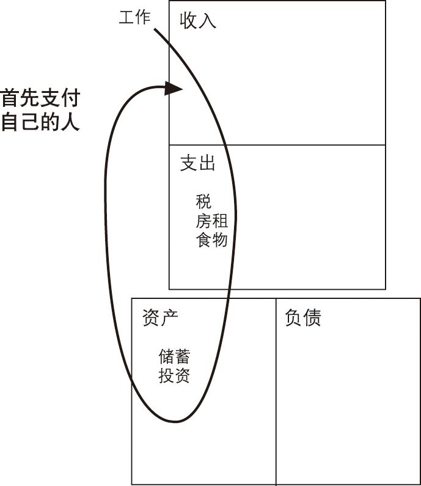
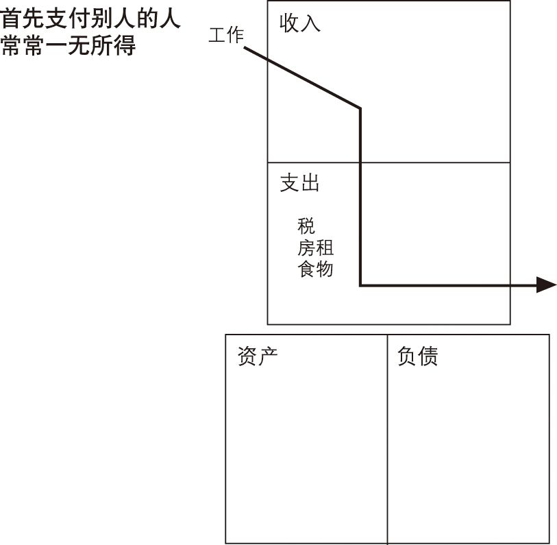

# 第9章：开始行动

我希望我可以说致富很容易，但事实并非如此。

所以，当我被问到“应该怎样开始致富”这类问题时，我就以自己日常的思维方式作答。我敢保证找到好生意的机会真的很容易，这就像骑自行车，刚开始还摇摇晃晃，但很快就驾轻就熟了。赚钱也是一样，最初的难关得由你自己渡过。

但是要找到一桩价值数百万美元的“关系一生的机会”，就需要唤醒我们的理财天赋了。我相信，我们每个人都拥有理财天赋，问题是，这种理财天赋一直处于休眠状态，等待有人将它唤醒。之所以会出现这种情况，是因为我们的文化一直教导我们金钱是万恶之源，这种观念促使我们学习某种技能，并为金钱而工作，却没能教会我们如何让金钱来为我们工作。我们被告知不必去担心将来的理财状况，因为我们退休后公司或者政府会照顾我们。然而，我们的孩子们还是在与以前一样的教育体制下受教育，却有可能不再支付这笔费用了。可信条仍然是努力工作、挣钱维生、缺钱时总能借到钱。

不幸的是，90％的西方人认同这个信条，这是因为他们相信通过找工作来挣钱要更容易一些。如果你不属于那90％，我向你建议采取10个步骤来唤醒你的理财天赋，我就是一直按这些步骤做的。如果你想遵循这些步骤，那好极了。如果你不想遵循，那就按你自己的方式来做，你的理财天赋足以让你无师自通。

在秘鲁，我问一位工作了45年的金矿工人，为什么他对找新的金矿充满信心。他回答说：“金矿到处都是，但大部分人没有经过相应的培训，所以发现不了它们。”

我认为这话是正确的。对于房地产项目，我出去跑一天就能发现四五桩潜在的生意，而一般人出去可能会空手而归，即使我们去的是同一个地区。这是因为他们没有花时间来开发自己的理财天赋。

我建议你采取以下10个步骤来开发上帝赐予你的才能，这种才能只有你才可以控制：

1．我需要一个超现实的理由——精神的力量。
 如果你问别人是否愿意致富或者获得财务自由，大部人都会说“愿意”。可是一想到现实，致富之路似乎就变得崎岖而漫长了，相比之下，为了钱工作并把剩余的钱托付给经纪人似乎更容易一些。

我曾经遇到一位梦想代表美国参加奥运会的女运动员。为此，她每天早上4点起床，游3个小时泳，然后去上学。周末她也不参加朋友们的聚会。她必须复习功课，保持学习进度以跟上其他同学。

当我问她是什么力量驱使她拥有超人的雄心壮志和牺牲精神时，她只是回答：“我这样做是为了自己和我所爱的人，是爱的力量使我克服重重困难、甘于牺牲。”

这个原因或目标，是“想要”和“不想要”的结合体。当人们问我为什么想致富时，我就说这是内心深处“想要”和“不想要”的结合体。

我可以首先举一些由“不想要”促成“想要”的例子。我不想将一生都耗在工作上；我不想要父辈们渴望的那些东西，如稳定的工作和一套郊区的房子；我不想做一个打工仔；我讨厌我爸爸因为忙于工作而总是错过我的橄榄球比赛；我讨厌我爸爸终身努力工作，但在他去世时却失去了他几乎所有的东西，他甚至不能把自己辛苦一生的所得留给孩子。而富人不会那样做，他们会努力工作，然后将工作成果留给孩子们。

其次是“想要”。我想自由自在地周游世界，我想以自己喜欢的方式生活，我想在年轻的时候就能做到这些，我想自由支配自己的时间和生活，我想要金钱为我工作。

这些就是我发自内心深处的精神动力。你的动力是什么呢？如果促使你前进的动力不够强大，那么前行道路上的严酷现实就会使你退缩。我曾失败过很多次，但就是这种深层的精神动力使我爬起来继续前进。我想在40岁时就实现财务自由，但是一直到47岁，在我经历了许多磨炼之后才真正实现了目标。

谈到这一点时，我希望能说这是很容易办到的，但事实并非如此，可也不是很难做到。没有强有力的理由和目标，任何事都会变得非常困难。

如果你没有一个强有力的理由，就无需再读下去了，因为这看起来是一项很艰巨的工作。

2．每天作出自己的选择——选择的力量。
 这是人们希望生活在一个自由国度的主要原因。我们需要有选择的权力。

从理财的角度来说，我们每挣到一美元，就得到了一次选择自己是成为富人、穷人还是中产阶级的机会。我们花钱的习惯反映了我们是什么样的人，穷人之所以贫穷是因为他们有着不良的消费习惯。

我还是一个孩子时可以一直玩“大富翁”游戏。因为没有谁跟我说过“大富翁”只有孩子才能玩，所以成年后我仍然喜欢这个游戏。富爸爸曾经向我指出资产和负债的区别，所以当我还是一个孩子时，我就选择要成为富人，而且知道自己要做的就是不断获取资产——真正的资产。我最好的朋友迈克接管了富爸爸的资产，但他必须学会对资产进行管理。许多富裕的家庭之所以“富不过三代”，就是因为他们没有培养出一个在行的人来管理资产。

大部分人不会选择成为富人，对于90％的人来说，做富人有“太多烦扰”，所以他们就说“我对金钱不感兴趣”，或是“我不想成为富人”，抑或“我并不担心，我还年轻”，“等我开始挣钱时，再考虑将来”，或者“我爱人掌握财权”，等等。这些说法存在着一个共同的问题，就是它们阻碍人们去思考这样两件事情：第一是时间，这是你最珍贵的资产；第二是学习，正因为你没有钱，就更要去学习。事实上我们每天都应该作出一个选择，这个选择是我们利用自己的时间、金钱和头脑里学到的东西作出的。这就是选择的力量。我们都有机会。我选择成为富人，每天都在为此而努力。

首先投资于教育。实际上，你所拥有的唯一真正的资产就是你的头脑，这是我们能控制的最强有力的工具。就像我刚才说的人们都有选择的力量，当我们逐渐长大时，每个人都要选择要学习什么样的知识。你可以整天看音乐电视，也可以阅读高尔夫球杂志、上陶艺班或是理财规划培训班，你可以进行选择。在投资方面，大部分人选择的是直接去投资，而不是首先投资于学习如何投资。

我有一个朋友是位很富有的女士，最近她的公寓失窃了，小偷偷走了电视机、录像机，却留下了她阅读的所有书。我们也会作出类似的选择，90％的人会购买电视机，只有大约10％的人才会购买商业和投资方面的书或磁带。

那么，我是怎么做的呢？我去参加研讨会。我喜欢那种为期至少两天的研讨会，因为这样我能静下心来研究某一专题。1973年，我在电视上看到有人做广告，举办一个为期3天的研讨班，讨论如何不支付首付就能购买房地产。这个研讨班只花了我385美元，却帮助我挣回至少200万美元。更重要的是，它为我创造了新的生活，正是这一课程使我在以后的岁月里不必再辛苦工作。我每年至少要参加两次这样的课程。

我喜欢磁带，因为它可以快速重放。我曾经听过彼得·林奇的一盘磁带，里面有一段话我完全不同意。但是，我并没有妄自尊大，而是按“重放”键把这段5分钟的录音听了至少20遍，也许还不止。忽然之间，我豁然开朗，懂得了他说的意思。这简直就像变魔术一样，我感到如同打开了一扇思想之窗，通向我们这个时代最伟大的投资家之一。由此我得以深刻认识和理解他那博大精深的学识和经验，并获得了巨大的教益。

最终的结果是：我仍然保留了自己习惯的思考方式，同时又学到了彼得·林奇分析同一问题或趋势的思考方式。我拥有了两个思路，能够用多个思路来分析某个问题或趋势，实在难能可贵。今天我常常会问自己，“这件事彼得·林奇会怎么做？或者唐纳德·川普、巴菲特、索罗斯又会怎么做？”我得以进入他们深邃思想的唯一途径就是谦虚地阅读或倾听他们说过的话。骄傲自大或吹毛求疵的人往往是缺乏自信而不敢冒险的人。如果想学习某些新东西，那你就要犯些错误，只有这样才能充分理解你所学习的知识。

如果你能读到这里，你就不存在傲慢的问题，因为傲慢的人很少读书或买磁带。他们何必读书呢？他们认为自己就是宇宙的中心。

当某种新思想与旧有的思维方式发生冲突时，许多所谓的聪明人会本能地为自己辩护。在这种情况下，他们的“聪明”和“傲慢”结合在一起就等于“无知”。我们都知道有许多受过高等教育的人，或是自认为很聪明的人，他们的资产负债表却一塌糊涂。一个真正聪明的人总是欢迎新思想，因为新思想能使他的思想库更加丰富。听比说更重要，否则，上帝就不会给我们两只耳朵一张嘴巴了。有太多的人爱说不爱听，这就放弃了吸收更多新思想和可能性的机会，他们爱争论而不是提问题。

我以长远的眼光看待我的财富，我并不同意那些买彩票或赌博的人“快速致富”的观念。我也会做短期股票投资，但从长远考虑，我更重视教育。如果你想驾驶飞机，我建议你先去上课。有的人投资股票或房地产，却从不投资于他们最重要的资产——头脑，对此我常常感到震惊。你买卖过一两套房产并不能说明你就是房地产方面的专家。

3．慎重地选择朋友——关系的力量。
 首先，我不会把理财状况作为挑选朋友的标准。我既有穷困潦倒的朋友，也有每年都有数百万美元进账的朋友，因为我相信“三人行，必有我师”，我愿意努力向他们学习。

但我要承认我确实会特意交一些有钱的朋友，我的目标不是他们的钱财，而是他们得以致富的知识。有时，这些有钱人会成为我的亲密朋友，当然，也不尽然。

但在这里我要指出一点区别。我会注意我有钱的朋友是如何谈论金钱的（我不是指他们的夸夸其谈），他们对这个话题感兴趣。这样，我通过交谈向他们学习，他们也向我学习。我的另一些朋友经济上很困难，他们不爱谈论金钱、生意或投资，他们认为这既粗俗又不明智。但我也能从他们那里学到许多知识，我会知道什么东西不可以去做。

我有几个朋友，他们在不长的时间里获得了数十亿美元的财富。他们中有3个人和我谈到过同样的现象：他们那些没钱的朋友从不问他们是怎样赚到钱的，而总是向他们要求这两种东西：一是贷款，二是工作。

注意：不要听贫穷的或是胆小的人的话。我有这样的朋友，我也非常喜欢他们，但他们过的是“小鸡”式的生活。一旦涉及金钱，特别是投资时，“天就要塌下来了”，他们总会告诉你一件事为什么不可行。问题是如果听了他们的话，盲目地接受这种杞人忧天的信息，你最终也会成为“小鸡”式的人。就像一句古老的谚语所说的：“物以类聚，人以群分。”

如果你看过哥伦比亚广播公司（它就像个投资信息的金矿）的节目，通常会见到一帮所谓的“专家”。一位专家说市场正在走向衰退，另一位却声称市场正在趋于繁荣。如果你很精明，两方的话你都要听。保持一种开放的心态，因为两种说法都有合理的地方。不幸的是，大部分穷人都只听从“小鸡”式的观点。

我有许多亲密的朋友劝我不要去做某一项交易或投资。几年前，一位朋友告诉我，他非常高兴，因为他发现了一份大额存单利率可达6％，我告诉他我从州政府获得的投资回报是16％。第二天，他递给我一篇文章分析了为什么我的投资是危险的。这么多年过去了，我每年的投资回报一直是16％，而他却依然只得到6％。

我想说，在积累财富的过程中，最困难的事情莫过于坚持自己的选择而不盲目从众。因为在竞争激烈的市场上，群体往往会反应迟钝，成为被“宰割”的对象。如果一项大宗交易被列在投资杂志的首页，在多数情况下你此刻去投资恐怕为时已晚，这时你应该去寻找新的机会。就像冲浪者经常说的那样：“总会有新的浪头过来。”人们总是匆匆忙忙去赶那已经过去的浪头，往往又会被新的浪头淘汰出局。

精明的投资者不会抱怨市场时机不对，如果错过了这个“浪头”，他们就会去寻找下一个，并且在其中找到自己的位置。对大多数投资者来说，做到这一点之所以非常困难，是因为一旦他们买入的东西不被大家看好，他们就会感到害怕。胆小的投资者总是亦步亦趋地跟在众人后面，当欲望驱使他们终于冒险投资时，精明的投资者早就已经获利退出了。明智的投资者往往会购买一项不被大众看好的投资，他们懂得利润在购买时就已确定，而不是在出售时获得的，他们会耐心地等待投资的增值。正如我所说的，他们并不计较市场时机，他们就像冲浪者，时刻等待着下一个大浪来将自己高高托起。

到处都有“内线人员交易”[(1)](./17-第三部分-开始行动.md)
 。有些形式的内线人员交易是非法的，而有些形式的内线人员交易是合法的。但不管怎样，它们都属于内线人员交易。唯一的区别在于你离内部到底有多近。你要去结交有钱的朋友，因为他们更加接近内部，而钱就是由“内线信息”挣来的。这样你就能在市场繁荣之前买进，在危机之前卖出。我不是要你去做非法的事，但是，你越早得到信息，获利的机会就越大，风险也会越小，这就是朋友的作用。这也是一种财商。

4．掌握一种模式，然后再学习一种新的模式——快速学习的力量。
 面包师要按照一定的配方做面包，即使配方只是记在脑子里。挣钱也是一样的道理，这也是金钱有时被称做“面包圈”的原因。

我们大都听说过这样一句谚语：“你爱吃什么，你就是什么样的人。”我有一句意义相近但说法不同的话：“你学习什么，就会成为什么样的人。”也就是说，你得注意你要学习的内容，因为你的精神力量非常强大，你学到了什么，就会成为什么样的人。例如，你学习烹饪，你就会经常做菜，然后成为一名厨师。如果你不想再做厨师，那你就要学习其他的东西，比如说你想当老师，那你就要学些师范类的课程，之后就有可能成为一名老师了。所以，一定要仔细选择自己学习的内容。

在钱的问题上，大多数人一般只知道一个基本的挣钱模式，这个模式是他们从学校学来的，就是为了金钱工作。在我看来，这是一个统治着全世界的模式：每天千百万人起床、上班、挣钱、支付账单、平衡支票簿、购买共同基金，然后再去工作。这是一个基本的模式或配方。

如果你对自己所做的工作感到厌倦或是你挣的钱不够多，那么很简单，改变你的挣钱模式吧。

多年以前，我26岁，参加了一个周末研讨班，内容是“如何购买破产的房地产”。在那里我学到了一个模式，接下来我就试着付诸实践，而这一步正是许多人没能做到的。在为施乐公司工作的3年中，我用业余时间学习并掌握了购买破产的财产的技巧，运用这个模式，我赚取了数百万美元。但是今天，这个模式有点过时了，因为有许多人也在这样做。

因此，我又开始寻找其他的模式。我参加过很多短期的研讨班，或许我并没有使用过学到的知识，但我还是开阔了视野。

我曾经参加过专门为金融衍生产品交易商举办的辅导班，也参加过为商品期权交易商举办的辅导班和为初学者举办的学习班。我还离开自己的职业领域，与许多核物理学和空间科学方面的博士一起讨论问题。我从中学到的东西使我的股票和房地产投资更加可靠、更加赚钱。

大部分高等专科学校和社区大学都开有理财规划和传统投资方面的辅导班，这些都是非常好的理财启蒙的地方。

我总是在寻找赚钱更迅速的模式，在条件差不多的情况下，我一天挣的钱比许多人一生当中挣的钱还要多。

我这里要补充说一句，在今天这个快速变化的社会中，你学到的东西再多都不算多，因为当你学到时往往就已经过时了。问题在于你学得有多快，这种技能是无价之宝。如果你想赚钱，寻找一条捷径是非常关键的。为金钱工作是人类在穴居时代产生的模式，它早已过时了。

5．首先支付自己——自律的力量。如果你控制不了自己，就别想着致富。
 首先你可能想加入海军特种部队或宗教团体，以此来约束自己，但我相信这样做对于投资、挣钱和花钱来说毫无意义。正是因为缺乏自律，大部分中彩票大奖的人在获得数百万美元后很快就破产了。也正是由于缺乏自律，人们才会在加薪后立即去买新车或乘游轮旅行。

很难说这10个步骤中哪一个最重要，不过对于所有这些步骤来说，这个步骤最难掌握，如果它不是你习惯去做的事情就更是如此。我要冒昧说一句：能否自律是将富人、穷人和中产阶级区分开来的首要因素。

简单地说，那些不太自信、对理财压力承受力差的人永远不会成为富人。正如我说过的那样，我从富爸爸那里学到了一条经验——生活推着你转。生活之所以能推着你转，不是因为生活的力量很强大，而是因为你缺乏自律。那些不够坚毅的人往往会成为那些自律性很强的人的手下败将。

在我教过的企业家培训班中，我经常提醒人们，不要仅将注意力集中在产品、服务或生产设备上，而要集中精力开发管理才能。开创事业所必备的最重要的3种管理技能是：

1．现金流管理。

2．人事管理。

3．个人时间管理。

我得说，这3项管理技能不仅适用于企业，而且还适用其他地方。比如，管理自己的日常生活、家庭、企业、慈善组织、城市甚至是国家。

自律精神可以增强上面每一项技能。因此我非常重视“首先支付自己”这句话。

“首先支付自己”这句话出自乔治·克拉森写的《巴比伦最富有的人》一书。这本书卖出了数百万册，虽然数百万的人都可以熟练地复述这句话，却鲜有人按这一建议去做。我说过，理财知识能让人读懂数字并了解数字背后的故事。通过一个人的收益表和资产负债表，我可以很容易地判断出一个人是否将嘴边念叨着的“首先支付自己”这句话用于实践中。

我们可以用图表把这个问题解释清楚。让我们来比较一下遵循“首先支付自己”与遵循“先支付别人”这两种人的财务报表。

研究一下下面的两张表，看看你能不能找出一些区别。当然，首先你必须懂得现金流的含义，只有它才能说明情况。大部分人只看数字本身，却忽略了数字所反映的内涵。如果你确实懂得了现金流的力量，你很快就能发现第二个的图存在的问题了，你也能明白为什么90％以上的人辛苦了一辈子，到了晚年无法工作时，却不得不依赖政府的支持，如社会保险等。

看到了吗？第一个图反映的是一个首先支付自己的人的行为方式，在支付每月支出之前，他们总是先将钱分配给自己的资产项。虽然数以百万计的人读过克拉森的书，也理解他所说的“首先支付自己”这句话的含义，但在现实生活中他们还是最后才支付给自己。

此刻，我能听到那些并不相信应该“首先支付自己”的人对我的嘲笑，也可以听到所有按时支付账单的“负责任的”人的笑声。其实，我不是说要人们不负责任、不付账单，我的意思只是要像那本书所说的那样：“首先支付自己。”上图就是这种正确做法在会计上的反映，第二幅图则完全不同。

我和我妻子的许多簿记员、会计师和银行经理对“首先支付自己”这句话抱有很大的疑问。这是因为这些理财专家在实际生活中也和大多数人一样，首先支付给其他人，最后才支付给自己。

曾经出于种种原因，我的现金流远低于应付账单的数额，但我仍然首先支付给自己。我的会计师和簿记员惊恐地尖叫：“他们会找你讨债的，国税局会把你投入监狱”、“你这样做是在毁掉自己的信用”、“他们会切断电源”，我不为所动，继续首先支付自己。

也许你会问：“为什么呢？”是因为《巴比伦最富有的人》一书中所讲的内容，是因为自律和坚毅的力量，用通俗一点的话来说，就是“胆量”。在我为富爸爸工作的第一个月里，他教我认识到大部分人是如何被外界牵着走的。一位讨债人打电话来请你还债，所以你就支付给他而不支付给自己。商店售货员告诉你：“你可以用信用卡付账。”你的房地产中介告诉你“买下来吧——政府会给你的房子减免税收”，于是你就相信了。这本书的真正目的是要告诉你：有胆量不随大流才能致富。你也许并不软弱，但一旦涉及金钱，往往会变得怯懦。

我不提倡不负责任的做法，而我没有高额信用卡债务和消费债务，是因为我想首先支付自己。我减少收入是因为我不想让政府从中拿走太多，就像有些人看过的录像片《富人的秘密》中反映的那样，我的收入来自对内华达州一家企业的投资。因为如果我为金钱工作，政府就会拿走相当一部分。

尽管我最后才支付账单，但我却有足够的财商来渡过理财难关。我不喜欢消费带来的债务，但实际上我确实拥有比99％的人都高的负债，只是我从不支付它们：自有其他人来为我支付，他们就是房客。因此第一条法则“首先支付自己”就是首先不能陷入债务之中。我的确到最后才支付账单，支付一些少量的、无足轻重的账单。

其次，当我偶尔资金短缺时，我仍会首先支付自己。我宁愿让债主和政府高声叫喊，他们越着急我越高兴。为什么？因为这些人是在帮助我，在激励我挣更多的钱。因此我首先支付自己，进行投资，然后任由债主大喊大叫，但我都会清偿债务。我和我妻子都信用良好，我们不会陷入债务危机，或动用储蓄、卖出股票来偿付消费带来的债务，因为这样做在理财上实在太不明智了。

所以，答案就是：

不要背上数额过大的债务包袱。要保持低支出。首先增加自己的资产，然后，再用资产项产生的现金流来买大房子或好车子。陷在“老鼠赛跑”中不是明智的选择。

当你资金短缺时，让压力去发挥作用，而不要动用你的储蓄或资本。利用这种压力来激发你的理财天赋，想出新办法挣到更多的钱，然后再支付账单。这样做，不但能让你赚到钱，还能提高你的财商。

我有许多次都曾陷入理财困境之中，但通过动脑筋、想办法反而创造了更多的收入，我坚决地保卫了我的资产。我的簿记员会大喊大叫，东躲西藏，可我就像一位坚强的战士守卫着堡垒——我的资产堡垒。

穷人有一些不好的习惯，其中一个普遍的坏习惯就是随便动用储蓄。富人知道储蓄只能用于创造更多的收入，而不是用来支付账单。

我知道这样说听起来很刺耳，但是正如我所说的，如果你意志不够坚定，就只能被世界推着转。

你如果不喜欢理财压力，那就找一个适合你的模式，例如：减少支出，把钱存在银行，支付你本不该支付的所得税，购买安全的共同基金，按照一般人的做法行事。可是这样与“首先支付自己”的原则相悖。

这一原则不鼓励自我牺牲或理财紧缩，它并不意味着首先支付自己之后就饿肚子。生活应当是快乐的，如果你唤醒自己的理财天赋，就有机会拥有人生中最美好的东西：致富，并不以牺牲舒适为代价地支付账单。这就是财商。

6．给你的经纪人以优厚的报酬——好建议的力量。
 我经常看到人们在自己的房子前面插上一块牌子，上面写着：“房主直接出售，中介免谈。”或者像今天我从电视上看到的，许多人说：“对经纪人的话不能完全相信。”

我的富爸爸教我的做法与这些人相反。他坚持给专业人士优厚的报酬，而我也运用了这一策略。今天，我聘请身价不菲的律师、会计师、房地产经纪人和股票经纪人为我工作。为什么要这样做呢？因为我认为，如果他们是专业人才，他们的服务就会为我创造财富，而他们创造的财富越多，我挣到的钱也就越多。

我们生活在信息时代，信息是无价的。一位好的经纪人不仅应该给你提供信息，还应该愿意花时间来教导你。我有几位经纪人就是这样的，其中有些人在我没钱或钱很少的时候仍在教我，所以今天我也一直任用他们。

我付给经纪人的钱与我根据他们提供的信息而赚到的钱相比，只是一小部分。我乐意见到我的房地产经纪人或股票经纪人赚到很多的钱，因为这通常意味着我赚到了更多钱。

一个好的经纪人不仅能为我赚钱，而且为我节省了时间。这样，当我以9000美元购得一块闲置地皮然后立即转手以2.5万美元卖出的时候，还能马上去买一辆保时捷。

经纪人是我在市场上的“眼睛”和“耳朵”，他们代替我整天密切地注视着市场动向，而我可以去打高尔夫球。

此外，直接出售自己房子的人也一定是不珍惜时间的人。为什么不能花一点小钱，用它换回时间去挣更多的钱、买更多喜欢的东西呢？我感到奇怪的是，许多穷人和中产阶级宁愿为餐馆糟糕的服务支付15％～20％的小费，却不愿给经纪人支付3％～7％的佣金。他们在支出项上慷慨地支付小费，却在资产项上对人极为吝啬，这样做在理财上显然是不明智的。

每个经纪人的能力是不一样的。不幸的是，大部分经纪人只不过是推销员而已，尤其是某些房地产经纪人。他们卖房产，可自己只拥有极少的房产甚至根本就没有房产。要知道一个出售房子的经纪人与一个出售投资项目的经纪人之间有天壤之别，对那些自称理财专家的股票经纪人、债券经纪人、共同基金经纪人和保险经纪人来说也是一样。就像童话故事里讲的那样，你要吻许多只青蛙才能找到一位王子。记住那句古老的格言：“如果你需要一本百科全书，千万别找百科全书推销员。”

当我考察任何一个提供有偿服务的专业人士时，我首先要弄清楚他们个人到底拥有多少财产或股票，以及他们纳税的比例是多少，我在挑选税务律师和我的会计师时也是这么做的。我有一位会计师，她十分关心自己的事业，她的职业是会计，可她的事业是房地产。我也雇用过一个小企业会计师，但他自己没有房产，最终我解雇了他，因为我们感兴趣的领域不一样。

要找一位很关心你的利益的经纪人。许多经纪人会花时间来教导你，那么他们可能是你得到的最好的资产。你慷慨地对待他们，大多数人也会慷慨地对待你。如果你总是琢磨着要减少他们的佣金，那么他们凭什么要尽力为你服务呢？这是很简单的逻辑。

我在前文中说过，人事管理是重要的管理技能之一。许多人只会管理不如自己聪明的人或是能力不如自己的人，比如下属。许多中层管理人员一直停留在中层，就是因为他们只知道如何与职位低于自己的人一起工作，却不善于和比自己职位高的人一起工作。真正的技能是在某些技术领域能够管理比你更聪明的人并给他们提供优厚的报酬。这也是为什么公司要拥有一个董事会的原因，你应该有这种顾问，而这也是你的财商。

7．做一个“印第安给予者”——无私的力量。
 当第一批白人移民抵达美洲时，他们对印第安人的文化习惯感到十分惊讶。例如，当看到一个白人很冷时，印第安人会给他一条毯子，可白人误以为这是一份礼物，因此当印第安人要回毯子时，他就感到十分不快。

印第安人也会感到失望，因为他们发现白人移民竟然无意归还自己的毛毯。这就是“印第安给予者”一语的由来，是指一种简单的文化误读。

在“资产项”领域，做一个“印第安给予者”对于获取财富来说十分重要。一位老练的投资者的首要问题是：“我多久才能收回投资？”他们还会想确定自己的投资能得到的回报，也被称为“白捡便宜”。这就是投资回报率重要的原因。

例如，在我家附近我发现一处已经被没收的抵押品住房。银行要价6万美元，我出价5万美元，他们接受了，只因我开出了5万美元的现金支票。他们知道我是认真的。大部分投资者会说，你这不是冻结了一大笔现金吗？申请一笔贷款不是更好吗？答案是：有道理，但这里并不适用。在冬季，我的投资公司把这处房产作为度假屋出租。当那些“雪候鸟”（指那些冬季到南方度假的北方人）来到亚利桑那州时，这套房子每年可有4个月能以每月2500美元的价格出租。在淡季则每月只能租1000美元。我用了大约3年时间收回了投资。现在我依旧拥有这笔资产，每个月它仍能给我创造现金收入。

在股票市场上我也这样做。我的经纪人经常会给我打电话，建议我动用一笔数额可观的资金，购买他看好的公司的股票，比如拥有某种新产品的公司的股票。于是，我会在股票上涨前一周到一个月内将资金调入，赢利后，我便抽回初始资金，并不再担心后市的波动，因为我的成本已经收回，并又投资于其他资产了。通过这样的方式，使我拥有了一笔从技术上来说是无偿取得的资产。

确实，有时我也会损失资金，但我投资的项目都是在我能承担的损失范围之内的。我承认，在平均每10项投资中，我会有2～3项赢利，5～6项不赚不赔，2～3项亏本。但是我会将自己可能发生的损失限制在那个时期我所拥有的资金量的范围之内。

那些讨厌风险的人会把钱存在银行里。从长远来看，有储蓄总比没有好。但是，这样做要花很长时间才能收回资金，而且在大部分情况下，你没有一些额外的奖赏。银行以前还发点烤面包机之类的，如今连这个也没有了。

在我所有的投资中，必有一些投资是能带来一些额外收入的，比如一处公寓，一处小型仓储库，一片土地，一处房子，股票，写字楼等，这些项目的风险很低。其原因在一些书中专门讲到，我在这里就不予展开了。这就像雷·克罗克，以创立麦当劳而出名，他出让汉堡包特许经营权并不是因为他喜欢汉堡包，而是因为出让特许经营权后获得房地产。

因此明智的投资者不只看到投资回报率，而且还能看到，一旦收回投资，就能额外得到的资产。这也是财商。

8．用资产来购买奢侈品——专注的力量。
 一位朋友的孩子养成了乱花钱的坏毛病，他刚16岁就想买车，理由是：他朋友们的父母都为他们买了车。他想用为上大学存的钱作为首付买辆车，于是我的朋友就给我打来电话。

“你觉得我应该允许他这样做吗？或者像其他父母一样给他买车？”

我回答：“从短期来看这样做可以减轻你的压力，但从长远来看，这样做能教给他什么呢？你能不能利用他希望有车的欲望来激励他去学点东西呢？”我朋友心里豁然一亮，赶忙回家了。

两个月后，我又遇到了这位朋友。“你给儿子买车了吗？”我问。

“不，没有。但我给了他3000美元，我告诉他可以用我给的钱但不能动用他上大学的钱。”

“啊，你很慷慨呀！”我说。

“不是这样，这笔钱只是一个“绳套”。我接受了你的建议，决定利用他想有车的强烈愿望，促使他学点东西。”

“那么，什么是‘绳套’？”我问。

“首先，我们玩了一次你的‘现金流’游戏，然后就如何明智地花钱的问题进行了一次长谈。之后我给了他订阅《华尔街日报》的费用和一些关于股票市场的书。”

“接下来呢？”我问，“你是怎么做的呢？”

“我告诉他这3000美元归他所有了，但他不能直接用这笔钱买车，他可以用它来买卖股票，也可以聘请股票经纪人。等他把3000美元增值到6000美元，就可以用挣到的钱去买车了，而原来的3000美元仍要用在他的大学教育上。”

“那么，结果怎么样？”我问。

“一开始他在交易中很幸运，但几天之后他就把挣到的钱全赔光了，接下来他真的开始感兴趣了。现在，我想他可能已经亏了2000美元本金，但他的兴趣更大了，不仅读完了我给他买的所有书，还到图书馆去借书读。他如饥似渴地阅读《华尔街日报》，关注市场动向，看哥伦比亚广播公司的节目而不是从前爱看的音乐电视。现在他只剩下1000美元了，但他的兴趣和学习劲头却高得不得了。他知道如果自己赔光了钱，就要再等两年买车，可他似乎并不在意这个了，甚至对买车也不那么感兴趣了，因为他找到了一项更有趣的游戏。”

“要是他真赔光了怎么办？”我问道。

“船到桥头自然直。我宁可他现在赔掉一切而不愿等到他到我们这个年纪时再去冒这样的险。而且，我想这是我花在他的教育上效果最好的3000美元，他从中学到的知识将使他受益终身。他似乎对金钱的力量肃然起敬，我想他不会再那么大手大脚了。”

在“首先支付自己”一节中，我谈到如果一个人缺乏自律，最好别想着致富。因为从理论上来讲，从一项资产中获得现金流的过程是容易的，但是拥有控制金钱的坚强意志却是困难的。在今天的消费者世界里，由于种种外在的诱惑，所以很容易在支出项上挥霍金钱。因为意志薄弱，金钱的流出简直是无遮无拦，这就是大多数人贫困并在财务困境中苦苦挣扎的原因。

我会举一个有关财商的数据作为例证，在这个例子中，是控制金钱的能力使人们赚到了更多的钱。

假设我们在年初给100个人每人1万美元，到了年底我想会出现这样的情况：

有80个人会分文不剩。事实上，许多人可能会通过先付首付来买新车、电冰箱、电视机、录像机或是去度假，从而背上很重的债务。

有16个人会将这1万美元增值5％～10％。

有4个人会将这1万美元增值到2万美元至数百万美元。

我们上学去学习某个专业，这样我们就可以为金钱工作了，但我认为——学会让金钱为你工作同样重要。

我和其他人一样喜欢奢侈品，差别在于有些人贷款购买奢侈品，这是一个相互攀比的陷阱。而假如我想买一辆保时捷，最简单的方法可能也是给我的银行经理打电话，让他帮我申请一笔贷款，但实际上我不会这么做，我选择关注资产项而不是负债项。

我习惯于用消费的欲望来激发并利用我的理财天赋去投资。

今天，我们关注的是借钱来买我们想要的东西，而不是如何才能创造财富。这样做从短期来看很容易，但从长期来看却很难做到。不论是对个人还是国家来说，这都是一种坏习惯。记住，轻松的道路往往会越走越艰难，而艰难的道路往往会越走越轻松。

你能越早开始训练自己和自己所爱的人做金钱的主人，结果就会越好。金钱是一种强大的力量，但不幸的是，有的人让金钱的力量反过来对付自己。如果你的财商很低，金钱就会超过你，它会比你更精明。如果你不如金钱精明，你就将为它工作一生。

要成为金钱的主人，你就要比金钱更精明。然后金钱才能按照你的要求办事，它会屈服于你，这样你就是它的主人，而不是它的奴隶。这就是财商。

9．对英雄的崇拜——神话的力量。
 当我是个孩子时，我非常崇拜威利·梅斯、汉克·阿龙、约吉·贝拉，他们是我心中的英雄。作为少年棒球联赛的参与者，我希望自己能像他们那样。我珍藏着他们的棒球卡，我想知道他们的一切事情。我知道他们的总得分，他们的打点和投手防御率，他们挣多少钱，以及他们是怎样在少年棒球联赛上崭露头角的。我想知道关于他们的每一件事，因为我想成为像他们那样的人。

在我9岁或10岁的时候，每当我上场击球或是充当一垒手和接球手时，我便不再是我自己，我成了约吉和汉克，这是我学到的最有效的方法之一。但当我们长大成人后，却失去这种模仿能力，我们失去了心中的英雄，失去了过往的单纯。

今天，我看到年轻的小伙子们在我家附近打篮球。在场上他们不再是小约翰尼，而是迈克尔·乔丹、查尔斯·巴克利和克莱德·德雷克斯勒。模仿或赶超大英雄确实是一条很好的学习途径。所以，当像辛普森[(2)](./17-第三部分-开始行动.md)
 这样的人物名誉扫地时，社会舆论一片哗然。

这不仅仅是一场法庭审判，这是英雄的缺失。一个伴随着人们成长的人，一个让人仰慕的人，一个被奉为楷模的人，突然之间必须从人们的心中抹去。

随着年龄的增长，我的心中又有了新的英雄，如高尔夫球大师彼得·雅各布森、弗雷德·库普勒斯和泰格尔·伍兹。我模仿他们的击球动作，竭尽全力去搜集与他们有关的资料。我还崇拜像唐纳德·川普、沃伦·巴菲特、彼得·林奇、乔治·索罗斯和吉姆·罗杰斯这样的投资家。现在我年纪大了，但我还像小时候了解棒球明星们跑垒得分那样了解这些新英雄的情况。我跟随沃伦·巴菲特的选择进行投资，还阅读所有我能找到的他对市场看法的文章；我阅读彼得·林奇的书，以弄懂他怎样选股；我还读了唐纳德·川普的书，试图发现他谈判和促成交易的技巧。

就像在棒球场上一样，我不再是我自己。在市场上或为交易进行谈判时，我下意识地模仿川普的那种气势；当分析某种趋势时，我学着像彼得·林奇那样思考。通过偶像的模范作用，我们挖掘出自身的巨大潜能。

英雄人物不仅激励了我们，还会使难题看起来容易一些。他们坚定了我们要像他们一样的信心，“如果他们能做到，那么我也能”。

在投资问题上，许多人总是说有多么多么困难，而不去找能够“帮助”他们的英雄。

10．先予后取——给予的力量。
 从某种意义上来说，我的两个爸爸都是老师。富爸爸教给我一生受用的经验，即乐善好施是必要的。受过良好教育的爸爸花了很长时间传授知识给很多人，却几乎没有给过别人钱财。他常常说要是有多余的钱，就会捐助给别人。可是，他很少有结余。

富爸爸既提供金钱也提供教育，他坚信应该缴税。“如果你想获得，就要先给予。”他总是这样说。即使他缺钱，他还是会向教堂或他支持的慈善机构捐钱。

如果我可以给你提供一种新思路，那一定是这个思路：当你感到手头“有点紧”或是想得到什么时，首先要想到给予，只有先“予”，你才能在将来取得丰厚的回报，无论金钱、微笑、爱情还是友谊都是如此。我知道人们常把给予放在最后，但事实证明勇于付出对我总是大有裨益。我相信互利互惠的原则，我想要得到就要付出。我想要钱，所以我给别人钱，然后我又成倍地收回钱；我想做销售，所以我帮助其他人卖东西，这样我的东西也卖出去了；我需要签合约做生意，所以我会尽我所能去帮助其他人得到合约，就像变魔术一样，我要的合约也到手了。多年前我曾听到一句谚语说“上帝不需要得到，但人类需要付出”。

我的富爸爸常说：“穷人比富人更贪婪。”他这样解释：如果一个人很富有，那么他就能提供别人想要的东西。在我的一生中，每当我觉得有什么需要，或是缺钱，或是需要帮助时，我都会想一想，自己心里要的到底是什么，然后首先为此付出。一旦我付出了，就总是能得到回报。

这使我想起了一个故事，说的是一个人抱着柴火坐在寒冷的夜里，冲着一只大火炉叫道：“你什么时候给我温暖，我就什么时候给你添柴火。”推而广之，当涉及金钱、爱情、幸福、销售和合约等时，都应记住要为自己想要的东西先付出，然后才能得到加倍的回报。常常是在思索我想要什么，以及要为此给予别人什么的过程中，我会变得慷慨大方。每当人们没有向我微笑时，我就开始笑着和别人问好，然后，非常神奇地，似乎我周围突然多出了许多面带微笑的人。的确，你的世界就是你的一面镜子。

所以我说“先予后取”。我发现，越真诚地教那些想学习的人，我就从中学到越多。如果你想学习有关金钱的知识，那就要先告诉别人你赚钱的方法，然后，新的思想和绝妙的灵感就会喷涌而出。

也有许多次我虽然付出了但没有任何回报，或者得到的并非我想要的东西，但仔细想想，大多数时候我并不是白白付出，而是取得了很好的回报。

我爸爸培养老师，最终成为一名资深的教师。同样的，富爸爸总是把自己做生意的经验和知识传授给年轻人。回想起来，当他们把自己懂得的知识十分慷慨地传授给别人时，他们也变得更加聪明了。在这个世界上有人比我们更聪明，你也许可以凭借自己的努力取得成功，但是如果有了这些人的帮助，你的成功之路也许就会更平坦。你应当做的就是：慷慨一些。反过来，那些人也会慷慨地对你。

————————————————————

[(1)](./17-第三部分-开始行动.md)
  内线人员交易是指任何对公司或股票持有人负有信托义务，而且掌握了非公开内线消息的人，通过掌握的信息进行交易。

[(2)](./17-第三部分-开始行动.md)
  辛普森是美国前著名美式橄榄球运动员。1994年辛普森杀妻案成为当时美国最为轰动的事件。在这一案件中辛普森被指控谋杀其前妻妮科尔·布朗·辛普森及她的朋友罗纳德·莱尔·戈德曼，最后辛普森被宣布无罪释放。
