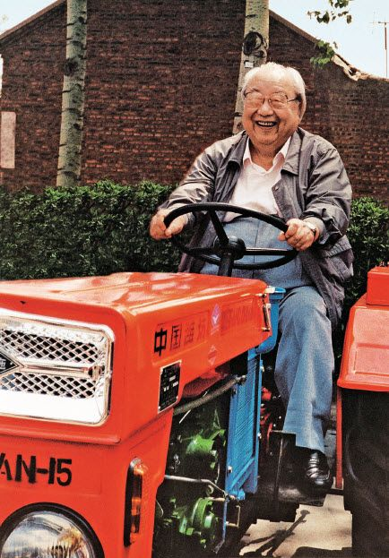

费孝通（1910－2005）

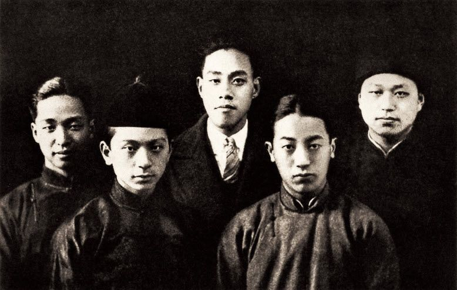

学生时代的费孝通，一直是编辑出版校刊的积极参与者，在东吴大学时，他是东吴大学学生会秘书、校刊通讯秘书。图为费孝通（左四）与校刊同事们合影。

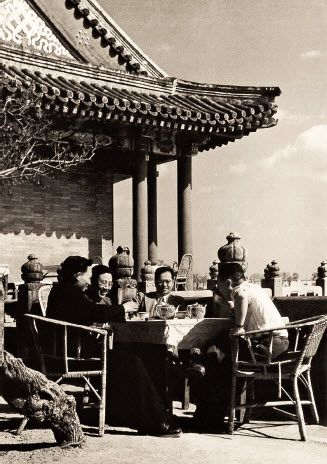

费孝通与吴晗等友人在一起

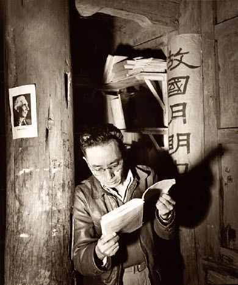

1940—1946年，费孝通主持的云南大学社会学系研究室为躲避日军轰炸，在呈贡大古城魁星阁坚持社会学人类学研究，并取得了系列研究成果，造就了学科人才。图为费孝通在魁阁。

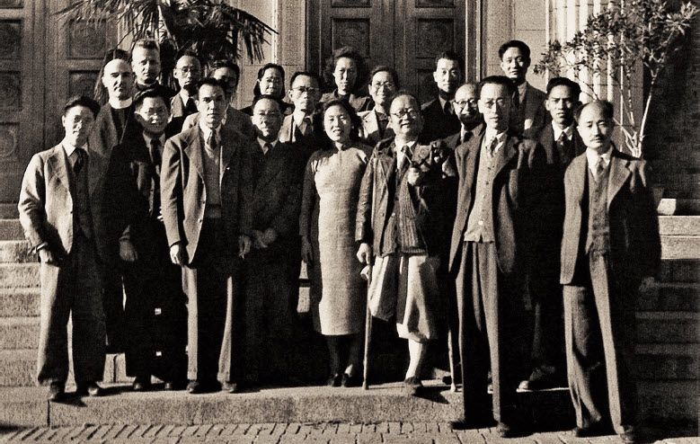

新中国成立前夕，中国社会学界已初步形成一支研究队伍，并取得了一定的研究成果。图为参加社会学年会的代表在一起（前排右三为潘光旦，前排左四为费孝通）。

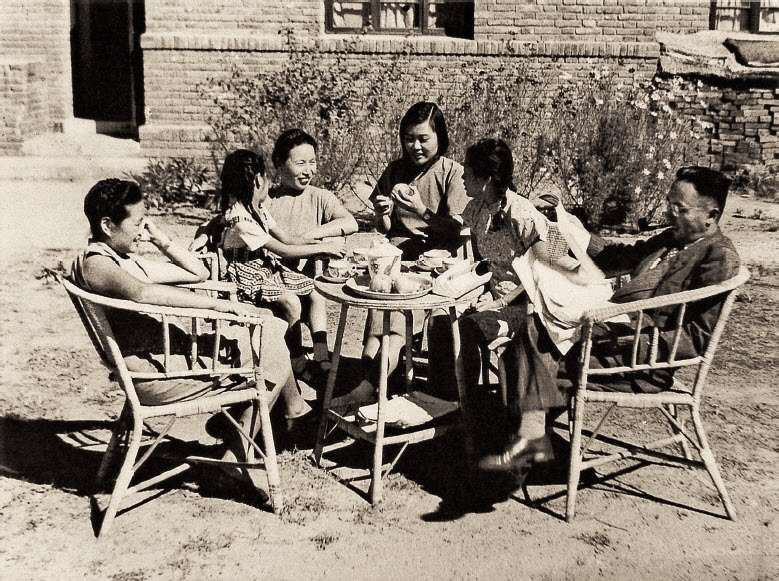

费孝通和家人在清华园胜因院住宅院子里

|

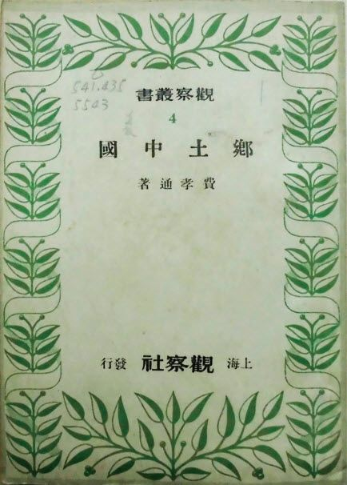

 |
|

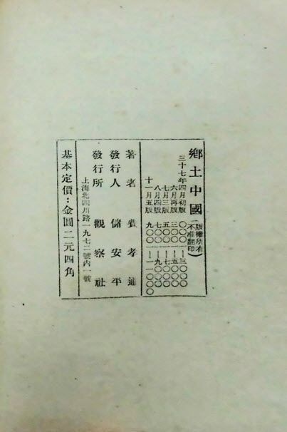

 |

| 《乡土中国》1948年版书影 |

|

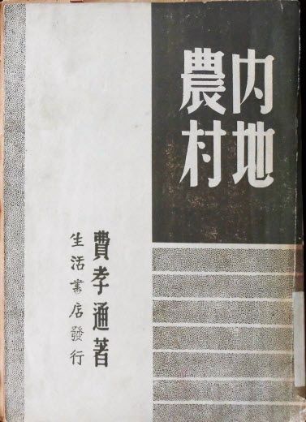

 |
|

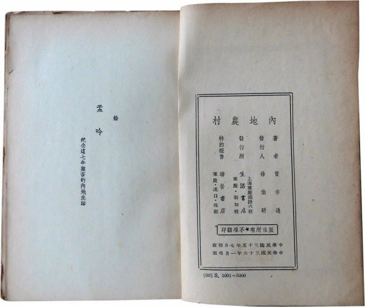

 |

| 《内地农村》初版书影 |

|

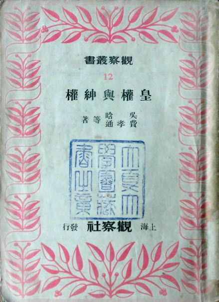

 |
|

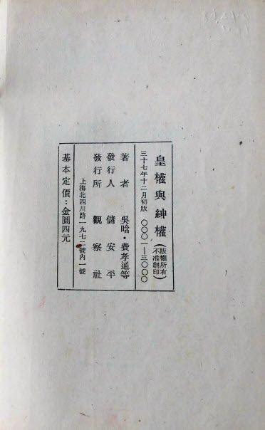

 |

| 《皇权与绅权》初版书影 |

|

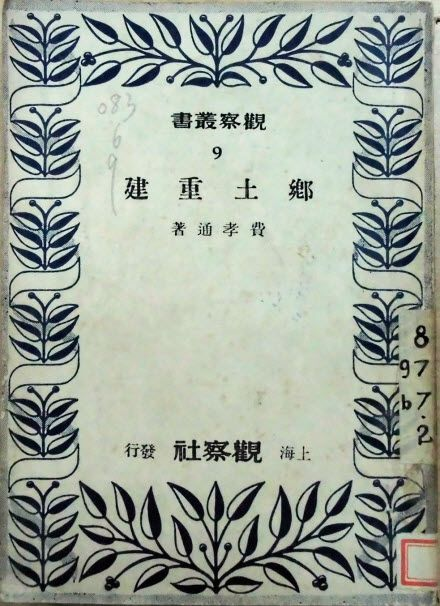

 |
|

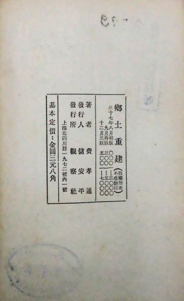

 |

| 《乡土重建》1948年版书影 |

|

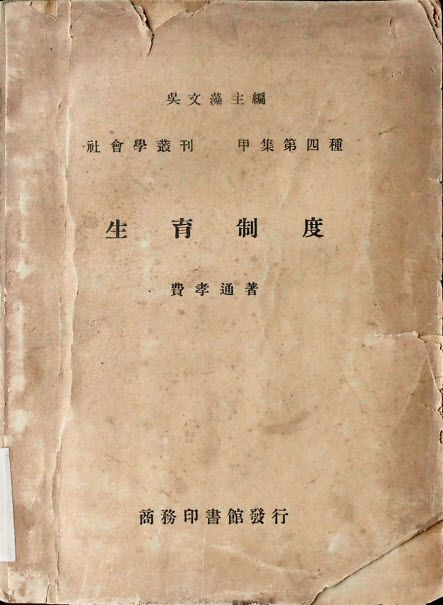

 |
|

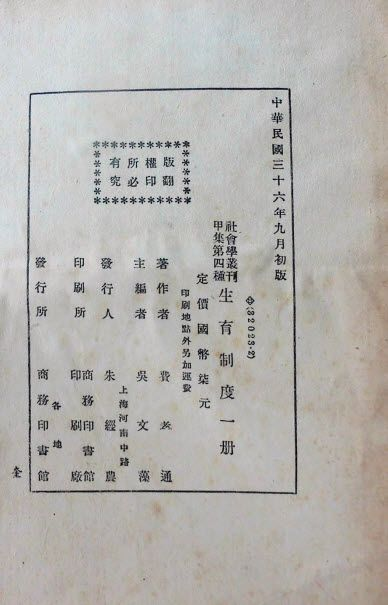

 |

| 《生育制度》初版书影 |

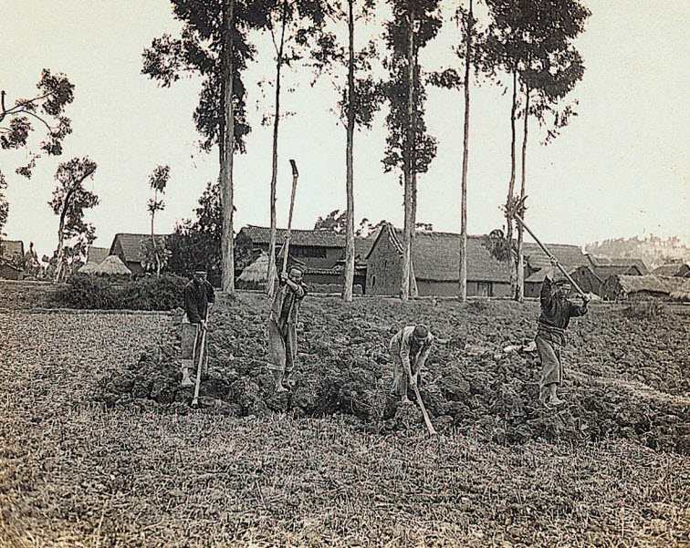

20世纪40年代内地农村的生产活动之一

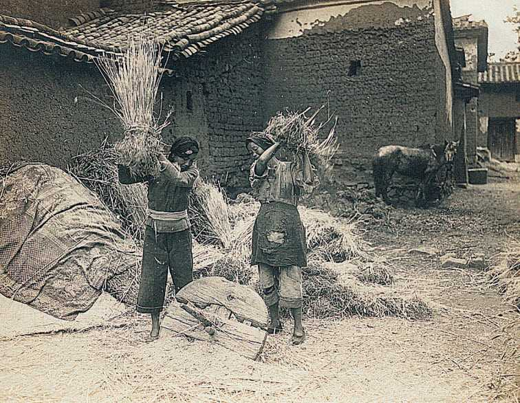

20世纪40年代内地农村的生产活动之二

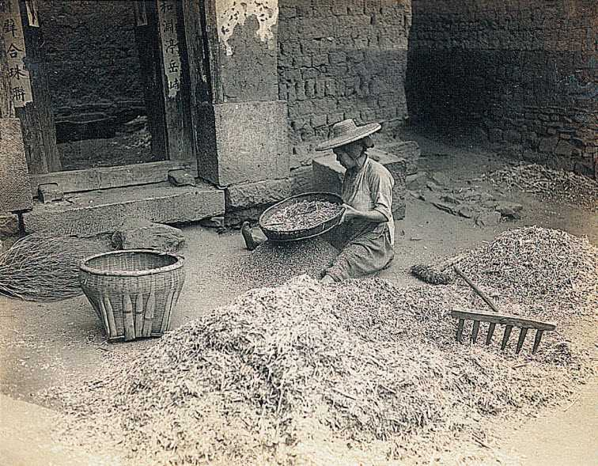

20世纪40年代内地农村的生产活动之三

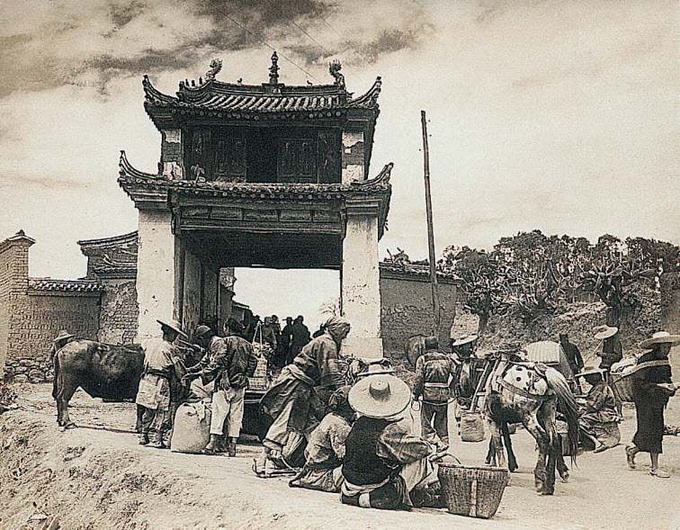

20世纪40年代内地农村的商业活动之一

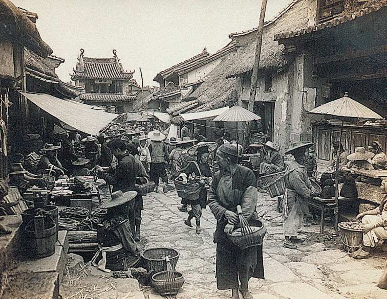

20世纪40年代内地农村的商业活动之二
