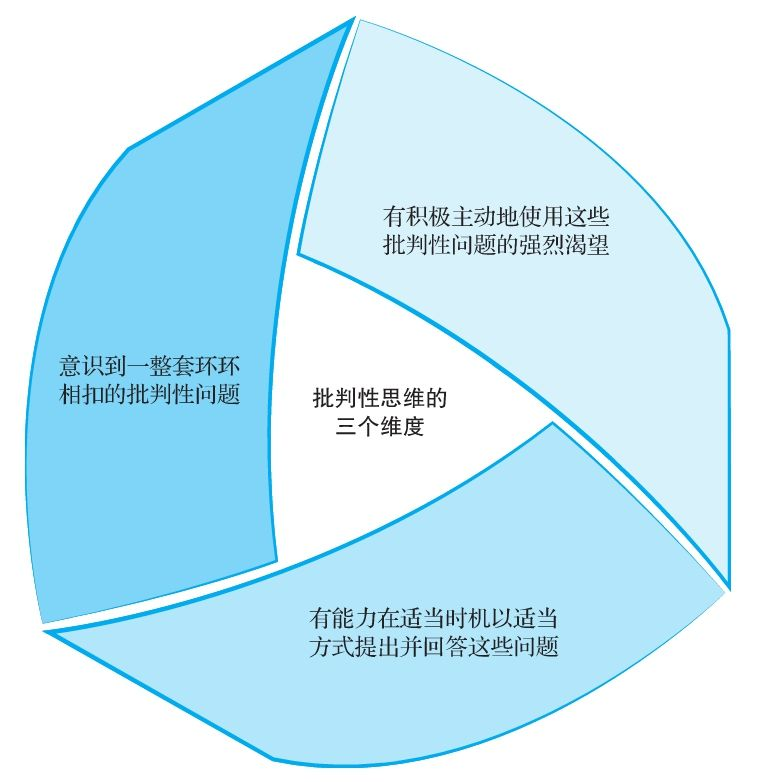

## 激发你的批判性思维

  所谓批判性地倾听和阅读，即对自己耳闻目见的一切加以系统评价，然后做出回应。这需要一整套技能和态度。这些技能和态度都建立在一系列环环相扣的批判性问题的基础之上。我们会一个一个地学习这些问题，而我们的最终目标是将这些问题融会贯通，从而找到可以做出的最佳决断。理想的效果是，提出这些问题将会成为你不可或缺的一部分，而不仅是你在书上学会的一套本领。

  我们在本书中使用的批判性思维（critical thinking）这一术语，指由以下三个维度激活的评估技能：

  1）意识到一整套环环相扣的批判性问题；

  2）有能力在适当时机以适当方式提出并回答这些问题；

  3）有积极主动地使用这些批判性问题的强烈渴望。

  本书的目标就是激发你朝这三个维度全面发展。

批判性思维的三个维度

  提出的问题需要被问对象做出回应。通过提问，我们传达给被问对象的是“我很好奇”“我想多了解一点这方面的知识”“请帮帮我”。这样的请求体现出我们对他们的尊重。批判性问题的提出是为了让所有听到问题的人明白要点，掌握方向。从这方面来说，批判性思维始于个体完善思想的强烈愿望。批判性问题同样有助于提高我们的书面和口头表达能力，因为它们能在以下几个方面助我们一臂之力：

  1）客观评价一篇文章或图书、杂志中以及网站上提供的证据，不盲从盲信；

  2）评判一场讲座或演说的水平高低；

  3）形成自己的论点；

  4）完成指定阅读任务后，撰写有理有据的论文；

  5）积极参与课堂讨论。

注意：批判性思维包括意识到一整套环环相扣的评价性问题，加上在适当时机提出和回答这些问题的能力和意愿。
