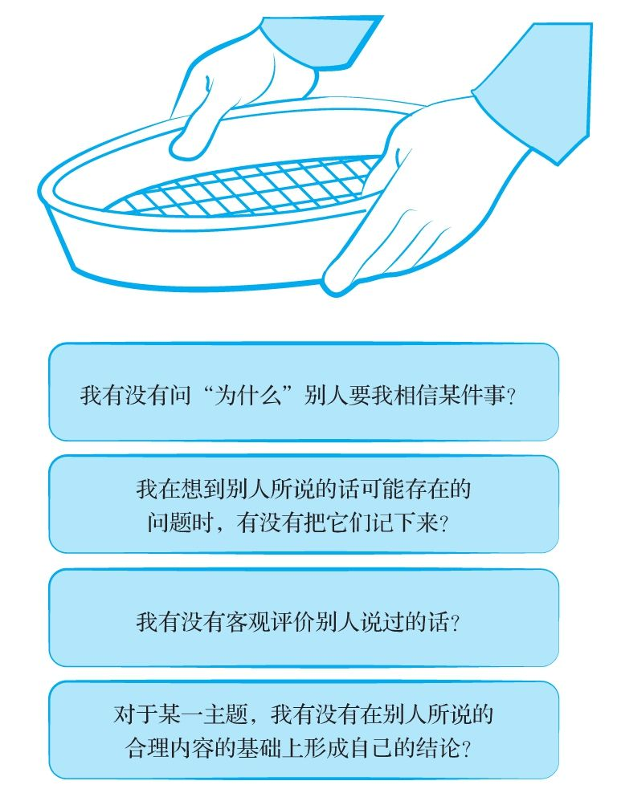

## 海绵式思维和淘金式思维

  有种常见的思维方式因为类似于海绵放到水中的反应——充分吸收水分，而被称为“海绵式思维”。这种流行的思维方式有以下两个显著优点：

  第一，吸收外部世界的信息越多，你就越能体会到这个世界的千头万绪。你获取的知识将会为今后展开更复杂的思考奠定坚实的基础。

  第二，海绵式思维相对而言比较被动，它并不需要你绞尽脑汁、冥思苦想，往往既轻松又快捷，特别是在你看到的材料组织得井井有条又生动有趣时，运用这种思维更是毫不费力。虽然大量吸收外部信息可以为你成为一个有思想的人提供一个有效的起点，但海绵式思维有个严重而又致命的缺陷：对于哪些信息和观点可以相信，哪些信息和观点应该摒弃，它提供不了任何判断方法。如果读者始终依赖海绵式思维，那么最后读到的内容是什么，他就会相信什么。

  我们相信，你一定愿意自己掌握主动权，来选择该吸收什么和忽略什么。要做出这个取舍，你就得带着一种特别的态度去读书，即不断提问的态度。这种思维方式需要你积极主动地参与互动。作者不断向你兜售观点，而你应该随时准备与之辩论，尽管作者本人并不在场。

  我们把这种互动的方式称为“淘金式思维”。淘金的过程为积极主动的读者和听众提供了一种可效法的模式，在他们想要判断自己的所见所闻有多大价值时可以借鉴。要想在对话的过程中披沙拣金，就需要不断地提问并思考问题的答案。

  海绵式思维强调知识获取的结果，而淘金式思维则重视在获取知识的过程中积极和它展开互动。因此这两种思维方式其实可以互补。要想淘出智慧的金子，首先你的淘金盘里得有东西供你掂量才行。此外，要评价各种论点，我们必须掌握足够的知识，也就是说，得有一些信得过的见解才行。

  采取淘金式思维的读者会怎样做呢？像采取海绵式思维的读者一样，他也希望通过阅读来获取新的知识，但两者间的相似点仅此而已。淘金式思维要求读者问自己一系列问题，这些问题旨在找出最佳的决定或最合理的信念。

  采用淘金式思维的读者常常质疑作者为什么要提出各种各样的主张。他在书页的边缘写批注，提醒自己注意论证中存在的问题。他时刻和自己的阅读材料进行互动，意在批判性地评价所读的材料，并在客观评价的基础上得出自己的结论。

  淘金式思维最重要的特点就是互动式参与，即作者和读者之间、演讲者和听众之间展开的对话。一个会思考和判断的人愿意赞同别人的观点，但他首先得为自己的问题找到一些令人信服的答案。

淘金式思维的心理检视表

  别人话中的不合理之处并不会自动跳到你的眼前。作为读者或听众，你必须要积极主动地去查究才行。要做到这一点，你就需要不断地提问。最好的查缺补漏方法就是批判性地提问。这些问题的一个巨大好处是，即使你对当前讨论的问题知识有限，你仍然可以打破砂锅问到底。例如，即使你不是育儿专家，你也一样可以对日托中心的管理完善与否提出一些批判性问题。
