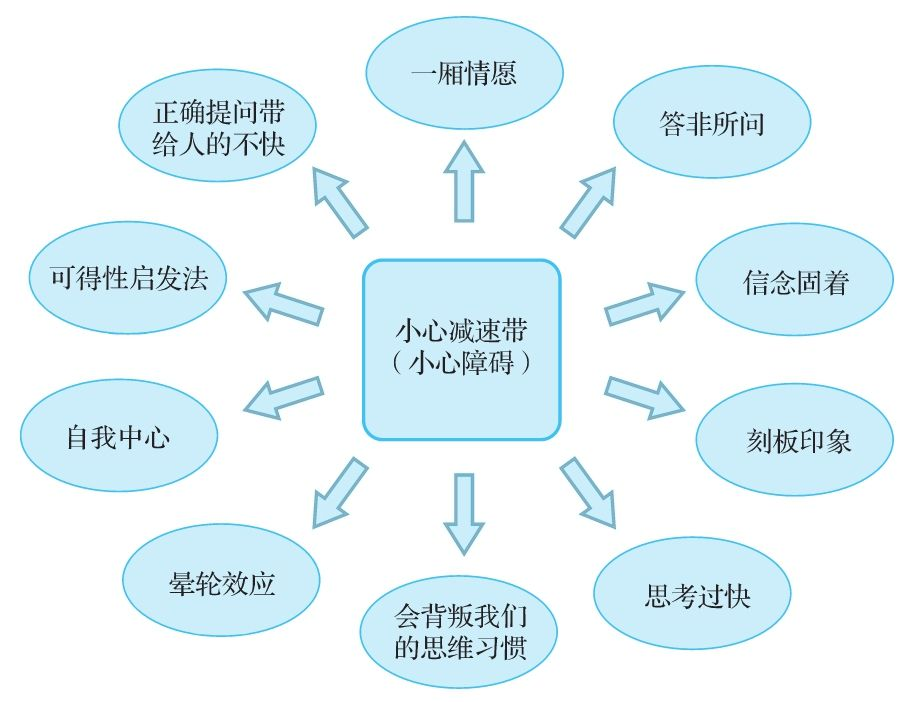
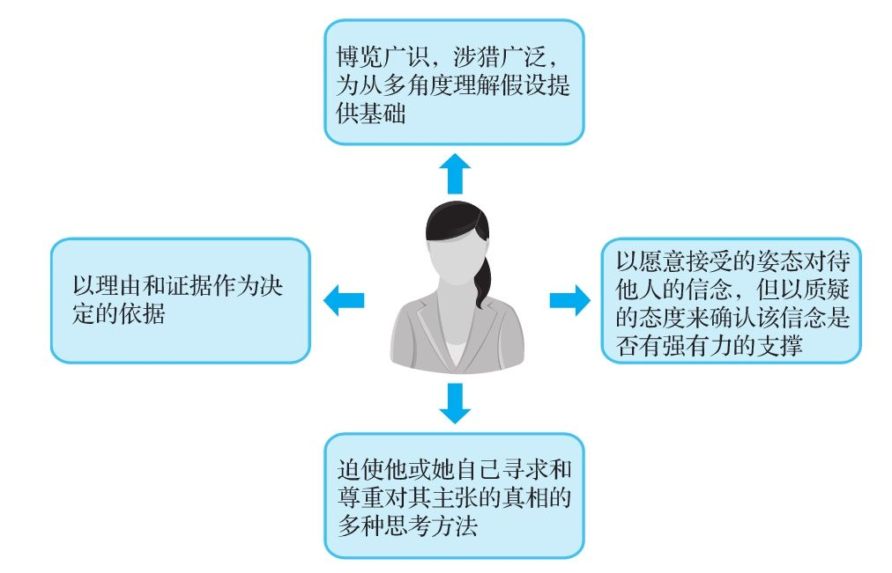

## 成为一个批判性思维者

  批判性思维是一个工具，它能助你一臂之力。在实现这一功能的时候，批判性思维可能让你如虎添翼，也可能让你面临阻碍。你已耗时费力地苦练了批判性思维能力，在本书的最后，我们鼓励你最大限度地利用批判性思维的态度和技能。

批判性思维的障碍

  本书花费大量篇幅为你打造批判性思维的“技能库”。在第1章中，我们指出批判性思想者的基本价值观是自主决断、好奇心、谦恭有礼和对好的论证的尊重。

  要按照这些价值观生活并付诸行动，就需要培养一定的思维习惯。这些习惯既不是天生的，也不易培养。我们强烈建议你经常进行自我评估：“在生活中，我是不是运用了所学的批判性思维技能？”为帮助你做到这一点，我们提供了一份对批判性思维者特有习惯的简单描述。

  一个批判性思维者：

  1）博览广识，涉猎广泛，为从多角度理解假设提供基础；

  2）以理由和证据作为决定的依据；

  3）以愿意接受的姿态对待他人的信念，但以质疑的态度来确认该信念是否有强有力的支撑的；

  4）迫使他或她自己寻求和尊重对其主张的真相的多种思考方法。

一个批判性思维者

  你怎样向别人传达你的批判性思维是一种友善的工具，它可以改善发言者和听众、写作者和读者的生活质量？和其他批判思维者一样，我们也一直在试图回答这个问题。我们发现最有用的一个办法是大声把你的批判性问题说出来，表现出你对它充满了好奇。如果总是摆出一副“哈哈，我可逮着你的一个错了”的态度，将会对批判性问题的有效性产生最致命的影响。

  作为临别赠言，我们想鼓励你真正投入论题中。批判性思维不是只开花不结果的业余爱好，只能在教室里摆摆架子，在考试时临阵磨枪，或者在要显摆你智力超群时拿出来充充门面。它是通情达理的人采取联合行动的坚实基础。信念固然很奇妙，但是信念的回报寓于我们随后的行为之中。在你发现一个问题的最佳答案之后，请依据这个答案采取行动。让批判性思维成为创造一个你为之自豪的身份认同的基础。让批判性思维转化为你自己和你所在的集体的行动。

  期待有朝一日，我们能从你学会的这一切之中大大受益。
