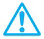

# 第2章　论题和结论是什么

  学习目标

  1）区分论题的类型。

  2）发现论题并找到结论。

  3）把对论题和结论的识别融入写作中。

  在评价一个人的论证之前，我们先要找到他的论证。这听起来很简单，其实不然。要成为一个批判性思维者，首先我们必须练习找准论题和结论的能力。可以把论题看作激发讨论的问题，把结论看作作者对这个问题所持的立场。阅读下面的段落，看看你能不能在其中找到论题和结论：

  尽管手机给人们带来了种种便利，但使用手机也存在可怕的弊端。例如，一边开车一边发短信容易引发交通事故，美国有些州觉得有必要通过法律，强制规定人们在开车时不准使用手机，违者将面临巨额罚款，以此来减少交通事故发生率。面对日渐增长的滥用手机人口，我们需要施加更加严厉的惩戒才行。

  写这篇文章来评价手机的人很想让你去相信某个观点。但他到底想让你相信什么观点，我们又为什么要相信这样的观点呢？

  一般来说，那些建网页、开博客、写社论、出书、给杂志写文章或者做演讲的人，都在竭力影响你的观念或是信仰。要对他们循循善诱的说法做出合理的回应，首先就得找出其中的争议之处，或者说论题（issue）之所在，然后再找到作者想要推销给你的论点或者说结论（conclusion）。如果找不准作者的结论，那你就会曲解其意图，这样做出的回应往往也会显得驴唇不对马嘴。

  读完本章以后，你应该能比较自如地回答我们提出的第一个批判性问题：

批判性问题：论题和结论是什么？

注意：论题就是引起对话或讨论的问题或争议。它是后续所有讨论的原动力。
