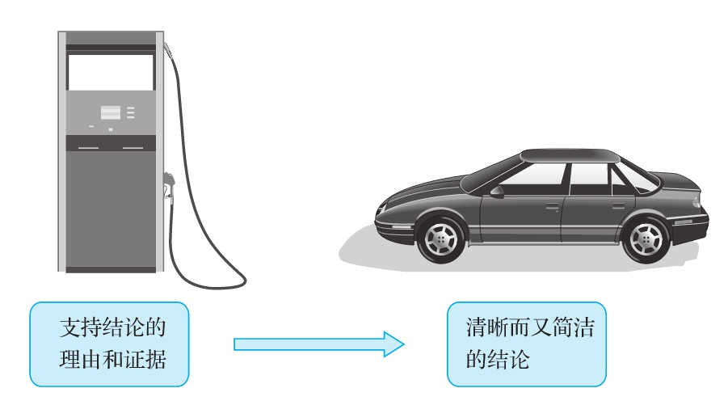

# 第3章　理由是什么

  学习目标

  1）认识论证中理由和证据的作用。

  2）理解论证的属性。

  3）区别理由和结论。

  为什么有人会做出某个决定？为什么有人会持有某个观点？我们总是感到好奇，“理由”为我们的好奇心提供了答案。看看下面的几个陈述：

  1）强加给大学生的债务被转化成银行的巨大利润。

  2）蜈蚣的蜇伤比大多数蛇的咬伤更危险。

  3）音乐的力量巨大无比，它改变世界的力量比所有政治领导人加起来还要强。

  以上三个断言都缺少了点什么。我们既可以同意，也可以不同意，以它们现在的形式，我们既不能说它们经不起推敲，也不能说它们经得起考验。这些断言都不包含解释说明或逻辑依据，不能证明我们为什么应该同意它们。因此，如果我们听到有人提出以上任何一个主张，都只有干瞪眼，迫切想要知道其所以然。我们没有依据来决定是否同意这些陈述。

  以上陈述所缺少的正是支撑断言的理由或者证据。所谓理由，就是用来支撑或证明结论的信念、隐喻和其他陈述。这些陈述是结论可信度的基础，是结论成立背后的逻辑。证据则是支持断言的另一个基础，它由一系列事实组成，这些事实有助于使听众或读者相信你的理由是可靠的。

  我们在第2章里已经介绍了一些必要的方法，教你怎样找到论证“大厦”的两块柱石——论题和结论。本章主要介绍找到论证大厦的第三块柱石——理由的各种技巧。第7章和第8章将重点讨论不同形式的证据，它们辅助理由以支撑一个强有力的结论。一个经得起考验的论证的支撑结构被称为论证的依据，即理由和证据。

  如果写作者有个结论希望你接受，那么他不但要提供论证的依据来说服你相信他的结论是正确的，还要说明为什么他的论证的依据能够证明这个结论。

  判断一个人是否理性，其主要标志就是看他的各种信念是否都有适当的证据来支撑，当这些信念有一定的争议时更是如此。举例来说，如果有人声称中国在不久之后将取代美国成为世界超级大国，这样的言论应该受到以下挑战：“你为何有这样的想法？”这个人的依据可能充分，也可能不充分，但只有你提出以上问题并确定他的理由之后，才能见分晓。如果他的回答是“因为我就是相信这是事实”，那么你肯定会对这样的论证极不满意，因为这个人的“理由”不过是结论的翻版而已。但是，如果答案是关于两国的军事和教育支出的证据，那么你在评价这一结论的时候就要认真考虑这些证据。请记住：只有在你找到支撑一个结论的各种理由和证据以后，你才能评判这个结论的价值。

批判性问题：理由是什么？

  理由和结论相结合，就构成我们在第2章中所定义的论证。有时候，一个论证只由一个理由和一个结论构成；但更常见的情形是，很多理由会被用来支撑一个结论。所以当我们谈到某个人的论证时，我们可能指的是一个理由以及相关的结论，也可能指一整套的理由以及它们想要证明的结论。

注意：理由是指我们相信某个结论的原因或原理。

注意：证据是指证明理由的真实性的事实。

强有力的结论的构成

  论证本身有几个特点值得我们加以注意：

  ·论证必有其目的。人们之所以展开论证，是因为希望说服我们相信某些事或按照某些特定的方式行事。因而论证需要别人对其做出回应。不论我们的反应类似于海绵还是淘金者，我们一般总会做出回应。

  ·论证的质量有高低之分。我们需要依赖批判性思维来判定一个论证的质量高低。

  ·论证有两个明显的必要组成部分，一个结论及支撑它的理由。两者当中如果有一个我们找不到，也就意味着我们失去了评价这一论证的机会。我们自然无法对找不到的东西做出评价。

  最后一点值得进一步强调和说明。心急火燎地展开批判性思考并没有什么意义。实际上，哲学家维特根斯坦曾说过，在一个聪明人和另一个聪明人说话时，他们都会总是先说“等一等”。花点时间找准论证之所在，然后再去评价我们听到或看到的那些话，这样对提供论证的那个人才够公平。
