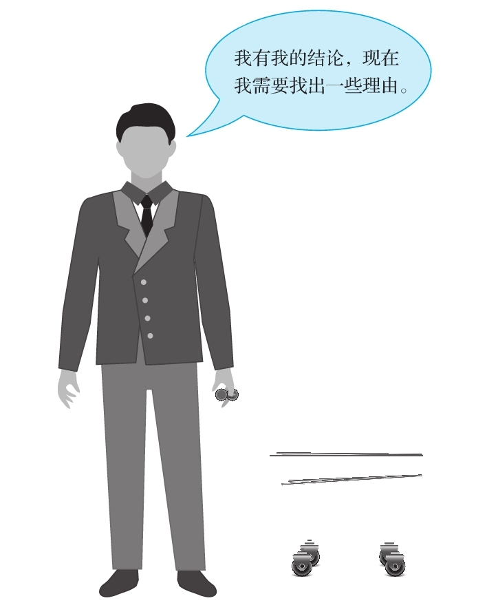

## 让理由和结论一目了然

  有很多论证篇幅冗长、结构松散。有时候，成套的理由只是用来支持一个结论，而这个结论又被当成另一个结论的主要理由。理由可能会由其他理由来支持。面对复杂的论证，当你想批判性地评价自己看到或听到的内容时，你常常发现自己很难在脑海中将论证的结构清晰展现出来。要想克服这一难题，你就要设法组织材料，将理由和结论分开，以逻辑性的方式重新编排。

  我们已经提到过许多技巧，它们能帮助你构建一幅有关论证结构的清晰画面。如果你有其他更好的技巧，那就毫不犹豫地加以利用吧。关键是，在你打算评价一个论证以前，一定要让理由和结论一目了然。

### ◎使用这个批判性问题

  一旦你找到理由，随着阅读或倾听的不断深入，你就需要一遍又一遍地重温这些理由。结论能不能站住脚主要取决于给出的相应理由扎不扎实。薄弱的理由必然导致薄弱的论证！

### ◎谨防操控型论证

  我们在第1章里警告过弱势批判性思维带来的危险。当你注意到有人似乎在编造理由（甚至是当场编造理由），仅仅因为他们想以此来捍卫自己所持的观点，这时你就应该在心里不断发出警示信号，提醒自己注意弱势批判性思维的局限性。如果有人急于和你分享他的观点，好像其观点是确凿无疑的结论，可一旦被问及有哪些理由，他就变得一脸茫然或恼羞成怒，那么这很可能是弱势批判性思维惹的祸。

  操控型论证就是指以一个结论开始的论证。然后提供论证者选择理由和证据，它们发挥着特定的作用。这种作用并不在于这些证据具有很强的真实性，而在于它们有助于听众或读者在脑海中勾勒出一个故事，使这个故事朝着预先确定的结论行进。你可以这样理解操控型论证：想象一个人态度坚定，持有先入为主的结论，他在“信息超市”中“采办”理由和证据的目的仅在于增加分享预期结论的人数。

  操控型论证的一个很好的例证就是律师在对抗制的司法体系中的行为。当客户跨进大门的时候，律师接收到的信息是一个特定的结论，他被请求必须接受这个结论。一旦建立了代理人-委托人关系，律师的道德任务就是积极地提出有利于委托人的论证。这与科学家的行事风格截然不同，科学家可能对一个实验将得出什么样的结果有一种预感，但他最终的结论由这样的规则所决定：先有理由和证据，后有结论。

操控型论证

  在这一点上，你必须要自我监控。我们都知道，我们倾向于匆匆下结论。要设法避免“逆向逻辑”或“反向论证”，在这种论证中，理由不过是一记马后炮，会随着你的结论而不断变化。理想的做法是，将理由和证据作为模具，结论据此得以成型和修饰。
