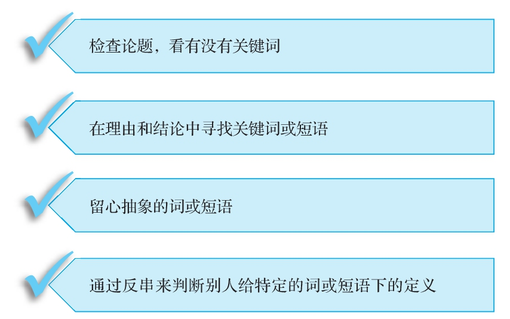

## 找准关键词

  要确定哪些关键词或短语意思不清楚，第一步就要以表述出来的论题为线索，来寻找可能的关键词。这里所说的关键词或短语，是指在论题的语境里有不止一层潜在含义的词或短语。在你决定是否同意发言者的论证之前，你觉得首先得让他澄清这些词的含义。仔细核对论题中专门术语的含义，这种做法大有好处，为了说明这种好处，我们可以看看下面两个论题：

  1）高收入是否能带来幸福感？

  2）真人秀节目里展示的画面是不是对现实生活的一种歪曲？

注意：歧义是指一个词或短语可能存在多重含义的现象。

  以上两个论题中都含有一些需要写作者或发言者进一步加以解释，然后你才能评价他们对这些论题的回答的短语。下列每个短语的意思可能都不太清楚：“高收入”“幸福感”和“歪曲”。当你读到一篇针对这些论题的回应文章时，你要特别注意写作者如何定义这些术语。

  确定哪些词或短语意思不清楚的第二步是要找到在对写作者的理由能否支撑其结论的判断中，哪些词或短语起到关键作用。也就是说，要找出论证结构中的关键词。找到这些关键词后，你就能判断它们的意思是否含糊不清。

  在寻找关键词或短语的时候，你应该牢记寻找它们的原因。因为有人要你接受他的结论，所以你才去寻找那些影响你接受这个结论与否的词或短语。这样说来，你应该在理由和结论中寻找这些词或短语。对于那些并未包括在基本论证结构内的关键词或短语，你就可以把它们“从淘金盘里扔出去”。

  在寻找关键词或短语时还有个好帮手，那就是牢记下面这个原则：一个词或短语越抽象，人们就越有可能对其做出多重解读。

  为了避免在使用“抽象”这个术语时意思不明确，我们这样来给它下定义：一个词所指代的对象离特定、具体的事例越遥远，它也就越抽象。因此，像“平等”“责任”“色情”和“侵犯”这些词，就要比“同样有机会获得生活必需品”“直接引发某个事件”“男女生殖器图片”和“故意伤害他人身体”这些短语抽象得多。后面这些短语提供了更加具体的图像，所以表意更明确。

  你还可以通过反串（reverse role-playing）来找出潜在的重要又有歧义的词或短语。问问自己，如果你采取和写作者相反的立场，那么你会不会选择用不同的方式来定义某些词或短语？如果是这样，你就找到了一处可能存在的歧义。例如，对于“对动物残忍”这个短语，把看宠物秀作为娱乐的人给出的定义肯定和把看宠物秀视为剥削动物的人给出的定义大相径庭。

找到关键词的线索小结
