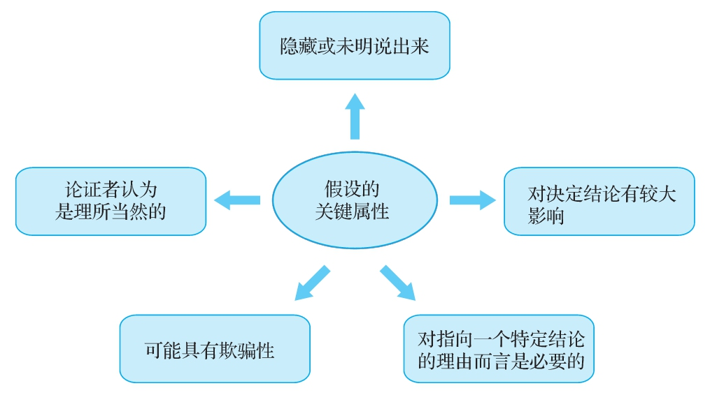

# 第5章　价值观假设和描述性假设是什么

  学习目标

  1）解释找出隐含在论证中的假设的重要性。

  2）识别论证中的价值观假设。

  3）区别价值观假设与描述性假设之间的异同。

  4）理解典型的价值观冲突。

  5）运用线索找出描述性结论。

  任何一个想说服你相信某个立场的人，都会尽量拿出与其立场相一致的理由。换句话说，理由和结论相辅相成，构成一个完整的说法。因此，乍一看，几乎每个论证都显得“言之有理”，其外表结构看起来都显得完美无缺。但是表面的、明说出来的理由并不是唯一用来证明或支撑其结论的观点。有些内在的、没有说出来的想法提供了一个不可见的结构，使可见的结构说得通。因此，就理解和评价论证而言，本章关于假设的讨论可能是本书最有影响力的部分。让我们思考下面这个论证，看看假设的隐蔽结构到底有多重要。

  地方执法机构应采取更多措施来让公众场合醉酒者承担严重后果。很显然，人们不会积极主动地遵纪守法，因此城市警察必须采取行动。如果不强制执行法律，我们怎么能期待会有改变发生？

  乍一看，这个论证的理由支撑了它的结论。如果城市期待市民在行为上有所改变，城市的执法机构就必须强制推行这种改变。

  但是也有这种可能：给出的理由确实有道理，但并不足以支撑其结论。假如你认为制止公共场合醉酒的行为是个人的责任，而不是政府的集体责任呢？这样的话，从你的角度看来，上述理由就不再能证实其结论了。只有你认同写作者以为理所当然而没有明说出来的那些特定信念，这个论证对你而言才是令人信服的。在这个例子里，写作者认为理所当然的一个观点就是一种价值观（集体责任）要比另一种价值观（个人责任）更为可取。

  在所有的论证中，都有一些写作者认为理所当然的特定信念。通常情况下写作者不会将这些信念明说出来。就像你必须挖掘词语所指的含意一样，你也必须通过阅读字里行间的内容来找到假设。这些信念是论证结构中无形的重要纽带，是将整个论证连接在一起的黏合剂。它们回答了一个非常重要的问题：“必须持有什么样的观点才能将理由和结论从逻辑上联系起来？”这些纽带的必要性很明显。没有了这些纽带，在成千上万不同的观点中，人们又怎么能判断哪些才有资格充当理由？只有获得了这些纽带以后，你才能真正理解一个论证。

  本章对于你成为一个批判性思维者特别有帮助，因为它帮助你关注整个论证的方方面面，而不仅仅关注那些比较吸引人的特征。提供论证的人可能想要对你隐藏一部分内容，而你的思维却在抓紧时机，补足论证的这些组成部分。

  我们再用一种方式来看看假设的重要性，请你想一想为什么你要努力掌握本书介绍的这些技能和态度。有各种各样的理由证明你完全可以不用学习批判性思维。独立认真的思考需要我们付出更多的精力，远不如抛一块硬币做决定，或者问问身边踌躇满志的专家该怎么办那样轻松。但是本书鼓励你学习批判性思维。我们在告诉你，批判性思维对你非常有好处。

  我们的建议都是基于一些潜在的观点，如果你不认同这些观点，那么你完全可以不理会这些建议。批判性思维者相信，自己做主、遇事好奇、通情达理等价值观是人类最重要的目标。批判性思维的最终结果就是要求一个人虚怀若谷地接纳各种观点，理性而又有理有据地评判这些观点，然后在理性判断的基础上决定接受哪些观点或采取哪些行动。我们相信你赞同这种对人生的刻画，并因此想成为一个批判性思维者。

  当你努力理解一个人的时候，你面临的任务在很多方面都像没有亲眼看到魔术师的表演诀窍，就自己动手去复制那个魔术。你眼看着手帕被放进了帽子里，出来的却是一只兔子，而你压根就不知道魔术师暗地里玩的是什么把戏。要理解这个魔术，你就得搞清楚魔术师暗地里的那些把戏。同样，在论证中，你也要找到那些暗藏的把戏。实际上，这些把戏就是没有明说出来的观点或信念。我们把这些没有明说出来的想法称为假设（assumptions）。要全面理解一个论证，你就得找出这些假设。

  假设具有下面这些特征：

  1）隐藏或没有明说出来（大多数情况下如此）；

  2）论证者认为是理所当然的；

  3）对决定结论有较大的影响；

  4）可能具有欺骗性。

批判性问题：假设是什么？

假设的关键属性
