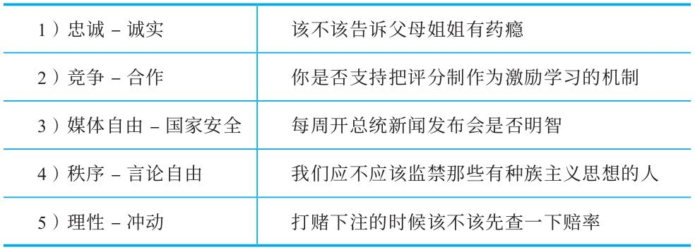

## 典型的价值观冲突

  如果你能意识到典型的价值观冲突，你就能更快地认出一个写作者在得出特定结论时做出的价值观假设。我们列举了一些伦理道德论题上常见的价值观冲突，而且提供了可能出现这些价值观冲突的论争例证。在识别重要的价值观假设时，你可以把这些列举出的价值观冲突作为出发点。

  在识别价值观冲突的时候，你常常发现在某一个论争中，似乎存在好几个价值观冲突，并且它们对形成结论似乎都很重要。所以在你评价一个论争的时候，请尽量找出几个价值观冲突，以此来检验一下自己的看法。

  典型的价值观冲突和论争的具体例证

