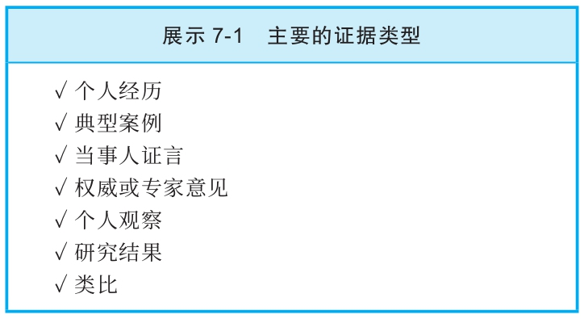

## 证据的来源

  什么时候我们才能接受一个事实断言，认为它是可靠的？在以下三种情况下，我们最倾向于认可事实断言：

  1）当这个断言看起来是无可置疑的常识时，比如“举重有助于增肌”这个断言；

  2）当这个断言是从无懈可击的论证中得出的结论时；

  3）当这个断言得到有证据支持的理由充分的支撑时。

  本章我们所关心的是第三种情况。要确定证据充分与否，我们需要提出这样的问题：“这个证据的效力怎么样？”要回答这个问题，我们首先要问：“我们所说的证据到底是什么意思？”

注意：所谓证据，就是立论者告知的明确信息，用来支撑或证明一个事实断言的可靠性。在规定性论证中，需要有证据来证明属于事实断言的那些理由；在描述性论证中，需要有证据来直接证明一个描述性的结论。

  如果运用得当，每种证据都可以成为“有效证据”，有助于支撑写作者的断言。正如淘金者仔细检查自己淘金盘里的石子，以筛选出可能存在的高质量矿石，我们也必须仔细检查证据，判断其质量。我们想知道：作者的证据是否为其断言提供了可靠的支撑？因此，我们在开始评价证据时就要问：“证据的效力怎么样？”我们要一直在脑海深处铭记，没有哪一种证据可以像灌篮那样一锤定音、一劳永逸。你总是在找更好的证据，不可能找到完美的证据。

  在本章以及第8章里，我们会逐一探讨我们可以针对每种类型的证据（见展示7-1）提出的各种问题，这些问题能帮助我们确定证据的质量如何。本章将要考察的证据类型包括直觉、个人经历、典型案例、当事人证言和专家意见。

