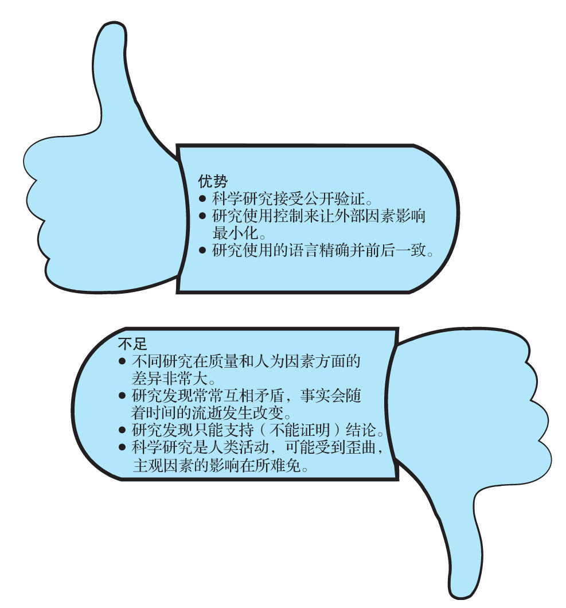

## 以研究报告作为证据可靠吗

  “研究表明……”

  “研究人员在最近一项调查中发现……”

  “《新英格兰医学期刊》（New England Journal of Medicine）的一份报告显示……”

  由训练有素的科研人员系统地收集观察结果所形成的科学研究属于一种权威。它们充分的观察，常常是被高度认可的证据。研究结果的可靠性到底如何？面对研究结果时，应采用与对待更普遍的诉诸权威意见一样的方法，只有等我们问了一些问题之后，才能知道研究结果有多可靠。

  我们的社会越来越依赖于科学方法，将其作为重要指导，帮助人们判定事实真相，因为这个世界上各种事件之间的关系错综复杂，人类对于这些事件的观察和理论很容易出错。科学方法力求避免我们在观察世界时以及我们的直觉和常识中带有的很多内在偏见对我们获取真相造成影响。

  科学方法有什么特别之处？首先，它追求的信息是以公开证实过的数据的形式出现的——也就是说，它的数据是在一定条件下获取的，其他有资质的人根据同样的条件，可以展开类似的观察并获得同样的结果。因此，如果有研究人员报告说他能在实验室条件下获得冷聚变，只有其他研究人员也能获得同样的结果，这个实验才可信。换句话说，我们可以更加信赖这些科学研究的结果，因为这些结果已经得到复制（即重复）。

  其次，科学方法的第二个主要特征就是控制——即使用特别的程序来减少观察和研究成果诠释中出现的错误。例如，如果观察中存在的偏见可能是个主要的难题，那么研究人员就要尝试控制这类错误，如让多个人员一起进行观察，然后看他们的观察结果相互之间能在多大程度上取得一致。物理学家经常在实验室里研究问题，以使外部因素的影响达到最小化，使控制达到最大化。可惜的是，在真实社会中实施控制通常比在物理世界中困难得多，因此，要将科学方法成功应用到解决很多复杂的人类行为问题上是很难的。

  再次，语言的精确性是科学方法的第三个主要组成部分。许多概念常表意不明、模糊，显得模棱两可。科学方法则力图在语言运用上做到精确和前后一致。

  科学还存在很多其他要素，远非我们在这里可以探讨，但我们想让你记住，（做得好的）科学研究是我们获得证据的一个优质的来源，因为科学研究强调可重复性、控制和精确性。

### ◎研究发现中存在的一般问题

  可惜的是，研究被用于论证一个问题这一事实并不必然意味着研究证据是可靠的证据，或者对于这个证据含义的解释准确无误。如同诉诸任何来源的证据一样，取材于科学研究的证据也需要我们谨慎对待。同时，对于有些问题，尤其是那些关注人类行为的问题，哪怕有最好的证据，我们也只能尝试性地进行回答。因此，对于研究而言，我们还要提出很多重要的问题，这样才能决定它们的结论可靠性到底如何。

  当立论者以研究作为证据来源时，你应该记住以下几点：

  1）研究的质量有高有低，差别很大。有的研究细照笃行，有的研究粗制滥造，我们自然更应该相信前者。因为研究过程太过复杂，而且受到太多的外在因素影响，哪怕是训练有素的研究人员，有时所做的研究也难免会存在重大不足，在科学刊物上发表文章并不能确保一项科学研究没有重大缺陷。

  2）研究成果常常会互相矛盾。因此，脱离了调查某一具体问题的科学研究的大环境，单一的研究呈现的常常是误导性的结论。最值得我们注意的研究是那些不止一个人或不止一群研究人员反复做过的研究。有很多断言从来没有被重新验证过，还有很多断言在重新验证后未能重复其原始的结论。比如说，最近发表在一份声望很高的医学杂志上的研究，重新检验了一些宣称产生了成功的医学干预效果的备受重视的研究断言，结果令人信服地表明，原来的断言中有41%都是错误的或被极大地夸大的。（见“Lies，Damned Lies，and Medical Science，”November 2010，Atlantic Magazine）。我们需要不断追问：“其他的研究人员有没有重复取得这些发现？”

  3）研究发现并不能证明结论，充其量只能支持结论。这些研究发现本身并不足以说明问题。研究人员总是要解释他们的发现的意义，而所有的科学发现都可以找到不止一种解释方法（参见第7章）。因此，研究人员的结论不应该被当成是已证明了的“真理”。当你遇到“研究结果表明……”这样的表述，应该重新将其解读为“研究人员解释，他们的研究发现表明了……”

  4）如同我们大家一样，研究人员也有自己的期待、态度、价值观、训练和需求，这使他们所问的问题、做研究的方法、解释研究发现的方式都烙上偏见的印记。例如，科学家通常都对某个假说投入大量的感情。如果美国食糖研究所（American Sugar Institute）为你提供暑期研究经费，那么你就很难发现青少年过量消费食糖的问题。和所有容易犯错的人一样，科学家可能也会发现，客观对待那些与他们所相信的假说相冲突的数据非常困难。科学研究的一个主要优势在于它总是尽力将程序和结果公开化，这样其他人就可以判断研究的优缺点，然后可以尝试重复验证。但是，一份科学报告不论看上去多么客观，仍难免会夹杂严重的主观因素。

  5）发言者和写作者常常歪曲或者简化研究结论。原始研究得出的结论和立论者使用这个证据来支持其信念的方式之间常常有重大差异。例如，研究人员可能在其原始研究报告中仔细限定了他们的结论，只不过当结论到了其他人手里时，这些限定马上就被拿掉了。

  6）研究的“事实”会随着时间的流逝而发生改变，尤其是关于人类行为的断言。比如，下面的研究“事实”都在主流的科学资料来源上报道过，却都被最近的研究证据驳倒。

  ·对大部分抑郁症患者来说，百忧解、左洛复和帕罗西汀的医疗效果要好于安慰剂。

  ·吃鱼肝油、锻炼身体、做智力游戏能有效抵抗老年痴呆症。

  ·麻疹疫苗会引发自闭症。

  7）不同研究的人为程度有很大差异。研究者经常为了达到控制的目的，使得研究失去一部分现实世界的特征。研究的人为因素越多，研究结论就越难推广到外部世界。研究的人为因素问题在研究涉及复杂的社会行为时变得尤其明显。例如，社会科学家会让人们坐在一间有电脑的房间里，玩一些游戏，其中包含测试人们的论证过程。研究人员想要弄明白，为什么人们面对不同的场景时会得出不同的决定。面对这样的研究，我们应当问：“坐在电脑前思考假想的情境，这种环境是不是太过人为，根本就不能告诉我们人们在面临真实的两难处境时做出决断的方式？”

  8）对经济效益、社会地位、人身安全和其他因素的需求可能会影响到研究的结果。研究人员也是人，不是电脑，要他们做到百分百的客观是极其困难的。例如，如果研究人员想通过他们的研究来发现某个特定结果，他们就有可能按照心中所想的结果那样来解释自己的研究发现，以得到他们想要的结果。获得资助、终生教职或其他个人奖励的压力可能会影响研究人员解读数据的方式。例如，一家制药公司出钱赞助一项研究，主要研究使用这家公司的药物进行干预的结果，比起另一项针对同样的药物但是受到与那家制药公司无关的资助（如政府基金的资助）的研究，这项研究更倾向于得出较高比率的阳性结果。

  现在你发现，尽管研究证据有很多优点，但我们要避免过早拥抱研究结论。不过，你也不能仅仅因为有一丝疑虑，就武断地抛弃一个建立在科学基础上的结论。“确定性”通常是个不可企及的目标，但并不是所有的结论都同样不确定，我们应该时刻准备去拥抱其中一些结论，而抛弃其他结论。因此，当我们客观地评价研究断言和信念的时候，请小心，不要犯这样的论证错误：在一些结论中强求确定性，其实这些结论中虽然存在一定的不确定性，但并不足以否定这一结论。我们把这一论证错误称为“强求确定性谬误”（impossible certainty fallacy）。

以科学研究作为证据

强求确定性谬误：认为一个研究结论如果不是百分百确定，就应该被抛弃。

  评价科学研究的一些线索

  应用以下问题，以判断研究发现是不是可靠的证据。

  （1）报告的资料来源的质量怎么样？通常情况下，最可靠的报告往往出自那些发表在由同行专家评定的期刊上的文章，在这些期刊中，一项研究结果在经过一系列相关专家评价以后才会被接受。通常情况下，资料来源的声誉越好，研究设计也就越好（并不总是如此）。所以，要尽最大努力找出资料来源的信誉。

  （2）除了资料来源的质量以外，报告中有没有其他线索显示这项研究完成得很出色？例如，报告有没有详细说明这项研究有什么过人之处？可惜的是，我们在流行杂志、报纸、电视报道和博客里遇到的绝大部分关于研究发现的报告，都没有提供足够的关于研究的细节信息，以确保我们对这项研究质量做出准确评价。

  （3）研究实施的时间距离现在有多久，有没有理由让人相信研究发现可能会随着时间的流逝而发生改变？很多研究发现会随着时间的流逝而发生改变。例如，抑郁症、犯罪或者心脏病的起因，在1980年和2014年时可能大不相同。

  （4）这项研究的发现有没有被其他研究重复过？如果某种联系总是在精密设计的研究中一致地被发现，比如吸烟和癌症之间的联系，那么我们就有理由相信它，至少在不同意这一结论的人提供较有说服力的证据来证明他们的观点之前，我们都会相信它。

  （5）立论者在选择研究的时候是否有选择性？例如，得出相反结论的相关研究有没有被他忽略不计？立论者是不是只选择那些支持他的观点的研究？

  （6）有没有什么强势批判性思维的证据？发言者或写作者对于那些支持他的观点的研究有没有表现出一种批判的态度？研究都有局限性，研究得到的大部分结论都需要有所限定。立论者有没有表现出加以限定的意愿？

  （7）有没有理由让人蓄意歪曲这项研究？我们要当心研究人员亟须找到特定结果的那些情况。

  （8）研究的条件是不是人工制造的并因此遭到扭曲？记住，一定要问一声：“研究进行的客观条件和研究者总结概括的研究环境到底有多少相似之处？”

  （9）根据研究样本，我们概括的范围到底有多大？因为这个问题非常重要，我们将在下一部分深入讨论。

  （10）研究人员所使用的调查报告、问卷调查、等级评定或其他测量结果有没有偏见或者歪曲的现象存在？我们应该相信研究人员想要测量的东西，他们一定会测量得准确无误。但是片面的调查报告和问卷调查这一问题在科学研究中简直无孔不入，我们只有在后面部分详细加以讨论。
