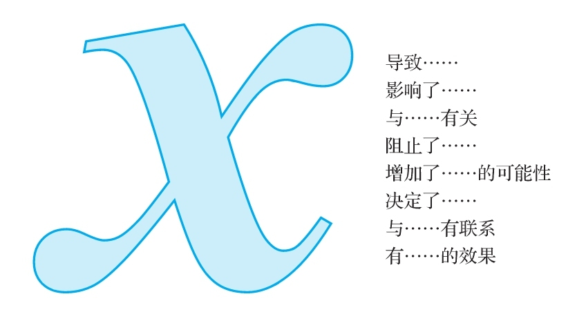

## 可能存在替代原因

  当你有足够的理由相信写作者或发言者在使用证据支持他对某件事的起因的一个断言时，你就需要寻找一些替代原因。“原因”（cause）这个词的意思是“引起，让某件事发生，或影响”。立论者可以用很多种不同的方式指出因果思维。下面我们仅列出一些供你参考。

因果关系的指示词

  这些因果思维的线索应该能帮助你在立论者做一个因果断言时辨认出来。一旦注意到这样的断言，你就一定要警惕存在替代原因的可能性。
