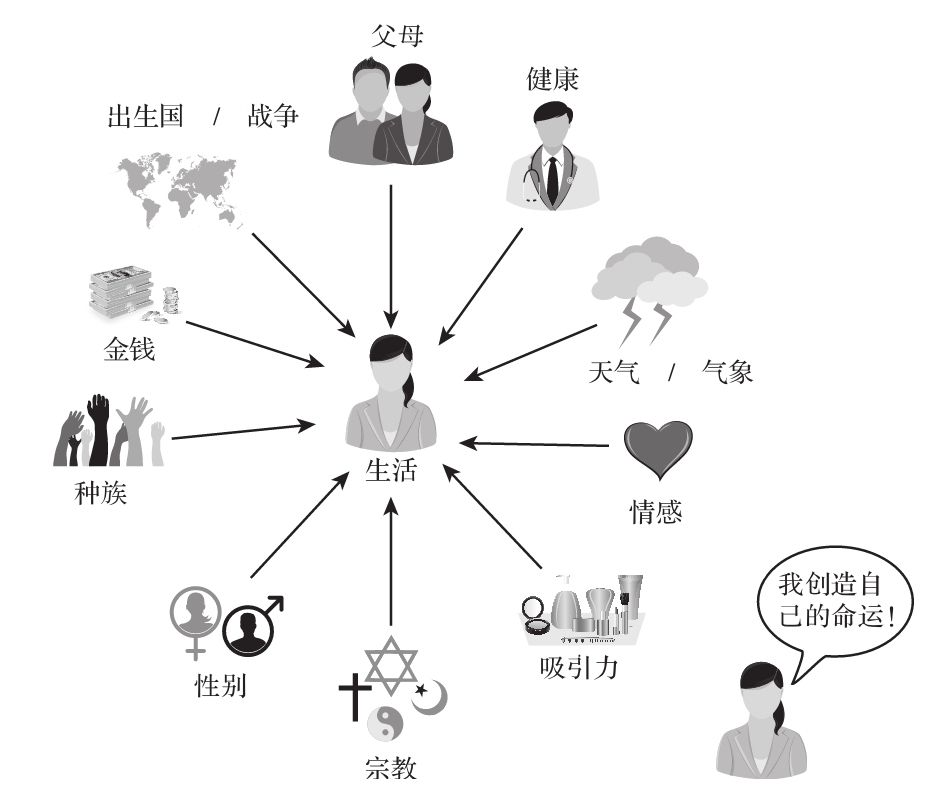

## 解释单个事件或行为

  是什么原因引起2010年冰岛火山爆发？为什么社交媒体这样流行？

  和我们对桑迪胡克小学校园血案提出的问题一样，这些问题都在寻求对单个历史事件的解释。首先，就像我们在桑迪胡克小学校园血案中见到的那样，对于同一事件，有多种不同版本的故事都能说得通。其次，我们解释事件的方式深受各种社会力量和政治力量的影响，同时还受到和信念有关的个人视角的影响。我们还受到一种常见的偏见——基本归因错误（fundamental attribution error）的影响，这种错误指我们在解释他人的行为时普遍高估了个人倾向的重要性而低估了环境因素的作用。也就是说，我们总喜欢认为别人的行为来自其内部因素的作用（他们个人的性格特点），而不是来自外部因素的作用（环境的力量）。因此，当发现有人偷窃时，我们很可能将偷窃行为一下子就看成小偷骨子里没廉耻或没良心的结果，或认为他们做了糟糕的选择。然而，我们还应该考虑一下外部环境的作用，考虑是否贫困或者来自同龄人的压力等因素也发挥了作用。

基本归因错误

  构建过去事件的各种原因还存在一个重大的困难，即很多证据都依赖于人们的记忆，而大量研究显示记忆常常会出现极大的扭曲。

  我们怎么知道我们是不是有了对某件事或某些事的合理解释呢？我们永远也不可能有百分百的把握。但是通过问一些批判性的问题，我们可以取得一些进步。

  一定要当心，千万不要贸然接受你所遇到的事件的第一个解释。要寻找替代原因，并努力去比较不同原因的可信度。要考虑采取看待同一事件的不同视角。阅读事件的多种不同叙述版本，以帮助你扩大见解的范围。我们必须接受这一事实：很多事件并非只有一种简单的解释。
