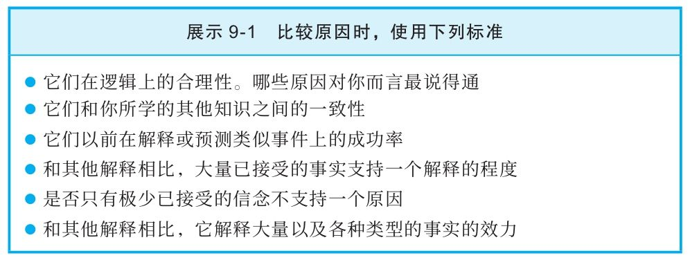

## 替代原因与你的表达和交流

  因果论证对于写作者而言是最难写的论证之一，你必须要筛查大把可能存在的原因，其中一些货真价实，而另一些则可能以假乱真。然后你必须要展示一种实实在在的因果关系的存在。这个问题在美国公共广播公司（PBS）的《芝麻街》（Sesame Street）的一个经典桥段中得到了展现，在这个桥段里木偶伯特发现阿尼把一根香蕉举到耳朵边。伯特问他为什么有这样奇怪的举动，阿尼回答说：“听着，伯特，我是用这根香蕉来驱赶短吻鳄的。”有点生气的伯特指出芝麻街上压根就没有短吻鳄，阿尼骄傲地回答说：“对啊，这根香蕉无意间起了大作用，是不是，伯特？”阿尼错误地推断两个同时发生的事件相互之间有关系。

  在你证明了某种关系确实存在之后，接下来你必须要说明这种关系会朝着你提出的那个方向发展。也就是说，甲导致了乙，而不是乙导致了甲，或者丙导致了甲和乙。也不能是另外的什么情况，例如在J.K.罗琳的《哈利·波特》系列著作中，作者再现了那个有关因果先后方向的经典的鸡和蛋之谜：“凤凰和火焰，哪个先有？”卢娜·洛夫古德——小说主角们的一个古怪的朋友，正确地回答道：“一个圆圈根本就没有起点。”

  最后，你也许想说明你关注的因果关系在解释这个现象时比其他的替代解释效力更强。这整个过程可能很难一下子实现，我们建议你将其拆成一个个小步骤。第一步就需要用到一些创造性思维。

### ◎发掘潜在的原因

  开始关于因果关系的写作时，你要做的和写其他的论证时一样。先选定一个自己感兴趣的论题。在这种情况下，你寻找的论题主要探索的是因果关系。这样的论题可能明确提到“原因”这样的词语，例如“美国AMC有线电视台播放的《行尸走肉》（The Walking Dead）的观众人数打破了有线电视台的收看记录，这是什么原因造成的”或者“是什么原因造成疾病对治疗有了一定的抵抗力”。同样，这个论题也可以明确使用“后果”这个词语：“勒布朗·詹姆斯决定离开这座城市前往迈阿密热火队效力，这可能为克利夫兰的经济带来怎样的后果？”

  在选定了一个论题后，下一步就是竭力思考这个问题可能的答案。这个过程可以充满创造力。处理这个任务的一种最佳方法就是像一个五岁的淘气小孩一样一直问个不停，不断追问为什么。我们回到《行尸走肉》这部电视剧的例子来做一下说明。“为什么《行尸走肉》能打破有线电视台的收视纪录？”“也许是因为18～49岁的人喜欢看僵尸题材。”让我们采取五岁儿童的态度一路追问：“他们为什么喜欢僵尸题材？”你会怎么回答这个问题？

  我们心中的“小屁孩”接下来可能还会问什么问题？“还有什么原因呢？”因为《行尸走肉》填补了任何一家其他电视台都不曾填补过的空白。“还有什么原因呢？”因为表演、剧本和导演都完美无缺。“还有什么原因呢？”

  你现在该明白了。朋友、同学以及生活中的其他人在你开动脑筋的时候都可以帮助你。他们可能想出你从来就没有想到过的原因。

  学会的教训

  1）很多类型的事件都可以由各种替代原因来解释。

  2）专家可能检查同一个证据并发现不同的原因来对它加以解释。

  3）大部分立论者都只提供那些他们偏好的原因，具备批判性思维的读者或听众必须自己找出替代原因。

  4）想出替代原因是个创造性的过程，通常情况下，这类原因不会一目了然。

  5）最后，一个因果断言的确定性和言之成理的替代原因的数量成反比。因此，找到多个替代原因，可以让批判性思维者获得适当的理智上的谦逊。

  ◌思维体操◌

  下面每个例子都提供了支持一个因果断言的论证。请尽量为这些断言想出替代性的原因。然后看一看通过了解这些替代原因，你在多大程度上削弱了作者原来的断言的分量。

  第一篇

  父母没有大学学历的孩子更容易贫穷吗？为了找到答案，研究人员最近对552名接受政府援助的人进行了抽样调查，看看有多少人会说他们的父母中一方或双双没有大学学历。取样是在自愿原则下进行的，样本范围包括俄亥俄州、肯塔基州和西弗吉尼亚州接受政府援助的人员。调查显示，85%的受访者的父母中至少有一方没有大学学历。研究人员还随机调查了这三个州中552个没有接受政府援助的人。在这一样本中，只有40%的人声称他们父母中至少有一方没有大学学历。

  第二篇

  为什么这位公司高管要从自己的企业里偷钱呢？细细查看一下他的生活就可以找到清晰而令人信服的答案。这个高管来自一个非常成功的家庭，父母都是医生，兄弟姐妹都是律师。作为公司高管，他挣的钱不如家人多。同时，他坚信美国梦和以下思想：一个人只要努力工作，最终总会成功。但是，尽管工作十分卖力，但他最近还是经历了许多生意上的挫败，包括在股市里赔掉相当一大笔钱。更糟糕的是，他的孩子需要做手术。为了不让家人失望，做个成功人士，为家庭提供稳定的收入，这位高管不得不从自己的公司里偷钱。

  第三篇

  大学校园里日益增加的细菌数量导致大学生的发病率不断攀升。大学生不太可能在校园的生活区和公共区域里进行消毒，这导致大量的细菌依附在物体表面，飘散到空中，导致更多的学生生病。

  ◌给个提示◌

  第一篇

  结论：父母没有大学学历的孩子比父母有大学学历的孩子更容易贫穷。

  理由：接受政府援助的人比没有接受政府援助的人更多报告说，他们父母中至少有一方没有大学学历。

  请注意，这里呈现的结果只来自一项研究，并未提及这些结果具有多大的典型意义。我们也不知道这些信息是在哪里发表的，因此我们无法评估该研究在正式发表之前是否经过了严格的审稿程序。

  不过，我们可以问一些关于此项研究的问题，这些问题对我们很有帮助。样本量相当大，但其范围广度令人质疑。虽然对多个州进行了抽样调查，但这些州接受政府援助的人能在多大程度上代表全美国贫困人口？例如，不同的州对一个人在寻求政府援助之前必须满足的条件有不同要求。此外，依靠政府援助的贫困人口与没有寻求援助的贫困人口相比较，情况如何？

  也许抽样中最重要的问题在于缺乏随机样本。虽然没有享受政府援助的人是在三个州中随机选择的，但接受政府援助的人是在自愿的基础上选择的。自愿参加调查的人和没有自愿参加的人是否有很大区别？例如，有可能男性参加调查的可能性比女性高80%。这就使得样本将不成比例地偏向男性，使样本无法准确地代表广大贫困人口。研究人员必须向我们提供更多关于样本的信息，以让我们确信调查取样是没有偏差的。

  测量评定准确性如何？首先，除了接受政府援助这一信息，调查没有给出穷人的定义。但是人们接受政府援助的原因有很多。例如，医疗保险可以被视为政府援助，在美国，只要年满65岁并有资格享受社会保障，就有资格享受医疗保险。因此，我们不仅不确定抽样调查的人群是否接受了公平取样，也不确定参与者是否真的贫困。

  同样值得质疑的是，所谓的不贫困人群对照组的选取依据是自我评估。我们知道不贫困是受到社会赞许的，人们知道后往往会给出受社会赞许的答案。此外，如前所述，有人可能很穷，但他们不寻求帮助。如果一些对照组参与者其实很贫穷，但他们没有报告自己的贫困状况，那么这种情况可能会使对照组进一步失之偏颇。在我们对结论抱有信心之前，我们要对这些评定的准确性知道更多。

  第二篇

  结论：高管从自己的公司偷钱是为了和自己家人竞争，显示他不是失败者，同时也为了养家糊口。

  理由：高管很可能关心上面提到的所有因素。

  有可能上面所有的因素都是这位高管从自己公司偷钱的重要原因。但是社会上还有很多其他人士肩上也背负同样的压力，他们却没有诉诸非法手段来获得钱财。有没有其他可能的原因导致这位高管的这种行为？就像我们在恐怖行为的案例中看到的一样，可能存在多种言之成理的解释。例如，我们想要多了解他的童年，了解他生活中最近发生的事。

  ·这位高管最近有没有和老板吵架？

  ·他有没有服药？

  ·他最近有没有承受高强度压力的经历？

  ·他有没有偷窃的历史？

  通过事后观察，我们常常可以发现儿童时期的经历能部分解释成人的行为。但在我们做出因果结论之前，必须要寻找更多证据来证明是一系列事件引起了另一系列事的发生，仅仅一系列事件先于另一系列事件发生这样一个简单的事实是不够的。我们还必须要小心不被基本归因错误误导，确保自己在考虑内部因素的同时，也考虑外部因素。
