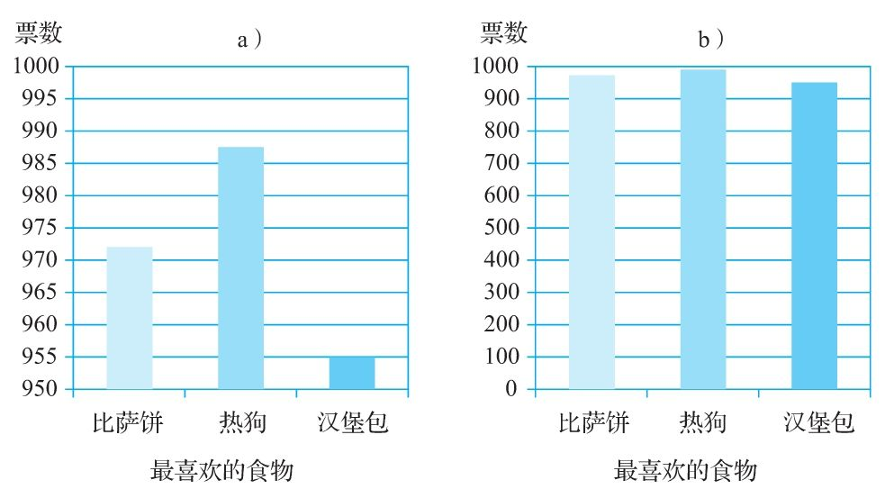

# 第10章　数据有没有欺骗性

  学习目标

  1）认识到有偏差的和不知来历的统计数据的危险。

  2）加强对各种形式的平均值的重要性的理解。

  3）了解测量误差的危险。

  4）认识到一个使用统计数据的人得出的结论可能会与统计数据本身显示的情况大相径庭。

  下面这篇简报能在多大程度上说服你？

  新闻简报：经济获得了长足发展。仅上个月我们的失业率就下降了一个百分点。

  你不该被上面的论证打动。这个论证很可能用数据欺骗了我们！

  写作者给出的证据当中最为常见的一种就是“统计数据”。你可能经常听到人们使用下面这句话来支撑他们的论证：“我有统计数据来证明。”我们使用统计数据（通常以不合适的方式）来揭示战争伤亡人数的增加或减少，提醒公众注意发病率的变化，测量一种新产品的销量，判断某只股票的前景，确定下一张牌是A的概率，衡量不同大学的毕业率，记录不同年龄段的人性生活的频率，并为很多其他问题提供信息。

  统计数据就是用数字表达出来的证据。这样的证据可能看起来非常有说服力，因为数字让证据显得非常有科学性，非常精确，似乎它就代表了“事实”。但是，统计数据可能（而且经常会）撒谎！它们并不一定能证明它们想要证明的观点。

换一种呈现数据的方式可能会产生欺骗性

注意：统计数据可能（而且经常会）撒谎。它们并不一定能证明表面上证明的观点。

  作为一个批判性思维者，你应该努力辨别错误的统计数据式的论证。我们无法在短短几页中向你全面展示人们“用统计数据撒谎”的所有不同方法。不过，本章将为你提供一些基本策略，你可以用这些策略来发现其中骗人的小伎俩。同时，本章还通过展示写作者错误使用统计数字来当证据的最常见的方法，以提醒你注意数据论证中存在的缺陷。

批判性问题：数据有没有欺骗性？
