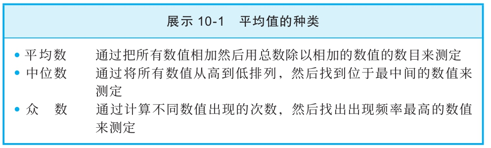

## 令人困惑的平均值

  请检查下面的陈述：

  1）一个快速致富的方法就是做一名职业橄榄球员，2015年美国国家橄榄球联盟球星的平均收入是220万美元。

  2）为在大学里取得好成绩，学生需要付出的努力越来越少了。根据最近一项调查，大学生每周平均花在学习上的时间是12.8小时，和20年前大学生的学习时长相比，前者大概只有后者的一半。

  两个例子当中都使用了“平均”这个词，但是实际上有三种不同的方法来测定平均值，而且在大多数情况下，每种方法都会给出不同的数值（见展示10-1）。

  第一种方法是把所有数值相加，然后用总数除以相加的数值的数目。这种方法所得的结果就是平均数（mean）。第二种方法是将所有数值从高到低排列，然后找到位于最中间的数值，这个中间数值就是中位数（median）。一半的数值在中位数之上，另一半在中位数之下。第三种方法是将所有数值排列好，计算每个不同数值出现的次数或每个不同数值范围出现的次数，出现频率最高的数值就叫作众数（mode），这是第三种平均值。

  一个写作者所用的术语“平均值”谈论的是平均数、中位数还是众数？这会产生很大的区别。

  在第一个例子中，哪一种平均值最能说明问题？请考虑一下职业化运动当中大牌球星的收入与一般球员收入的对比。最大牌的球星，比如说橄榄球明星四分卫，收入比球队里大部分其他球员要高出很多。事实上，2015年薪酬最高的橄榄球运动员年收入超过3500万美元——远远高于平均值。这样高的收入将会急剧拉高平均数，但是对于中位数或众数而言影响不大。举例来说，美国国家橄榄球联盟的球员2015年工资平均数是220万美元，但是其工资中位数却只有83万美元。因此，对于大部分职业运动，运动员工资平均数要比中位数或者众数高出很多。所以，如果有人想让工资水平显得非常非常高，他就会选择平均数作为平均值。

  现在让我们来仔细看看第二个例子。如果这里列举的平均值是中位数或众数，我们就有可能低估了平均学习时间。有些学生很可能花了极多的时间学习，比如一周30或40个小时，这会提高平均数的数值，但是不影响中位数或者众数的数值。学习时间的众数数值可能远低于或远高于中位数，主要取决于多长的学习时间对学生而言最为常见。

  当你见到平均值的时候，一定要记得问一下：“这是平均数、中位数还是众数？平均值的含义不同会不会产生什么影响？”在回答这些问题时，请想一想平均值的不同含义会给信息的意义带来怎样的变化。

  不仅判断一个平均值是平均数、中位数还是众数非常重要，判定最小数值和最大数值之间的差距（即全距（range））以及每个数值出现的频率（即数值分布），常常也很重要。

  下面我们来看一个例子，在这个例子里知道数值的全距和数值分布就非常重要。

  医生对20岁的病人说：你所患癌症的预后不容乐观。患同样癌症的病人存活时间的中位数是10个月。所以剩下来的这几个月你想做什么就做点什么吧，不必有什么顾虑了。

  病人听到医生给出这样的诊断结果，对自己的未来该做出怎样可怕的预期呢？首先，我们确定知道的是获得这种诊断的病人有一半不到10个月就去世了，还有一半人存活时间超过了10个月。但是我们并不知道活下来的那部分人的存活时间的全距和数值分布。也许这些信息会显示，有些人甚至很多人存活的时间远远超过了10个月。其中有些人甚至很多人可能活到了80岁以上呢！知道病人存活情况的完整分布可能会改变这个癌症患者对未来的看法。

  一般来说，病人应该考虑不同的医院对于他的疾病的存活率记录是不是有不同的全距和数值分布。这样，他应该考虑选择在有最乐观的数值分布情况的医院就诊。

  当你遇到平均值的时候记住全距和数值分布的一个总体好处，就是提醒你大多数人或事并不符合确切的平均值，与平均值差异极大的结果也在预料之中。
