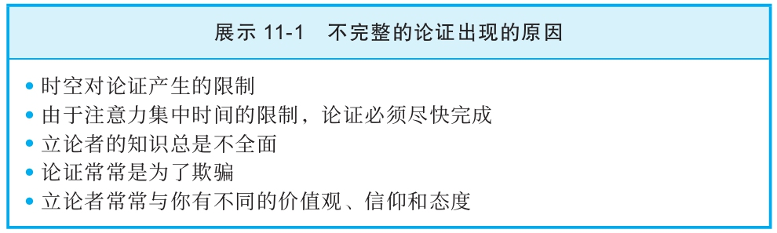

## 不完整的论证在所难免

  不完整的论证在所难免，主要有以下几点原因。第一，时空的限制。论证不完整是因为立论者没有足够的时间去组织这些论证，他们也没有不受限制的空间或时间来呈现他们的理由。

  第二，我们大部分人注意力持续的时间都很有限，并且如果信息长得没完没了，我们就会感到厌倦。因此，立论者常觉得有必要将他们的信息尽快传达给受众。广告和社论都反映了这两个因素。例如，社论的字数都有一定的限制，论证必须既引人入胜又切中要害。为此，社论作者不得不点到为止，让人心痒难搔。电视评论员更是出名地会将极其复杂的问题弄得听上去十分简单。他们的时间有限，无法提供足够精准的信息，而你需要精准信息才能形成一个合理的结论。

  第三，进行论证的人掌握的知识总是不完全的。还有第四个省略某些信息的原因：作者就想欺骗你。广告商知道他们省略了关键的信息。如果他们描述了产品中含有的所有化学成分或廉价的组成部分，那么你可能就不会购买他们的产品了。

  为什么省略信息变得这样肆无忌惮？最后一个原因是那些试图给你提建议或想要说服你的人的价值观、信仰和态度常常和你的并不相同。因此，可以预料，他们的论证会受到不同的假设引导，这些假设和你对同样的问题可能提出的假设可能完全不同。批判性思维者看重好奇心和合理性，而那些力图说服你的人常常想要打消你的好奇心，鼓励你依靠不理智的情绪反应来做出选择（不完整论证出现原因的总结见展示11-1）。

  一个特定的视角就像一副马戴的眼罩。眼罩让马心无旁骛，全神贯注于正前方的道路。但是，一个人看问题的视角也像马所戴的眼罩那样，阻止了他去关注某些特定的信息，而这些被他忽略的信息对那些从不同参照系进行论证的人而言可能至关重要。演员马特·达蒙所扮演的角色在电影《谍影重重3》里表达了对这个问题的理解：“一个东西到底是什么样，主要取决于你坐在什么地方观察，这真有意思。”

