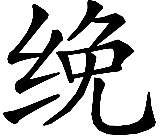

孝养第二十五
【题解】

汉代以孝为治，本篇围绕如何孝养父母问题展开辩论。辩论的焦点是，赡养父母，究竟是将礼节放在首位，还是将物质条件放在首要位置。丞相史认为，孝养父母，不能空谈礼节，而必须提供高大的房屋，安适的车马，轻暖的衣服，甜脆的食物，“与其礼有余而养不足，宁养有余而礼不足”。文学则主张礼节比物质条件更为重要，对父母要做到和颜悦色，承顺父母意志，完全按照礼节要求行事。

文学曰：“善养者不必刍豢也[(1)]，善供服者不必锦绣也。以己之所有尽事其亲，孝之至也。故匹夫勤劳，犹足以顺礼，歠菽饮水[(2)]，足以致其敬。孔子曰：‘今之孝者，是为能养，不敬，何以别乎？’[(3)]故上孝养志[(4)]，其次养色[(5)]，其次养体[(6)]。贵其礼[(7)]，不贪其养[(8)]，礼顺心和，养虽不备，可也。《易》曰：‘东邻杀牛，不如西邻之禴祭也。’[(9)]故富贵而无礼，不如贫贱之孝悌。闺门之内尽孝焉[(10)]，闺门之外尽悌焉[(11)]，朋友之道尽信焉，三者，孝之至也。居家理者，非谓积财也，事亲孝者，非谓鲜肴也，亦和颜色、承意尽礼义而已矣[(12)]。”

【注释】

[(1)]刍豢（chú huàn）：本指牛羊犬豕之类的家畜，此处指肉食。

[(2)]歠（chuò）菽饮水：食用粗茶淡饭。歠，同“啜”。菽，豆类食品。

[(3)]今之孝者，是为能养，不敬，何以别乎：见于《论语·为政》。孔子认为，仅能养活父母，还算不上孝。孝与不孝的区别，在于对父母有没有尊敬之心。

[(4)]上孝养志：《论语·学而》载孔子曰：“父在观其志，父没观其行。三年无改于父之道，可谓孝矣。”养志，不违背父母意志。

[(5)]其次养色：《论语·为政》载：“子夏问孝。子曰：‘色难。有事，弟子服其劳；有酒食，先生馔，曾是以为孝乎？’”养色，对父母和颜悦色。

[(6)]其次养体：奉养父母的身体，指供奉饮食之类。

[(7)]贵其礼：“其”字原无，据王利器说校补。

[(8)]不贪其养：不贪图供养父母的东西有多少。

[(9)]东邻杀牛，不如西邻之禴（yuè）祭也：见于《周易·既济》。禴祭，春祭和夏祭。东邻杀牛，为隆重祭礼，西邻禴祭为薄祭。祭祀关键是看心诚，不在祭礼是否隆重，所以东邻隆重祭祀反而不如西邻薄祭。

[(10)]闺门：家门。

[(11)]悌：尊敬兄长。

[(12)]承意：顺承父母心意。尽礼义：指尽守孝子对父母的礼义。

【译文】

文学说：“善于奉养父母的人不一定要每餐肉食，善于提供父母衣服的人不一定每件都是锦绣。将自己所拥有的东西全部拿出来事奉父母双亲，这是孝的顶点。因此平民虽然勤劳，但还足可以遵守礼义，粗茶淡饭，足可以表达孝敬。孔子说：‘现在的孝子，说是能够养活父母，如果不敬，那么拿什么去区别养父母与养犬马呢？’因此上等的孝是不违背父母意志，其次的孝是对父母和颜悦色，再其次是供养父母的身体。重视对父母的礼义，不贪图供养父母的东西有多少，遵守礼义，心平气和，供养物资即使不能完全具备，也是可以的。《周易·既济卦》说：‘东边邻居杀牛重祭，还不如西边邻居夏天薄祭。’因此如果大富大贵而缺乏礼义，还不如贫贱人家的孝悌。在闺门之内尽孝道，在闺门之外尽悌义，对朋友之道尽信用，做到这三点，就是孝的顶点了。治家有条理，并不看他积累了多少财富；事奉双亲尽孝，并不是看他给父母提供了多少美衣嘉肴，也不过是对父母和颜悦色、承顺父母意志、尽守孝子对父母的礼义而已。”

丞相史曰：“八十曰耋[(1)]，七十曰耄[(2)]。耄，食非肉不饱，衣非帛不暖[(3)]。故孝子曰甘毳以养口[(4)]，轻暖以养体。曾子养曾皙[(5)]，必有酒肉。无端

[(6)]，虽公西赤不能以为容[(7)]。无肴膳[(8)]，虽闵、曾不能以卒养[(9)]。礼无虚加，故必有其实然后为之文[(10)]。与其礼有余而养不足，宁养有余而礼不足[(11)]。夫洗爵以盛水[(12)]，升降而进粝[(13)]，礼虽备[(14)]，然非其贵者也。”

【注释】

[(1)]耋（dié）：七八十岁老人。古代有七十曰耋、八十曰耋或九十曰耋的不同说法。

[(2)]耄（mào）：高龄，《礼记·曲礼上》：“八十九十曰耄。”此处以七十为耄，与《礼记》说法不同。

[(3)]食非肉不饱，衣非帛不暖：《孟子·尽心下》：“五十非帛不煖，七十非肉不饱。”

[(4)]曰：通“爰”，于是。一说，“曰”当为“日”。毳（cuì）：通“脆”。

[(5)]曾子：孔门弟子曾参，曾皙之子，以孝道著称。曾皙：孔门弟子，《论语·先进》载有他的言行。《孟子·离娄上》：“曾子养曾晳，必有酒肉。”

[(6)]端：玄端，黑色礼服。

（wǎn）：通“冕”，礼帽。

[(7)]虽公西赤不能以为容：“以”下原有“养”字，据张敦仁说校删。公西赤，春秋鲁国人，孔门弟子，姓公西，名赤，字子华，故又称公西华。容，礼容。

[(8)]肴膳：饭食。

[(9)]闵：闵子骞，孔门弟子，以孝著称，曾受孔子称赞。曾：曾参。卒养：原作“养卒”，据张敦仁说校改。

[(10)]故必有其实然后为之文：“文”字原作“父子”，据黄侃说校改。实，指肴膳、端

之类的实物。文，礼仪形式。

[(11)]与其礼有余而养不足，宁养有余而礼不足：《礼记·檀弓上》：“子路曰：‘吾闻诸夫子：丧礼：与其哀不足而礼有余也，不若礼不足而哀有余也；祭礼：与其敬不足而礼有余也，不若礼不足而敬有余也。’”

[(12)]洗爵以盛水：恭敬地洗好酒杯，但面却装的是水。爵，酒杯。

[(13)]升降而进粝：请父母升堂高坐，但进献的却是粗饭。

[(14)]备：完备。

【译文】

丞相史说：“八十岁老人叫做耋，七十岁老人叫做耄。叫做耄的老人，吃饭没有肉就吃不饱，穿衣没有丝帛就穿不暖。因此孝子用甜脆的食物来养父母之口，用轻暖的衣服来保养父母的身体。曾参奉养父亲曾皙，吃饭时一定有酒肉。如果没有礼服和礼帽，即使是公西赤也不能完成礼容。没有美味佳肴，即使是闵子骞、曾参也不能完成赡养父母的任务。礼不是没有内容的空架子，因而必须先有情实，然后才能以相应的礼文去修饰。对父母与其礼仪有余而奉养不足，宁可奉养有余而礼仪不足。恭敬地洗好酒杯，却用酒杯装水给父母喝，让父母升堂高坐，进献的却是粗饭，礼仪虽然完备，然而并不值得提倡。”

文学曰：“周襄王之母非无酒肉也[(1)]，衣食非不如曾皙也，然而被不孝之名，以其不能事其父母也。君子重其礼，小人贪其养。夫嗟来而招之，投而与之，乞者由不取也[(2)]。君子苟无其礼[(3)]，虽美不食焉。故礼：主人不亲馈，则客不祭[(4)]。是馈轻而礼重也。”

【注释】

[(1)]周襄王之母非无酒肉：周襄王名叫姬郑。姬郑亲母早死，继母惠后生叔带。周惠王死后，姬郑即位，是为襄王。其弟叔带勾结戎、翟赶走周襄王。后来晋文公杀了叔带，周襄王才重新夺回王位。

[(2)]夫嗟来而招之，投而与之，乞者由不取也：《礼记·檀弓下》载：“齐大饥。黔敖为食于路，以待饿者而食之。良久，有饿者，蒙袂辑屦，贸贸然来。黔敖左奉食，右执饮，曰：‘嗟！来食！’扬其目而视之，曰：‘予唯不食嗟来之食，以至于斯也！’从而谢焉，终不食而死。”陈遵默说，“来”字为衍文，当删。由，通“犹”。

[(3)]苟：如果。

[(4)]主人不亲馈，则客不祭：《礼记·坊记》：“故食礼，主人亲馈，则客祭；主人不亲馈，则客不祭。故君子苟无礼，虽美不食焉。”

【译文】

文学说：“周襄王的母亲并非没有酒肉，衣食并非不如曾皙，然而周襄王蒙受不孝的名声，这是因为周襄王不能按照礼仪事奉父母。君子重视礼仪，小人贪得供养。用‘嗟，来’的口吻招呼，扔给他食物，即使是要饭的人也不愿接受。对君子来说，如果无礼，即使是美味，也不愿食用。因此按照礼仪，主人不亲馈赠食物，那么客人在食前就不必祭祀。这是因为，馈赠食物是小事，礼仪是重要的大事。”

丞相史曰：“孝莫大以天下一国养[(1)]，次禄养[(2)]，下以力。故王公人君，上也，卿大夫，次也。夫以家人言之[(3)]，有贤子当路于世者[(4)]，高堂邃宇[(5)]，安车大马，衣轻暖，食甘毳。无者[(6)]，褐衣皮冠[(7)]，穷居陋巷，有旦无暮[(8)]，食蔬粝荤茹[(9)]，膢腊而后见肉[(10)]。老亲之腹非唐园[(11)]，唯菜是盛。夫蔬粝，乞者所不取，而子以养亲，虽欲以礼，非其贵也。”

【注释】

[(1)]以天下一国养：天子以天下养其父母，诸侯以一国养其父母。《孟子·万章上》：“孝子之至，莫大乎尊亲；尊亲之至，莫大乎以天下养。”

[(2)]禄养：卿大夫以做官俸禄奉养父母。

[(3)]家人：没有官职的居家之人。

[(4)]有贤子当路于世者：“子”下原有“者”字，据卢文弨、俞樾说校删。当路，当权。

[(5)]邃（suì）宇：深邃屋宇。

[(6)]无者：“无”下原有“厌”字，据俞樾、张敦仁说校删。

[(7)]褐衣：粗布短衣。

[(8)]有旦无暮：吃了早饭无晚饭。

[(9)]食蔬粝荤茹：“粝”下原有“者”字，据卢文弨、张敦仁说校删。荤，指葱、韭等蔬菜。茹，吃。

[(10)]膢腊而后见肉：“肉”下原有“害”字，据黄侃、陈遵默说校删。膢，楚国在十二月祭饮食之神，称为膢。腊，十月祭祀百神，称为腊祭。

[(11)]唐园：蔬菜园。唐，通“场”。

【译文】

丞相史说：“孝，没有比天子以天下养亲、诸侯以一国养亲更大的了，其次是卿大夫以做官的俸禄养亲，最下是平民靠气力养亲。因此，王公君主，是上等的养亲，卿大夫是次等的养亲。从平民百姓来说，如果有贤能的儿子当高官，高大的厅堂，深邃的屋宇，安适的轩车，高大的骏马，穿着轻暖的衣服，吃着甜脆的饭食。如果儿子没有贤能，那就只能穿着粗布短衣，戴着皮帽子，住在简陋的巷子里，吃了早饭无晚饭，吃的是粗粮葱韭蔬菜，到了膢腊祭祀的日子才能见到肉食。父母双亲的胃不是蔬菜园，只装一些蔬菜。蔬菜粗粮，连乞丐都不愿吃，而儿子却以蔬菜粗粮供养双亲，即使是以礼事奉，但并不可贵。”

文学曰：“无其能而窃其位，无其功而有其禄，虽有富贵，由跖、蹻之养也[(1)]。高台极望[(2)]，食案方丈[(3)]，而不可谓孝。老亲之腹非盗囊也[(4)]，何故常盛不道之物[(5)]？夫取非有非职[(6)]，财入而患从之[(7)]，身且死祸殃，安得膢腊而食肉？曾参、闵子无卿相之养，而有孝子之名；周襄王富有天下，而有不能事父母之累。故礼菲而养丰[(8)]，非孝也。掠囷而以养[(9)]，非孝也。”

【注释】

[(1)]由：通“犹”。跖、蹻：指代强盗。

[(2)]极望：极目远望。

[(3)]食案：短腿饭桌。方丈：一丈见方。《孟子·尽心下》：“食前方丈，侍者数百人。”

[(4)]盗囊：强盗口袋。

[(5)]不道之物：不合道义的财物，犹言“不义之财”。

[(6)]非有：非自己所有。非职：非职分所得。

[(7)]财入：财物进门。患从之：祸患随之而来。

[(8)]菲：菲薄。养丰：供养丰厚。

[(9)]掠囷：抢劫别人粮仓。

【译文】

文学说：“没有实际才能而窃取官位，没有实际功劳而享受俸禄，即使有富贵给父母，那也如同跖、蹻的供养一样。让父母站在高台上极目远望，吃饭的饭桌一丈见方，这不能叫做孝。老父老母的胃不是强盗的口袋，为什么经常装不义之财？所取所得，既不是自己所有，也不是职分所得，财物刚进门，祸患随后就来，其身将遭到死亡祸殃，哪里有膢腊节日而吃肉？曾参、闵子骞对父母虽然没有卿相之养，但有孝子的名声；周襄王虽然富有天下，但却有不能事奉父母恶名的牵累。因此，礼仪菲薄而供养丰厚，这不是孝。抢劫别人粮食来供养父母，这更不是孝。”

丞相史曰[(1)]：“上孝养色，其次安亲[(2)]，其次全身[(3)]。往者，陈余背汉[(4)]，斩于泜水[(5)]；五被邪逆[(6)]，而夷三族[(7)]。近世，主父偃行不轨而诛灭[(8)]，吕步舒弄口而见戮[(9)]，行身不谨，诛及无罪之亲。由此观之：虚礼无益于己也。文实配行[(10)]，礼养俱施，然后可以言孝。孝在实质，不在于饰貌；全身在于谨慎，不在于驰语也[(11)]。”

【注释】

[(1)]丞相史曰：“丞相”之下原无“史”字，据张敦仁说校补。

[(2)]安亲：使父母生活安定。

[(3)]全身：保全完整身体，指不因受刑而导致身体残缺。

[(4)]陈余：秦朝大梁人，因犯罪为秦始皇所通缉，陈胜起义后，他与张耳受命辅佐武臣进攻河北，推武臣为赵王。后与张耳反目，而张耳已经归汉，陈余因此与刘邦多有不合，最终在泜水被韩信所杀。生平事迹见《史记·张耳陈余列传》。

[(5)]泜水：即今泜河，在河北南部。泜，原作“冱”，据王利器说校改。

[(6)]五被：即伍被。伍被为淮南王刘安的中郎，因参加刘安叛乱而被杀。生平事迹见《汉书·伍被传》。五，同“伍”。邪逆：指参与刘安反叛。

[(7)]三族：父族、母族、妻族。

[(8)]主父偃：山东临淄人，因建议汉家实施推恩令、尊卫子夫为皇后及告发燕王不法行为而受到汉武帝信任，被任命为中大夫。后赵王揭发他收受诸侯贿赂，公孙弘力主将他杀死。不轨，指主父偃受贿。

[(9)]吕步舒：河北枣强人，从董仲舒受春秋公羊学。曾持斧钺治淮南王谋反一案。弄口，搬弄是非。吕步舒弄口之事，可能是指险误董仲舒。董仲舒居家写《灾异之记》，主父偃盗其书上交汉武帝，汉武帝让学者讨论，吕步舒不知是其师董仲舒之作，批评此书“大愚”。董仲舒被判死罪，后被汉武帝赦免。吕步舒见戮事未闻。

[(10)]文：礼仪。实：奉养父母的实物。配行：配合而行。

[(11)]驰语：说空话。

【译文】

丞相史说：“上等的孝是对父母和颜悦色，其次是让父母过安定生活，再其次是保全身体。从前，陈余背叛汉王刘邦，被韩信斩于泜水；伍被参与淮南王刘安反叛，被夷灭三族。不久以前，主父偃行为不轨而被诛灭，吕步舒搬弄是非而被处死，他们都是行身不严谨，连无罪的亲人也被牵连而遭杀害。由此看来，空虚的礼仪对自己无益。礼文与实物相配而行，礼节与奉养并行，然后才可以讨论孝道。孝在于实质，不在于修饰外在的礼貌；保全身体在于谨慎，不在于说空话。”

文学曰：“言而不诚，期而不信[(1)]，临难不勇，事君不忠，不孝之大者也。孟子曰：‘今之世，今之大夫，皆罪人也。皆逢其意以顺其恶。’[(2)]今子不忠不信，巧言以乱政，导谀以求合[(3)]。若此者，不容于世。《春秋》曰：‘士守一不移，循理不外援，共其职而已。’[(4)]故卑位而言高者，罪也，言不及而言者[(5)]，傲也。有诏公卿与斯议[(6)]，而空战口也[(7)]？”

【注释】

[(1)]期：约会。

[(2)]今之世，今之大夫，皆罪人也。皆逢其意以顺其恶：见于《孟子·告子下》。逢，原作“达”，据杨沂孙、王利器说校改。逢，逢迎。顺，顺从。

[(3)]导谀：用阿谀奉承将君主引向邪路。

[(4)]士守一不移，循理不外援，共其职而已：不见于今本《春秋》，可能是汉代解释《春秋》的传记。守一，坚守一条正道。循理，遵循正确道理。不外援，不外求其他利益。共，同“供”。

[(5)]言不及而言：轮不到自己说话却要说。《论语·季氏》：“言未及之而言谓之躁。”《经典释文》：“躁，鲁读为‘傲’。”

[(6)]与斯议：参与这次议论。

[(7)]空战口：空打嘴仗。

【译文】

文学说：“说话不真诚，有约不讲信用，面临危难不勇敢，事奉君主不忠贞，这些行为都是大的不孝。孟子说：‘当今之世，现在的各国大夫，都是罪人。他们都逢迎君主意志，顺从君主的罪恶。’如今你不忠诚不信用，花言巧语，扰乱朝政，用阿谀奉承将君主引向邪路，以此苟合取容。像这种表现，不能见容于当世。《春秋》说：‘士应该坚守一条正道，贫贱不移，遵循正确道理，不外求其他利益，供奉官职而已。’因此处于卑贱之位，而高谈阔论，这是罪过，轮不到自己说话却要说，这是骄傲。皇帝有诏公卿参与这次议论，你们为何要参与空打嘴仗呢？”
