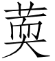
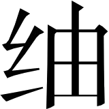
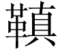
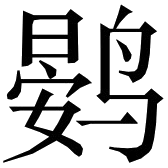
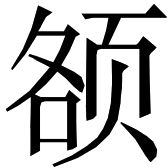
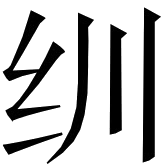
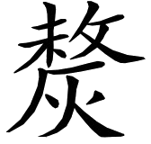
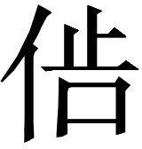

散不足第二十九
【题解】

本篇是全书中篇幅最大、难度最大、内容最丰富的篇章。文章由丞相“愿闻散不足”引发，贤良从衣食住行丧祭各个层面铺陈古今社会风尚的变化，以古代的节俭与当今社会的奢侈相对照，说明当今社会财富分散、用度不足完全是由弥漫全社会的豪奢风气造成的。文章展现了一幅幅古代社会生活的多彩画卷，对后人认识古代社会风尚特别是汉代生活风习很有帮助。贤良高举复古的旗帜，批判当时社会的豪奢之风，试图以此矫正社会弊病，用心良苦。全文三十二由“古者”领起的段落蝉联而下，每一段均以上古时代的简朴风尚与近现代的豪奢之风进行对比，按照“富者”、“中者”、“庶人”分层次，极为排奡纵恣。

大夫曰：“吾以贤良为少愈[(1)]，乃反其幽明[(2)]，若胡车相随而鸣[(3)]。诸生独不见季夏之螇乎[(4)]？音声入耳，秋至而声无。者生无易由言[(5)]，不顾其患，患至而后默，晚矣。”

【注释】

[(1)]少愈：稍微好一些。

[(2)]反其幽明：颠倒了黑暗和光明。

[(3)]胡车：匈奴的车子。相随而鸣：胡车因其粗糙简陋，前后的车都吱呀作响，比喻文学、贤良相互呼应。

[(4)]螇（xī）：即蟪蛄，一种春生夏死、夏生秋死的蝉。

[(5)]者：通“诸”。无易由言：不要轻易地由着性子乱说。《诗经·小雅·小弁》：“君子无易由言。”

【译文】

大夫说：“我原以为贤良会稍微好一些，谁知道他们颠倒了黑暗和光明，文学与贤良，就像两辆匈奴破车，一前一后吱吱呀呀作响。诸位儒生难道看不见夏末的蟪蛄么？夏天它鸣叫的声音声声入耳，秋天来了，声音就全没了。诸位儒生不要轻易地由着性子乱说，不顾后患，要是等到祸患来了而后沉默，那就晚了。”

贤良曰：“孔子读史记[(1)]，喟然而叹[(2)]，伤正德之废[(3)]，君臣之危也。夫贤人君子，以天下为任者也。任大者思远[(4)]，思远者忘近。诚心闵悼[(5)]，恻隐加尔[(6)]，故忠心独而无累[(7)]。此诗人所以伤而作[(8)]，比干、子胥遗身忘祸也[(9)]。其恶劳人[(10)]，若斯之急[(11)]，安能默乎？《诗》云：‘忧心如惔，不敢戏谈。’[(12)]孔子栖栖[(13)]，疾固也[(14)]。墨子遑遑[(15)]，闵世也[(16)]。”

大夫默然。

【注释】

[(1)]史记：在《史记》成为司马迁史书的专称之前，“史记”是史书的通称。

[(2)]喟（kuì）然：叹息貌。

[(3)]正德：正统道德。

[(4)]任大：责任重大。

[(5)]闵悼：伤悼。

[(6)]恻隐：同情。尔：通“耳”。

[(7)]独：孤独。累：牵挂。

[(8)]诗人：指《诗三百》各篇作者。

[(9)]比干：殷纣王叔父，因劝谏纣王而被剖心致死。子胥：吴国大夫伍子胥，因劝谏吴王夫差不要与北方齐晋争锋，而被夫差赐剑自杀，尸体被装进皮口袋而浮于江上。

[(10)]恶：丑恶事情。劳人：使人忧愁。

[(11)]斯：如此，指像比干、伍子胥一样。

[(12)]忧心如惔（tán），不敢戏谈：见于《诗经·小雅·节南山》。惔，火烧。戏谈，开玩笑。

[(13)]栖栖：忙碌不安的样子。

[(14)]疾固：痛恨社会弊病。

[(15)]墨子：墨家创始人墨翟，提出兼爱、非攻等主张，并为救世而奔走。遑遑：匆忙的样子。

[(16)]闵世：忧伤世道混乱。

【译文】

贤良说：“孔子读史书时，往往喟然长叹，他忧伤的是正统道德的废弃，君臣之道的危机。自古贤人君子，都是以天下为己任。责任重大的人思虑深远，思虑深远的人就会忘记近祸。他们以真诚之心伤悼现实，对天下寄予同情之心，因此忠心孤独而无牵挂。这就是《诗三百》作者感时伤世而创作诗篇，比干、伍子胥舍身忘祸的原因。丑恶现实让人忧愁，如同诗人、比干、伍子胥一样急迫，怎么能保持沉默呢？《诗经·小雅·节南山》说：‘忧愁之心似火烧，不敢戏谑开玩笑。’孔子忙忙碌碌，这是因为他痛恨社会弊病。墨子匆匆忙忙，这是因为他忧伤世道混乱。”

大夫沉默不言。

丞相曰：“愿闻散不足。”

贤良曰：“宫室舆马[(1)]，衣服器械，丧祭食饮，声色玩好[(2)]，人情之所不能已也[(3)]。故圣人为之制度以防之[(4)]。间者[(5)]，士大夫务于权利[(6)]，怠于礼义；故百姓仿效，颇逾制度[(7)]。今故陈之曰[(8)]。

【注释】

[(1)]舆：车。

[(2)]声色：音乐歌舞。玩好：包括狗马宠物以及各种游戏娱乐。

[(3)]已：止。

[(4)]防：防止僭越。

[(5)]间者：近来。

[(6)]务：追求。权利：权力财利。

[(7)]颇：相当。逾：僭越。

[(8)]陈：陈述。

【译文】

丞相说：“我想听一听关于财富分散、不够使用的问题。”

贤良说：“宫室、车马、衣服、器械、丧葬、祭祀、饮食、声色、玩好，这些都是人的性情所不能禁止的东西。因此圣人为此设立制度，以防止僭越。近来，士大夫追求权力财利，轻怠礼义；因而招致老百姓纷纷仿效，大大地僭越制度。现在特地将古代制度陈述如下。

“古者，谷物菜果，不时不食[(1)]，鸟兽鱼鳖，不中杀不食[(2)]。故徼罔不入于泽[(3)]，杂毛不取[(4)]。今富者逐驱歼罔罝[(5)]，掩捕麑

[(6)]，耽湎沈酒铺百川[(7)]。鲜羔

[(8)]，几胎肩[(9)]，皮黄口[(10)]。春鹅秋雏[(11)]，冬葵温韭[(12)]，浚茈蓼苏[(13)]，丰

耳菜[(14)]，毛果虫貉[(15)]。

【注释】

[(1)]不时：不到成熟季节。《礼记·王制》：“五谷不时，果实未熟，不粥于市。”

[(2)]不中杀：不到该杀的时候。《礼记·王制》：“禽兽鱼鳖不中杀，不粥于市。”

[(3)]徼：借为“缴（zhuó）”，射鸟时系在箭上便于收回的生丝绳。罔：同“网”。

[(4)]杂毛：各种毛色的幼小野兽。

[(5)]罔罝（jū）：猎捕鸟兽的罗网。

[(6)]掩捕：围猎。麑（ní）：幼鹿。

（kòu）：待母哺食的幼鸟。

[(7)]耽湎沈酒：沉溺于酗酒。酒，原作“犹”，据王利器说校改。铺百川：酒店像百条江河一样多。

[(8)]鲜羔

（zhào）：新鲜的羊羔肉。

[(9)]几：割。原作“鎡”。胎肩：小猪。肩，原作“扁”，据张敦仁说校改。

[(10)]皮：剥皮。黄口：雏鸟。

[(11)]春鹅：春天的小鹅。秋雏：秋天的小鸡。

[(12)]冬葵：冬天生长的一种蔬菜。温韭：温室种的韭菜。

[(13)]浚：一种香菜。茈（zǐ）：子姜。蓼（liǎo）：辛菜。苏：紫苏。以上四种均为调味品。

[(14)]

：原作“奕”。孙诒让说，“奕”当为“荋”，“丰荋”疑为“蕈荋（xùn ér）”，即木耳。耳菜：各种菌菜的总名。

[(15)]毛：毛虫。果：通“倮（luǒ）”，指身上没有羽毛和鳞甲的动物。貉：外貌像狐狸的哺乳动物。

【译文】

“古时候，谷物蔬菜水果，不到成熟的时节不吃，鸟兽鱼鳖，不到该杀的时候不吃。因此弓箭罗网不进山泽，各种毛色的幼小野兽不猎取。现在有钱人追杀网捕，围捕幼鹿和小鸟，他们沉溺于酗酒之中，酒店像百条江河一样多。吃新鲜的羊羔肉，割杀小猪仔，剥黄口小鸟的皮。春天吃小鹅，秋天吃小鸡，冬天吃葵菜和温室种的韭菜，加上香菜、子姜、辛菜和紫苏等调味品，此外还吃木耳香菇，连毛虫、倮虫、狐貉都吃。

“古者，采椽茅茨[(1)]，陶桴复穴[(2)]，足御寒暑、蔽风雨而已。及其后世，采椽不斫[(3)]，茅茨不翦[(4)]，无斫削之事，磨砻之功[(5)]。大夫达棱楹[(6)]，士颖首[(7)]，庶人斧成木构而已[(8)]。今富者井干增梁[(9)]，雕文槛楯[(10)]，垩

壁饰[(11)]。

【注释】

[(1)]采椽：用栎木做的承瓦木条。采，栎木。茅茨（cí）：用茅草盖的屋顶。

[(2)]陶：陶器。桴（fú）：屋梁。复穴：窟室。

[(3)]斫（zhuó）：砍。

[(4)]翦：剪去参差不齐的茅草。

[(5)]磨砻（lónɡ）：打磨光滑。

[(6)]达棱楹（yínɡ）：做成有棱角的柱子。达，达到。棱，棱角。楹，柱子。

[(7)]颖首：把椽子、大梁的头部砍细。

[(8)]斧成木构：用斧子砍伐木头盖成房屋。

[(9)]井干：天井，藻井。增梁：屋梁，屋顶。

[(10)]雕文槛楯（shǔn）：门槛、栏杆上雕刻花纹。槛楯，门槛、栏杆。楯，原作“修”，据张敦仁说校改。

[(11)]垩（è）：白土。

（nán）：原作“忧”，据卢文弨说校改，粉刷。

【译文】

“古时候，用栎树做椽子，用茅草盖屋顶，制陶瓦，挖地洞，这些足可以抵御寒暑，遮蔽风雨。到了后来，栎树椽子不砍，茅草屋不修翦，没有砍斫、劈削的事务，也没有木材打磨光滑的工夫。大夫家做成有棱角的柱子，士家将柱子头部砍细，庶人用斧子砍伐木头盖成房屋而已。如今富贵人家屋顶上有藻井，门槛和栏杆上雕刻花纹，用白灰粉刷墙壁。

“古者，衣服不中制[(1)]，器械不中用，不粥于市[(2)]。今民间雕琢不中之物[(3)]，刻画玩好无用之器[(4)]。玄黄杂青，五色绣衣，戏弄蒲人杂妇[(5)]，百兽马戏斗虎，唐锑追人[(6)]，奇虫胡妲[(7)]。

【注释】

[(1)]中：符合。

[(2)]粥（yù）：通“鬻”，卖。

[(3)]不中之物：不中用的物件。

[(4)]刻画玩好无用之器：“玩好”二字原在下句“玄黄”之上，据杨树达说校改。

[(5)]戏弄蒲人杂妇：模仿僰人妇女生活的戏剧。蒲，通“僰”，僰是西汉时居住在云南地区的少数民族。杂妇，村妇。

[(6)]唐锑（tī）追人：木偶、泥人爬高竿的游戏。

[(7)]奇虫：指鱼龙之类杂技。胡妲：花旦。

【译文】

“古时候，衣服不符合规定，器械不适合使用，不准拿到市上去卖。如今民间雕琢不中用的物品，刻画无用的好玩器具。一些艺人穿着黑色、黄色、杂青色以及五颜六色锦绣彩衣，演出模仿僰人妇女生活的戏剧，有的艺人玩弄各种野兽、马戏、斗虎，有的艺人玩木偶、泥人爬竿，或玩鱼龙杂技，花旦唱戏等等。

“古者，诸侯不秣马[(1)]，天子有命，以车就牧[(2)]。庶人之乘马者，足以代其劳而已。故行则服桅[(3)]，止则就犁[(4)]。今富者连车列骑[(5)]，骖贰辎

[(6)]。中者微舆短毂[(7)]，繁髦掌蹄[(8)]。夫一马伏枥[(9)]，当中家六口之食[(10)]，亡丁男一人之事。[(11)]

【注释】

[(1)]诸侯不秣（mò）马：“马”字原在“者”字下，据王先谦说校改。秣马，喂马。

[(2)]以车就牧：随车所在，就地放牧。

[(3)]行则服桅（è）：出行时就将马套上车。枙，通“轭”，驾车时套在牲口脖子上的曲木。

[(4)]止则就犁：不出行就用马拉犁。

[(5)]连车列骑：车马排成行列。

[(6)]骖（cān）：三匹马驾一辆车。贰：两匹马拉一辆车。辎（zī）：有帷盖的载重大车。

（pínɡ）：四面有帏的车，多供妇人使用。

[(7)]微舆短毂（ɡǔ）：指小车。微舆，小车箱。短毂，短车轴。

[(8)]繁髦：马鬣装饰。原作“烦尾”，据王利器说校改。掌蹄：给马蹄钉铁掌。

[(9)]一马伏枥（lì）：指喂一匹马。枥，马槽。

[(10)]中家：中产家庭。

[(11)]亡丁男一人之事：陪上一个壮年男子的劳力。亡，消耗。丁男，壮年男子。

【译文】

“古时候，诸侯不喂马，天子有命出征，随车就地放牧。庶人乘马出行，足可以代其步行、免其劳累而已。因此出行时就将马匹套上车，不出行就用马拉犁。如今富贵的人车马排成行列，有用三匹马驾一辆车，有用两匹马拉一辆车，有人乘坐有帷盖的辎车，妇人乘坐四面有帷的车。中等人家也有小车，马鬣上有装饰，马蹄钉有铁掌。喂一匹马，需要中产家庭六口人的粮食，还要陪上一个壮年男子的劳力。

“古者，庶人耋老而后衣丝[(1)]，其余则麻枲而已[(2)]，故命曰布衣[(3)]。及其后，则丝里枲表[(4)]，直领无袆[(5)]，袍合不缘[(6)]。夫罗纨文绣者[(7)]，人君后妃之服也。茧

缣练者[(8)]，婚姻之嘉饰也。是以文缯薄织[(9)]，不粥于市[(10)]。今富者缛绣罗纨[(11)]，中者素绨冰锦[(12)]。常民而被后妃之服，亵人而居婚姻之饰[(13)]。夫纨素之贾倍缣[(14)]，缣之用倍纨也[(15)]。

【注释】

[(1)]耋（dié）老：年老。衣丝：穿丝绸衣服。

[(2)]麻枲（xǐ）：麻布衣服。

[(3)]命：取名。布衣：指平民。

[(4)]丝里枲表：丝绸做面子，麻枲做里子。

[(5)]直领：古代长袍衣领，从脖子后曲领向前，相并直下。袆（huī）：蔽膝。

[(6)]袍合不缘：袍子合缝，但不必修饰边缘。

[(7)]罗纨文绣：轻软丝绢上绣上花纹。

[(8)]茧

（chóu）：粗丝绸。缣（jiān）：细绢。练：白绢。

[(9)]文缯（zēnɡ）：带有文采的丝织品。薄织：细薄的丝织品。

[(10)]粥：通“鬻”。

[(11)]缛绣：繁杂文绣。

[(12)]素绨：光滑厚实的白色丝织品。冰锦：如冰的白色丝织品。原作“锦冰”，据王先谦说校改。

[(13)]亵人：卑贱妇女。居：穿。

[(14)]纨素：细绢。贾：同“價”（价）。缣：粗绢。

[(15)]用：用处，使用价值。

【译文】

“古时候，平民百姓要到老年才穿丝绸衣服，其余的平民只能穿麻布衣服，因此称平民为布衣。到了后来，人们的衣服是用丝绸做面子，麻枲做里子，斜直衣领而没有蔽膝，袍子合缝，但不必修饰边缘。轻软丝绢上绣上花纹，这是君主后妃的衣服。粗绸和细绢，是结婚时才穿的好看衣服。所以那些带有文采的细薄丝织品，不会拿到集市上去卖。如今富贵人家穿的是绣有繁缛花纹的轻软细绢，中产阶层穿的是光滑厚实的白丝或洁白如冰的锦衣。普通老百姓穿上后妃才穿的衣服，卑贱妇女穿上结婚时才穿的服饰。细绢的价格比粗绢价格贵一倍，而粗绢的使用价值比细绢大一倍。

“古者，椎车无柔[(1)]，栈舆无植[(2)]。及其后，木

不衣[(3)]，长毂数幅[(4)]，蒲荐苙盖[(5)]，盖无漆丝之饰[(6)]。大夫士则单椱木具[(7)]，盘韦柔革[(8)]。常民漆舆大

蜀轮[(9)]。今庶人富者银黄华左搔[(10)]，结绥韬杠[(11)]。中者错镳涂采[(12)]，珥靳飞

[(13)]。

【注释】

[(1)]椎车：独轮车。柔：通“羛”，车轮边框。

[(2)]栈舆：竹木车。植：通“直”，直木。

[(3)]

（línɡ）：车厢上的木栅栏。衣：修饰。

[(4)]长毂：长长的轮轴。数幅：密集的辐条。

[(5)]蒲荐：为防振动而把蒲草绑在车轮上。笠盖：用草编成的车盖。

[(6)]漆：油漆。原作“染”，据孙诒让说校改。丝：丝绸。

[(7)]单椱：洪颐煊说，当作“蝉攫”，即车轮的边框。木具：蝉攫用木料制造。

[(8)]盘韦柔革：用软熟兽皮盘在车轮的边框之上。韦、革，经过加工制作的兽皮。

[(9)]漆舆：油漆的车厢。漆，原作“染”，据孙诒让说校改。大

：长的横木。蜀轮：独轮。蜀，通“独”。

[(10)]银：白银。黄：黄金。华：装饰。搔：通“瑵”，车盖上的玉饰。

[(11)]结绥：登车拉手用绳子打成花结。绥，登车时拉手用的绳子。韬（tāo）杠：用熟皮裹着的车辕。

[(12)]错镳（biāo）：镶金的马嚼子。涂采：涂上色彩。

[(13)]珥：本指女子的珠玉耳环，这里用作动词，意为装饰。靳：马肚带，这里指代马。飞

：车厢的窗子。

，原作“铃”，据张敦仁、王先谦说校改。

【译文】

“古时候，独轮车没有边框，竹木车没有栏杆。到了后来，车厢有了栏杆但不加装饰，长长的轮轴，密集的辐条，把蒲草绑在车轮上，用草编成车盖，车盖上没有油漆、丝绸的修饰。大夫和士的车是用木料制成的车轮边框，用软熟兽皮盘在车轮的边框之上。普通老百姓的车是油漆的车厢，独轮车加上长长的横木。如今平民和富贵人家，车盖上装饰着用白银、黄金镶嵌的玉瑵，登车拉手用绳子打成花结，用熟皮缠裹车辕。中产人家的车马是镶金的涂有色彩的马嚼子，用珠玉装饰马肚带，用珠玉装饰马和车窗。

“古者，鹿裘皮冒[(1)]，蹄足不去[(2)]。及其后，大夫士狐貉缝腋[(3)]，羔麑豹袪[(4)]。庶人则毛绔衳彤[(5)]，羝幞皮襥[(6)]。今富者鼲貂[(7)]，狐白凫翁[(8)]。中者罽衣金缕[(9)]，燕濔代黄[(10)]。

【注释】

[(1)]鹿裘：鹿皮制作的衣裘。冒：通“帽”。

[(2)]蹄足不去：兽皮上的蹄足没有除去。

[(3)]缝腋：王利器说，疑作“逢掖”，即大袖衣。

[(4)]羔麑豹袪（qū）：王利器说，疑作“羔裘豹袪”，见于《诗经·唐风·羔裘》。羔裘豹袪，意为用羊羔皮做皮袄，用豹皮做袖口。袪，袖口。

[(5)]毛绔：用毛做的套裤。绔，“袴”的本字。衳（zhōnɡ）：短裤。彤：朱红色。王利器说，彤，疑作榩（tǒnɡ），短袖衣。

[(6)]羝幞（fú）皮襥（bó）：原作“朴羝皮傅”，据王利器说校改。羝襆，公羊皮皮袄。皮襥，杂兽皮的短皮袄。

[(7)]鼲（hún）貂：原作“鼲鼯”，据王利器说校改。鼲貂，灰鼠皮和貂皮制作的皮袄。

[(8)]狐白：白狐皮袄。凫翁：鸭绒。凫，野鸭。翁，鸟颈上的毛。原作“翥”，据孙诒让说校改。

[(9)]罽（jì）衣：绒衣。金缕：金丝线。

[(10)]濔（lè）：老鼠的一种，皮可制皮袄。代黄：代郡的黄貂。

【译文】

“古时候，人们穿鹿皮制作的衣裘，戴兽皮帽，连兽皮上的蹄足都没有除去。到了后来，大夫和士穿狐貉皮毛制成的大袖衣，用羊羔皮做皮袄，用豹皮做袖口。平民百姓穿毛皮制作的套裤和短袖衣，有的穿公羊皮袄和杂兽皮制作的短袄。如今富贵人家穿灰鼠皮和貂皮制作的皮袄，有的穿白狐皮袄或鸭绒袄。中产人家穿金丝线缝制的绒衣，有的穿燕地濔鼠皮袄和代地黄貂皮袄。

“古者，庶人贱骑绳控[(1)]，革鞮皮荐而已[(2)]。及其后，革鞍牦成[(3)]，铁镳不饰[(4)]。今富者

耳银镊躐[(5)]，黄金琅勒[(6)]，罽绣弇汗[(7)]，垂珥胡鲜[(8)]。中者漆韦绍系[(9)]，采画暴干[(10)]。

【注释】

[(1)]贱骑绳控：不用鞍勒，只凭绳控。

[(2)]鞮（dī）：皮鞋。皮荐：指马背上垫的一块皮子。荐，原作“廌”，据王先谦说校改。

[(3)]革鞍：皮革马鞍。牦成：用牦牛毛制成。

[(4)]铁镳（biāo）不饰：铁制的马镳不加修饰。镳，勒马的用具。与马嚼子合用，衔在马口中，镳是两头露在外的部分。

[(5)]

（xù）耳：用革做的马的耳饰。银镊躐（liè）：银制的马头饰。

[(6)]琅（lánɡ）：光彩。勒：马笼头。

[(7)]罽（jì）绣：绣花毛毡。弇（yǎn）汗：马身防汗的用品。

[(8)]垂珥：用垂棘美玉作马的耳饰。胡鲜：鲜卑腰带。

[(9)]漆韦：涂漆的熟皮。漆，原作“染”，据孙诒让说校改。绍系：拴结。漆韦绍系，用油漆的皮绳拴结。

[(10)]采画：彩绘。暴干：日光暴晒。

【译文】

“古时候，平民百姓骑马不用鞍勒，只凭绳子控制，骑手脚穿特制皮靴，在马背上加块皮垫子而已。到了后来，马鞍用皮革和牦牛毛制成，铁制的马镳不加修饰。如今富贵人家用皮革做马的耳饰，用白银做马的头饰，用黄金做成闪闪发光的马笼头，用绣花毛毡做马的防汗布，用垂棘美玉作马的耳饰，用鲜卑腰带作马的肚带。中产人家的马匹用油漆的皮绳拴结，在马具上作彩绘后在日光下晒干。

“古者，污尊抔饮[(1)]，盖无爵觞樽俎[(2)]。及其后，庶人器用即竹柳陶匏而已[(3)]。唯瑚琏觞豆而后雕文彤漆[(4)]。今富者银口黄耳[(5)]，金罍玉钟[(6)]。中者野王纻器[(7)]，金错蜀杯[(8)]。夫一文杯得铜杯十[(9)]，贾贱而用不殊[(10)]。箕子之讥，始在天子[(11)]，今在匹夫。

【注释】

[(1)]污尊：凿地为樽。尊，同“樽”。抔（póu）饮：用手捧水喝。抔，原作“坏”，据王利器说校改。

[(2)]爵、觞、樽：三种酒杯。俎：祭祀时盛祭品的器皿。

[(3)]竹柳：用竹子、柳条编织的器具。陶：陶器。匏（páo）：葫芦瓢。原作“瓠”，据卢文弨说校改。

[(4)]瑚琏（hú liǎn）：古代祭祀时用来盛黍稷的器皿。豆：古代食器，形似高脚盆。雕文：雕刻花纹。彤漆：涂上红色油漆。

[(5)]银口：以白银装饰器物口部。黄耳：即金铜耳，以金铜装饰器具两耳。

[(6)]金罍（léi）：用黄金做的酒器。玉钟：玉制酒杯。

[(7)]野王：地名，在今河南沁阳。原作“舒玉”，据王先谦说校改。纻器：以苎麻为胎的漆器。

[(8)]金错蜀杯：镶金的蜀郡出产酒杯。

[(9)]一文杯得铜杯十：一个绘有花纹的杯子的价钱相当于十个铜杯。

[(10)]贾贱：指铜杯价格低廉。贾，同“價”（价）。用不殊：用途没有两样。

[(11)]箕子之讥，始在天子：《史记·十二诸侯年表》：“纣为象箸而箕子唏。”天子，指殷纣王。

【译文】

“古时候，人们挖个小坑当水池，用手捧水喝，没有酒杯和盛菜器皿。到了后来，平民百姓用竹子、柳条编织器具，用泥土制作陶器，用葫芦当水瓢。只有用做祭祀的瑚、琏、酒杯、豆盘才雕刻花纹，涂上红色油漆。如今富贵人家以白银装饰器物口部，以金铜装饰器具两耳，用黄金、珠玉制作酒杯。中产之家用野王出产的苎麻制造漆器，用蜀郡器材制作镶金的酒杯。一个绘有花纹的杯子的价钱相当于十个铜杯，铜杯价格低廉，而用途没有两样。箕子讥刺殷纣王使用象牙筷子，讽刺对象是天子，如今平民百姓也像天子一样豪奢了。

“古者，燔黍食稗[(1)]，而捭豚以相飨[(2)]。其后，乡人饮酒，老者重豆[(3)]，少者立食[(4)]，一酱一肉，旅饮而已[(5)]。及其后，宾婚相召[(6)]，则豆羹白饭[(7)]，綦脍熟肉[(8)]。今民间酒食，殽旅重叠[(9)]，燔炙满案[(10)]，臑鳖脍鲤[(11)]，麑卵鹑

橙枸[(12)]，鲐鳢醢醯[(13)]，众物杂味[(14)]。

【注释】

[(1)]燔（fán）黍：烧烤黄米。食稗：吃稗子饭。

[(2)]捭（bǎi）：原作“熚”，据王先谦说校改。捭，通“焷”，煮。豚：小猪。相飨（xiǎnɡ）：用食物招待客人。

[(3)]重（chónɡ）豆：几盘肉食。《礼记·乡饮酒义》：“乡饮酒之礼：六十者坐，五十者立侍以听政役，所以明尊长也；六十者三豆，七十者四豆，八十者五豆，九十者六豆，所以明养志也。”

[(4)]立食：站着吃饭。

[(5)]旅饮：多人在一起按序饮酒。

[(6)]宾婚相召：举行婚礼招待客人。

[(7)]豆羹白饭：用豆盘盛肉汤，加上米饭。

[(8)]綦脍（qí kuài）熟肉：切细的肉块和熟肉。綦脍，细切的肉块。

[(9)]殽旅重叠：鱼肉重迭。殽，通“肴”，熟的鱼、肉。旅，陈列。

[(10)]燔炙满案：烤肉摆满食案。

[(11)]臑（ér）鳖：炖熟的甲鱼。臑，同“胹”，煮熟煮烂。脍鲤：细切的鲤鱼肉片。鲤，原作“腥”，据孙诒让说校改。

[(12)]麑卵：鹿胎。鹑

：鹌鹑。橙枸：原作“撜拘”，据张敦仁说校改。橙，香橙。拘，枸酱。

[(13)]鲐（tái）、鳢（lǐ）：两种鱼名。醢（hǎi）：肉酱。醯（xī）：醋。

[(14)]杂味：各种味道。

【译文】

“古时候，人们烧烤黄米，吃稗子杂粮，招待客人才杀猪。到了后来，乡里的人在一起饮酒，老人吃的是几盘肉食，年轻人站着吃饭，一盘酱一盘肉，在一起按序喝酒而已。再到后来，人们举行婚礼招待客人，用豆盘盛肉汤，加上米饭，还有切细的肉块和熟肉。如今民间招待酒食，鱼肉重迭，烤肉摆满食案，炖熟的甲鱼，细切的鲤鱼肉片，还有鹿胎、鹌鹑、枸酱、鲐鱼、鳢鱼、肉酱、酸醋，各种味道杂陈。

“古者，庶人春夏耕耘，秋冬收藏，昏晨力作[(1)]，夜以继日。《诗》云：‘昼尔于茅，宵尔索绹，亟其乘屋，其始播百谷。’[(2)]非膢腊不休息[(3)]，非祭祀无酒肉。今宾昏酒食[(4)]，接连相因[(5)]，析酲什半[(6)]，弃事相随[(7)]，虑无乏日[(8)]。

【注释】

[(1)]昏晨力作：从早晨到黄昏努力耕作。

[(2)]昼尔于茅，宵尔索绹（táo），亟其乘屋，其始播百谷：见于《诗经·豳风·七月》。昼，白天。尔，语助词。于茅，割茅草。宵，夜。索，用作动词，搓。绹，绳子。亟，急，赶快。乘屋，登屋覆盖房顶。

[(3)]膢、腊：两个祭祀节日。

[(4)]昏：同“婚”。

[(5)]相因：一个接一个。

[(6)]析酲（chénɡ）：原作“折醒”，据卢文弨、孙诒让说校改。析，解。酲，酒醉。什半：十个人醉倒五个。

[(7)]弃事相随：抛弃了正事，相互奉陪。

[(8)]虑无乏日：几乎没有一天不是这样。

【译文】

“古时候，平民百姓春夏季节耕耘，秋冬季节收藏，从早晨到黄昏都在努力耕作，夜以继日地干活。《诗经·豳风·七月》说：‘白天去割茅草，夜里去搓绳索，赶快登屋盖房，开始播种百谷。’不是膢腊节日就不得休息，不是祭祀就没有酒肉。如今结婚宴请宾客，一个接着一个，喝酒喝得大醉，十个人醉倒五个，抛弃了正事也要相互奉陪，几乎没有一天不是这样。

“古者，庶人粝食藜藿[(1)]，非乡饮酒膢腊祭祀无酒肉[(2)]。故诸侯无故不杀牛羊，大夫士无故不杀犬豕[(3)]。今闾巷县佰[(4)]，阡伯屠沽[(5)]，无故烹杀，相聚野外。负粟而往[(6)]，挈肉而归[(7)]。夫一豕之肉，得中年之收[(8)]，十五斗粟，当丁男半月之食[(9)]。

【注释】

[(1)]粝食：粗粮。藜藿：两种野菜。

[(2)]乡饮酒：古代有乡人聚集饮酒礼俗。

[(3)]故诸侯无故不杀牛羊，大夫士无故不杀犬豕：《礼记·王制》：“诸侯无故不杀牛，大夫无故不杀羊，士无故不杀犬豕。”

[(4)]县佰：通“枭伯”，意为豪强。一说，枭伯，意为屠夫。

[(5)]阡伯：即阡陌，田间小路。屠：屠户。沽：酒家。

[(6)]负粟：背着粮食。

[(7)]挈（qiè）肉：提着肉食。

[(8)]夫一豕之肉，得中年之收：一头小猪的肉，相当于中等年景的收成。

[(9)]当丁男半月之食：相当于壮年男子半个月的口粮。

【译文】

“古时候，平民百姓吃粗粮野菜，如果不是乡人饮酒、膢腊祭祀节日，就没有酒肉。因此诸侯无事不杀牛羊，大夫和士无事不杀狗猪。如今乡里闾巷豪强，农村屠夫和酒家，无事也会随意烹杀牲畜，在野外相聚吃喝。背着粮食出去，提着肉食回来。一头小猪的肉，价值相当于中等年景一亩地的收成，等于十五斗小米，相当于壮年男子半个月的口粮。

“古者，庶人鱼菽之祭[(1)]，春秋修其祖祠[(2)]。士一庙，大夫三[(3)]，以时有事于五祀[(4)]，盖无出门之祭[(5)]。今富者祈名岳，望山川[(6)]，椎牛击鼓[(7)]，戏倡儛像[(8)]。中者南居当路[(9)]，水上云台[(10)]，屠羊杀狗，鼓瑟吹笙。贫者鸡豕五芳[(11)]，卫保散腊[(12)]，倾盖社场[(13)]。

【注释】

[(1)]鱼菽之祭：用鱼和豆类祭祀。

[(2)]祖祠：祖宗宗庙。

[(3)]士一庙，大夫三：《礼记·礼器》：“天子七庙，诸侯五，大夫三，士一。”《礼记·王制》：“大夫三庙，一昭一穆，与大祖之庙而三。士一庙。”

[(4)]以时：按照一定时节。有事：从事祭祀活动。五祀：司命、中溜（liù）、国门、国行、公厉。《礼记·王制》：“大夫祭五祀。”

[(5)]出门之祭：指家门外的祭祀。

[(6)]望：祭祀山川之神曰望。《尚书·尧典》：“望于山川。”

[(7)]椎牛：击杀耕牛。

[(8)]戏倡：演戏。儛：通“舞”，舞蹈。像：木偶。

[(9)]南居当路：南向祭神。当路，汉代神名。

[(10)]水上云台：在水上搭起高台。云台，高台。

[(11)]鸡豕五芳：祭祀用鸡猪五味。

[(12)]卫保：祈求保佑。散腊：疑指腊祭后，割肉散发（用王利器说）。

[(13)]倾盖：本指两车路上相遇，接近说话，车盖相倾。此处形容祭祀时车马很多。盖，车盖。社场：祭祀场所。

【译文】

“古时候，平民百姓用鱼和豆类祭祀，春秋季节修治祖庙。士人一座宗庙，大夫三座宗庙，按照一定时间举行户、灶、中霤、门、行五神的祭祀，没有家门以外的祭礼。如今富贵人家祈祷著名的五岳，望祭山川神灵，击杀耕牛，敲锣打鼓，演戏跳舞，表演木偶。中产人家南向祭神，在水上搭建高台，屠羊杀狗，鼓瑟吹笙。贫苦人家祭祀时也用鸡猪五味，祈求神灵保佑，祭后散发祭肉，祭祀时车盖如云，挤满祭场。

“古者，德行求福[(1)]，故祭祀而宽[(2)]。仁义求吉[(3)]，故卜筮而希[(4)]。今世俗宽于行而求于鬼[(5)]，怠于礼而笃于祭[(6)]，嫚亲而贵势[(7)]，至妄而信日[(8)]，听厗言而幸得[(9)]，出实物而享虚福[(10)]。

【注释】

[(1)]德行求福：用自己德行求得福报。

[(2)]宽：放松。

[(3)]仁义求吉：用自己的仁义行为求得吉利。

[(4)]希：同“稀”，稀少。

[(5)]宽于行：行为放松，指不注重德行仁义。

[(6)]怠：怠惰。笃：厚。

[(7)]嫚（màn）亲而贵势：轻侮父母双亲，看重权势。

[(8)]至妄而信日：极端狂妄却迷信占卜。日，日者。

[(9)]咡（tuó）言：欺骗之言。幸得：侥幸得福。

[(10)]出实物：给占卜者报酬及其祭品都是实物。享虚福：享受虚无幸福。

【译文】

“古时候，人们用自己的德行求得福报，因此祭祀祖宗神灵时心理放松。用自己的仁义行为求得吉利，因此卜筮次数稀少。如今世俗放松自己行为，而去求鬼神保佑，怠慢礼义而厚于祭祀，轻侮父母双亲而看重权势，极端狂妄却迷信占卜的日者，听信占卜人的欺骗言论，侥幸获得好运，付出的是实物，享受的却虚无的幸福。

“古者，君子夙夜孳孳思其德[(1)]；小人晨昏孜孜思其力。故君子不素餐[(2)]，小人不空食。今世俗饰伪行诈[(3)]，为民巫祝[(4)]，以取厘谢[(5)]，坚

健舌[(6)]，或以成业致富，故惮事之人[(7)]，释本相学[(8)]。是以街巷有巫，闾里有祝。

【注释】

[(1)]夙夜：早晚。孳孳：通“孜孜”，勤勉努力。

[(2)]素餐：白吃饭。

[(3)]今世俗饰伪行诈：饰伪行诈，弄虚作假，招摇撞骗。按，“今”字原无，据王利器说校补。

[(4)]巫：女巫，以舞事神。祝：男祝，从事祷告诅咒。

[(5)]厘谢：拿剩余祭肉来作报酬。厘，祭祀时剩下的祭肉。

[(6)]坚

（é）：坚实的前额，善于磕头。一说，坚

，犹言厚脸皮。健舌：健康的舌头，指能说会道。

[(7)]惮事之人：不愿干活的人。

[(8)]释本相学：抛弃农活去学巫祝。

【译文】

“古时候，君子早晚勤奋地思考如何提高德行；小人昼夜努力地思考如何使用劳力。因此君子不会白吃饭，小人也不会不劳而食。如今世俗弄虚作假，招摇撞骗。女巫男祝替人求神祷告，拿剩余祭肉来作报酬。他们有坚实的脑门善于磕头，有强健的舌头能说会道。有的人巫祝为业，发家致富。因此有些不愿干农活的人，放弃务农根本，去学做巫祝。所以大街小巷都有女巫，乡里都有男祝。

“古者，无杠樠之寝[(1)]，床栘之案[(2)]。及其后世，庶人即采木之杠[(3)]，牒桦之樠[(4)]。士不斤成[(5)]，大夫苇莞而已[(6)]。今富者黼绣帷幄[(7)]，涂屏错跗[(8)]。中者锦绨高张[(9)]，采画丹漆[(10)]。

【注释】

[(1)]杠：床沿。樠（mán）：床板。寝：睡觉之处，即床。

[(2)]床栘（yí）之案：炕桌。

[(3)]采木之杠：床板床沿是用柞木做的。

[(4)]牒桦：原作“叶华”，据王利器说校改。据《方言》，东齐、海岱之间将杠称为桦，卫之北郊、赵、魏之间将床板称为牒。

[(5)]士不斤成：士人的床不用斧子加工。斤，斧。

[(6)]苇莞（ɡuǎn）：指用芦苇、蒲草编织的席子。莞，蒲草。

[(7)]黼（fǔ）绣：黑白花纹。黼，古代礼服、礼器上绘、绣的黑白相间的斧形花纹。帷幄：帷帐。

[(8)]涂屏：描有花纹的屏风。错跗（fū）：镶有金边的屏风底座。跗，脚背。此处指屏风底座。

[(9)]锦绨：丝织物。张：通“帐”。

[(10)]采画丹漆：红漆彩画。

【译文】

“古时候，没有木制的床架，床上也没有炕桌。到了后代，平民百姓用柞木做床沿和床板，士人的床不用斧子加工，大夫只是睡芦苇、蒲草席子而已。如今富贵人家张设绣有黑白花纹的帷帐、描有花纹的屏风以及镶有金边的屏风底座。中产人家用丝锦缝制高大的帷帐，床上绘有彩色图画，涂上红漆。

“古者，皮毛草蓐[(1)]，无茵席之加[(2)]，旃蒻之美[(3)]。及其后，大夫士复荐草缘[(4)]，蒲平单莞[(5)]。庶人即草蓐索经单蔺蘧蒢而已[(6)]。今富者绣茵翟柔[(7)]，蒲子露床[(8)]。中者墡皮代旃[(9)]，阘坐平莞[(10)]。

【注释】

[(1)]草蓐：草席。

[(2)]茵（yīn）席：茵草垫子。

[(3)]旃（zhān）：通“毡”。蒻（ruò）：蒲草。蒲草所编的席叫做蒻席。

[(4)]复荐草缘：铺边缘粗糙的两层草席。

[(5)]蒲平：用香蒲编成的席子。单莞：用莞草编成的单席。

[(6)]草蓐（rù）：草垫子。索经：用细绳子做经线。单蔺：用蔺草编成的单席。蔺，比蒲草细的一种草。一说，单，疑作“簟”。籧篨（qú chú）：用竹或苇编的粗席。

[(7)]绣茵翟（dí）柔：用野鸡毛制成的有花纹的柔软褥子。翟，野鸡毛。

[(8)]蒲子露床：蒲子：蒲草席子。露床，没有帷幕的床。原作“露林”，据王利器说校改。

[(9)]墡皮：滩羊皮。墡，疑通“滩”（用王利器说）。旃：通“毡”。

[(10)]阘坐：古代床前备上床用的东西。阘，通“榻”。坐，张敦仁说，应作“登”。平莞：平滑莞席。

【译文】

“古时候，人们铺的是野兽皮毛和草席，没有茵草席子，也没有美丽的毛毡和蒲草席。到了后来，大夫和士铺的是边缘粗糙的两层草席，有的是用香蒲编成的席子或用莞草编成的单席。平民百姓铺的是用细绳做经线编成的草席，有的是用蔺草编成的单席，或者是用竹或苇编的粗席。如今富贵人家铺的是用野鸡毛制成的绣花软褥，露床上铺着蒲席。中产人家铺的是滩羊皮或代地毛毡，床前的踏脚板上都铺着莞草垫。

“古者，不粥饪[(1)]，不市食[(2)]。及其后，则有屠沽[(3)]，沽酒市脯鱼盐而已[(4)]。今熟食遍列，肴施成市[(5)]，作业堕怠[(6)]，食必趣时[(7)]，杨豚韭卵[(8)]，狗堄马朘[(9)]，煎鱼切肝[(10)]，羊淹鸡寒[(11)]，挏马酪酒[(12)]，蹇脯胃脯[(13)]，胹羔豆赐[(14)]，鷇膹雁羹[(15)]，臭鲍甘瓠[(16)]，熟梁貊炙[(17)]。

【注释】

[(1)]粥饪：卖熟食。饪，原作“絍”，据张敦仁说校改。粥，通“鬻”，卖。

[(2)]市食：在市场上买食物。

[(3)]屠沽：屠户和酒家。

[(4)]沽、市：卖。脯（fǔ）：熟肉。

[(5)]肴施成市：好吃的东西形成市场。肴施，张敦仁说，当作“肴旅”。

[(6)]作业堕怠：生产荒废懈怠。

[(7)]食必趣时：吃东西务求赶时令。趣，通“趋”。

[(8)]杨豚：杨：王利器说，疑为“炀”，炙。炀豚，烤小猪。韭卵：韭菜炒鸡蛋。

[(9)]狗堄（zhé）：切得很细的狗肉。堄，切成薄片的肉。马朘（juān）：切细的马肉。

[(10)]煎鱼：油煎的鱼。切肝：切好的肝。

[(11)]羊淹：腌制羊肉。淹，通“腌”。鸡寒：凉的酱鸡。

[(12)]挏（dònɡ）马酪酒：汉武帝时一种用马奶做的酒。原作“蜩马骆日”，据王利器说校改。

[(13)]蹇脯：蹇驴肉干。胃脯：将动物的胃制成肉干。胃，原作“庸”，据孙诒让说校改。

[(14)]胹（ér）羔：煮烂的羊羔肉。豆赐：豆豉。

[(15)]鷇膹（kòu fèn）：炖小鸟。雁羹：雁肉汤。

[(16)]臭：原作“自”，据王利器说校改。鲍：鲍鱼。瓠（hù）：瓠子，类似葫芦的瓜。

[(17)]熟粱：精米饭。熟，原作“热”，据卢文弨说校改。貊炙：烤猪。原作“和炙”，据王利器说校改。

【译文】

“古时候，不卖熟食，不在市场上买卖食物。到了后来，就有了屠户和酒家，只卖酒、肉脯、鱼和盐而已。如今卖熟食的遍地都是，好吃的东西摆满市场，有些人产业虽然荒废懈怠，但吃东西却务求赶时令：烤小猪，韭菜炒鸡蛋，切细的狗肉和马肉，油煎的鱼，切好的肝，腌制的羊肉，凉的鸡肉，用马奶做的酒，蹇驴肉干，动物的胃脯，煮烂的羊羔肉，加上豆豉，炖小鸟，雁肉汤，臭鲍鱼，甜瓠子，精熟的米饭，烧烤的猪肉。

“古者，土鼓块枹[(1)]，击木拊石[(2)]，以尽其欢。及其后[(3)]，卿大夫有管磬[(4)]，士有琴瑟。往者，民间酒会，各以党俗[(5)]，弹筝鼓缶而已[(6)]。无要妙之音[(7)]，变羽之转[(8)]。今富者钟鼓五乐[(9)]，歌儿数曹[(10)]。中者鸣竽调瑟，郑舞赵讴[(11)]。

【注释】

[(1)]土鼓：堆土做鼓身。块枹（fú）：敲击土块。

[(2)]击木拊石：敲木头，拍打石头。

[(3)]及其后：“其”字原无，据王利器说校补。

[(4)]管：古代用竹子制作的吹奏乐器。磬（qìnɡ）：用石头或玉制作的打击乐器。

[(5)]党俗：乡党习俗。

[(6)]筝（zhēnɡ）：古筝，古代一种弦乐器。缶（fǒu）：瓦制的打击乐器。

[(7)]要妙：美妙悦耳。

[(8)]变羽之转：指乐调的转换。

[(9)]五乐：指曲调齐全。

[(10)]歌儿：歌手。数曹：分成若干队。曹，辈，引处指队。

[(11)]郑舞：郑地舞蹈。赵讴：赵地歌曲。《史记·货殖列传》：“今夫赵女郑姬，设形容，揳鸣琴，揄长袖，蹑利履，目挑心招，出不远千里，不择老少者，奔富厚也。”

【译文】

“古时候，人们堆土为鼓，敲打土块，敲击木棍，拍打石头，以尽情欢乐。到了后来，卿大夫有竹管吹奏，石磬敲打，士人有琴瑟弹奏。从前，民间举办酒宴聚会，各自以不同的乡党习俗，弹筝鼓缶而已。没有美妙悦耳之音，也没有曲调的转换。如今富贵人家有钟有鼓，五乐齐全，歌手分列几队。中产人家吹竽弹瑟，表演郑地舞蹈和赵地歌曲。

“古者，瓦棺容尸[(1)]，木板堲周[(2)]，足以收形骸，藏发齿而已。及其后，桐棺不衣[(3)]，采椁不斫[(4)]。今富者绣墙题凑[(5)]。中者梓棺楩椁[(6)]，贫者画荒衣袍[(7)]，缯囊缇橐[(8)]。

【注释】

[(1)]瓦棺容尸：用陶土烧成的棺材收殓尸体。《礼记·檀弓上》：“有虞氏瓦棺，夏后氏堲周。”

[(2)]堲（jí）周：夏朝埋葬死人，用烧好的砖附在棺木的周围。

[(3)]桐棺不衣：桐木棺材不加修饰。

[(4)]采椁不斫：用柞木做外棺，木材不再加工。

[(5)]绣墙：灵柩车辆布帷上绣花纹。题凑：用木材在棺外累积，木头内向，叫做题凑。

[(6)]梓（zǐ）、楩（pián）：两种珍贵木材。椁（ɡuǒ）：外棺。

[(7)]画荒：盖在棺材上面布上的画。

[(8)]缯（zēnɡ）囊缇（tí）橐（tuó）：把尸体装在丝织袋里面。缯，丝织品。缇，橘红色的丝织品。囊、橐，口袋。

【译文】

“古时候，用陶土烧成的棺材收殓尸体，或在木棺周围砌土砖，足可以收藏死人的形骸、头发和牙齿。到了后来，桐木棺材不加修饰，用柞木做外棺，木材不再加工。如今富贵人家灵柩车辆布帷上绣有花纹，棺椁四周堆积木材，木头向内聚拢。中产人家用珍贵的梓木和楩木做棺椁。贫穷人家埋葬死人，棺材上盖着有画的布罩，或者把尸体装在丝织袋里面。

“古者，明器有形无实[(1)]，示民不可用也[(2)]。及其后，则有醯醢之藏[(3)]，桐马偶人弥祭[(4)]，其物不备[(5)]。今厚资多藏[(6)]，器用如生人[(7)]。郡国繇吏[(8)]，素桑楺[(9)]，偶车橹轮[(10)]，匹夫无貌领[(11)]，桐人衣纨绨[(12)]。

【注释】

[(1)]明器：古代随葬的物品。有形无实：只有形状，不能实用。

[(2)]示民不可用也：“可”字原无，据王利器说校补。

[(3)]醯（xī）：醋。醢：酱。《礼记·檀弓上》：“宋襄公葬其夫人，醯醢百瓮。曾子曰：‘明器也，而又实之。’”

[(4)]桐马：桐木制作的马。偶人：陶俑或木俑。弥祭：完成祭礼。

[(5)]其物：指祭祀物品。

[(6)]厚资多藏：花巨资买很多东西随葬。

[(7)]器用如生人：指随葬的器物如同活人用的一样。

[(8)]繇吏：管徭役的小官吏。

[(9)]素桑楺：意谓平素乘坐桑木制作的车子。素，平素。楺，通“羛”，指车轮。

[(10)]偶车：殉葬的木偶和车辆模型。橹轮：有楼可以望高的车子。

[(11)]貌领：张敦仁说，当作“绕领”，即披肩。

[(12)]纨绨：丝绸。

【译文】

“古时候，随葬的明器仅有形状而不实用，以此告诉民众，明器不可用。到了后来，随葬物之中有了醋、酱，还有桐木制作的马和陶俑，以此完成祭礼，祭品并不完备。如今斥巨资多买东西随葬，随葬器物如同活人用的一样。郡国管徭役的小官吏，生前平常乘坐的是桑木车，而死后随葬的木俑车却有高楼大轮。平民活着没有披肩，死后随葬的桐木俑却穿丝绸。

“古者，不封不树[(1)]，反虞祭于寝[(2)]，无坛宇之居[(3)]，庙堂之位[(4)]。及其后，则封之，庶人之坟半仞[(5)]，其高可隐[(6)]。今富者积土成山，列树成林，台榭连阁，集观增楼[(7)]。中者祠堂屏合[(8)]，垣阙罘罳[(9)]。

【注释】

[(1)]封：堆土为坟。树：墓旁植树。

[(2)]反：同“返”，回家。虞祭：祭名，指埋葬之后回家安顿亡亲灵魂的祭祀。寝：指家停尸之处。

[(3)]坛宇：古代举行祭祀时用土建筑的祭坛。

[(4)]庙堂：供奉祖先的祖庙。

[(5)]半仞：大约四尺。

[(6)]隐：人站在坟边可以将手肘放在坟上，作为凭依。

[(7)]集观：庙宇成群。增楼：几重高楼。

[(8)]屏合：月照壁。

[(9)]垣：宫室的围墙。阙：宫室门前两边的望楼。罘罳（fú sī）：宫门外的屏风，上刻云气、虫兽，镂空可透视。

【译文】

“古时候，不堆土为坟，墓旁不栽树，下葬之后，回家在停尸之处祭祀，没有祭坛，也没有祖庙。到了后来，人们就堆土为坟，平民的坟大约四尺高，站在坟边可以把手放在坟顶上。如今富贵人家下葬时积土成山，列树成林，高台亭榭连成一片，庙宇成群，高楼入云。中产人家祠堂外有月照壁，还有墙垣、望楼和屏风。

“古者，邻有丧，舂不相杵[(1)]，巷不歌谣。孔子食于有丧者之侧，未尝饱也；子于是日哭，则不歌[(2)]。今俗因人之丧以求酒肉[(3)]，幸与小坐而责辨[(4)]，歌舞俳优[(5)]，连笑伎戏[(6)]。

【注释】

[(1)]相：舂米的声音。杵（chǔ）：本指舂米的木棒。这里用作动词，即舂米时唱号子。《礼记·曲礼上》：“邻有丧，舂不相；里有殡，不相歌。”

[(2)]孔子食于有丧者之侧，未尝饱也；子于是日哭，则不歌：见于《论语·述而》。

[(3)]因：借。

[(4)]幸与：碰巧。责辨：要求别人置办酒菜。辨，通“办”。

[(5)]俳（pái）优：演员。

[(6)]连笑：一种滑稽戏。伎戏：杂技。

【译文】

“古时候，邻居有丧事，舂米时不唱劳动的号子，里巷不唱歌谣。孔子在死了亲属的人旁边吃饭，未尝吃饱过；孔子在这一天哭泣过，就不再唱歌。如今风俗，借别人家的丧事来求得酒肉，碰巧到办丧事人家小坐，就要求人家置办酒菜。别人丧事期间，有人唱歌跳舞演戏，滑稽搞笑，观看杂技。

“古者，男女之际尚矣[(1)]，嫁娶之服，未之以记[(2)]。及虞、夏之后，盖表布内丝[(3)]，骨笄象珥[(4)]，封君夫人加锦尚褧而已[(5)]。今富者皮衣硃貉[(6)]，繁露环佩[(7)]。中者长裾交袆[(8)]，璧瑞簪珥[(9)]。

【注释】

[(1)]男女之际：男女之间的关系，指婚姻。尚：久远。

[(2)]未之以记：没有记载下来。

[(3)]表布内丝：婚嫁服装外面穿布的，里面穿丝的。

[(4)]骨笄（jī）：用兽骨做发簪。象珥（ěr）：用象牙做耳环。

[(5)]封君夫人：受封的君主夫人和贵族女子。加锦尚褧（jiǒnɡ）：在锦衣之上再加一件麻布罩衣。尚，同“上”。褧，用麻布做的单罩衣。《诗经·卫风·硕人》：“衣锦褧衣。”

[(6)]皮衣硃貉：大红的貉皮衣服。

[(7)]繁露：即冕旒，古代贵族戴的垂着和露珠一样的帽子。露，原作“路”，据孙诒让说校改。环佩：佩玉。

[(8)]长裾（jū）交袆（huī）：长襟下摆与蔽膝交接。裾，衣服的大襟。袆，蔽膝。

[(9)]璧瑞簪珥：以瑞玉为簪珥。瑞，原作“端”，据陈遵默说校改。

【译文】

“古时候，男女之间的婚姻关系已经很久远了，但上古时期的嫁娶服饰，未能记载下来。到虞、夏以后，婚嫁服饰是外面穿布的，里面穿丝的，用兽骨做发簪，用象牙做耳环，受封的君主夫人和贵族女子的婚服，也只是在锦衣之上再加一件麻布罩衣而已。如今富贵人家嫁娶穿大红的貉皮衣服，佩戴的珠玉如同露珠。中产人家长襟的下摆与蔽膝相交接，以瑞玉为簪珥。

“古者，事生尽爱[(1)]，送死尽哀[(2)]。故圣人为制节[(3)]，非虚加之[(4)]。今生不能致其爱敬，死以奢侈相高[(5)]；虽无哀戚之心，而厚葬重币者[(6)]，则称以为孝，显名立于世，光荣著于俗。故黎民相慕效[(7)]，至于发屋卖业[(8)]。

【注释】

[(1)]事生尽爱：父母活着的时候，对父母尽爱慕之心。

[(2)]送死尽哀：父母去世，为父母送丧尽悲哀之心。

[(3)]制节：规定礼节。

[(4)]虚加：无故地强加。

[(5)]相高：攀比高低。

[(6)]重币：花钱多。

[(7)]慕效：羡慕仿效。

[(8)]发屋卖业：出卖房屋和家产。

【译文】

“古时候，父母活着的时候，对父母尽爱慕之心；父母去世，为父母送丧尽悲哀之心。因此圣君事奉父母规定礼节，并不是凭空强加。如今父母活着，不能对父母表达爱敬之心；父母死后，却互相以奢侈攀比高低。虽然没有悲哀之心，但那些花大钱大操大办的人，被人们称之为孝子，在社会上树立了显赫名声，在世俗面前无上光荣。因此平民相互羡慕仿效，甚至于出卖房屋和产业。

“古者，夫妇之好，一男一女，而成家室之道[(1)]。及后，士一妾，大夫二，诸侯有侄娣九女而已[(2)]。今诸侯百数，卿大夫十数，中者侍御[(3)]，富者盈室。是以女或旷怨失时[(4)]，男或放死无匹[(5)]。

【注释】

[(1)]成家室之道：组成家庭。

[(2)]侄娣九女：侄女和妹妹九个女子。《春秋公羊传·庄公十九年》：“媵（yìnɡ）者何？诸侯娶一国，则二国往媵之，以姪娣从。姪者何？兄之子也；娣者何？弟也。诸侯一聘九女。”

[(3)]侍御：婢妾。

[(4)]旷怨失时：女子因为多妻制而难见夫君，怨恨失去青春。

[(5)]放死无匹：到死也没有配偶。

【译文】

“古时候，夫妇相好，一男一女，组成一个家庭。到了后来，士人有一妾，大夫有二妾，诸侯也只有侄女、妹妹九个女子而已。如今诸侯妻妾上百人，卿大夫妻妾几十个，中产人家有一些婢妾，富贵人家妻妾满室。所以有些女子怨恨失去青春，有些男子到死也没有配偶。

“古者，凶年不备[(1)]，丰年补败[(2)]，仍旧贯而不改作[(3)]。今工异变而吏殊心[(4)]，坏败成功[(5)]，以匿厥意[(6)]。意极乎功业[(7)]，务存乎面目[(8)]。积功以市誉[(9)]，不恤民之急。田野不辟[(10)]，而饰亭落[(11)]，邑居丘墟[(12)]，而高其郭[(13)]。

【注释】

[(1)]凶年不备：凶年没有储备。

[(2)]丰年补败：丰年把不足的粮食补上。

[(3)]仍旧贯而不改作：按照老规矩办事而不改变。《论语·先进》：“鲁人为长府，闵子骞曰：‘仍旧贯，如之何？何必改作！’”仍，按照。旧贯，老规矩，老一套。改作，改变。

[(4)]工异变：工匠有变化。吏殊心：官吏心思不同。

[(5)]坏败成功：抛弃过去成功做法。

[(6)]匿：藏匿。厥意：自己的私心。

[(7)]意：心思。极乎功业：全部放在功利之上。

[(8)]务存乎面目：务求保存脸面。

[(9)]积功：积累功劳。市誉：换取声誉。

[(10)]辟：开垦。

[(11)]亭落：村落房屋。汉代十里一亭。

[(12)]邑居：城邑住宅。丘墟：成为荒丘废墟。

[(13)]郭：城郭。

【译文】

“古时候，凶年没有储备，丰年把不足的粮食补上，按照老规矩办事而不改变。如今工匠有变化，官吏变了心思，抛弃过去成功的做法，来藏匿自己真实的私心。心里想得最多的是功利，却要务求保存淡泊名利的面目。积累功劳来换取名誉，不体恤民众的困苦。田野不去开垦，却去修饰来往必经的村落，城邑住宅变成荒丘废墟，却不断增高城郭。

“古者，不以人力徇于禽兽[(1)]，不夺民财以养狗马，是以财衍而力有余[(2)]。今猛兽奇虫不可以耕耘[(3)]，而令当耕耘者养食之。百姓或短褐不完[(4)]，而犬马衣文绣，黎民或糟糠不接[(5)]，而禽兽食粱肉[(6)]。

【注释】

[(1)]徇：伺候。

[(2)]衍：丰饶。

[(3)]奇虫：奇兽。

[(4)]短褐：粗布短衣。完：完备，齐全。

[(5)]接：接触，指吃。

[(6)]而禽兽食梁肉：“粱”字原脱，据王利器说校补。

【译文】

“古时候，人们不会以人力去伺候禽兽，不掠夺民众财产来养狗马，所以财富丰饶而劳力有余。如今猛兽奇禽不可以用来耕耘，却命令耕耘者去养食它们。有的老百姓粗布短衣都不齐全，而富贵人家的犬马却穿绣花衣服，有的平民连糟糠都吃不上，而富贵人家饲养的禽兽却喂食大米肉类。

“古者，人君敬事爱下[(1)]，使民以时[(2)]，天子以天下为家，臣妾各以其时供公职，古今之通义也[(3)]。今县官多畜奴婢[(4)]，坐禀衣食[(5)]，私作产业[(6)]，为奸利，力作不尽[(7)]，县官失实[(8)]。百姓或无斗筲之储[(9)]，官奴累百金[(10)]；黎民昏晨不释事[(11)]，奴婢垂拱遨游也[(12)]。

【注释】

[(1)]敬事：严肃恭敬地处理政事。

[(2)]使民以时：按照空闲时节使用民力。

[(3)]通义：通行的道理。

[(4)]县官：朝廷，官府。畜：通“蓄”。汉代剥夺犯罪人员家属的自由人身份，让他们作为官府奴婢。

[(5)]坐廪：坐享。禀，读为“廪”。

[(6)]私作：私自经营。

[(7)]力作不尽：干私活无限卖力。

[(8)]县官失实：官府失去实际利益。实，指财货。

[(9)]无斗筲之储：没有升斗的粮食储备。

[(10)]官奴累百金：官府奴婢积累了百金家私。

[(11)]不释事：不停地劳动。

[(12)]垂拱遨游：垂衣拱手，到处闲逛。

【译文】

“古时候，君王严肃恭敬地处理政事，爱护下民，按照空闲时节使用民力。天子以天下为自己的家庭，臣下妻妾各自按照规定时间供奉公职，这是古今通行的道理。如今各级官府蓄养了许多奴婢，坐享衣食，私自经营产业，谋取不正当利益，干私活无限卖力，官府失去实际利益。有的老百姓家中没有升斗粮食储备，而官府奴婢却积累百金家私；平民从早到晚不停地干活，奴婢却垂衣拱手，四处闲逛。

“古者，亲近而疏远，贵所同而贱非类[(1)]。不赏无功，不养无用。今蛮、貊无功[(2)]，县官居肆[(3)]，广屋大第[(4)]，坐禀衣食。百姓或旦暮不赡[(5)]，蛮、夷或厌酒肉[(6)]。黎民泮汗力作[(7)]，蛮、夷交胫肆踞[(8)]。

【注释】

[(1)]所同：指本民族。非类：异族。

[(2)]蛮、貊（mò）：指边疆地区少数民族。

[(3)]居肆：傲慢放肆。居，读为“倨”。

[(4)]广屋大第：宽广大宅。

[(5)]赡：丰足。

[(6)]厌酒肉：酒足饭饱。

[(7)]泮（pàn）：散。泮汗：流汗。

[(8)]交胫肆踞：交叉两腿放肆地坐着。

【译文】

“古时候，亲近邻而疏远人，看重本民族，贱视其他民族。不奖赏无功之人，不供养无用之辈。如今蛮、貊少数民族没有功劳，却在官府里傲慢放肆，住在宽广的大宅里，坐享官府提供的衣食。有的老百姓吃了上顿没下顿，蛮夷少数民族却酒足饭饱。平民汗流浃背努力劳作，蛮夷少数民族却交叉两腿放肆地坐着。

“古者，庶人麁菲草芰[(1)]，缩丝尚韦而已[(2)]。及其后，则綦下不借[(3)]，鞔鞮革舄[(4)]。今富者革中名工[(5)]，轻靡使容[(6)]，纨里

下[(7)]，越端纵缘[(8)]。中者邓、里闲作蒯苴[(9)]。蠢竖婢妾[(10)]，韦沓丝履[(11)]。走者茸芰絇绾[(12)]。

【注释】

[(1)]麁（cū）：原作“鹿”，据张敦仁说校改。菲：借为“屝”。芰（jì）：通“履”。麁、菲、芰，都是草鞋。

[(2)]缩丝尚韦：用绳子加皮条系着鞋。缩丝，用丝绳约束。尚，同“上”。韦，熟皮，此处指皮鞋带。

[(3)]綦（qí）下不借：指结带的麻鞋。綦，鞋带。不借，方言称麻鞋为不借。

[(4)]鞔（mán）：鞋带。鞮（dī）：皮鞋。革舄（xì）：加木底的皮鞋。

[(5)]革中名工：请著名鞋匠加工皮革。

[(6)]轻：轻软。靡：美丽。使容：使式样好看。容，鞋的样式。

[(7)]纨里

（xún）下：用细绢做鞋里，用绦带装饰鞋底。

，圆形绦带。

[(8)]越端：以绒布装饰鞋的前后。越，通“绒”。纵缘：以绒布缘鞋口。纵，绒的一种。

[(9)]邓、里闲作蒯苴：邓、里都是河南地名，出产优质苞草，当地人用苞草做草鞋。里，当作“

”（用孙人和说）。蒯苴，用蒯草做鞋垫。

[(10)]蠢竖：愚蠢的童仆。原作“秦坚”，用孙人和、王利器说校改。

[(11)]韦沓：革鞜，皮鞋。

[(12)]走者：跑腿的人。茸芰（jì）：细软的鞋。絇绾（qú wǎn）：鞋头的装饰。原作“狗官”，据王绍兰说校改。

【译文】

“古时候，平民百姓穿的是草鞋，用丝绳和皮条系着鞋。到了后来，就穿结带的麻鞋，或穿系鞋带、加木底的皮鞋。如今富贵人家聘请著名鞋匠，制作轻软美观的皮鞋，用细绢做鞋里，用绦带装饰鞋底，用绒布修饰鞋头、鞋跟和鞋口。中产人家用邓、

苞草做草鞋，用蒯草做鞋底。愚蠢单仆和婢妾，都穿皮鞋或丝鞋。跑腿的人穿软底鞋，鞋头上有装饰。

“古圣人劳躬养神[(1)]，节欲适情[(2)]，尊天敬地，履德行仁[(3)]。是以上天歆焉[(4)]，永其世而丰其年[(5)]。故尧秀眉高彩[(6)]，享国百载。及秦始皇览怪迂[(7)]，信禨祥[(8)]，使卢生求羡门高[(9)]，徐巿等入海求不死之药[(10)]。当此之时，燕、齐之士，释锄耒，争言神仙。方士于是趣咸阳者以千数[(11)]，言仙人食金饮珠[(12)]，然后寿与天地相保[(13)]。于是数巡狩五岳、滨海之馆[(14)]，以求神仙蓬莱之属。数幸之郡县[(15)]，富人以赀佐[(16)]，贫者筑道旁。其后，小者亡逃，大者藏匿；吏捕索掣顿[(17)]，不以道理。名宫之旁，庐舍丘落[(18)]，无生苗立树[(19)]；百姓离心，怨思者十有半[(20)]。《书》曰：‘享多仪，仪不及物曰不享。’[(21)]故圣人非仁义不载于己[(22)]，非正道不御于前[(23)]。是以先帝诛文成、五利等[(24)]，宣帝建学官[(25)]，亲近忠良，欲以绝怪恶之端，而昭至德之涂也[(26)]。

【注释】

[(1)]躬：身体。

[(2)]适情：性情表达适中。

[(3)]履德：践行道德。

[(4)]歆：心动，感动。

[(5)]永其世：让他统治的时代长久。丰其年：保佑他长寿。

[(6)]秀眉高彩：眉清目秀，满面红光。《淮南子·修务训》：“尧眉八彩，九窍通洞，而公正无私。”

[(7)]怪迂：怪诞迂腐。

[(8)]禨（jī）祥：吉凶预兆。禨，吉兆。祥，凶兆。

[(9)]使卢生求羡门高：据《史记·秦始皇本纪》记载，公元前215年，秦始皇到河北碣石山巡视，派燕人卢生寻找仙人羡门高。

[(10)]徐巿（fú）等入海求不死之药：据《史记·秦始皇本纪》记载，公元前219年，齐人徐巿等人上书秦始皇，说海中有蓬莱、方丈、瀛洲三座仙山，有不死之药。秦始皇派徐巿带着数千童男童女出海求仙人，结果一去不复返。

[(11)]趣：奔赴。

[(12)]食金：食金丹。饮珠：饮珠丸。

[(13)]相保：共存亡。

[(14)]巡狩：古代帝王巡视。五岳：中岳嵩山，东岳泰山，西岳华山，北岳恒山，南岳天柱山（后改为衡山）。

[(15)]幸：皇帝驾临叫幸。

[(16)]赀：资财。佐：资助。

[(17)]掣顿：强迫别人服从自己。掣，拉。顿，停止。

[(18)]庐舍丘落：房屋空虚衰落。

[(19)]生苗：活着的树苗。立树：立着的树木。

[(20)]怨思：怨恨。十有半：十人中有五人。

[(21)]享多仪，仪不及物曰不享：《尚书·洛诰》：“享多仪，仪不及物，惟曰不享。”享多仪，享礼有多种礼节仪式。仪不及物，礼物丰盛而礼仪疏略。曰不享，叫做不遵守享礼。

[(22)]不载于己：不往自己身上拉。

[(23)]不御于前：不再前行。御，原作“禦”，据卢文弨说校改。

[(24)]文成：文成将军，这是汉武帝给方士少翁的封号，后来少翁伪造牛腹中帛书，事发被诛。五利：五利将军，汉武帝给方士栾大的封号，后以其方多不验被诛。事见《史记·封禅书》。

[(25)]宣帝：张敦仁说，当作“皇帝”。

[(26)]涂：同“途”。

【译文】

“古代圣人勤劳身体，保养精神，节制欲望，表达性情适中，尊敬天神地祇，践行道德，修行仁义。所以上天为之感动，让他长期统治下民，保佑他延年益寿。因此帝尧眉清目秀，满面红光，享有国家长达百年。到了秦始皇，喜欢怪诞迂腐，相信吉凶征兆，派燕人卢生去追求仙人羡门高，又派徐巿等人进入大海，替他寻求不死之药。那个时候，燕、齐的方士，放下锄头耒臿，争先恐后地谈论神仙。方士于是奔赴都城咸阳的人多达数千，他们说仙人食金丹，饮珠丸，这样人的寿命与天地同在。于是秦始皇屡次巡狩五岳和海边行宫，以此寻求蓬莱等仙山神仙。屡次驾临到全国各郡县，富人用资财提供费用，穷人为皇帝修路。后来，小户人家逃亡，大户人家躲藏；官吏搜捕，强迫他们驯服，不讲任何道理。著名行宫之旁，平民房屋空虚衰落，没有活着的树苗，也没有立着的树木；老百姓离心离德，十个人中就有五人怨恨。《尚书·洛诰》说：‘享礼有多种礼节仪式，如果礼物丰盛而礼仪疏略，那就叫做不遵守享礼。’因此圣人不是仁义的事决不去做，不是正道就不再向前走。所以已故武帝诛灭文成将军、五利将军等方士。皇帝建立学官，亲近忠良之臣，就是想以此断绝怪诞邪恶的端绪，彰显最高道德的途径。

“宫室奢侈，林木之蠹也[(1)]。器械雕琢，财用之蠹也。衣服靡丽[(2)]，布帛之蠹也。狗马食人之食，五谷之蠹也。口腹从恣[(3)]，鱼肉之蠹也。用费不节，府库之蠹也。漏积不禁[(4)]，田野之蠹也。丧祭无度[(5)]，伤生之蠹也。堕成变故伤功[(6)]，工商上通伤农[(7)]。故一杯棬用百人之力[(8)]，一屏风就万人之功[(9)]，其为害亦多矣！目修于五色[(10)]，耳营于五音[(11)]，体极轻薄[(12)]，口极甘脆，功积于无用[(13)]，财尽于不急。口腹不可为多[(14)]。故国病聚不足即政怠[(15)]，人病聚不足则身危。”

丞相曰：“治聚不足奈何？”

【注释】

[(1)]蠹：蛀虫。

[(2)]靡丽：华丽。

[(3)]从恣：放纵随意。从，同“纵”。

[(4)]漏积：漏水淤积。禁：堵塞。

[(5)]丧：丧礼。祭：祭礼。无度：没有节制。

[(6)]堕成变故：毁坏成规，改变旧法。伤功：伤害事功。

[(7)]上通：指官营。

[(8)]杯棬（quān）：杯、盘、盆的总称。

[(9)]就：耗费。

[(10)]修：张敦仁说，当作“

”，意为沉迷。

[(11)]营：沉醉。

[(12)]极：极尽。

[(13)]积：花费。

[(14)]不可为多：不能吃得太多。

[(15)]病聚不足：聚积不足的弊病。

【译文】

“宫室奢侈，是林木的蛀虫。器械雕琢，是财用的蛀虫。衣服华丽，是布帛的蛀虫。狗马吃人的粮食，是五谷的蛀虫。口腹放纵恣意，是鱼肉的蛀虫。用费不节制，是府库的蛀虫。漏水淤积不堵塞，是田野的蛀虫。丧礼祭礼无节制，是伤害活人的蛀虫。毁坏成规，改变旧法，会伤害事功，工商官营，就会伤害农业。因此，制作一个杯盘，需要花费上百人的气力，一扇屏风的制作，需要耗费上万人的工夫，它们所造成的祸害也够多了！眼睛沉迷于五色，耳朵沉醉于五音，身体穿尽轻薄衣服，嘴巴吃尽甜脆食物，工夫都花在无用之事上，财富全用在不急事务上。口腹不能吃得太多。因此，国家有聚积不足的弊病，就会造成政事懈怠，一个人如果有聚积不足的毛病，身体就会危险。”

丞相说：“如何治理聚积不足的弊病呢？”
