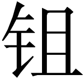

后刑第三十四
【题解】

本篇聚焦用刑问题。大夫认为“人君不畜恶民，农夫不畜无用之苗”，主张杀一儆百，“刑一恶而万民悦”，强调以严刑治国，从中可以看出大夫的法家思想立场。贤良虽然也认为刑罚对于治国不可或缺，但并不赞成一味地依靠刑杀，而是主张通过制定刑罚来起到威慑、警戒的作用，以期收到“威厉而不杀，刑设而不犯”的效果。贤良认为治国要先德而后刑，把政治教化放在第一位，并特别强调统治者自身的表率作用，提倡“民乱反之政，政乱反之身，身正而天下定”。

大夫曰：“古之君子，善善而恶恶[(1)]。人君不畜恶民[(2)]，农夫不畜无用之苗。无用之苗，苗之害也；无用之民，民之贼也。

一害而众苗成[(3)]，刑一恶而万民悦[(4)]。虽周公、孔子不能释刑而用恶[(5)]。家之有姐子[(6)]，器皿不居[(7)]，况姐民乎[(8)]！民者敖于爱而听刑[(9)]。故刑所以正民，

所以别苗也。”

【注释】

[(1)]善善：肯定善人。恶（wù）恶：厌恶恶人。

[(2)]畜：通“蓄”，养。

[(3)]

：同“锄”。

[(4)]刑：用做动词，诛杀。

[(5)]虽：即使。释刑：放弃刑罚。用恶：任用恶人。

[(6)]姐子：娇子。姐，原作“

”，据陈遵默说校改。

[(7)]居：保存。

[(8)]姐民：娇民。

[(9)]敖：同“傲”。原作“教”，据张敦仁说校改。

【译文】

大夫说：“古代的君子，肯定善人，厌恶恶人。君主不愿蓄养坏人，农夫不愿保留无用的莠苗。无用的莠苗，是禾苗的祸害；无用的坏人，是民众的祸害。锄除一株害苗，众多禾苗就健康成长；杀掉一个坏人，万民为之喜悦。即使是周公、孔子当政，也不能放弃刑罚而任用坏人。家中有娇子胡闹，器皿就不能保存，何况国家有娇民呢！老百姓受到怜爱就会骄傲，面对刑罚就会听从。因此刑罚是用来矫正老百姓不法行为的，锄头是用来辨别良苗与莠草的。”

贤良曰：“古者，笃教以导民[(1)]，明辟以正刑[(2)]。刑之于治，犹策之于御也[(3)]。良工不能无策而御[(4)]，有策而勿用。圣人假法以成教[(5)]，教成而刑不施。故威厉而不杀[(6)]，刑设而不犯。今废其纪纲而不能张[(7)]，坏其礼义而不能防[(8)]。民陷于罔从而猎之以刑[(9)]，是犹开其阑牢[(10)]，发以毒矢也[(11)]，不尽不止[(12)]。曾子曰：‘上失其道，民散久矣。如得其情，即哀矜而勿喜。’[(13)]夫不伤民之不治，而伐己之能得奸[(14)]，犹弋者睹鸟兽挂罻罗而喜也[(15)]。今天下之被诛者，不必有管、蔡之邪，邓皙之伪，恐苗尽而不别[(16)]，民欺而不治也[(17)]。孔子曰：‘人而不仁，疾之已甚，乱也。’[(18)]故民乱反之政[(19)]，政乱反之身[(20)]，身正而天下定。是以君子嘉善而矜不能[(21)]，恩及刑人[(22)]，德润穷夫[(23)]，施惠悦尔[(24)]，行刑不乐也。”

【注释】

[(1)]笃教：厚于教化。笃，厚。导民：引导民众。

[(2)]明辟：公布法令。辟，法。正刑：端正刑罚。

[(3)]策：鞭子。御：驾车。

[(4)]良工：优秀车夫。

[(5)]假法：借助刑罚。成教：完成教化。

[(6)]威厉：威猛严厉。《荀子·议兵》：“威厉而不试，刑措而不用。”

[(7)]张：施张。

[(8)]防：防范。

[(9)]罔：同“网”，法网。猎：猎杀。《孟子·滕文公上》：“及陷乎罪，然后从而刑之。”

[(10)]阑牢：栏圈。

[(11)]发：射出。毒矢：毒箭。

[(12)]尽：杀尽。

[(13)]上失其道，民散久矣。如得其情，即哀矜而勿喜：见于《论语·子张》。散，离心离德。得其情，审出罪犯的真情。哀矜，同情。

[(14)]伐：自夸。

[(15)]弋者：射猎者。罻（wèi）罗：捕鸟的小网。

[(16)]苗尽而不别：苗锄尽了，还不能区别良莠。

[(17)]民欺而不治：民众狡诈而不能治理。

[(18)]人而不仁，疾之已甚，乱也：见于《论语·泰伯》。疾，痛恨。已甚，太厉害。乱，祸乱。

[(19)]反之政：返回到政治上来。反，同“返”。

[(20)]反之身：返回到自身修养上来。

[(21)]矜不能：同情无能的人。《论语·子张》：“君子尊贤而容众，嘉善而矜不能。”

[(22)]刑人：受刑之人。

[(23)]德润：恩德润泽。穷夫：穷人。

[(24)]尔：语尾助词。

【译文】

贤良说：“古时候，厚于教化来引导民众，公布法令来端正刑罚。刑罚对于治国，如同鞭子对于驾车。优秀车夫不能不带鞭子就去驾车，也不能有鞭子而不使用。圣人借助法令来完成教化，教化成功了，刑罚就不必施用。因此法令威猛严厉但不一定要杀人，刑罚设置就没有人敢于触犯。如今纪纲坏废而不能施张，毁坏礼义而不能防范。民众陷于法网，官府随后用刑捕猎，这如同打开其猎物栏圈大门，再射出毒箭，不杀尽就不停止。曾子说：‘在上位的失去正确的治道，民心离散已经很久了。如果你审出罪犯真情，就哀怜同情而不要窃窃自喜。’不去感伤民众得不到治理，反而夸耀自己能够审出真情，这就如弋猎者看到鸟兽闯入罗网而自喜。现在天下被诛杀的人，不一定有管叔、蔡叔那样的邪恶，或邓析的伪学，恐怕是禾苗锄尽了还辨别不出良莠，民众狡诈而得不到治理。孔子说：‘一个人如果不仁，痛恨他太厉害，这是致乱之源。’所以，民众出了乱子，就返回到政治，政治出了乱子，就返回到自身修养，身子正了，天下安定。因此君子表彰善良而同情无能的人，恩惠施及受刑之人，德惠润泽到穷人，施予恩惠是令人高兴的事，执行刑杀并不让人快乐。”
