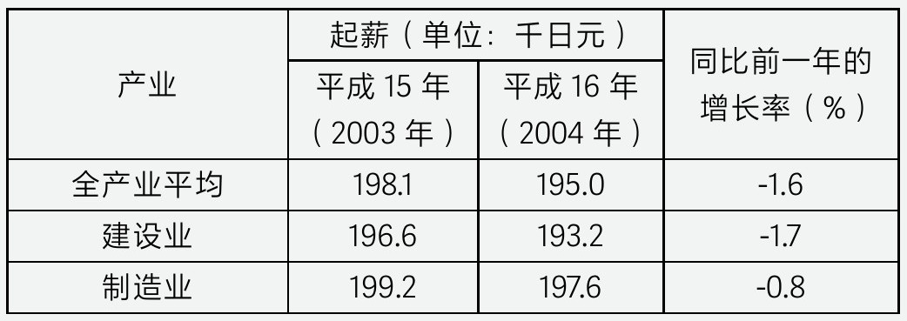
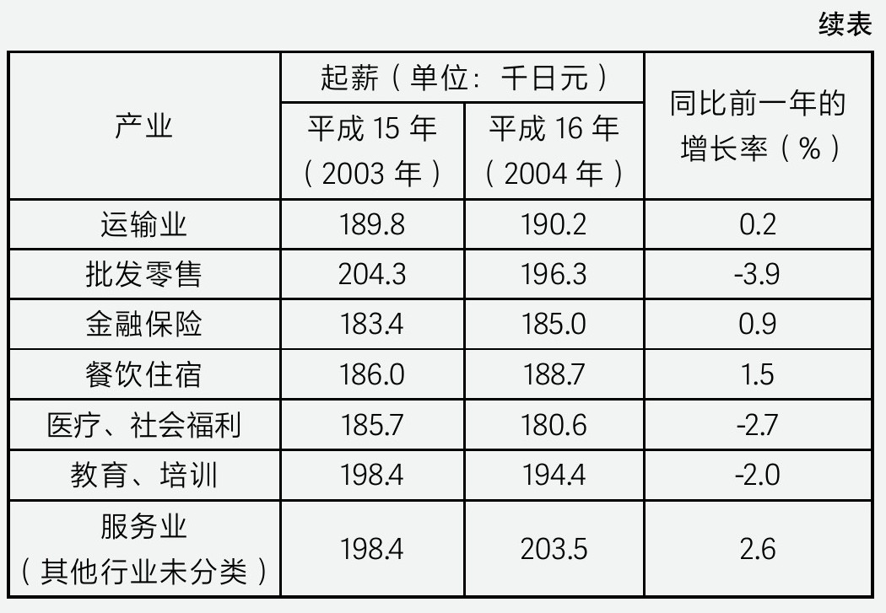

## 第一章 保就业，还是保发展？

## ——回顾日本保就业史：为保就业付出了怎样的代价？

 日本作为一个高度重视社会稳定的国家，在泡沫经济破裂后的经济下行期间，采用了众多手段将失业率长期压制在5%以下，艰难地挺过了一轮轮失业潮，但有人认为，日本保就业的成果，是建立在牺牲长期发展与一代人的利益的基础上所取得的。

 那么这一切是如何发生的？

 就业的稳定，是每一个社会群体最关心的话题。当经济下行时，经济增长的停滞往往会触发群体性失业问题。然而，在日本泡沫经济破裂后的10年经济下行期间，失业率却几乎始终控制在5%以下。即便2001年至2003年那段经济最为艰难的时期，整个社会同时遭受互联网泡沫破裂、亚洲金融危机余波以及银行业破产潮的三重冲击，国民失业率也仅短暂上升至5.4%。在20世纪90年代初泡沫经济瞬间破裂、房地产市场暴跌的悲剧下，日本社会并未出现严重的群体性问题，其保就业措施可谓功不可没。

 但日本在保就业过程中付出的代价却极为沉重，甚至可以说是以牺牲一代人的利益为代价。本篇作为“以日为鉴”系列的第一篇，让我们从大众最关心的就业话题出发，回顾那段历史。

 一、经济只是短暂的失速

- “CI指数”即“景气动向综合指数”（Composite Index），是日本政府用于衡量经济周期波动的重要指标之一。该指数由日本内阁府编制，分为一致指数（Coincident Index）、先行指数（Leading Index）和滞后指数（Lagging Index）三部分，分别反映当前经济状况、未来经济趋势及历史经济表现。

 如今我们已清楚地看到，日本的那轮经济衰退持续了近20年。但在90年代初，对于那个昨天还在全民高呼“日本可以说不”的社会来说，尽管衡量经济景气的CI指数
 在1989年达到历史最高点114后便开始下滑，到1991年已跌破100，但所有人都认为这只是一次短暂的调整。1990年底，无数日本媒体热炒一个词——“未实现的收益”。政府和民众都坚信未来的股价还会继续上涨，目前的下跌只是暂时的，损失的只是尚未实现的收益，未来仍可重新获得。

 对于企业而言，头脑发热的企业家们仍在加大产能投资。全行业设备投资额从1989年的54万亿日元增加到1991年的64万亿日元，而当年职工薪酬大涨5.6%创下自1985年以来的最高水平。几乎所有人都笃信，这只是短暂的调整，经济复苏即将开始，于是纷纷加仓抄底。

 但事实真的如此吗？1990年全国家用车销售数量达到510万台，相当于每20个日本人就有一个在当年置换新车，而到了1993年这一数字已经跌到400万台。而家用车这类家庭大宗消费往往代表了社会民众的信心，毕竟是否换车往往取决于未来几年的收入水平。可以说1990年这轮最后的疯狂，让无数民众与企业都抄底在最高点。而投资决策与经济周期的严重背离，也为后来180度的政策转向种下了苦果。

 二、泡沫破裂的惊醒

 1993年，日本迎来了就业危机的第一年。随着泡沫经济的余温消退，国民GDP迎来了自1974年以来的首次负增长，许多还沉浸在泡沫繁荣中的日本人瞬间清醒。然而比GDP负增长更糟糕的是失业率的快速增长。当年厚生省统计的全行业失业率从不足2%跳涨至3%，全国破产企业已经连续两年突破1万家。

 而这场失业风暴也着实惊吓到了日本社会，长期的繁荣早已让很多人忘记了经济衰退的恐怖，甚至从未经历过失业的恐惧。自1975年石油危机后，日本一直处于高速增长状态，80年代更是成为全球少有的低失业率与高增长国家。在泡沫经济最疯狂的1985年至1989年，每年数千家企业因人手不足而破产，当时的公司招聘甚至需要预留一笔“接待经费”，用于招待前来应聘者的交通和餐食费用。1988年《朝日新闻》统计，东京地区面试者的平均交通费超过2 000日元，而面试后如安排用餐，则标准至少为10 000日元/位。否则，企业会被视为“失礼”，因为人们愿意来面试本身就是给了企业面子。

 在这种大好形势下，整整一代人都没有接触过“失业危机”这个词，因为过去的20年告诉他们，工作总是唾手可得。

 然而，随着泡沫经济的破灭，这种繁荣景象戛然而止。1993年厚生省的劳动经济报告开篇便是“失业动向：各行业岗位需求持续锐减”。而在两年前报告书首要讨论的问题还是“在经济景气扩大背景下：劳动力短缺与企业应对措施”。由此，日本政府开始了为期十余年的就业率保卫战，而这段时间就是在这本书里会被反复提起的“就业冰河期”。

 三、日本如何保住就业

 在深入探讨日本如何保住就业之前，我们有必要先了解一下当时企业所面临的困境。当时的日本企业遇上的最大问题便是企业利润快速下滑，但产能端却出现了严重的过剩，这使得企业陷入了恶性内卷和亏损的泥潭。根据日本大藏省统计，仅1993年全行业利润就同比下降了21%，但全社会产能却出现了接近15%的增长。

 造成这一现象的主要原因，是由于大多数企业在1993年以前错误地评估了经济形势，误以为这只是一轮短暂的经济调整。因此，他们选择简单粗暴地增加产能，希望借此抢占市场，最终导致了产能的严重过剩。以日本水泥产业为例，本应该作为受房地产市场下行影响最大的行业，在地产泡沫破裂全国地价断崖式下跌的背景下，全行业却在三年内逆势增加了1 000多万吨的产能。而当时面临相同问题的，又何止水泥这一个行业呢？

 但不同于欧美资本主义企业在企业利润下滑与产能过剩时就裁员，日本企业基本遵循终身雇佣制度，员工愿意与企业共渡难关，企业自然也不能随意裁员。由此，日本政府陷入了保就业还是保发展的两难选择。如果放任这些利润下滑与产能过剩企业倒闭，固然能够实现过剩产能的出清，但也将引发巨大的社会性失业问题，这严重违背了日本传统的社会价值观。

- “窗边族”，又称“内部失业”，指日本企业为了让高龄的普通员工或不适任的员工不干扰其他员工的工作，而将其安排在窗边的位置，不为其安排工作或是只安排杂务。部分企业为了节省遣散费，甚至将“窗边族”的办公用品撤下，逼迫其主动辞职。

 在泡沫时期的终身雇佣制度下，企业被视为一个大家庭，员工需要尽忠尽职，但企业也不能抛弃每一个员工。而这也是日本为何有“窗边族”
 文化的原因，哪怕这些大龄员工已经无法做出贡献，但他们依然是企业不能放弃的一分子。再加上，日本企业长期采用交叉持股、互相绑定的做法，上下游企业之间往往是共生关系，而非对立关系。即使个别企业出现破产，它们也很快会被关联企业收编，最大限度地保证了整个社会的稳定。这也是为何80年代日本员工也常常被称为企业战士的原因，因为企业就是他们的第二个家。

 由于社会价值观很难接受企业倒闭与员工失业，迫于社会舆论压力，日本政府最终选择了一切为就业稳定让路。

 在具体做法上，日本采用了企业改革与雇佣改革两大政策来稳定就业市场。

 第一，企业改革。在企业改革方面，1994年开始日本政府的核心目标就是尽可能地不让企业破产。在具体运作上，采用了“大吃小”与“集群合并”两种思路，将行业内亏损企业与盈利企业进行合并，同时银行向大型企业提供贷款保证他们收购足够多的小企业，或者通过政府牵线让多家小企业集群合并抱团取暖。

 第二，雇佣改革。在雇佣制度上，政府鼓励企业更多采用合同制雇员而非终身雇佣制的正式员工，同时出台了《劳务派遣法》采用“老人老办法新人新办法”的形式，逐步降低整个社会正式员工的数量，大幅度增加临时性员工数量。简单来说就是基本放弃了对大学生的培养，转而全力稳定对于已有工作经验群体的保障。

 在这样强力的行政干预手段下，最终经过数年的调整，日本过剩产能基本被消化。还是以水泥行业为例。经过1993年到1997年大规模的兼并重组，到1998年，日本水泥行业整合为12个水泥集团，行业集中度大幅提高，相对稳定的格局基本形成。而到了2000年以后，随着日本的产业结构发生巨大改变，服务业成为日本主要的GDP贡献来源，而原有重工业和重化工业所占的比例大幅下降。整个社会岗位供给重新复苏。

 最终经过10年的努力，日本失业率在2003年以后逐年下滑。全社会成功将日本在“就业冰河期”的失业率压制在5%以下。社会普遍认为，到2003年日本基本已经走出了“就业冰河期”。

 那么这样做，真的没有代价吗？

 四、保就业的代价

 后来有人总结，日本保就业的成果，是建立在牺牲长期发展与一代人利益的基础上所取得的。

 我们先说说日本是如何牺牲发展来保就业的。其实经济过热之后的企业破产潮，本就是经济周期的必然阶段。但是为了保住就业，日本政府采取了一系列措施来避免企业破产和产能出清。这种做法虽然在短期内保住了就业，但却给日本经济发展留下难以愈合的伤口。

 由于日本政府不顾企业盈利能力，鼓励重组兼并，企业市场能力严重下降，大量被收购企业本身在兼并前就已经处于亏损，被大企业收购后更是直接躺平。毕竟都有银行与大企业养着，为什么还要努力工作？在这套保护制度下，大量将被淘汰的企业得以存活，但他们的主营业务早已连贷款利息都付不起了。

 后来这些无法以主营业务利润支付贷款利息、只能靠银行贷款续命的企业被统一称为“僵尸企业”。最高峰时，僵尸企业数量占到日本企业总数的20%，哪怕是到了35年后的今天，日本平均每6家企业中还有一家是僵尸企业，由此可见日本保就业的政策力度有多大。

 但僵尸企业却只是这轮保就业衍生代价中最小的一个部分，比僵尸企业更恐怖的是，日本将海量资金用于救助企业而不是用来发展科技，而这不仅连累了金融体系，也断送了日本高科技产业的未来。

 如今银行体系到底在90年代豁免了多少债务，已经随着那场著名的银行业群体破产危机成为一个难以考证的难题。但根据日本银行协会的统计，整个就业冰河时期为了救助企业，总计豁免的债务可能高达6 000亿美元。因此日本至今还有部分学者认为，过度宽松的债务豁免导致日本银行无法及时处置不良资产，也是日本银行业在1998年陷入群体破产潮的诱因之一。

 简单来说，由于政府过度地保护就业，导致中小银行无法向处于破产的企业追偿债务，从而使得日本政府只能先让大银行为中小银行兜底。这一模式下，不良资产仍淤积在银行体系内，最终也连累大型银行积重难返，最终导致整个银行业走向破产。

 1994年地区性银行体系首先因不良债务堆积而崩塌。当年以东京协和信用合作社破产案为导火索，全年总计有3家大型地方信用社宣告停业，造成了超万亿日元的损失，金融体系的裂痕已经出现。但政府放任的处理方式却进一步加速了裂痕的不断蔓延：年底，大藏省率先宣布由东京共同银行接管两家信用社，这给社会造成了一个错误的印象，那就是日本的银行都是“大而不能倒”，政府将无限制兜底债务。而这也为90年代银行破产潮在民众心目中留下的滔天巨浪埋下了伏笔。

 这场破产潮究竟有多剧烈，我想以一个例子来说明：

 1998年底日本十大银行分别是北海道拓殖银行、朝日银行、东京三菱银行、第一劝业银行、富士银行、樱花银行、东海银行、住友银行、三和银行及大和银行。破产潮发生后，这10家银行全部遭遇了重组兼并，20年后的今天已经没有一家企业再使用这些名字了。关于该部分内容我将在本章后面的扩展阅读中介绍。

 2007年，日本电影《重返泡沫时代》引起了许多日本中老年人的回忆。当身背巨额债务的女主角穿越回20年前，告诉因为银行破产失业沦为高利贷追债员的田岛圭一他所在的银行将在数年后倒闭时，田岛圭一却只是一脸不可思议地告诉她：“银行是永远不会倒闭的！”这段剧情深刻还原了当时民众对银行的高度信任，这种信任恰恰源于政府对银行的无限制兜底政策。

 可以说日本为了保住就业市场，最终搭上了整个银行金融体系。

 但还有比金融系统失控更大的代价吗？其实是有的！

 20世纪90年代是全球科技转型的最关键时点，10年间连续爆发了互联网革命、微型计算机革命、手机通信革命与软件系统革命等后来孕育无数巨型企业的超级红利，这也让美国直接在第三次科技竞赛中一骑绝尘。

 但曾为全球科技巨头的日本在干吗？泡沫破灭后，企业抵押给银行的资产跌得一文不值，如果银行追究起来，这些公司都将直接破产。于是日本企业被迫出售资产还债，同时不再追加投资。再加上日本政府将大量资本用以保企业生存，不能够将宝贵的资金投入新的高风险行业，日本科技产业呈现出惊人的衰退趋势。

 1993年全日本设备产能投资额只有可怜的46万亿日元，比1991年整整减少了30%，而这还仅仅只是一个开始。1995年，由于长期的超量下跌，日本股市成交量同比泡沫时期已经萎缩了90%，融资额更是下滑93%，上市企业几乎丧失了在公开市场融资的可能性。在这种背景下，由于需要偿还债务又没有合理的融资渠道，企业的资金压力进一步增加，进行高风险高投入的项目研发意愿大幅降低。

 1994年后，以东芝为首的日资半导体企业主动采取了消极的设备投资战略，降低半导体工艺更新频率。而半导体作为一个典型的不进则退的产业，消极投资带来了难以想象的恶果：1999年，韩国企业仅用6年时间就超越日本，成为世界第一芯片大国，而此时距离1991年日本电子立国战略规划公布还不到8年。

 可以说虽然通过10年的努力，就业问题被化解了，但大量资本被用以保企业生存，而不是孤注一掷的投向新兴产业。日本由此错过了90年代半导体与互联网的机遇，从而开启了下一个失落的10年。

 而其中最典型的例子就是东芝，这家在80年代号称“日本之光”的高科技企业，曾经是全球第一大电脑生产商，但如今已经成为日本最大的僵尸企业。

 那么保就业的代价只有这些吗？

 五、就业冰河时期的到来

 我们接下来将说的则是在这段保就业历史中最让人心痛的一群人，那就是在就业冰河时期毕业的大学生们。整个就业冰河时期，日本企业基本放弃了对大学生的培养，转而尽全力于对已有工作经验群体的保障。

 根据日本私立大学联盟的相关统计，1998年超过71%的企业认为能力开发是员工自己的责任，员工应当为自己的个人成长买单。超过40%的企业选择不再设立新员工的培训预算，导致大学生的入职难度大幅增加，他们难以适应工作要求。数据也反映了这一趋势：就业冰河时期大学生三年内离职率达到30%，即每三个大学生就有一个无法适应职场工作。但要知道在泡沫经济时期这一比例长期低于7%。可以说，日本在就业冰河时期虽然一直将失业率压制在5%以下，但大学生的就业率却长期低于60%。本质上，日本是以牺牲了一代大学生的发展为代价，才维持了就业市场的相对稳定。

 从1993年开始的十年被日本大学生称为“就业急冻期”，十年间日本大学生就业率从85%迅速下滑到2003年的55%。厚生省统计，即使当时大学生投递简历数量普遍超过100家，但能找到的工作却仍不足6成；同时还有15%的大学毕业生选择延迟毕业，只为了下一年可以用应届生身份寻找工作。大量的年轻人因为找不到工作而选择啃老或者在家考公务员。10年间，啃老族数量从8万激增到40万，间接造成了日本现在严重的宅男现象。

 由于这段经历对于那十年的毕业生伤害过于沉重，以至于日本NHK电视台在后来的纪录片中评价道：“努力拼搏奋斗的学生们却遇上了最糟糕的时代，这些学生并没有做错什么，他们只是出生在了一个坏的时代。”根据日本大藏省2020年统计，就业冰河时代的大学毕业生至今都是日本平均收入最低的群体，可以说那批大学生们花了30年都没有走出就业冰河期。

 有一种不满情绪认为：“上一代吃掉了时代的红利”。其实当年日本也有相同的不满情绪。在泡沫经济时期日本的岗位需求极大，每年毕业的大学生数量与校招需求比例是1:4，简单来说就是一个萝卜有四个坑位。1989年日本就有超过5 000家企业因为人手不足而倒闭。当时社会将大学生就业市场称为超级卖方市场，名牌大学生的平均意向公司是7.1家，即一个名牌大学生至少拥有7家公司的录用意向。大量的企业为了争夺大学生入职，需要定期宴请学生去高档餐厅就餐了解入职意向，而在临近毕业的前2个月，公司会公费让大学生去国外旅行，避免他们在国内与其他公司接触。但这样梦幻的大学生就业年代，却在泡沫后瞬间梦碎。

 根据1999年读卖新闻社的报道，当年日本实习生的平均留用比例不到5成，这意味着即使一路闯关成为大企业的实习生，大学生们依然面临高达50%的淘汰比例。这主要因为当时多数企业无法容忍培训员工所花费的成本，企业宁愿花高价雇用一个老员工，也不愿意培训一个新员工。最终这批大学生只能通过不断培训考证来提升自身实力，仅仅是为了能够获得大企业实习机会。

 而未能进入大企业工作的员工，则只能成为低薪的临时员工。据统计在就业冰河期间，全日本临时员工比例从1993年的19%提升至2003年的32.4%，此后日本每三个人就有一个是临时工，其中65%是在就业冰河时期毕业的大学生。这批人至今都是日本收入最低的群体之一，因为他们多数人整个职业生涯都处于低薪的临时员工状态。而如今他们在日本被统一称为“冰河世代困扰”，如何保障他们养老则已经成为日本最大的社会问题。

 后来，泡沫经济时期毕业的大学生被称为暖春一代，而泡沫后毕业的大学生则被称为寒冬一代。两代大学生仅仅因为读书时间的不同，就面临着两种截然不同的人生。

 到这里第一章的内容基本就结束了，关于日本就业冰河时期的各种问题与乱象将在后续的文章不断提及。事实上第一章更像是一个引子让大家对20世纪90年代的日本有个初步的印象。那么日本大学生是如何被牺牲的，日本社会又为何要做出这样的决定，这就是第二章的内容了。

 拓展阅读

 日本住专危机与银行破产潮

 如果说日本社会要选出一个为保企业付出高昂代价的案例，那么住专公司危机无疑就是最具代表性的例子。这场几乎贯穿整个20世纪90年代的地产危机，如今已经成为所有研究日本银行业的学者都无法绕过的研究对象。

 1.住专公司的辉煌与落寞

 住专公司是指日本大藏省（日本最高财政机关）直辖的非银行金融机构。在20世纪80年代日本“泡沫经济”时期，该公司利用从金融机构筹措来的大量资金，转贷给地产公司进行房地产项目投资，其对外贷款总额中80%流向房地产企业。由于同时掌握政府的金融审批权与银行体系的资金，住专公司在当时也被称为“大藏省的银行”。伴随着日本地价持续攀升，8家住专公司成为80年代最为显赫的金融机构，其社会地位与薪酬待遇甚至超过“百业之母”的银行业。

- 平成：日本年号，使用时间为1989年1月8日至2019年4月30日。

 当时哪怕是刚刚进入住专公司的社员，每天下班后也能去银座的高级俱乐部，他们的名片夹里塞满了各大地产企业老板的私人电话。而同期毕业后选择加入霞关（日本行政中心所在地）的官僚精英们，此刻正在千代田区通宵核对平成
 元年（1989年）的财政预算。由于其贷款抵押品接近80%都是各类土地房产，住专公司一般也被认为是吃到日本地产蛋糕的主要机构之一，就连东京大学法学部（日本官僚精英大多毕业于此）的高才生也以加入住专公司为荣，而不是成为一名大藏省的职员。

 但进入90年代，住专公司却迅速从“天之骄子”沦为“破落户”。由于泡沫经济破灭、房地产价格暴跌，住专公司大量中转贷款沦为坏账。1992年全国所有住专公司坏账总金额达到4.6万亿日元，坏账率高达38%，已经处于实质性破产状态。但日本政府却不敢让这8家公司破产。

 2.不能破产的执念

 二战后日本一直采用的是金融行政体系，建立了从“大藏省到日本银行，再到城市银行，最后再由各家银行输血企业”的资金供给和流动的纵向机制。日本人给这种金融体系起了个有战争意味的名字——“护送船队模式”，就像航空母舰带领战斗群一样，所有护卫舰都必须听从母舰司令的指挥，而母舰也要负责保护其他护卫舰，特别是要保证那些最弱的或有故障问题的舰船能跟上队伍。

 这么做的好处就是可以尽可能地维护整个社会体系的稳定。以各层级银行体系为触角，大藏省可以将行政指令迅速传导至最末端的企业，而在遭遇危机时银行体系又可以为企业兜底。这也是日本为何在20世纪70年代石油危机的严酷环境下，仍然能够实现芯片、电子与医药等资本密集型产业的成功。

 但这么做的坏处也是十分显著的，那就是“一荣俱荣，一损俱损”。由于住专公司绑定了大量下游地产公司，住专一旦破产将引起整个房地产行业的连锁爆炸。以1991年来看，当年地产行业破产企业数量达到1100家，是全国破产企业数量排名第一的行业，这意味着如果此时就放弃住专公司，地产企业的破产潮会更加剧烈。也就是在这样的背景下，日本政府第一时间的选择只能是先保住这8家住专公司。

 好在住专公司接近70%的借款都来自银行体系，1991年大藏省制定了“第一次住专再建计划”，希望通过延期的形式将债务支付时间往后拖，以等待抵押的土地价格回升。简单来说，就是欠银行的钱晚一些再还，先等待房地产市场转暖。

 这一决策如今看来有些可笑。虽然1991年日本热炒旅游地产，北海道的一居室公寓价格快速上涨，虽然当时核心都市房价已不再增长，但社会普遍认为这只是地产行情的分化而已。同时金融体系已经进入降息空间，制造业产品出口的数量依然增长，因此无论是大藏省的官员还是最底层的民众，没有谁可以想象房价实际触底的时间竟然要到20年后。

 3.被银行无限制兜底的债务

 1991年底，在泡沫破裂两年以后，日本政府终于启动了第一次降息，但想象中的股价与房价恢复并没有实现。降息后不到8个月日本股市跌破15 000点心理大关，房地产也正式进入全面的下降区间，至1992年底全国所有地区的平均地产都处于负增长状态。随着抵押的土地资产价格一路下滑，住专公司的债务也已经从前一年的4.6万亿放大到了6万亿。

 此时，日本部分高级官员其实已经意识到了问题的严重性。1992年8月日本央行首席理事福井俊彦提出“住专重组方案”，同时对住专公司大量坏账可能拖累银行体系提出预警。事实上从无数学者后来收集的资料来看，如果日本政府此时选择壮士断腕，代价依然可以承受。虽然地价暴跌，但银行体系手中持有的股票仍然在当年提供近5万亿日元的投资收益，当时即使所有住专公司宣布破产，日本金融体系或许会有重大损失，但还谈不上遭受重创。

 但这样的预警最终还是没有起到作用。1993年住专公司坏账突破7万亿，大藏省却再次做出所谓“住专延命安排”，也就是后来常说的“第二次住专再建计划”。之所以会做出此项决定，是因为大藏省认为通过“护送船队模式”，日本银行体系能够为住专公司兜底，还不至于走到破产的地步。自此日本住专问题陷入了“地价下跌→房地产公司经营恶化→住专不良债权增加→银行延付”的死亡螺旋。

 可以说对于金融体系过于乐观的判断，让日本政府错过了解决住专问题的最后时间。

 4.首相的道歉

 1995年8月兵库银行成为第一家因不良债权破产的地方银行，当年日本有10家次一级的信用社宣告停业（前一年只有3家），而这也成为日本金融体系正式崩塌的信号。由于长期坚持银行兜底债务的模式，不良资产问题被不断扩散，银行体系的债务危机终于浮出水面。1995年，日本住专公司坏账金额达到恐怖的8.1万亿日元，全公司76%的账款都处于坏账状态，相比3年前又翻了一倍。

 当年日本社会的三件舆论大事便是：①住专危机；②高学历群体的恐怖袭击事件（奥姆真理教案）；③平成艾滋药害事件。关于后两个事件我会在此后的内容中讲述。事实上，原本足以在日本社会产生爆炸性效果的后两件事，却因为住专案显得小巫见大巫。由于住专问题久拖未决，当时社会出现了空前的恐慌，认为这会拖垮整个日本金融业。由于住专资金还有一大部分来自农林系统，若是损失传导延续到后者，会引起更大的社会动荡。

 最终在1996年6月，经过半年的国会审议，日本政府同意由财政资金与大型银行共同承担巨额的坏账损失，最终没有将损失传导到农林系统与中小银行。在大会上，时任首相桥本龙太郎连续三次为住专问题的久拖未决鞠躬致歉。

 但一切仅此而已吗？

 住专问题持续多年，揭开了日本金融机构早已落入巨额

 不良资产陷阱的帷幔，将日本金融机构和金融体制丑陋的一面暴露于众。1995年后，日本在国际金融市场借贷成本边际提高0.25%，一些国家甚至冻结日本的融资合同，大量资金也从东京外逃出国。随后金融机构破产接连不断，1996年全国有协合、安全、木津等7家银行先后破产。

 到了1997年11月24日，被誉为日本金融活化石的山一证券宣告破产，而在1996年这家证券公司还在为迎接自己100岁生日而忙碌。山一证券停业后，世界为之震动，一度导致日元汇率下跌，东京金融市场剧烈动荡。再加上东亚金融危机的冲击，全国前十大银行都面临重组危机，自此号称“永不倒闭的银行业”成了90年代后期群体性倒闭最频繁的行业。而银行职员也从80年代“神的职业”跌落到“被裁员占比最高的职业”。

 表一 平成15年，银行破产潮后各行业应届生起薪

