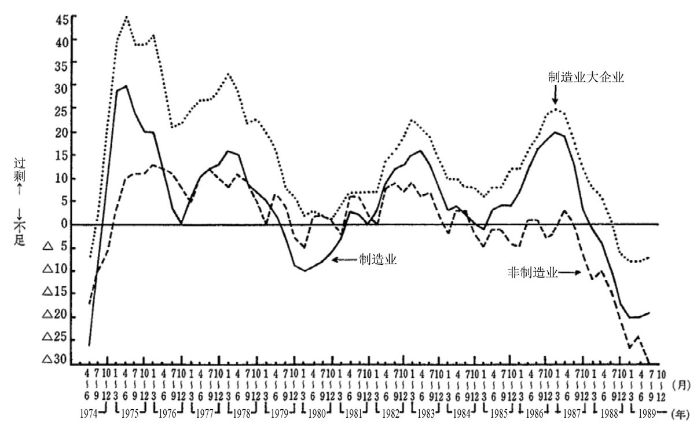

## 第二章 救老员工，还是大学生？

## ——回顾日本大学生失业潮

 他们出生于20世纪70年代的日本婴儿潮时期，学生时代的他们见证了日本80年代的经济腾飞，却在毕业后迎面撞上90年代无止境的经济衰退。最终，他们成为日本收入最低、结婚率也最低的群体。

 那么这一切是如何发生的？

 有这样一群人，他们人生的前20年生活在高速发展的经济中，见证了本国企业在全球市场所向披靡。他们在步入社会的前夕，感受过泡沫经济之花最鼎盛的绚烂，见证过学长学姐被大企业争抢的疯狂，也听过“创业者第一次见面就融资到10个亿”的都市传说。但就在他们对人生最充满希望，憧憬着自己作为名牌大学生步入社会的种种美好之时，却一头撞上了日本失落的30年，无止境的经济衰退让他们整个后半生都生活在低薪与失业的痛苦中。

 而这就是在日本泡沫破裂后大学生们的经历！

 在上一章我们回顾了日本在90年代保就业的历史，提到了日本社会通过牺牲那一批新生代大学生的就业，而换取了已有群体就业的相对稳定。那么日本政府为何要做出这样的决定？又对新生代造成了哪些影响？本章我将系统回顾这一决策的背景与种种决策所产生的惊涛骇浪。

 一、泡沫破裂后的雇佣严重过剩困境

 1991年底，在经历了接近一年半的横盘之后，日本土地价格终于支撑不住，东京地区6个月内土地价格下挫超过8%。而随着地产泡沫的正式破裂，同时暴跌的还有企业利润。1990年，日本地产全行业的营业利润尚有49万亿日元，而到了1993年，这一数字已经降至不到32万亿日元。短短三年间，蒸发了18万亿日元的利润。就连与丰田公司并称为日本汽车帝国双璧的日产公司，也不得不在1992年宣布出现赤字，震动了全日本。

 此时一个严重的问题摆在了企业面前，那就是员工规模都是按照泡沫经济去配置的，如今泡沫破裂利润下滑，但员工规模却没有减少。根据通产省1992年统计，企业的人均利润率仅有泡沫时期的77%，到了1993年更是下滑到70%以下，这就是后来长期困扰日本企业的雇佣过剩问题。“雇佣过剩”“设备过剩”与“债务过剩”后来被称为平成时期企业的三大过剩。关于“设备过剩”与“债务过剩”我们在上一章已经详细讲解了，因此本章我们将聚焦“雇佣过剩”是如何影响大学生就业的。

 首先我们需要弄明白，当时企业为何会出现如此严重的雇佣过剩问题？

 最根本的原因还是全社会对于经济过度乐观。80年代的经济神话让企业界普遍相信日本产业终将征服全世界，而低利率环境所提供的低廉资金使用成本，又给这种乐观情绪提供了最好的助燃剂。80年代中期，各大企业纷纷扩大生产规模，对员工需求呈现直线暴增。1988年全国的职位空缺数量比上年度增加了19%，而1989年空缺不仅没缓解反而又增长了23%，全行业都在呈现严重的劳动力短缺。

- 参见厚生劳动省白皮书《平成二年版労働経済の分析》。

 图一 日本全行业劳动力紧缺指数
 

 在人才最为紧缺的1989年，厚生省的统计数据显示：全行业岗位缺口高达500万个，其中房地产行业一枝独秀，岗位缺口接近300万。而当时全国适龄劳动人口才刚刚超过6 000万人，这意味着需要凭空多出10%的人口才能填补岗位空缺。在这样的背景下，就业市场的竞争异常激烈，不仅名校大学生备受青睐，就连最普通的私立大学毕业生也能轻松找到理想的工作。

 当时日本最大的房地产公司，西武集团的总裁堤义明在这种人才紧缺的环境下，提出了所谓“奴才哲学”，他认为只要招聘足够多的员工来执行他的命令，就能拓展商业版图。令人唏嘘的是，这个曾经拥有15万名员工的集团，泡沫破裂后成为全日本失业员工数量最多的公司之一。2005年，由于长期的财务造假，堤义明最终锒铛入狱，盛极一时的西武集团也逐渐消失在了历史的长河中。

- “大纳会”，即股市每年的最后一个交易日。在日语中，“纳”意为“结束、收尾”，“会”指“交易时段”。

 1989年就业白皮书明确指出：大学生已经出现严重供应不足，供需矛盾至少需要5年的时间才能缓解。然而这篇报告的作者肯定无法料想，2个月后日本将迎来股市的“大纳会顶点”
 ，泡沫经济达到最终章。而报告中描述的让人兴奋的大学生就业前景，在3年后成了全行业雇佣过剩。1992年就业白皮书披露，相比较1989年，员工的平均利用率和劳动密度都出现大幅下降。

 然而，由于日本企业普遍实行的终身雇佣制度，企业很难对老员工进行裁员。因此，为了应对劳动力成本的压力，企业纷纷选择暂缓新员工的招聘。全社会开始出现大规模的缩招潮。

 二、房贷重压下的老员工与刚刚毕业的大学生们

 1992年日本企业的缩招潮开始蔓延，年底每个求职者对应新增岗位数量仅有0.73个，也就是所有新增岗位都招聘完毕，全社会依然可能有27%的人处于待业状态。而在2年前这一数字却是1.5，仅仅两年时间全社会岗位数量就缩减了五成。由于此时日本企业采用年功序列制（终身雇佣制），老员工为了工龄累积几乎不会离职，当时的求职市场主要由每年的大学毕业生构成。

 因此，大学生成了这次岗位缩减潮最大的受害者，而谁也没想到的是这一轮缩减潮居然持续超过10年。2012年随着《失落的二十年》一书爆火，这一批从1993年至2003年毕业的大学生后来有了一个统一的名字，那就是失落的一代人，意指被日本社会牺牲的一代人。

 那么为何不能牺牲老员工的利益，打破这些老人的终身雇佣制？

 除了制度的本身限制以外，真正的原因是如果马上启动对现有就业群体的改革，很有可能会引发金融风险。经过全民炒房热潮后，日本家庭平均负债是年收入的3.1倍，即每个家庭都透支了未来3年的收入。而地产暴跌后，银行业坏账率已经逼近5%的临界点。如果日本政府现在启动改革，必然产生大量的失业断供，此时的金融体系已经无法承担这样的坏账率冲击，这也是日本政府一开始并不愿意打破终身雇佣制的原因。

 那么当时日本这群老员工的债务问题有多恐怖？

 1985年广场协议签订当年，日本银行贷款总额为267万亿，而到泡沫巅峰的1989年已经暴涨到410万亿，超过当年国民GDP。其中有大量贷款都是30年以上的个人超长期房屋信贷。

 这就带来了一个可怕的问题，泡沫最疯狂阶段整个银行体系在4年时间增长了140万亿贷款，但在泡沫破裂之时这些贷款还款周期大多都不到20%。这就意味着一旦老员工们失业，他们这剩余80%的未偿贷款将只能由银行消化。从后来的发展上看，90年代后期日本银行确实遭遇了不良资产危机，但那场危机主要来自企业端债务暴雷，就这已经让银行业元气大伤，全行业在2010年后才逐渐走出衰退影响。试想一下，如果企业端与居民端同时暴雷，日本银行体系大概率将尸骨无存。

 也正是由于日本政府维系住了现有就业群体的稳定，再加上工作与信用的强绑定关系（日本正式员工评判最重要的就是个人信用健康），即使老员工们的资产早已大幅贬值，他们也愿意用余生还完这些超长期贷款。后来这群人还有一个很自嘲的说法，因为日本房屋抵押贷款合同一般称为“住宅契约书”，所以他们是用一生还完了自己在30岁时签下的“魔鬼契约”。而这也是日本政府一定要优先保证老员工就业的原因，因为这让日本避免了居民端的债务暴雷。

 但笔者必须强调，尽管日本政府对老员工们多有优待，但也并不是一开始就打算完全牺牲大学生群体的利益，政府初期更多的是采用延缓就业的形式来拖延大学生就业。如果站在决策层角度思考，假设后面的经济能够重新恢复增长，那么延缓大学生就业的选择是正确的，这样可以同时保住新老就业群体。

 只是日本政府怎么也想不到，这一轮经济衰退居然持续了20年这么久。

 三、延缓就业之痛

 1992年至1995年间，面对大学生就业的严峻形势，日本政府推出了“乡村分流”与“研究生扩招”两项举措，旨在尽量延缓大学生进入就业市场的时间，以缓解就业压力。

 乡村分流方面，日本政府启动了一项为期3年的乡村基建计划，积极鼓励大学生前往非都市圈区工作，这一举措后来被称为“逃离东京运动”。厚生省统计通过分流政策，3年间成功将近30万大学生分流到乡村和小城市，既大大减少了东京的就业压力，同时也为乡村地区带来了新增人口。而在扩招政策上，日本政府迅速放宽了大学与研究生门槛。1992年日本在校大学生还只有237万，而3年后就增加到了310万，3年时间整个大学体系增加了73万学生。同时日本大学生深造比例开始升高，研究生门槛的降低使得1995年64%国立大学生都选择读研。

 根据日本文部省统计，1992年至1995年间，通过乡村分流与扩招两个措施，至少延缓了约90万大学生进入就业市场。这也为日本政府保就业争取了宝贵的时间。1995年开始，日本新增岗位数量触底反弹，大学生们的就业似乎迎来了希望的曙光。

 然而看似美好的希望，却隐藏着一个巨大的隐患。毕竟政策只是拖延了大学生的就业时间，但最终，这批大学生还是要面对就业的现实。

 从1996年开始，日本政府逐渐停止了大基建投资，原先创造的大量乡村岗位迅速消亡，大学生被迫重新回到大城市就业。据统计在1996年至2000年的五年间，仅东京就新增了27万人口，其中70%是毕业5年内的大学生。而更可怕的是1996年日本迎来了扩张后的第一轮毕业潮，全学历段待业总数达到惊人的80万，同时还有260万在校大学生等待毕业。此时日本经济还在衰退，就业市场根本无法承受如此巨量的大学生规模，当年大学生就业率瞬间下降至65%。

 1996年，日本社会已经深刻意识到危机的来临。面对数百万待就业的大学生，日本政府清楚地认识到，大学生就业潮已经无法再被拖延。

 就业市场必须进行改革了，但这次改革的第一刀却又砍向这批大学生群体。

 四、劳务派遣之痛

 1996年政府修改了《工人派遣法》并推广劳务派遣制度，鼓励企业减少正式员工雇佣比例，将临时员工作为新的就业蓄水池。这轮改革后，所谓的终身雇佣制度基本就与大学生无缘了，此后10年日本每两个大学毕业生就有一个是临时员工。

 但比成为临时工更可怕的是，这轮改革也基本摧毁了日本企业的用人价值观。

 既然企业可以随意裁减临时员工，大学生被要求一毕业就要具备即战力，企业对于新人犯错的容忍度几乎为零。甚至可以说大学生一毕业，就面临的是一个毫无晋升空间的职场环境。据统计，这批临时员工在10年内成功转正的比例仅有47%。这种环境下，新人们怎么可能规划好自己的职业生涯，多数人被迫开始频繁跳槽。而此时日本社会还没有意识到这批大学生其实才是真正的受害者，反而认为这批大学生不够努力、不够上进，由此催生了“垮掉的70后”。可以说，这一代大学生没有赶上终身雇佣制度的红利，但却成了终身雇佣制度解体的牺牲品。

 日本政府之所以会这么改革，一方面是因为老员工的终身雇佣已经是既定事实，既得利益群体难以撼动。更重要的是，此时银行的不良率已经超过5%的危险线。如果启动大规模裁员，企业需要支付大量赔偿金，而失业员工则可能引发房贷断供。这样一来，企业端与居民端的负债将同时暴雷。

 因此在债务暴雷与大学生的抉择之间，日本政府再一次选择了牺牲大学生群体的利益。毕竟，这批大学生的父母都是团块世代的有钱人，他们可以为子女支付生活费，因此这批大学生在物质上并没有出现太多危机。在我国，他们有一个新的称呼，叫作“全职儿女”。

 然而，相比较职业上的不顺利，这批70后大学生的内心却出现了更严重的问题。

 此时已经是泡沫破裂后的第5年，很多大学生已经意识到，即使再努力，原本规划好的人生也无法实现，宅文化开始兴起。而反映这种心态最明显的例子，就是电视剧《悠长假期》的爆火。1996年，这部讲述两个东京失业年轻人的电视剧创下了30%的惊人收视率。剧中木村拓哉那句“在自己什么都做不好的时候，就当是上天赐予的一个长假”的台词，安抚了很多年轻人的内心。要知道，在5年前，日本最火爆的电视剧还是《东京爱情故事》，那是一部讲述乡下孩子在东京打拼、催人奋进的励志电视剧。仅仅相隔5年，两部电视剧的对比就能说明当时日本年轻人心态转变之快。

 也许看到这里，你会觉得日本的大学生们已经过得很惨了。但你要知道，1992年至1996年，日本还处于泡沫经济的惯性中，家庭中位数收入还维持在550万日元的历史高位。虽然工作辛苦了一点，但起码家庭收入是没有下降的。简单来说，没有工作的孩子至少还有父母可以依靠。

 但苦难就仅此而已吗？

 五、金融危机之痛

 当1997年新年的钟声敲响，日经指数重新站上21 000点大关。这一短暂的复苏的状态，让整个日本社会都误以为经济已经重新步入增长的正轨。政府发布的白皮书甚至开始预警，称存在经济过热的风险。大学生们也纷纷开始憧憬，自己的人生终于要重新回到正轨了。

 然而，正当所有人都沉浸在希望之中时，亚洲金融危机的突然爆发，却如同一场无情的风暴，瞬间打碎了所有人的美梦。以日本四大券商之一的山一证券倒闭为起点，日本政府拖延了近7年的银行坏账问题终于迎来了爆发。坏账率迅速逼近10%，日本金融体系开始崩溃。

 金融大爆炸时期日本总计倒闭153家银行，未倒闭银行的累积亏损达到11万亿日元。由于银行业在日本百业之母的地位，大量实体企业与银行其实是共生状态，因此每倒闭一家银行就会连带许多企业濒临破产。由此1998年3月日本创下了单月破产1 820家企业的历史记录。

 在此背景下别说大学生的稳定就业了，海量社会精英都因企业倒闭失去工作。

 当年，仅山一证券的破产案，就导致了1.2万名员工失业。而山一证券最后一任社长野泽正平，那张他哭泣着恳求大家帮助失业员工再就业的照片，后来也被视为日本泡沫经济正式破灭的象征。

 如果说1997年之前，日本社会还处于有能力但不主动解决大学生就业问题的状态，那从1997年的金融大爆炸开始，日本政府的决策层就真的陷入了自顾不暇的境地。由于处置危机不力，5年间日本政府更换了4位首相，最终只能通过超发40万亿日元的债务来救助企业，这才勉强控制住了这次危机。

 然而，在这样的混乱局面下，谁还记得那些大学生们怎么样了呢？

 在1997年至2003年的这段时间里，日本社会从上到下，已经没有人再去关注大学生的处境了。毕竟，需要拯救的倒闭企业实在太多，大学生的就业问题，自然就被排在了优先级的后面。最明显的一个例子就是，在这5年时间里，日本政府甚至没有出台过一部专门针对大学生就业问题的法案。

 而这也是这批大学生后来被称为被遗忘一代的原因。他们就像被忙着救火的大人们遗忘在角落的孩子一样，被整个日本社会所遗忘。2003年日本大学生的就业率已经跌到令人发指的55%，即每年的毕业生中，将近一半处于失业状态。

 那么经济好转之后，他们的人生能变好吗？

 六、被时代遗忘的一群人

 2003年后日本金融大爆炸的影响开始消退，日本政府重新鼓励企业雇佣大学生，全职雇佣人数与岗位比例均显著上涨，2007年大学生就业率重新回到70%。但此时一个尴尬的现实是，就业冰河时期的学生们基本都已经毕业超过10年，即使校招恢复，又与已经做了10年临时工的他们有何关系！

 而在社招市场上，此时就算老员工们已经退休了，优质的岗位依然与这些90年代的大学生无关。

 2004年，随着团块世代进入退休阶段，日本再次掀起了“再雇佣”的风潮，一批老技术员工被返聘成为香饽饽。这是因为企业发现，这些老员工经历过七八十年代众多项目的历练，往往拥有更丰富的工作经验和专业技能。相比之下，90年代的大学生在毕业后面临的是产业与技术的衰退，他们中的许多人不要说历练了，甚至都没有完整参与过几个项目，自然也谈不上什么专业的技能。更糟糕的是，不少公司宁愿选择刚刚毕业的大学生重新培养，也不愿意培养一个老人。而这批70后因为年龄过大，就算是正式员工，也已经沦落为下一批“窗边族”的储备。

 根据厚生劳动省统计，“失落一代”在35岁的收入比泡沫经济时期的毕业生低25%，也低于就业冰河时期后的毕业生，成为三代人中的收入最低的群体。

 后来，知名作家小林美希这样总结这一代人：他们出生于20世纪70年代的日本婴儿潮时期，学生时代见证了日本80年代的经济腾飞，但却在毕业后迎面撞上90年代无止境的经济衰退。最终，他们成为日本收入最低、结婚率也最低的群体。

 至此，第二章的内容就结束了。前两章我们回顾了在失业潮的大背景下，日本政府在企业发展与社会稳定之间的抉择，以及面对新老世代不同困境所做出的取舍。这两章的讨论主要聚焦于城市，那么同样在失业潮的背景下，日本的乡村又发生了怎样的变化？
