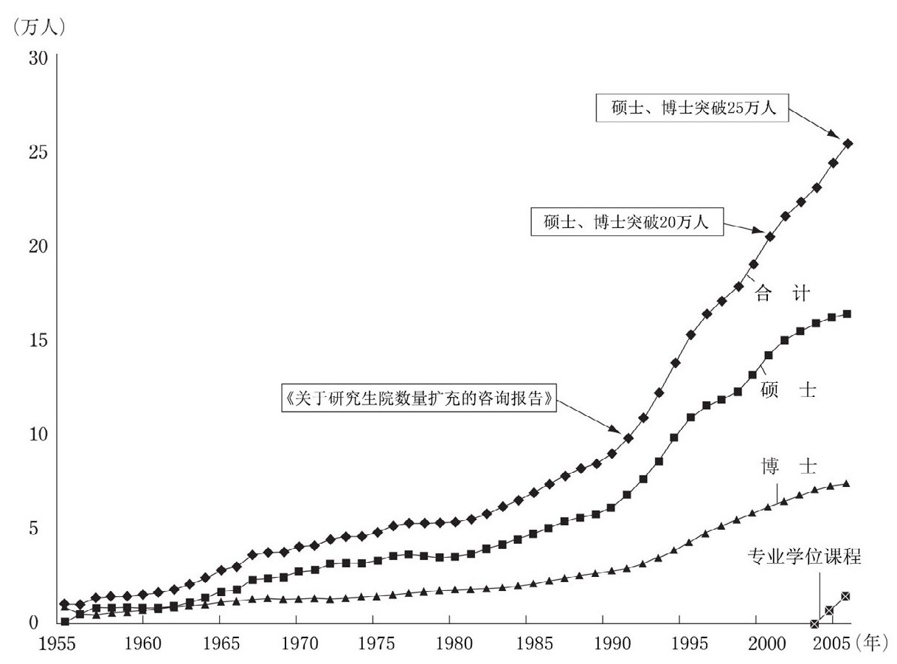
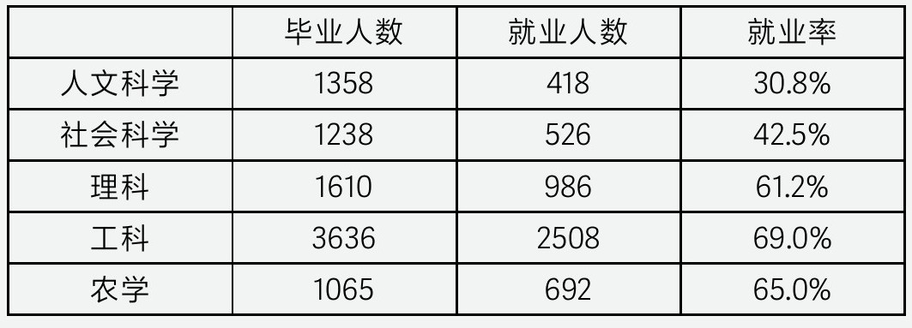
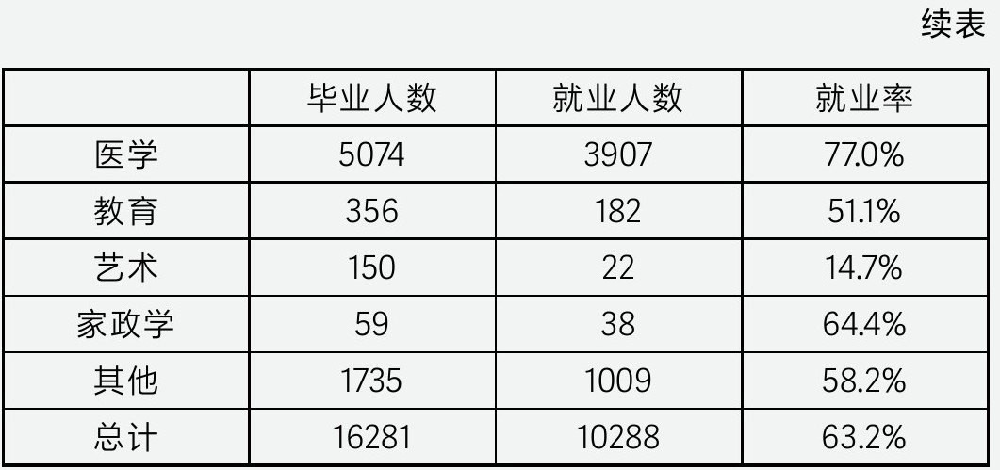
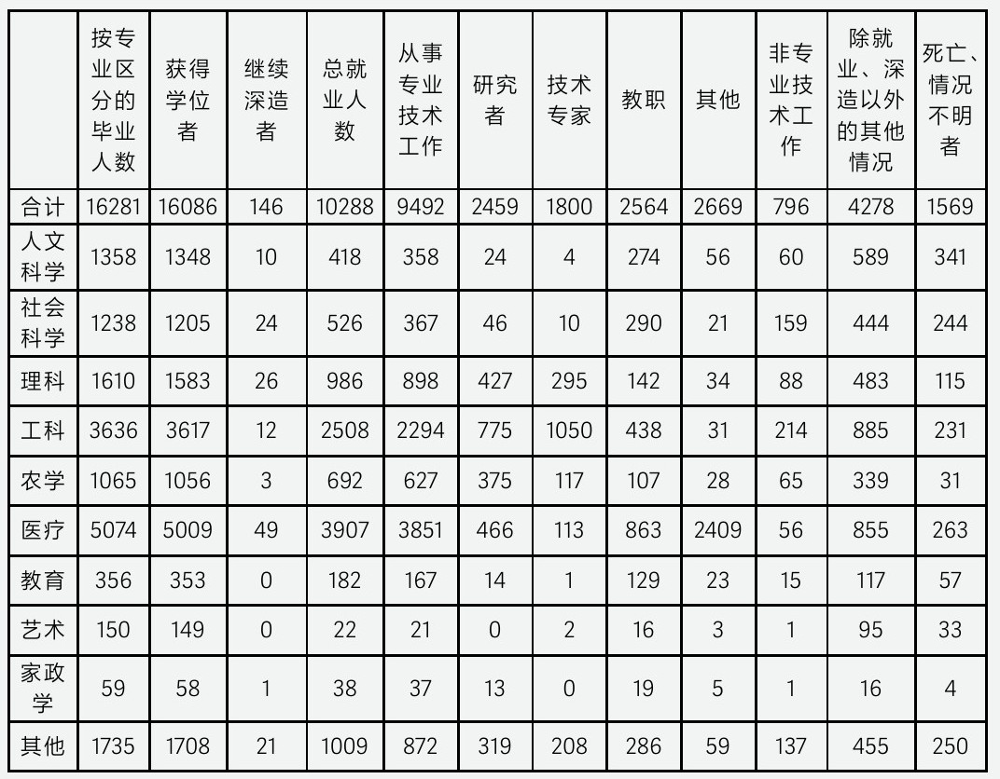

## 第六章 日本硕博扩招一代

 ——日本硕博学历贬值史：大扩招的教训2023

 年，作家阿部恭子的纪实文学《高学历难民：失落的精英们》成为日本社会现象级作品，短短一年时间历经4次加印。

 这部聚焦“硕士与博士生存困境”的著作，通过田野调查与个人叙述，讲述了20世纪90年代研究院倍增（大扩招）计划后，100余万扩招硕博学生在失落经济时期下的凄惨境遇。通过将一个个血淋淋的个体命运与“扩招余波”结合，揭示了日本曾经那段硕博大扩招政策所留下的经验与教训。

 那么时隔近40年，当重新回顾这段硕士扩招的历史，给今天的我们留下了哪些启示？

 引子：自信的决策与研究院倍增计划

 1991年，相田洋编写的《電子立国日本の自叙伝》（《电子立国日本自述》）出版，该书系统描写了日本当时最成功的微电子产业，如何从60年代百废待兴，至70年代超大规模集成电路弯道超车，再到80年代电子计算机血战中获胜的全过程。书籍出版的次年，便荣获了日本文学的最高奖项之一的“文部大臣艺术奖”。

 该书如此成功不仅是因为详细记录了日本微电子产业的发展历程，更重要的是反映了当时日本社会从上到下普遍存在的技术崇拜心态，即认为技术升级可以解决一切问题。80年代，日本产业在全球市场上风光无限，这种对技术进步的无限信心渗透到政府决策、企业经营和民众观念的方方面面。他们坚信，只要在技术领域保持领先，就能在全球竞争中立于不败之地，实现经济的持续增长和社会的全面进步。

 由于该书的影响力过于巨大，同年NHK就上映了6集纪录片《电子立国：日本的自传》，开篇第一句话就是，“继汽车之后，电子产品成为日本赚取外汇的又一大得力干将”。虽然彼时日本经济已经陷入衰退的泥潭，日经指数接近腰斩，日本政府依然自信地认为这只是一轮短暂的经济冲击，技术的发展依然能够推动日本社会的长期发展，而这种心态甚至深刻影响着顶层决策。

 1991年末，日本一年一度的国民经济白皮书发布，副标题竟然是“长期增长的条件”。面对连续15个月的经济衰退与大幅下滑的房地产市场，通产省规划中依然自信地宣布，日本至少还有5—10年的二次增长曲线。一时间日本全民信心爆棚，寻找下一个长期增长点成为当时热议话题，而这甚至一度刺激了日经指数在年末的小幅反弹。

 而就是在这种狂热的氛围中，政府提出以科技创新重新刺激经济增长的科学立国战略，其中扩招高学历人才是该战略的主要任务之一。政府笃信通过扩招高端人才复制80年代的产业优势，日本可以迅速走出经济衰退的冲击。在此背景下，文部省启动了一场为期多年的研究生扩招计划。由于当时恰逢大学生失业潮，在就业难的背景下社会掀起了一场持续多年的考研热，研究生报名人数仅4年就翻倍增长。但此后考研潮愈演愈烈，导致研究生出现过量供应。最高峰时日本国立大学毕业生考研比例竟然高达60%，虽然政府多次调整政策，但最终这场硕博大扩招却演变成了学历大贬值。

 而这轮扩招就是至今都在日本教育史上饱受争议的，平成三年（1991年）《研究院倍增计划》。

 根据文部科学省《学校基本调查》，大扩招后博士生就业率连续9年低于60%，以2007年为例，当年毕业的15 973名博士中，仅有9 167人找到工作，其中文科与社科类博士的就业率更是不足40%。而硕士就业率虽然略高于博士，但也依然远低于同时期本科生就业率。

 如今“高学历贫穷”在日本已经成为一个社会名词，其与“女性贫穷”共同被称为就业冰河时期两大特殊性贫困群体，意指其贫困发生的原因具有时代的特殊性。许多高学历者在毕业后只能从事低收入的临时教师工作，年收入普遍低于200万日元。他们挂着一纸高学历文凭，却无法改变自己的命运。而在硕士学历贬值后，日本大学生考研读博意愿大幅降低。

 2021年文部省统计，选择大学毕业后继续攻读研究生的比率仅为11.8%。如今日本本科生毕业就参加工作成为常态，由此可见这轮贬值对日本学生就业观的影响之大。

 那么当年的学生们到底经历了什么，这轮硕博大扩招又是如何进行的？

 一、扩招之初，过量的扩招人数与教育质量下滑

 1992年日本启动了泡沫后第一轮高等教育改革，放宽硕士招生限制成为改革的核心。扩招实施不到三年，硕士在校人数就从6万暴增至10万，后来这段时间被称为硕士扩大化时期。

 改革后各大学开设研究生课程的门槛被大幅降低。起初，社会对这一改革寄予厚望，认为这实现了学历提升与人才储备的双赢局面，当年国民经济白皮书更是将硕士扩招称为日本科学立国战略的重要支柱。那么被寄予厚望的大扩招计划，最终是如何造成学历大贬值的呢？

 事实上，政策实施后遇到的首要问题就是超额扩招与教育质量的严重下滑。

 图二：1955—2005年，日本高校硕士、博士招生情况

 1.教育资本化失控（超额扩招现象）

 倍增计划推出时，政府规划用10年时间将硕士人数增长至10万人。但实际仅5年就已经超过原定的规划扩招人数，最高峰时更是超过原定规划的2倍还多。后来超额扩招导致的研究生供给过剩，也被认为是其学历贬值的主要原因。

 那么扩招为何严重超过规划？

 这是因为政策放宽后大量民间资本涌入大学投资，许多不具备研究生教学能力的私立大学也开始扩招。泡沫破裂后资本将教育视为一门好生意，因为经济下行期间教育属于刚需行业。此前私立大学设立研究院的门槛极高，如今门槛放开自然导致资本纷纷涌入。

 据文部省统计，4年时间里，私立大学的硕士学院数量从170家暴涨至290家。当时甚至出现学院还在筹备，但招生工作已经在开展的奇观。由于新建学院数量过快，各私立大学师资力量出现严重不足，为了争夺有限的教师资源，教育界甚至出现了所谓“一亿教授”的说法，意指私立大学邀请一位国立大学的教授，每年需要支付的报酬在一亿日元以上。

 1994年私立大学报名数突破3.2万人，而当年总共只录取了2万人，这意味着即使最差的研究院都存在淘汰率。短短4年，私立大学在校人数就从不足2万跃升至4.5万人，由此可见这一轮扩张速度之快与研究生超额扩招的数量之大。

 2.教育质量下滑

 除了私立大学过度扩招以外，当时还有一个严重的问题，那就是研究生教育质量的飞速下滑。由于各大学都处于扩招状态，教师数量完全跟不上硕士扩招速度。而这也导致了研究生教育质量的飞速下滑。文部省统计，扩招前全国研究院平均师生比例是1:2.7，扩招后仅三年就超过1:5。个别新成立研究生学院甚至出现一名导师同时负责10名学生的情况。

 由于学生数量的急剧增加，导师们面临着前所未有的指导压力，往往只能进行一些简单的学术交流和建议，难以对学生的研究课题进行全面细致的把控。与此同时，很多学生选择读研更多是将其视为“经济冰河时期”的就业缓冲地带，而非出于对学术研究的热爱和追求。

 因为毕业过于轻松，社会将研究生学院称为休闲之地，大大降低了大众对研究生，尤其是私立大学研究生的认可度。后来这段时间也被称为研究院宽松时期，意指其学历含金量明显低于大扩招以前。

 至1996年日本私立大学硕士就业率跌破恐怖的60%，成为当时所有学历段就业率最低的群体。可以说短短四年，日本私立大学硕士学历就迎来致命的贬值。

 二、扩招政策大调整，大学竞争化时期与从严考核

 1996年日本社会已经意识到过度扩招带来的危害。

 研究生人数增长过快，扩招后学生的综合素质出现明显下滑。—1995年《日本教育白皮书》。

 但面对愈演愈烈的大学生失业潮，当时日本陷入了两难的选择，如果停止硕士扩招，则原先海量的考研学生必将开始找工作，此时的就业市场根本无法容纳如此多学生。文部省统计仅1996年一年就新增22万失业大学生，而当年参加各大学硕士笔试人数高达11万，可以说考研有效缓解了当时社会恐怖的就业压力。在大扩招无法停止的背景下，日本政府于1996年提出研究生教育质量改革与博士扩招计划。一方面，政府鼓励研究生进行博士深造以延缓就业，此后又推出博士后支援计划，最高峰是在读博士数量达到7万，博士后达到1.5万，是扩招前的整整三倍。

 其实日本启动博士扩招还有一个重要原因。1996年正处于“科学立国”战略最关键时期，急需海量博士人才参与到基础研究中。站在当时的决策角度思考，假设科学立国战略成功，那么大扩招的人才都可以投入新兴行业中。关于博士的情况后文再说，我们先说说日本是如何进行研究生教育质量改革的。

 1.大学竞争时期—从严考核

 当时政府通过引入大学间竞争制度，将高校经费从申请制改为竞争制，企图通过竞争倒逼各大学提升学生的学术研究产出能力。此后高校间迅速形成马太效应，不具备科研能力的私立大学逐渐被市场淘汰。这一改革效果也是立竿见影，从1996年开始各大学论文总量连续3年增长超过10%。

 但对于国立大学的在校学生来说，这一改革则产生了一个巨大的问题，那就是其毕业门槛被大幅度提高，各国立大学为了竞争经费，纷纷对学生提出极为严苛的毕业论文要求。这导致许多学生无法按时完成学业，只能选择延时毕业。

 根据文部省数据，质量改革前硕士的平均延毕率在8%以下，但改革后最高达到了17%。同时各国立大学每年还有约2 000人选择退学，90年代因为考研人数众多，优质的国立大学考研竞争十分激烈，不到万不得已几乎不会有人选择退学。

 可见这一轮质量改革对学生毕业难度要求之高。

 2.教授的无情压榨

 但其实除了毕业难以外，当时的学生还面临一大问题，那就是教授们的无情压榨。由于日本高校采用教授负责制，教授对学院内所有学生去留问题都有一票裁定权，导致教授权力极大。

 学生们想要专心进行科学研究几乎是不可能的，文部省统计1998年研究生实际科研时间仅占53%，剩下时间都在处理非科研事项。一边是艰难的毕业论文，一边是教授的无情压榨，研究生与博士们几乎都处于严重过劳状态。

 当时社会将这种畸形的导师制度称为“主公与家臣”的关系。2003年，电视剧《白色巨塔》上映。这部作品表面讲述日本医学院残酷权力等级制度，实则是影射当时各国立大学教授群体生存现状，马上引发社会热议。“本该是科研的象牙塔的大学为何沦为泯灭人性的白色巨塔”成为当时的讨论焦点。而该剧影响力之大甚至创下收视纪录，可见日本社会对这一问题的关注。

 三、“科学立国”战略失败后的就业之痛

 在竞争如此激烈环境中考上硕博，又艰难毕业的学生们，他们的就业状况究竟如何呢？让人遗憾的是，就业之痛才是这批学生们命运最残酷的考验，这也正是“研究院倍增计划”至今都在日本饱受争议的原因。

 在这里，我们需要再回顾下这轮硕士扩招的历史背景，1991年当政府提出扩招政策时，是基于10年后“科学立国”战略成功，日本爆发大量新兴产业需要海量硕士与博士的人才设想。但2001年正值日本陷入最艰难的超级就业冰河时期，“科学立国”战略不仅没有成功，反而在90年代后期那场著名的芯片战争中惨遭失败。这一系列挫败导致大量扩招的人才，根本没有派上用场，就已经面临了贬值的危机。

 1.隐形难民，100万余扩招的硕博学生

 “科学立国”战略失败后，日本社会不得不面对一个问题，那就是大扩招期间产生的100余万研究生与博士如何安置。这批高学历人才因年龄劣势很难在就业市场找到工作。他们究竟遭遇了什么？

 （1）科研机构法人化冲击

 1999年日本遭受了泡沫破裂以后的第二次经济冲击。当年因为财政负担难以维持过量的研发支出，日本启动了国立科研机构法人化改革，改革后原由政府扶持的科研机构开始自负盈亏，各大科研机构实施人员降本增效。此前各大科研机构一直是日本研究生的主要就业渠道，这轮缩招导致国立大学研究生就业率首次跌破70%。

 （2）高校缩编潮

 2000年政府开始调整科研扶持政策。在前一年日本半导体市场份额被韩国超越后，基本已宣告第一次“科学立国”战略失败。此后政府宣布只对通信等四个产业进行经费扶持，放弃了此前全学科扶持的战略。2002年政府科研经费开始减少，各大高校开始缩减人员编制，由于高校与研究机构同时缩减编制，当年博士与研究生就业率双双跌破60%，这批大龄博士与研究生被迫成为“高学历穷忙族”。

 而更糟糕的是，政府于2004年宣布对高校实施经费管控改革，此后每年的高校经费都要比上年减少1%。大量依附高校的机构被裁撤，硕博学历的失业人数进一步增加。机构裁撤潮中很多高学历者已经超过35岁，中年失业的痛苦想必今天的你我都感同身受。

 （3）企业支援计划失败

 2002年开始，政府启动了企业支援计划协助研究生与博士就业。政府给予一定奖励，鼓励企业雇佣研究生与博士搞研发，奖励最高时期每雇佣一名博士可以奖励企业500万日元。但现金奖励也没有换来企业的雇佣，2004年文部省调查数据显示，只有15%的企业愿意雇佣博士与研究生。因为经过10年的经济衰退与破产潮的洗礼，多数企业都处于战略收缩阶段，对于研发创新的投入十分谨慎，因此企业没有意愿雇佣太多的研究型人才。当时正是劳务派遣最严重的时期，找不到工作的硕士博士，很多只能沦为派遣员工，与本科生甚至高中生拿着相同的薪水。而不愿从事派遣员工的高学历者，则只能返回高校从事低薪的临时教师，以期待有一天可以转正，继续干回自己热爱的科研工作。

 但这一天终究没有到来。

 2.就业冰河时期特别援助

 2005年为了应对经费缩减潮，日本各高校开始对临时教师制度进行改革。改革后临时教师不再有转正机会，所有合同都是一年一签，按照上课次数付费，其工资待遇与稳定性甚至低于就业市场的派遣员工。据2005年文部省统计，临时教师每节课的平均酬金在2万日元左右。为了增加课时，他们不得不同时在几所大学兼职任教。即便如此，临时教师的全年收入也往往不到全职正式教师工资的30%，许多人甚至同时在便利店打工，过着白天在大学教书，晚上在便利店上班的生活。根据文部省2007年统计，临时教师的年收入普遍低于200万日元，属于日本的绝对贫困群体。而当时日本有整整16.8万临时教师（全教育口径），其中73%都是35岁以下的硕士与博士生。2010年日本启动就业冰河时期特别援助，高学历的临时教师成了主要援助群体。

 就此他们中的很多人挂着一纸高学历文凭，却在临时教师制度中逐渐走向贫穷。从2007年以后日本大学生开始拒绝读研考博，日本曾经稳居世界第三的科研体系走向崩塌。

 尾记：32年的轮回

 1992年，日本政府开启“研究院倍增计划”。

 2002年，随着政府科研经费开始减少，这场持续了十余年的硕博大跃进画下句号。日本政府于当年宣布“研究院倍增计划”基本结束，此后各国立大学硕博人数开始逐渐回落。

 “研究院倍增计划”结束后，日本政府未再对该计划发表过任何评价。直到2018年，文部省首次承认日本科研处于衰退时，才对90年代“研究院倍增计划”进行反思，90年代初对于经济复苏的过度乐观，导致未能控制好硕博扩招比例，是以后同类计划必须检讨的部分。

 回望这一代扩招的硕博学生，他们一度是日本90年代最优秀的一群人，在失业潮的洪流中艰难上岸，又在高压环境下成功毕业。但个人的努力又怎能敌过时代的洪流。最终他们的命运只能随着日本经济的持续衰退走向沉沦。

 2010年以后随着日本经济的恢复，企业与科研机构开始逐渐恢复对科研的投入。此后研究生就业率开始回升。但起薪基本已经与本科生保持一致。2020年以后由于经济的持续向好，日本社会开始释放大量研究生与博士招聘需求。2024年日本再次提出博士扩招计划，这一次政府希望在20年间将博士人数增长2倍。

 而此时距离上一轮硕博大扩招已经过去了整整32年。

 拓展阅读

 日本为何产生“博士远离”现象

 自2003年“科学立国”战略失败后，日本博士人数就处于持续下跌状态。博士入学人数从2003年最高的1.8万下跌至1.4万，更糟糕的是，这1.4万人里还有43%的在职人士与16%的外国学生，硕士直升博士人数只有40%，而在2003年83%的博士都是硕士直升。

 如今的博士课程已经沦为职场学历镀金的场所，社会普遍认为只有找不到工作的人才会去读博士，而这种现象被称为“博士離れ”（博士远离），意指博士毕业生在就业市场上长期面临就业率低于本科生的困境。而导致这一现象的原因除了“科学立国”战略失败以外，从1996年开始的博士扩招政策也在推波助澜。那么博士的政策究竟是如何演变的，又是如何导致博士远离现象？

 1.万博计划

 1996年的“一万博后计划”是日本博士扩招的起始点，当年《科学技术基本计划》提出，为提升日本的科学研究水平，需要在2000年实现培养10 000名博士后的目标。计划推出后国立大学迅速扩大了博士与博士后人才规模，最终在1999年提前完成，比原定提前一年。

 但该计划却产生了一个严重的问题，那就是大量博士无法对口就业。由于只强调就读人数与毕业人数，各大高校在扩大招生规模的同时，并未充分考虑市场需求和就业环境的变化，将扩招重点放在了当时所谓前沿的脑科学与超级材料领域（因为同年日本推出前沿工程计划，研发总投入达到14.4万亿日元），产生了大量“無駄博士”（无用博士）。

 许多所谓前沿领域的博士不得不接受低薪、非专业对口的职位，不仅造成了社会资源的浪费，也造成了博士的严重过剩。而同时期日本政府也忽视了对于博士就业的配套的制度以及经济支持，甚至还在其中火上浇油。1997年颁布了《大学教师任期法》，开始在大学中推广任期制，大学将退休教师的岗位回收并进行削减或重新分配的现象增多，博士留校难度也加大。

 在这样的背景下，日本很快从“无用博士与博士过剩”向“博士就业难”的情况转变。21世纪初，日本网络出现《百名博士之村》的故事，渲染了一批博士人才的悲惨生活。

 之后又有《高学历穷忙族》一书问世，讲述许多博士毕业生难以进入一流企业就业，甚至沦为未就业或从事非正式职业的窘境。

 2.财政压迫下的改革

 1996年日本启动博士扩招之时，可能连政策制定者都不能预料到此后急转直下的经济环境。当第一批扩招博士生尚未毕业时，1997年亚洲金融危机便如巨浪般拍碎日本出口导向的经济支柱，连续两年GDP都出现超过1%的负增长。至2001年小泉政府上台之时，面对庞大的赤字，内阁提出在教育界实施“没有禁区的改革”，也就是后来的大学结构改革。其中最重要的举措就是促进国立与公立大学的重组，大幅减少大学数量，而这进一步减少了招聘新教师数量。雪上加霜的是，由于当时已经进行国立科研机构独立法人改革，2001年仅三大国立研究院之一的产业技术综合研究院就裁员900人。许多原本就难以维持的科研项目和研究岗位被迫削减或取消，这使得博士毕业生就业更加艰难。

 鉴于科研机构与大学都已经无法提供足够的就业，政府于2001年提出推动科研人才进入企业界的构想，并在此后两年推出多项政府补贴计划，而这就是“博士企业支援计划”。然而该政策的推出不仅没有降低博士的失业率，反而进一步增加了博士入学人数。

 一方面，企业对于雇佣博士生的积极性依然不高。因为在经济形势不佳、企业自身经营压力较大的情况下，企业更倾向于招聘具有实际工作经验、能够迅速投入工作并创造价值的人员，而不是高学历但缺乏实践经验的博士生。博士生的培养成本相对较高，企业担心投入与产出不成正比，所以即使有政府补贴，企业在招聘博士生时仍然持谨慎态度。

 然而企业支援计划在另一方面却对学生群体产生了意想不到的后果，反而吸引了更多研究生去读博士。这其中有两个原因：第一是部分学生机械地认为在企业支援计划的补贴下，博士生会比硕士生更容易找到工作；第二则是由于当时严峻的失业潮，硕士的就业率也不足65%，很多学生认为反正也找不到满意的工作，不如进一步深造读博，一方面可以暂时避开就业压力，另一方面也期望通过提高学历在未来获得更好的就业机会。在这种思想作祟下，日本博士的入学人数在2003年达到了历史最高的1.8万人，与此同时，日本博士的就业率却也跌到了历史最低的54.4%。

 3.国立大学法人化改革

 而2004年政府实施国立大学法人化改革，又将博士留校就业的最后一扇门给关上。法人化改革之后，文部省对科研经费按照每年强制下降1%的比例削减。到了后期，部分大学的人均科研经费竟低至50万日元，这般微薄的资金，几乎仅能维持电费和复印费的支出。国家对各大学的财政拨款逐渐减少的同时，大学教授的退休年龄却被延长，这导致各大学陷入了捉襟见肘的境地，鲜少有充足的经费用于招聘青年教师。在这种背景下，东京出现过300:1，甚至400:1的大学教师应聘比例，而这也是前文提到为何有如此巨量大学临时教师存在的原因。

 最终在持续多年的低就业率与严重过剩的供应矛盾下，日本博士远离问题就此被引爆。

 表二 平成二十年（2008年），日本各学科博士主要就业率

 表三 平成二十年（2008年），日本各学科博士主要就业方向

